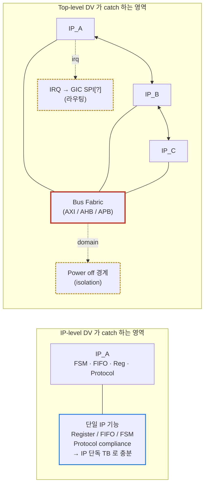
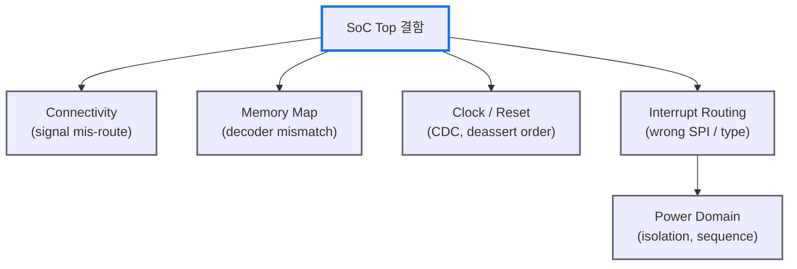

# Module 01 — SoC Top Integration

<!-- DV-SKOOL-CH-CTX:start -->
<div class="chapter-context" data-cat="soc">
  <a class="chapter-back" href="../">
    <span class="chapter-back-arrow">←</span>
    <span class="chapter-back-icon">🏗️</span>
    <span class="chapter-back-text">SoC Integration</span>
  </a>
  <span class="chapter-divider">›</span>
  <span class="chapter-marker">Module 01</span>
</div>
<!-- DV-SKOOL-CH-CTX:end -->

<!-- DV-SKOOL-CH-TOC:start -->
<div class="page-toc">
  <span class="page-toc-label">목차</span>
  <a class="page-toc-link" href="#1-why-care-이-모듈이-왜-필요한가">1. Why care?</a>
  <a class="page-toc-link" href="#2-intuition-도시-준공-검사-비유와-한-장-그림">2. Intuition</a>
  <a class="page-toc-link" href="#3-작은-예-camera-frame-한-장이-soc-를-가로지르는-과정">3. 작은 예 — Camera frame 한 장</a>
  <a class="page-toc-link" href="#4-일반화-soc-top-검증의-5축">4. 일반화 — SoC Top 검증의 5축</a>
  <a class="page-toc-link" href="#5-디테일-검증-항목-tb-구조-코드-패턴">5. 디테일</a>
  <a class="page-toc-link" href="#6-흔한-오해-와-dv-디버그-체크리스트">6. 흔한 오해 + DV 디버그 체크리스트</a>
  <a class="page-toc-link" href="#7-핵심-정리-key-takeaways">7. 핵심 정리</a>
</div>
<!-- DV-SKOOL-CH-TOC:end -->

!!! objective "학습 목표"
    이 모듈을 마치면:

    - **Distinguish** IP-level DV 와 SoC-level DV 의 검증 책임을 데이터 흐름 관점에서 구분할 수 있다.
    - **Identify** Top-only 결함 5종 (connectivity / clock-reset / interrupt routing / memory map / power domain) 을 식별한다.
    - **Trace** 한 camera frame 이 sensor → ISP → codec → DDR → display 까지 흐를 때 어떤 IP 간 연결을 지나가는지 추적한다.
    - **Design** Multi-IP UVM env 에 multiple agent + virtual sequencer 와 Common Task Checker Layer 를 통합하는 구조를 설계한다.
    - **Apply** Connectivity SVA 와 Memory Map UVM sequence 를 작성해 통합 결함을 catch 한다.

!!! info "사전 지식"
    - [UVM](../../uvm/) Module 01-06 — agent / sequencer / scoreboard 기본
    - SoC architecture 일반 — bus fabric (AXI/AHB/APB), GIC, MC, sysMMU 의 위치

---

## 1. Why care? — 이 모듈이 왜 필요한가

### 1.1 시나리오 — _Silicon 후_ 에 발견된 _1 줄_ bug

당신은 SoC 출시 직전. 모든 IP 의 IP-level DV 통과. 통합 후 system 시뮬도 통과. Tape-out → 6 주 후 silicon 도착.

Silicon 부팅: **fail**. 추적:
- IP A 의 _interrupt_ 가 _wrong IRQ controller port_ 로 connect.
- 1 줄 connectivity bug.
- IP-level DV 에서 _절대_ 안 잡힘 — IP 자체는 정상 IRQ 보냄. _연결_ 만 틀림.

비용:
- 1 silicon revision = $1-3M (mask cost).
- 6 주 시간 손실.
- 또는 SW workaround → 영구 부담.

**1 줄 connectivity bug = $1M+ + 6 주**. 이게 SoC integration DV 가 _IP-level 만큼 critical_ 인 이유.

**SoC integration bug 는 가장 비싸게 잡힙니다.** IP-level 은 모두 PASS 인데 통합 후 connectivity 한 줄 누락 → silicon revision 또는 software workaround. 이 단계에서 못 잡으면 **post-silicon debug 수 주 + 다음 tape-out 까지 1~3 개월** 의 비용이 따라옵니다.

이 모듈을 건너뛰면 이후의 Common Task / CCTV / TB Top 자동화 (Module 02–03) 가 "그냥 매트릭스를 채우는 작업" 으로 보입니다. 반대로 **"IP 검증으로는 절대 못 잡는 결함의 종류"** 를 구체적으로 알면, 매트릭스의 각 칸이 _어떤 silicon 버그를 막는지_ 가 보이기 시작합니다. 이후 모든 Common Task 정의의 출발점이 이 한 챕터입니다.

---

## 2. Intuition — 도시 준공 검사 비유와 한 장 그림

!!! tip "💡 한 줄 비유"
    **IP-level DV** = 건물 한 채 한 채의 _자체 검사_ — 전기, 배관, 구조가 그 건물 안에서 정상인지.<br>
    **SoC Top-level DV** = 건물들이 _도시로 조립된 뒤_ 의 준공 검사 — 도로(interconnect)가 끊기지 않았는지, 지번(memory map)이 맞는지, 119 신고망(interrupt)이 올바른 소방서로 가는지, 정전(power domain off) 시 옆 건물에 X 전류가 흘러들어가지 않는지.

### 한 장 그림 — IP 검증 vs Top 검증의 결함 영역



### 왜 두 단계가 모두 필요한가 — Design rationale

세 가지 요구가 동시에 만족돼야 합니다.

1. **Sim 속도**: SoC full RTL 한 번 컴파일 + 부팅 = 수 시간. IP 단독 TB = 분 단위. → 기능 회귀는 **IP 단계** 에서 끝내야 한다.
2. **연결의 존재 자체**: IP_A.irq_out 이 GIC.spi[47] 에 연결됐는지는 _IP_A 의 testbench 안에 존재하지 않는 정보_ 다. → **Top 단계에서만** 검증 가능.
3. **상호작용 결함**: Reset 해제 순서, power domain 격리, multi-master 의 bus 경합은 IP 들이 _함께_ 있어야만 발생. → 역시 **Top 단계** 의 책임.

이 셋이 합쳐져 "IP DV = 부품 정상성, Top DV = 조립 정상성" 이라는 분업이 됩니다.

---

## 3. 작은 예 — Camera frame 한 장이 SoC 를 가로지르는 과정

CCTV / 영상 SoC 의 가장 단순한 시나리오. **CMOS image sensor** 가 한 장의 **1920 × 1080 RAW10** frame 을 찍어 → ISP 가 RGB 로 변환 → Video codec (H.264 encoder) 이 압축 → DDR 에 bitstream 적재 → Display IP 가 preview 로 다시 읽어 LCD 로 출력. 이 한 frame 의 여행에서 **IP 간 연결 / 라우팅 / 도메인 경계가 어떻게 동시에 검증되는지** 따라가 봅니다.

```d2
direction: right

SENSOR: CMOS Sensor
ISP: ISP
CODEC: H.264 Encoder
DDR: "DDR · MC" { shape: cylinder; style.stroke: "#1a73e8"; style.stroke-width: 3 }
DISP: Display IP
LCD: LCD panel
GIC: "GIC (SPI)\nspi[12] · spi[13] · spi[14]" { style.stroke: "#c5221f"; style.stroke-width: 2 }
CPU: "CPU (FW)" { style.stroke: "#c5221f"; style.stroke-width: 2 }

SENSOR -> ISP: "MIPI CSI-2\npixel bus"
ISP -> CODEC: "AXI-S\nRGB888"
CODEC -> DDR: "AXI-MM\nbitstream"
DDR -> DISP: "⑤ AXI-MM read"
DISP -> LCD: "⑥ MIPI DSI"

SENSOR -> GIC: "① VSYNC irq" { style.stroke-dash: 4 }
ISP -> GIC: "② frame_done irq" { style.stroke-dash: 4 }
CODEC -> GIC: "③ bs_ready" { style.stroke-dash: 4 }
GIC -> CPU: "④ to CPU0"
CPU -> ISP: "reg-config (APB)"
CPU -> GIC: "ISR ack" { style.stroke-dash: 4 }

PWR_CLK: "Power / Clock 도메인" {
  PD_VIDEO: "PD_VIDEO ON · ISP + codec + display"
  PD_CORE: "PD_CORE ON · CPU + GIC + MC"
  PIXCLK: "PIXCLK 297 MHz → sensor, ISP"
  AXICLK: "AXICLK 533 MHz → codec, display, MC"
}
```

### 단계별 추적

| Step | 누가 | 무엇을 | Top 에서만 검증되는 _연결_ |
|---|---|---|---|
| ① | Sensor | VSYNC 발생 → `sensor_irq_out` assert | `sensor_irq_out` 이 GIC SPI[12] 에 1:1 연결 |
| ② | ISP | RAW10→RGB888 변환 후 frame_done | ISP 의 PIXCLK (297 MHz) 가 sensor 와 동일 source 인지 |
| ③ | H.264 codec | bitstream ready, AXI-MM master 로 DDR write | codec 의 AXI master 가 MC 의 slave port 4 에 연결, sysMMU 경유 |
| ④ | GIC | SPI[12/13/14] → CPU0 IRQ line | SPI index 가 CSV 와 RTL 에서 일치 |
| ⑤ | Display IP | DDR 에서 frame buffer read | display 의 read 경로가 codec write 경로와 _coherent_ 한 view |
| ⑥ | Display IP | MIPI DSI 로 panel 송출 | DSI clock domain 과 PD_VIDEO power 도메인 정렬 |

```c
// Step ④ 시점에 CPU 가 보는 ISR 의 단순화 예 (Top TB 에서 CPU model 이 실행)
void isp_isr(void) {
    uint32_t status = mmio_read(ISP_BASE + 0x40); // INT_STATUS
    if (status & FRAME_DONE) {
        mmio_write(ISP_BASE + 0x44, FRAME_DONE);  // INT_CLEAR
        codec_kick(/* frame_id */);                // chain: ISP → codec
    }
}
```

!!! note "여기서 잡아야 할 두 가지"
    **(1) 한 frame 의 path 는 _연결의 사슬_** — sensor → ISP → codec → MC → DDR → display. 이 사슬 중 _한 wire 라도 잘못 연결되면_ frame 한 장이 통째로 사라지고, IP 단독 TB 는 자기 부분만 PASS 라고 보고합니다.<br>
    **(2) 같은 frame path 가 5 개 검증 카테고리를 _동시에_ 친다** — connectivity (sensor↔ISP↔GIC), clock (PIXCLK vs AXICLK CDC), reset (codec 가 MC 보다 먼저 풀리면 첫 frame 손실), memory map (codec 의 ring buffer base addr), power (PD_VIDEO 가 OFF 일 때 display 가 codec 의 last write 를 못 봄). 이게 SoC Top TB 가 _하나의 대형 시나리오로 다섯 카테고리를 묶어 쳐야 하는 이유_ 입니다.

---

## 4. 일반화 — SoC Top 검증의 5축

§3 의 frame path 시나리오에서 등장한 _연결 / 클럭 / 리셋 / 인터럽트 / 메모리맵 / 전원_ 을 일반화하면 SoC Top 검증의 **5 축** 이 됩니다.



| 축 | 결함 형태 | IP 검증으로 못 잡는 이유 |
|---|---|---|
| **Connectivity** | irq_out → spi[wrong_idx], data bus mis-route | 연결 정보가 IP TB 에 존재하지 않음 |
| **Memory Map** | base 중첩 / DECERR 미동작 / IP-XACT vs RTL 불일치 | decoder 가 SoC top 에만 존재 |
| **Clock / Reset** | 잘못된 freq, deassert 순서 위반, CDC 누락 | reset 트리 + PLL 위계가 통합에만 존재 |
| **Interrupt Routing** | SPI 인덱스 어긋남, edge/level type 불일치, 보안 그룹 오설정 | GIC ↔ IP 매핑은 통합 시 결정 |
| **Power Domain** | iso cell 미동작, ON/OFF 순서, retention reg 손상 | PD 경계는 단일 IP TB 안에 없음 |

### 4.1 IP 검증 vs SoC Top 검증

| 항목 | IP-Level DV | SoC Top-Level DV |
|------|------------|-------------------|
| 범위 | 단일 IP (MMU, UFS HCI, ISP 등) | 전체 SoC (수십~수백 IP 통합) |
| 초점 | IP 기능 완전성 | IP 간 **연결/상호작용** 정확성 |
| 환경 | VIP + UVM Agent | **실제 IP RTL** + 최소 자극 |
| 시뮬레이션 속도 | 빠름 (블록 단위) | 느림 (전체 SoC RTL) |
| 버그 유형 | 기능 버그 | **통합 버그** (연결 오류, 매핑 오류) |
| TB 복잡도 | 중간 | 높음 (다수 인터페이스) |

### 4.2 검증 책임의 분기 — 한 frame path 로 보는 분담

§3 의 sensor → display 사슬을 예로:

- **sensor IP DV**: VSYNC 출력 타이밍, MIPI CSI-2 protocol compliance.
- **ISP IP DV**: RAW10→RGB 변환 알고리즘, frame_done 발생 조건.
- **codec IP DV**: H.264 압축률, AXI master burst 패턴.
- **SoC Top DV**: _이 셋 사이의 연결 + GIC 매핑 + PIXCLK↔AXICLK CDC + PD_VIDEO 격리_ — IP 어느 쪽도 책임 못 지는 영역.

이 분담이 깨지면 (Top DV 가 IP 기능까지 검증하려 하면) sim 시간이 폭발하고, 반대로 (IP DV 가 통합 결함을 잡으려 하면) 정보 부족.

---

## 5. 디테일 — 검증 항목, TB 구조, 코드 패턴

### 5.1 IP 검증에서 잡을 수 없는 5 대 결함 카테고리

```
1. Connectivity 오류
   - IP_A의 irq_out이 GIC의 SPI[47]에 연결되어야 하는데 SPI[48]에 연결
   - IP 단독으로는 발견 불가 — 연결은 Top에만 존재

2. Clock/Reset 오류
   - IP에 잘못된 클럭 공급 (200MHz 필요한데 100MHz 연결)
   - Reset 해제 순서 오류 (IP_A가 IP_B보다 먼저 해제되어야 하는데 반대)

3. Memory Map 오류
   - IP의 Base Address가 스펙과 다르게 배치
   - 주소 범위 중첩 (IP_A와 IP_B 주소가 겹침)

4. Interrupt Routing 오류
   - 인터럽트가 잘못된 CPU/GIC 입력에 연결
   - 인터럽트 우선순위/보안 그룹 설정 오류

5. Power Domain 오류
   - IP가 꺼진 Power Domain의 버스에 접근 → 행(hang)
   - Power 순서 위반
```

### 5.2 SoC Top 검증 항목 상세

#### 1. Connectivity Verification

```
모든 IP 간 신호 연결이 설계 의도와 일치하는가?

검증 방법:
  (a) Formal (JasperGold Connectivity):
      - 연결 스펙(CSV/JSON) → Property 자동 생성 → 증명
      - "IP_A.data_out이 IP_B.data_in에 연결됨" 증명

  (b) Simulation:
      - IP_A에서 특정 패턴 출력 → IP_B에서 동일 패턴 수신 확인

  (c) DFT Scan:
      - Scan Chain으로 신호 값 직접 관찰

대상:
  - 데이터 버스 (AXI, AHB, APB)
  - 인터럽트 (IP → GIC)
  - DMA 요청 (IP → DMAC)
  - Clock/Reset 트리
  - Power 스위치 제어
```

#### 2. Memory Map Verification

```
모든 IP가 올바른 주소에 배치되어 있는가?

+------------------------------------------+
| 0x0000_0000 | BootROM                     |
| 0x1000_0000 | Internal SRAM               |
| 0x1200_0000 | UFS HCI Registers (APB)     |
| 0x1300_0000 | DRAM Controller Regs        |
| 0x1400_0000 | Crypto Engine               |
| ...         | ...                         |
| 0x4000_0000 | DRAM (via MC)               |
+------------------------------------------+

검증:
  - 각 IP의 Base Address에 접근 → 응답 확인
  - 할당되지 않은 주소 접근 → DECERR 확인
  - 주소 중첩 없음 확인
  - IP-XACT 메타데이터와 실제 RTL 비교
```

#### 3. Clock/Reset Verification

```
검증 항목:
  - 각 IP에 올바른 클럭 주파수 공급
  - Clock Gating 동작 (IP Idle 시 클럭 차단)
  - Reset 해제 순서 (의존성에 따른 순서)
  - Reset 후 모든 IP의 레지스터 기본값

Reset 순서 예시:
  1. PLL Lock 확인
  2. Bus Fabric Reset 해제
  3. Memory Controller Reset 해제 (DRAM 접근 필요)
  4. 나머지 IP Reset 해제
  → 순서 위반 시 IP가 초기화되지 않은 버스에 접근 → 행(hang)
```

#### 4. Interrupt Routing Verification

```
검증 항목:
  - IP_A의 인터럽트 → GIC의 올바른 SPI 번호
  - 인터럽트 트리거 타입 (Edge/Level) 일치
  - 인터럽트 보안 그룹 (Secure/Non-Secure)
  - 인터럽트 우선순위
  - 인터럽트 마스킹 동작

시나리오:
  IP에서 인터럽트 발생 → GIC에서 올바른 CPU에 전달 →
  ISR 실행 → 인터럽트 클리어 → GIC 상태 복귀
```

#### 5. Power Domain Verification

```
검증 항목:
  - Power On/Off 시퀀스 정확성
  - 꺼진 도메인의 IP 접근 시 적절한 에러 응답
  - Power Isolation (꺼진 IP의 출력이 버스를 오염시키지 않음)
  - 전력 상태 전이 (Active → Idle → Retention → Off)
  - DVFS (Dynamic Voltage Frequency Scaling) 동작
```

### 5.3 SoC Top TB 아키텍처 (이력서 연결)

```d2
direction: down

EXT: "외부 모델 (자극원)" {
  style.stroke: "#1a73e8"; style.stroke-width: 2
  CPUM: "CPU Model\n(C-model / Processor VIP)"
  MEMM: "External Memory\n(DRAM BFM)"
  IFM: "External IF Model\n(UFS / Ethernet)"
}

DUT: "DUT — Full SoC RTL" {
  style.stroke: "#137333"; style.stroke-width: 2
  D_CPU: CPU
  D_MC: MC
  D_UFS: UFS
  D_DCMAC: DCMAC
  D_MMU: MMU
  D_OTH: "..."
}

CHK: "Checker / Monitor Layer" {
  style.stroke: "#b8860b"; style.stroke-width: 2
  BUSCHK: "Bus Protocol Checker\n(AXI / AHB / APB)"
  IRQMON: "Interrupt Monitor"
  MMAPCHK: "Memory Map Checker"
  PWRMON: "Power State Monitor"
}

EXT.CPUM -> DUT
EXT.MEMM -> DUT
EXT.IFM -> DUT
DUT -> CHK
```

특징:

- CPU Model이 FW(BootROM, BL2 등)를 실행 → 실제 부팅 시뮬레이션
- 또는 AXI Master VIP으로 레지스터 접근 시나리오 실행
- 외부 메모리/디바이스는 BFM(Bus Functional Model)으로 대체

### 5.4 코드 예시 — Connectivity 검증 SVA

```systemverilog
// Connectivity Spec (CSV 등)에서 자동 생성되는 SVA
// "IP_A.irq_out → GIC.spi[47]" 연결 증명

module soc_connectivity_check (
  input logic        clk,
  input logic        rst_n,
  // IP_A 인터럽트 출력
  input logic        ip_a_irq_out,
  // GIC SPI 입력
  input logic [63:0] gic_spi
);

  // ---- Connectivity Assertion ----
  // ip_a_irq_out은 gic_spi[47]에 1:1 연결되어야 함
  property p_irq_connectivity;
    @(posedge clk) disable iff (!rst_n)
    ip_a_irq_out == gic_spi[47];
  endproperty

  ast_irq_conn: assert property (p_irq_connectivity)
    else `uvm_error("CONN_CHK", $sformatf(
      "IRQ Connectivity Mismatch: ip_a_irq_out=%0b, gic_spi[47]=%0b",
      ip_a_irq_out, gic_spi[47]))

  // ---- 데이터 버스 Connectivity ----
  // IP_A.axi_wdata가 Bus Fabric을 거쳐 IP_B.axi_wdata에 도달
  property p_data_connectivity;
    @(posedge clk) disable iff (!rst_n)
    (ip_a_axi_wvalid && ip_a_axi_wready)
    |-> ##[1:10] (ip_b_axi_wvalid && ip_b_axi_wdata == ip_a_axi_wdata);
  endproperty

  ast_data_conn: assert property (p_data_connectivity)
    else `uvm_error("CONN_CHK", "Data path connectivity failure: IP_A → IP_B")

  // ---- Negative Check: 잘못된 연결 없음 ----
  // ip_a_irq_out이 gic_spi[48]에 연결되면 안 됨
  property p_irq_no_cross;
    @(posedge clk) disable iff (!rst_n)
    ip_a_irq_out |-> !gic_spi[48];  // 다른 SPI에 영향 없음
  endproperty

  ast_irq_no_cross: assert property (p_irq_no_cross);

endmodule
```

**핵심 포인트**:
- Positive check (올바른 연결 확인) + Negative check (잘못된 연결 배제) 모두 필요
- Formal 도구(JasperGold)는 모든 입력 조합을 exhaustive하게 증명 → 시뮬레이션보다 확실
- CSV/JSON 스펙에서 이런 property를 **자동 생성**하는 것이 실무 핵심

### 5.5 코드 예시 — Memory Map 검증 UVM Sequence

```systemverilog
class soc_memory_map_test_seq extends uvm_sequence #(axi_txn);
  `uvm_object_utils(soc_memory_map_test_seq)

  // SoC Memory Map 정의 (Config에서 로드)
  typedef struct {
    bit [31:0] base_addr;
    bit [31:0] size;
    string     ip_name;
    bit        is_secure;
  } mem_region_t;

  mem_region_t regions[$];

  function new(string name = "soc_memory_map_test_seq");
    super.new(name);
  endfunction

  task body();
    axi_txn txn;

    // ---- Phase 1: 각 IP Base Address에 R/W 접근 ----
    foreach (regions[i]) begin
      // Write
      txn = axi_txn::type_id::create($sformatf("wr_%s", regions[i].ip_name));
      start_item(txn);
      txn.addr   = regions[i].base_addr;
      txn.data   = 32'hDEAD_BEEF;
      txn.wr_rd  = AXI_WRITE;
      txn.expect_resp = AXI_RESP_OKAY;  // 정상 응답 기대
      finish_item(txn);

      `uvm_info("MMAP", $sformatf("[%s] Write 0x%08h → resp=%s",
        regions[i].ip_name, regions[i].base_addr, txn.resp.name()), UVM_MEDIUM)

      // Read back
      txn = axi_txn::type_id::create($sformatf("rd_%s", regions[i].ip_name));
      start_item(txn);
      txn.addr   = regions[i].base_addr;
      txn.wr_rd  = AXI_READ;
      finish_item(txn);

      if (txn.resp != AXI_RESP_OKAY)
        `uvm_error("MMAP", $sformatf("[%s] Base addr 0x%08h unreachable!",
          regions[i].ip_name, regions[i].base_addr))
    end

    // ---- Phase 2: 할당되지 않은 주소 → DECERR 확인 ----
    test_unmapped_address(32'hFFFF_0000);
    test_unmapped_address(32'h0000_0100);

    // ---- Phase 3: 주소 경계 테스트 ----
    foreach (regions[i]) begin
      // IP 영역 마지막 주소 접근 → OKAY
      test_boundary(regions[i].base_addr + regions[i].size - 4, AXI_RESP_OKAY);
      // IP 영역 직후 주소 접근 → DECERR (다음 IP 영역이 아닌 경우)
      test_boundary(regions[i].base_addr + regions[i].size, AXI_RESP_DECERR);
    end
  endtask

  task test_unmapped_address(bit [31:0] addr);
    axi_txn txn = axi_txn::type_id::create("unmapped");
    start_item(txn);
    txn.addr  = addr;
    txn.wr_rd = AXI_READ;
    finish_item(txn);

    if (txn.resp != AXI_RESP_DECERR)
      `uvm_error("MMAP", $sformatf("Unmapped 0x%08h should return DECERR, got %s",
        addr, txn.resp.name()))
    else
      `uvm_info("MMAP", $sformatf("Unmapped 0x%08h correctly returned DECERR", addr), UVM_MEDIUM)
  endtask

  task test_boundary(bit [31:0] addr, axi_resp_e expect);
    // ... 경계 테스트 구현
  endtask
endclass
```

**검증 전략 3단계**:
1. **Positive**: 각 IP Base Address R/W → OKAY 응답
2. **Negative**: 미할당 주소 → DECERR 응답
3. **Boundary**: 영역 경계에서 정확히 잘리는지 확인

### 5.6 실전 디버그 시나리오 — Interrupt 라우팅 오류

```
[UVM_ERROR] @ 125000ns: ISR not triggered within timeout.
  Expected: GIC SPI[47] → CPU0 IRQ
  Actual:   CPU0 IRQ never asserted after IP_A interrupt
```

**디버그 트레이싱 (사고과정)**:

```
Step 1: IP_A에서 인터럽트 발생 확인
  → 로그: "IP_A irq_out asserted at 124500ns" 정상

Step 2: GIC 입력 확인
  → 로그에 GIC SPI[47] 관련 메시지 없음
  → 의심: IP_A.irq_out → GIC.spi[47] 연결 문제

Step 3: 실제 연결 추적 (RTL)
  soc_top.sv:
    .spi_47 (ip_b_irq_out),  // ← ip_a가 아닌 ip_b가 연결!
    .spi_48 (ip_a_irq_out),  // ← ip_a가 48에 잘못 연결!

Step 4: 근본 원인
  RTL 통합 시 IP_A와 IP_B의 인터럽트 포트가 뒤바뀜
  → IP 단독 검증에서는 발견 불가 (인터럽트는 외부 연결)

Step 5: 수정
  soc_top.sv:
    .spi_47 (ip_a_irq_out),  // 수정
    .spi_48 (ip_b_irq_out),  // 수정

Step 6: 검증
  Connectivity SVA를 추가하여 재발 방지:
  assert property (ip_a_irq_out == gic_spi[47]);
```

**교훈**:

| 항목 | 내용 |
|------|------|
| **버그 분류** | 통합 버그 (Connectivity) |
| **발견 레벨** | SoC Top 검증에서만 발견 가능 |
| **근본 원인** | RTL Integration 시 수동 포트 매핑 실수 |
| **예방책** | Connectivity SVA 자동 생성 + Formal 검증 |
| **IP 검증 한계** | IP_A TB에서 irq_out은 정상 → 연결 대상은 IP TB 범위 밖 |

### 5.7 SoC Top TB 의 UVM Env 구조

```systemverilog
class soc_top_env extends uvm_env;
  `uvm_component_utils(soc_top_env)

  // ---- Agents ----
  axi_master_agent   m_cpu_agent;      // CPU Model (AXI Master VIP)
  axi_slave_agent    m_dram_agent;     // DRAM BFM
  apb_master_agent   m_apb_agent;      // APB 접근용

  // ---- Checkers (Common Task Layer) ----
  soc_connectivity_checker  m_conn_chk;
  soc_memmap_checker        m_mmap_chk;
  soc_interrupt_monitor     m_irq_mon;
  soc_power_monitor         m_pwr_mon;
  soc_clock_monitor         m_clk_mon;

  // ---- Coverage ----
  soc_cctv_coverage         m_cctv_cov;    // CCTV 매트릭스

  // ---- Scoreboard ----
  soc_top_scoreboard        m_scbd;

  // ---- Config ----
  soc_top_config            m_cfg;

  function new(string name, uvm_component parent);
    super.new(name, parent);
  endfunction

  function void build_phase(uvm_phase phase);
    super.build_phase(phase);

    // Config 가져오기
    if (!uvm_config_db#(soc_top_config)::get(this, "", "soc_cfg", m_cfg))
      `uvm_fatal("CFG", "soc_top_config not found in config_db")

    // Agent 생성
    m_cpu_agent  = axi_master_agent::type_id::create("m_cpu_agent", this);
    m_dram_agent = axi_slave_agent::type_id::create("m_dram_agent", this);

    // Checker 생성 (Config 기반으로 동적 결정)
    m_conn_chk = soc_connectivity_checker::type_id::create("m_conn_chk", this);
    m_mmap_chk = soc_memmap_checker::type_id::create("m_mmap_chk", this);
    m_irq_mon  = soc_interrupt_monitor::type_id::create("m_irq_mon", this);

    if (m_cfg.has_power_domain)
      m_pwr_mon = soc_power_monitor::type_id::create("m_pwr_mon", this);

    // CCTV Coverage
    m_cctv_cov = soc_cctv_coverage::type_id::create("m_cctv_cov", this);

    // Config 전파
    uvm_config_db#(soc_memmap_config)::set(this, "m_mmap_chk", "mmap_cfg", m_cfg.mmap);
    uvm_config_db#(soc_irq_config)::set(this, "m_irq_mon", "irq_cfg", m_cfg.irq_map);
  endfunction

  function void connect_phase(uvm_phase phase);
    super.connect_phase(phase);

    // Agent → Scoreboard 연결
    m_cpu_agent.m_monitor.ap.connect(m_scbd.cpu_export);
    m_dram_agent.m_monitor.ap.connect(m_scbd.mem_export);

    // Agent → Checker 연결
    m_cpu_agent.m_monitor.ap.connect(m_mmap_chk.txn_export);
    m_cpu_agent.m_monitor.ap.connect(m_cctv_cov.txn_export);
  endfunction
endclass
```

**구조 핵심**:
- `soc_top_config` 에 IP 목록/메모리맵/인터럽트맵 → 모든 Checker 가 Config 기반 동작
- Common Task Checker Layer 가 Agent 와 별도 계층으로 분리
- CCTV Coverage Collector 가 모든 트랜잭션을 수집하여 매트릭스 자동 갱신

### 5.8 연습 — 한 번 더 손으로 풀어보기

#### 문제 1: Memory Map 충돌 진단

다음 SoC Memory Map 설정에서 문제를 찾고, 어떤 증상이 나타날지 설명하라.

```
IP_A (UFS HCI):  Base=0x1200_0000, Size=0x0010_0000
IP_B (Crypto):   Base=0x1208_0000, Size=0x0008_0000
IP_C (DMA):      Base=0x1300_0000, Size=0x0001_0000
```

**사고과정**:
```
1. 각 IP의 주소 범위를 계산:
   IP_A: 0x1200_0000 ~ 0x120F_FFFF (1MB)
   IP_B: 0x1208_0000 ~ 0x120F_FFFF (512KB)
   IP_C: 0x1300_0000 ~ 0x1300_FFFF (64KB)

2. 범위 겹침 확인:
   IP_A 끝: 0x120F_FFFF
   IP_B 시작: 0x1208_0000
   → IP_B가 IP_A 범위 안에 완전히 포함됨! (0x1208_0000 < 0x120F_FFFF)

3. 증상:
   - CPU가 0x1208_0000에 접근 시 IP_A와 IP_B 모두 응답
   - Bus Fabric에서 두 slave 동시 응답 → 버스 프로토콜 위반
   - 또는 Decoder가 먼저 매칭되는 IP로 라우팅 → IP_B 접근 불가
   - AXI DECERR 또는 데이터 오염

4. 수정:
   IP_B를 IP_A 범위 밖으로 이동: Base=0x1210_0000
   또는 IP_A Size를 줄여 IP_B 영역을 분리
```

#### 문제 2: Reset 순서 위반 디버그

다음 로그에서 근본 원인을 찾아라.

```
[  0ns] Reset de-asserted
[ 10ns] CPU: Accessing DRAM at 0x4000_0000
[ 10ns] MC (Memory Controller): DRAM initialization not complete
[ 10ns] AXI BUS: SLVERR response from MC
[ 15ns] CPU: Bus error exception
[ 15ns] [UVM_FATAL] CPU halted — unrecoverable bus error during boot
```

**사고과정**:
```
1. FIRST error 확인: 10ns에 MC가 "DRAM initialization not complete"
   → MC가 아직 초기화되지 않았는데 CPU가 접근

2. Reset 해제 순서 추적:
   - 0ns: Reset이 해제됨 → CPU와 MC가 동시에 reset 해제
   - CPU는 즉시 BootROM 실행 → DRAM 접근 시도
   - MC는 DRAM 초기화에 수십~수백 ns 필요

3. 근본 원인:
   Reset 해제 순서 오류
   - 올바른 순서: PLL Lock → MC Reset 해제 → DRAM Init 완료 → CPU Reset 해제
   - 실제: 모든 IP가 동시에 Reset 해제 → CPU가 MC보다 먼저 동작

4. 수정:
   soc_top_reset_controller에서 순차 해제 구현:
   Phase 1: Bus Fabric + MC reset 해제
   Phase 2: MC DRAM init 완료 대기 (init_done 신호)
   Phase 3: CPU + 나머지 IP reset 해제

5. 검증:
   SVA로 순서 보장:
   assert property (@(posedge clk)
     $rose(mc_rst_n) |-> !cpu_rst_n until mc_init_done);
```

#### 문제 3: Connectivity 검증 전략 선택

200 개 IP 가 있는 SoC 에서 Connectivity 검증을 Simulation 으로만 수행하려 한다. 왜 이것이 불충분한지 설명하고, 최적의 검증 전략을 제시하라.

**사고과정**:
```
1. Simulation의 한계:
   - 200개 IP × 평균 50개 신호 = ~10,000개 연결 포인트
   - 각 연결을 확인하려면 해당 경로에 트래픽 발생 필요
   - 모든 조합을 커버하는 테스트 작성 = 수천 개 시나리오
   - 시뮬레이션 시간: SoC Full RTL에서 1개 테스트 = 수 시간
   - 현실적으로 모든 연결을 테스트하기 불가능

2. 추가 문제:
   - 시뮬레이션은 실행된 경로만 확인 (exercised path)
   - 연결은 되었지만 테스트에서 사용하지 않은 경로 = 미검증
   - "연결이 없다"는 것을 시뮬레이션으로 증명 불가

3. 최적 전략: Formal + Simulation Hybrid
   a) Formal (JasperGold Connectivity):
      - 연결 스펙(CSV) → SVA 자동 생성 → exhaustive 증명
      - 모든 연결을 입력 무관하게 완전 증명
      - 수 시간 내 10,000개 연결 모두 검증
      - "이 연결이 존재한다" + "다른 연결이 없다" 모두 증명

   b) Simulation:
      - Formal이 커버하지 못하는 동적 시나리오
      - 데이터 무결성 (올바른 데이터가 전달되는가)
      - 타이밍 관련 동작 (CDC 등)
      - End-to-end 기능 시나리오

   c) 역할 분담:
      Formal = 구조적 연결 완전성 (static)
      Simulation = 동적 동작 정확성 (dynamic)
```

---

## 6. 흔한 오해 와 DV 디버그 체크리스트

### 흔한 오해

!!! danger "❓ 오해 1 — 'SoC Top 시뮬레이션을 통과하면 IP 단독 검증은 불필요'"
    **실제**: SoC Top 검증은 IP 간 연결 오류를 잡지만, IP 내부 기능 버그는 IP-level DV 에서만 발견됩니다. SoC Top 환경은 sim 속도 제약으로 모든 corner case 를 커버할 수 없고, 한 IP 의 randomize seed 100 회 같은 깊은 회귀를 돌릴 수 없습니다.<br>
    **왜 헷갈리는가**: "통합 테스트가 단위 테스트를 포함한다" 는 소프트웨어 직관을 하드웨어에 잘못 적용하기 때문.

!!! danger "❓ 오해 2 — 'Connectivity 는 Formal 만으로 충분'"
    **실제**: Formal 은 _구조적_ 연결 완전성 (wire 가 닿아 있나) 을 증명할 뿐, 실제 데이터가 _의도한 timing_ 에 _의도한 값_ 으로 전달되는지는 simulation 이 필요합니다. 특히 CDC, hand-shake, AXI ordering 은 dynamic 검증.<br>
    **왜 헷갈리는가**: Formal 의 "exhaustive" 라는 단어가 모든 종류의 결함을 잡는다는 인상을 주기 때문.

!!! danger "❓ 오해 3 — 'Reset 한 번 인가하면 모든 IP 가 안전하게 초기화'"
    **실제**: Reset 도메인이 다른 IP 들은 서로 다른 시점에 해제되며, 잘못된 순서로 해제되면 초기화되지 않은 상태로 동작을 시작합니다. CPU 가 MC 보다 먼저 풀리면 첫 boot 에서 SLVERR.<br>
    **왜 헷갈리는가**: 단일 IP 검증 환경에서는 reset 타이밍이 단순하지만, SoC Top 에서는 여러 reset 도메인이 복잡하게 얽혀 있다는 사실을 과소평가하기 때문.

!!! danger "❓ 오해 4 — 'Memory map 중첩 = 즉시 DECERR'"
    **실제**: 두 IP 의 주소 범위가 겹치면 decoder 구현에 따라 _임의로 한 쪽이 응답_ 합니다 — DECERR 가 안 떨어지고 OKAY 로 wrong-IP 에 write. silicon 에서야 발견되는 silent corruption.<br>
    **왜 헷갈리는가**: "에러는 에러 응답으로 표시된다" 는 직관 + AXI spec 의 DECERR 정의가 unmapped 영역에만 명시돼 있어서.

!!! danger "❓ 오해 5 — 'Power off 된 IP 의 출력은 0'"
    **실제**: Isolation cell 이 활성화돼야 0 (또는 latch 된 값) 으로 clamp 됩니다. iso cell 이 misconfigured 면 X 가 bus 로 전파 → downstream IP 의 X-propagation → 시스템 전체가 알 수 없는 상태.<br>
    **왜 헷갈리는가**: power gating 이 "그냥 전원 OFF" 처럼 들리지만 실제로는 isolation + retention + sequence 의 _세 가지 메커니즘_ 의 조합.

### DV 디버그 체크리스트 (이 모듈 내용으로 마주칠 첫 실패들)

| 증상 | 1차 의심 | 어디 보나 |
|---|---|---|
| `ISR not triggered within timeout` | IRQ 라우팅 오류 (SPI 인덱스 어긋남) | `soc_top.sv` 의 GIC SPI 포트 매핑 vs IP-XACT interrupt_map |
| `AXI DECERR` on IP base address | Memory map mismatch (IP 위치 변경) | Config JSON 의 `base_addr` vs `addr_decoder.sv` |
| `Bus error exception` 직후 boot 실패 | Reset deassert 순서 위반 | Reset controller 의 `mc_init_done` 대기 여부 |
| Frame buffer 에 stale data | Display 가 codec last write 못 봄 | Cache coherency / `*_done` IRQ → display kick 경로 |
| 같은 frame burst 가 가끔 truncate | PIXCLK ↔ AXICLK CDC FIFO underrun | CDC FIFO 의 depth + back-pressure 신호 |
| ISR 이 잘못된 handler 로 dispatch | SPI 인덱스 1 차이 (off-by-one) | `gic_spi[N]` vs spec CSV 의 SPI ID |
| IP 가 power-up 후 X 출력 | Isolation cell 미동작 또는 retention 손상 | UPF/CPF 의 iso strategy + reset 후 첫 read |
| 두 IP 가 같은 주소에 응답 (silent) | Memory map 영역 중첩 | Config JSON 의 `base + size` 인접성 자동 검사 |

---

## 7. 핵심 정리 (Key Takeaways)

- **IP DV vs Top DV**: IP 는 부품 정확성, Top 은 조립 정확성 — 둘 중 하나만 하면 다른 카테고리의 결함을 통째로 놓침.
- **Top-only 결함 5종**: connectivity / memory map / clock-reset / interrupt routing / power domain. 모두 _연결 정보가 IP TB 안에 존재하지 않기_ 때문에 발생.
- **검증 전략**: Formal (구조적 연결 완전성) + Simulation (동적 데이터/타이밍) 의 hybrid. 둘 중 하나만으로는 부족.
- **Multi-IP UVM env**: Config JSON → Agent / Checker / CCTV Coverage 자동 구성. Common Task Checker Layer 가 Agent 와 별도.
- **Frame path 시각**: 한 시나리오 (camera → display) 가 5 카테고리를 동시에 친다 — Top 시나리오를 _연결 사슬 단위로_ 설계하면 회귀 효율이 극대화.

!!! warning "실무 주의점 — 인터럽트 SPI 번호 1씩 오프셋 뒤바뀜"
    **현상**: IP 는 단독 테스트에서 인터럽트를 정상 발생시키지만, SoC 통합 후 ISR 이 전혀 실행되지 않거나 엉뚱한 핸들러가 호출된다.

    **원인**: `soc_top.sv` 의 포트 매핑에서 GIC SPI 인덱스가 스펙 대비 1 차이나게 연결된 경우, IP-level DV 는 GIC 없이 인터럽트 신호만 확인하므로 통과된다. SoC 통합 시점에서야 드러나는 전형적인 connectivity 버그.

    **점검 포인트**: SVA `assert property (@(posedge clk) ip_a_irq_out == gic_spi[47])` 구문에서 GIC SPI 인덱스를 IP-XACT interrupt_map 과 1:1 대조. `soc_top.sv` 포트 매핑에서 `irq_out` 연결 라인을 grep 하여 스펙 CSV 와 직접 비교.

### 7.1 자가 점검

!!! question "🤔 Q1 — Connectivity 자동 검증 (Bloom: Apply)"
    100 IP × 평균 10 interrupt = _1000 connection_. 어떻게 _자동_ 검증?

    ??? success "정답"
        IP-XACT 기반:
        1. **IP-XACT XML** 에 각 IP 의 interrupt 출력 → GIC SPI 매핑 정의.
        2. **자동 SVA 생성**: XML parser 가 `assert property (ip_a_irq == gic_spi[N])` 같은 _수백 SVA_ 자동 작성.
        3. **Connectivity scan**: 모든 SVA 통과 = connectivity 완벽.

        Manual 검증의 _수십 배 빠름_ + _100% coverage_.

!!! question "🤔 Q2 — Power domain bug (Bloom: Analyze)"
    Power domain A off → domain B 의 신호가 _X_ propagation. 어떤 SVA?

    ??? success "정답"
        - **Isolation cell**: domain A off 일 때 출력 _0 또는 1_ clamp.
        - SVA: `assert property (pwr_a_off |-> (ip_a_to_b_sig === 1'b0))`.
        - 만약 `=== 1'bx` → isolation cell 누락 또는 misplace.

        SoC top 검증의 _가장 흔한_ silicon bug source.

!!! question "🤔 Q3 — Scan 시 SoC 검증 (Bloom: Evaluate)"
    Scan chain test 시 _normal traffic_ 영향?

    ??? success "정답"
        Scan mode 진입 시:
        - 모든 IP 가 _scan FF chain_ 으로 변형.
        - Normal traffic 차단 (또는 isolated).
        - DFT signal `scan_en=1` 시점에 _모든 mission mode signal_ 무효.

        SVA: `assert property (scan_en |-> all_outputs_safe)` (X propagation 없음).

### 7.2 출처

**Internal (Confluence)**
- 사내 SoC integration 자료
- `PCIe AMBA Integration Guide` (id=639270996)

**External**
- IP-XACT (IEEE 1685) Standard
- *SoC Verification Methodology Manual* — Cadence/Synopsys
- ARM Cortex-A integration guides

---

## 다음 모듈

→ [Module 02 — Common Task & CCTV](02_common_task_cctv.md): SoC Top 검증 항목 중 _모든 IP 에 공통 적용되는 것_ 을 매트릭스로 추적. DVCon 2025 의 Gap 자동화.

[퀴즈 풀어보기 →](quiz/01_soc_top_integration_quiz.md)

<div class="chapter-nav">
  <a class="nav-prev" href="../">
    <div class="nav-label">◀ 이전</div>
    <div class="nav-title">코스 홈</div>
  </a>
  <a class="nav-next" href="../02_common_task_cctv/">
    <div class="nav-label">다음 ▶</div>
    <div class="nav-title">Common Task & CCTV (Common Task Coverage Verification)</div>
  </a>
</div>


--8<-- "abbreviations.md"
