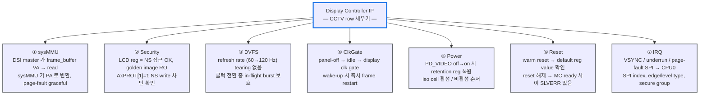

# Module 02 — Common Task & CCTV

<!-- DV-SKOOL-CH-CTX:start -->
<div class="chapter-context" data-cat="soc">
  <a class="chapter-back" href="../">
    <span class="chapter-back-arrow">←</span>
    <span class="chapter-back-icon">🏗️</span>
    <span class="chapter-back-text">SoC Integration</span>
  </a>
  <span class="chapter-divider">›</span>
  <span class="chapter-marker">Module 02</span>
</div>
<!-- DV-SKOOL-CH-CTX:end -->

<!-- DV-SKOOL-CH-TOC:start -->
<div class="page-toc">
  <span class="page-toc-label">목차</span>
  <a class="page-toc-link" href="#1-why-care-이-모듈이-왜-필요한가">1. Why care?</a>
  <a class="page-toc-link" href="#2-intuition-건물-입주-공통-점검-비유와-한-장-그림">2. Intuition</a>
  <a class="page-toc-link" href="#3-작은-예-display-ip-한-개에-7-가지-common-task-가-모두-적용되는-과정">3. 작은 예 — Display IP 의 7 가지 Common Task</a>
  <a class="page-toc-link" href="#4-일반화-cctv-매트릭스-와-3-단계-방법론">4. 일반화 — CCTV 매트릭스</a>
  <a class="page-toc-link" href="#5-디테일-task-별-시나리오-coverage-코드-실전-사례">5. 디테일</a>
  <a class="page-toc-link" href="#6-흔한-오해-와-dv-디버그-체크리스트">6. 흔한 오해 + DV 디버그 체크리스트</a>
  <a class="page-toc-link" href="#7-핵심-정리-key-takeaways">7. 핵심 정리</a>
</div>
<!-- DV-SKOOL-CH-TOC:end -->

!!! objective "학습 목표"
    이 모듈을 마치면:

    - **Identify** SoC 내 Common Task 7 종 (sysMMU / Security / DVFS / Clock Gating / Power Domain / Reset / IRQ) 을 식별한다.
    - **Apply** CCTV (Common Task Coverage Verification) 매트릭스를 IP × Task 형태로 작성하고 모든 cell 을 분류한다.
    - **Implement** SystemVerilog covergroup 으로 `cross cp_ip × cp_task` + `ignore_bins` + `illegal_bins` 를 구성한다.
    - **Distinguish** Human Oversight 누락과 Technical Gap 을 분류하고, 자동화 적용 영역을 결정한다.
    - **Plan** 새 IP 추가 시 Common Task 목록 갱신 → CCTV 매트릭스 재산정 → Gap report → V-Plan bin 의 워크플로우를 구성한다.

!!! info "사전 지식"
    - [Module 01](01_soc_top_integration.md) — SoC Top 검증의 5 축
    - UVM Sequence Library + Covergroup 패턴

---

## 1. Why care? — 이 모듈이 왜 필요한가

### 1.1 시나리오 — _100 IP × 20 Task_ = _2000 셀_

당신의 SoC 에 IP 100 개. 각 IP 가 _공통 task_ (sysMMU, Security, DVFS, Clock Gating, Reset, Interrupt 등) _20 종_ 적용 가능.

**전체 매트릭스 = 100 × 20 = 2000 cell**.

수동 추적:
- Excel sheet 작성. _업데이트_ 마다 cell 추가.
- 3-5% 누락 = 60-100 cell.
- 누락 96% 는 _human oversight_ (잊어버림, 새 IP 추가 시 update 안 함).
- 1 누락 cell = silicon bug risk → $1M+ 비용.

해법: **CCTV (Common Task Coverage Verification)** — _자동화된 매트릭스_:
- TB build 시 IP/task 자동 enumerate.
- 각 cell 의 검증 _자동 실행_.
- 빈 cell = _명시적 알람_.

SoC 안의 IP 가 50~200 개로 늘어나면 **각 IP 가 받아야 하는 공통 검증** (sysMMU 연동, Security 접근 제어, DVFS, Clock Gating ...) 의 조합 수가 _수백~수천_ 으로 폭발합니다. 수동으로 추적하면 DVCon 2025 데이터로 **3~5% 가 누락** 되고, 이 누락의 **96.30% 가 단순한 Human Oversight** 입니다.

이 모듈의 한 가지 가정 — **"같은 카테고리의 검증은 모든 적용 가능 IP 에 _빠짐없이_ 수행돼야 한다"** — 가 곧 이후 Module 03 (TB Top 자동화 / AI 기반 Gap 자동 발견) 의 출발점이 됩니다. 이 가정을 못 잡으면 자동화 자체의 정의가 흐려지고, 잡으면 매트릭스의 빈 cell 하나하나가 _silicon 버그 한 건의 위험_ 으로 보이기 시작합니다.

---

## 2. Intuition — 건물 입주 공통 점검 비유와 한 장 그림

!!! tip "💡 한 줄 비유"
    **Common Task** = 도시 내 _모든 건물_ 이 공통으로 받는 점검 (소방, 전기, 배수). 건물 종류가 달라도 항목은 동일.<br>
    **CCTV (Common Task Coverage Verification)** = 점검 _대장(臺帳)_ — 어떤 건물이 어떤 점검을 통과했는지의 매트릭스. 빠진 칸 = silicon 버그 risk.

### 한 장 그림 — IP × Task 매트릭스

```
              ┌─────────────────────── Common Tasks ───────────────────────┐
              │ sysMMU │ Security │ DVFS │ ClkGate │ Power │ Reset │ IRQ │
   IP_0 (UFS)  │   ✅   │    ✅    │  ✅  │   ✅    │  ✅   │  ✅   │ ✅ │
   IP_1 (DMA)  │   ✅   │    ✅    │  ❌  │   ✅    │  ✅   │  ✅   │ ✅ │   ← Gap!
   IP_2 (GPU)  │   ✅   │    ❌    │  ✅  │   ❌    │  ✅   │  ✅   │ ✅ │   ← Gap!
   IP_3 (Crypto)  N/A  │    ✅    │  ✅  │   ✅    │  ✅   │  ✅   │ ✅ │
   ...
   IP_N         │   ✅   │    ✅    │  ✅  │   ✅    │  ❌   │  ✅   │ ✅ │   ← Gap!
              └─────────────────────────────────────────────────────────────┘

   ✅ = covered    ❌ = Gap (NOT_TESTED)    N/A = ignore_bins
   Closure ⇔ 모든 cell 이 ✅ 또는 N/A
```

### 왜 매트릭스 형태로 추적해야 하는가 — Design rationale

세 가지 압력이 동시에 작용합니다.

1. **조합 폭발**: 100 IP × 7 task = 700 cell. 엔지니어 수십 명이 _다른 도구 / 다른 V-Plan_ 으로 추적하면 일관성 보장 불가.
2. **새 IP 추가의 누락**: Project N+1 에 IP 가 5 개 늘면 자동으로 35 cell 이 새로 생기는데, "이전 칩에서 했으니까" 가정으로 누락.
3. **N/A 의 명시적 선언 필요**: "Crypto 는 sysMMU 불필요" 같은 _legitimate ignore_ 와 _누락_ 을 구분해야 함. 그렇지 않으면 false-gap 폭주.

이 셋의 교집합이 **`cross + ignore_bins + illegal_bins`** 라는 SystemVerilog covergroup 패턴입니다.

---

## 3. 작은 예 — Display IP 한 개에 7 가지 Common Task 가 모두 적용되는 과정

§3 의 가장 단순한 시나리오 — _하나의 IP_ (CCTV / 영상 SoC 의 **Display Controller**) 가 7 가지 Common Task 검증을 _순서대로_ 통과하는 과정. 이게 매트릭스 한 _행 (row)_ 이 채워지는 모습입니다.



### 단계별 추적 (한 row 의 7 cell 이 모두 ✅ 가 되기까지)

| Step | Common Task | 무엇을 | 통과 조건 |
|---|---|---|---|
| ① | **sysMMU** | DSI master 가 VA 0x10000000 → sysMMU → PA 0xA0000000 | 변환 정확 + page fault graceful + bypass↔enable 전환 보호 |
| ② | **Security** | NS world 가 LCD_GOLDEN_REG (S-only) 에 AxPROT[1]=1 write | SLVERR 응답 + register 값 불변 |
| ③ | **DVFS** | 60 Hz → 120 Hz pixel clock 변경 중 in-flight DMA 1 개 | 변경 중 burst 손실 0, tearing 0 |
| ④ | **ClkGate** | display idle 감지 → clk gate → 1 µs 후 wake | wake 후 첫 frame deadline 위반 0 |
| ⑤ | **Power** | PD_VIDEO off 200 µs → on → retention 복원 | reg default 가 아닌 last-saved 값으로 복원 |
| ⑥ | **Reset** | warm reset → 모든 reg = default | SLVERR 없음, MC ready 대기 |
| ⑦ | **IRQ** | VSYNC → GIC SPI[14] level → CPU0 ISR | SPI idx + type + 보안 group 일치 |

```systemverilog
// CCTV row 한 줄을 채우는 virtual sequence (단순화)
class display_cctv_row_seq extends uvm_sequence;
  `uvm_object_utils(display_cctv_row_seq)
  cctv_coverage cov;
  task body();
    do_sysmmu_scenarios();     cov.record_result(IP_DISPLAY, TASK_SYSMMU,   RESULT_PASS);
    do_security_scenarios();   cov.record_result(IP_DISPLAY, TASK_SECURITY, RESULT_PASS);
    do_dvfs_scenarios();       cov.record_result(IP_DISPLAY, TASK_DVFS,     RESULT_PASS);
    do_clkgate_scenarios();    cov.record_result(IP_DISPLAY, TASK_CLK_GATE, RESULT_PASS);
    do_power_scenarios();      cov.record_result(IP_DISPLAY, TASK_POWER,    RESULT_PASS);
    do_reset_scenarios();      cov.record_result(IP_DISPLAY, TASK_RESET,    RESULT_PASS);
    do_irq_scenarios();        cov.record_result(IP_DISPLAY, TASK_IRQ,      RESULT_PASS);
  endtask
endclass
```

!!! note "여기서 잡아야 할 두 가지"
    **(1) 한 IP 의 row 는 _독립 시나리오 7 개의 묶음_** — 각 task 시나리오는 sequence library 에서 _IP-agnostic_ 하게 작성돼 있고, virtual sequence 가 IP 별로 호출만 다르게. 같은 sysMMU 시나리오가 GPU / DMA / Display row 에 _재사용_.<br>
    **(2) record_result 를 호출하는 순간 매트릭스 cell 이 바뀐다** — covergroup 의 sample() 이 cross 를 채워, regression 끝에 100% 미만이면 _자동으로 Gap 이 보고됨_. 수동 체크리스트가 필요 없어집니다.

---

## 4. 일반화 — CCTV 매트릭스 와 3 단계 방법론

### 4.1 매트릭스의 형식화

```
   CCTV = IP × Common Task × Result 의 cross coverage
                         ↑           ↑
                         │           └ {PASS, FAIL, NOT_APPLICABLE, NOT_TESTED}
                         └ {SYSMMU, SECURITY, DVFS, CLK_GATE, POWER, RESET, IRQ, ...}

   bins:
     normal       : (IP_i, TASK_j, PASS)
     legitimate   : (IP_i, TASK_j, NOT_APPLICABLE) ← ignore_bins
     gap          : (IP_i, TASK_j, NOT_TESTED)     ← illegal_bins → 자동 경고

   Closure ⇔ ∀ (i, j) : result ∈ {PASS, NOT_APPLICABLE}
```

### 4.2 3 단계 방법론 (DVCon 2025)

```
Phase 1: Hybrid Data Extraction
  IP-XACT → 구조 (레지스터, 버스, 메모리맵)
  IP Spec → 시맨틱 (기능, 보안, 동작 모드)
  → IP 별 "어떤 Common Task 가 필요한가" 판단

Phase 2: RAG + FAISS 유사 IP 검색
  대규모 IP DB → embedding → 인덱싱
  새 IP 추가 시 → 유사 IP 의 검증 이력 참조 → 누락 가능성 예측

Phase 3: LLM Gap Detection
  IP 별 필요 Task 목록 vs 기존 V-Plan 항목
  차이 = Gap → 우선순위 분류 → 테스트 명령어 자동 생성
```

(Phase 1–3 의 _구현_ 은 Module 03 에서 다룸. 여기서는 _매트릭스의 행/열/cell 정의_ 까지만.)

### 4.3 Closure 조건과 회귀 정책

| 조건 | 의미 | 행동 |
|---|---|---|
| 모든 cell ∈ {PASS, N/A} | Closure | sign-off |
| 어떤 cell = NOT_TESTED | Gap | report → 담당자에게 mrun 명령 배포 |
| 어떤 cell = FAIL | Real bug | 디버그 escalation, 매트릭스 재산정 보류 |
| ignore_bins 비율 > 30% | over-pruning 의심 | N/A 판정 근거를 IP Spec 으로 재검토 |

---

## 5. 디테일 — Task 별 시나리오, Coverage 코드, 실전 사례

### 5.1 왜 Common Task 가 누락되는가 — 문제의 구조

```
SoC 내 IP 수: 50~200개
각 IP에 공통 적용되는 검증 항목:

  +-------+  +-------+  +-------+     +-------+
  | IP_0  |  | IP_1  |  | IP_2  | ... | IP_N  |
  +---+---+  +---+---+  +---+---+     +---+---+
      |          |          |              |
  Common Tasks (모든 IP에 필요):
  ☑ sysMMU 연동      ← 이 IP에 sysMMU가 연결되어 있나?
  ☑ Security 접근제어 ← Secure/Non-Secure 접근이 올바른가?
  ☑ DVFS 동작        ← 전압/주파수 변경 시 정상 동작?
  ☑ Clock Gating     ← Idle 시 클럭 차단 + 복구?
  ☑ Power Domain     ← Power Off/On 시 상태 보존?
  ☑ Reset 동작       ← Reset 후 기본값?
  ☑ Interrupt 동작   ← 인터럽트 발생/클리어 정확?

  IP_0: ☑☑☑☑☑☑☑  (모두 완료)
  IP_1: ☑☑☐☑☑☑☑  (DVFS 누락!)
  IP_2: ☑☐☑☑☑☐☑  (Security, Power 누락!)
  ...
  IP_N: ☐☑☑☐☑☑☑  (sysMMU, DVFS 누락!)

  → 엔지니어 수십 명이 각자 담당 IP의 Common Task를 관리
  → 수백 개 조합에서 3~5%가 누락 (Human Oversight)
```

### 5.2 누락 원인 분류 (DVCon 논문 데이터)

| 원인 | 비율 | 설명 |
|------|------|------|
| **Human Oversight** | **96.30%** (소형 SoC) | 엔지니어가 단순히 빠뜨림 |
| New IP/Feature | ~40% 감소 가능 | 새 IP 추가 시 Common Task 목록 미갱신 |
| Legacy 의존 | 높음 | "이전 칩에서 했으니까" 가정 → 변경사항 누락 |
| 문서 불일치 | 중간 | 스펙과 실제 구현의 차이 |

### 5.3 Common Task 항목 상세

#### 1. sysMMU 연동 검증

```
SoC 내 대부분의 DMA-capable IP는 sysMMU를 통해 메모리 접근

검증 항목:
  - IP → sysMMU → Memory 경로의 주소 변환 정확성
  - Page Fault 발생 시 IP의 에러 처리
  - sysMMU Bypass 모드 동작
  - TLB Invalidation 후 재접근
  - Secure/Non-Secure 접근 제어

누락 시 영향:
  - IP가 잘못된 물리 주소에 접근 → 데이터 오염
  - Page Fault 무한 루프 → 시스템 행(hang)
```

#### 2. Security / Access Control

```
각 IP의 레지스터와 메모리 영역에 대한 접근 권한:

검증 항목:
  - Secure IP에 Non-Secure 접근 → 차단 확인 (TZPC)
  - 레지스터별 접근 권한 (RO/WO/RW × EL × S/NS)
  - Firewall 설정 후 불법 접근 차단
  - 보안 레지스터 Lock (한번 설정 후 변경 불가)

누락 시 영향:
  - Normal World에서 Secure 레지스터 접근 가능 → 보안 붕괴
  - 잘못된 접근 권한 → 실리콘 보안 인증 실패
```

#### 3. DVFS (Dynamic Voltage Frequency Scaling)

```
전압/주파수 동적 변경 시 IP 정상 동작:

검증 항목:
  - 클럭 변경 중 IP 동작 (Glitch-free?)
  - 변경 완료 후 IP 기능 정상
  - 변경 중 진행 중인 트랜잭션 보호
  - 최저/최고 주파수에서의 동작

누락 시 영향:
  - 클럭 전환 중 데이터 오류 → 간헐적 버그 (재현 어려움)
```

#### 4. Clock Gating / Power Gating

```
IP Idle 시 클럭/전원 차단 + 복구:

검증 항목:
  - Idle 감지 → Clock Gate 활성화 → IP 상태 유지
  - Wake-up 요청 → Clock 복귀 → 즉시 동작 가능
  - Power Gate: 상태 저장 → 전원 차단 → 복원
  - Isolation Cell 동작 (꺼진 IP 출력이 버스 오염 방지)

누락 시 영향:
  - Clock Gate 후 복귀 실패 → IP 죽음
  - Isolation 미동작 → 버스 X 전파 → 시스템 불안정
```

### 5.4 CCTV Coverage Model (개념)

```
[CG_CCTV] Common Task Coverage Matrix

  // IP 목록 (SoC 설정에서 동적 생성)
  cp_ip: {UFS, DMA, GPU, CRYPTO, DISPLAY, ...}

  // Common Task 목록
  cp_task: {SYSMMU, SECURITY, DVFS, CLK_GATE, POWER, RESET, IRQ}

  // 검증 결과
  cp_result: {PASS, FAIL, NOT_APPLICABLE, NOT_TESTED}

  // 핵심: IP × Task 교차 커버리지
  cross: cp_ip × cp_task × cp_result

  // Closure 조건:
  // 모든 (ip, task) 쌍이 PASS 또는 NOT_APPLICABLE
  // NOT_TESTED가 0개 = Gap 없음
```

### 5.5 기존 방법의 한계

| 방법 | 한계 |
|------|------|
| **JIRA/Confluence 수동 추적** | SoC 규모 확장 시 관리 불가, 엔지니어 의존 |
| **IP-XACT 자동화** | 구조 정보만 → "이 IP에 sysMMU가 필요한가?"의 시맨틱 판단 불가 |
| **체크리스트 기반** | 새 IP/Feature 추가 시 갱신 누락, 레거시 의존 |

### 5.6 코드 예시 — CCTV Coverage Matrix (SystemVerilog)

```systemverilog
// ---- CCTV Coverage Matrix Covergroup ----
// IP × Common Task × Result 교차 커버리지

typedef enum {
  IP_UFS, IP_DMA, IP_GPU, IP_CRYPTO, IP_DISPLAY,
  IP_ETHERNET, IP_USB, IP_I2C, IP_SPI, IP_UART
} ip_id_e;

typedef enum {
  TASK_SYSMMU, TASK_SECURITY, TASK_DVFS,
  TASK_CLK_GATE, TASK_POWER, TASK_RESET, TASK_IRQ
} common_task_e;

typedef enum {
  RESULT_PASS, RESULT_FAIL, RESULT_NOT_APPLICABLE, RESULT_NOT_TESTED
} task_result_e;

class cctv_coverage extends uvm_component;
  `uvm_component_utils(cctv_coverage)

  // Coverage 수집용 변수
  ip_id_e        sampled_ip;
  common_task_e  sampled_task;
  task_result_e  sampled_result;

  covergroup cg_cctv;
    cp_ip: coverpoint sampled_ip;
    cp_task: coverpoint sampled_task;
    cp_result: coverpoint sampled_result {
      // NOT_TESTED는 Gap — 이것이 0이 되어야 closure
      illegal_bins gap = {RESULT_NOT_TESTED};
    }

    // 핵심: IP × Task 교차 — 모든 조합이 커버되어야 함
    cx_ip_task: cross cp_ip, cp_task {
      // N/A 조합 제외 (예: CRYPTO는 sysMMU 불필요)
      ignore_bins crypto_no_mmu = binsof(cp_ip) intersect {IP_CRYPTO}
                                && binsof(cp_task) intersect {TASK_SYSMMU};
      ignore_bins uart_no_dvfs  = binsof(cp_ip) intersect {IP_UART}
                                && binsof(cp_task) intersect {TASK_DVFS};
    }

    // IP × Task × Result 삼중 교차 — PASS로 채워져야 함
    cx_full: cross cp_ip, cp_task, cp_result {
      ignore_bins crypto_no_mmu = binsof(cp_ip) intersect {IP_CRYPTO}
                                && binsof(cp_task) intersect {TASK_SYSMMU};
    }
  endgroup

  function new(string name, uvm_component parent);
    super.new(name, parent);
    cg_cctv = new();
  endfunction

  // 테스트 결과 수집
  function void record_result(ip_id_e ip, common_task_e task, task_result_e result);
    sampled_ip     = ip;
    sampled_task   = task;
    sampled_result = result;
    cg_cctv.sample();

    `uvm_info("CCTV", $sformatf("[%s × %s] = %s",
      ip.name(), task.name(), result.name()), UVM_MEDIUM)
  endfunction

  // Regression 종료 시 Gap 리포트
  function void report_phase(uvm_phase phase);
    real coverage_pct = cg_cctv.cx_ip_task.get_coverage();
    `uvm_info("CCTV", $sformatf("CCTV Matrix Coverage: %.2f%%", coverage_pct), UVM_NONE)

    if (coverage_pct < 100.0)
      `uvm_warning("CCTV", $sformatf(
        "CCTV Gap detected! Coverage=%.2f%% — uncovered IP×Task combinations exist",
        coverage_pct))
  endfunction
endclass
```

**핵심 설계 포인트**:

| 요소 | 설명 |
|------|------|
| `illegal_bins gap` | NOT_TESTED 가 발생하면 coverage tool 이 경고 → Gap 자동 감지 |
| `ignore_bins` | N/A 조합을 제외하여 false gap 방지 (Crypto 에 sysMMU 불필요 등) |
| `cx_ip_task` cross | IP × Task 모든 조합이 실행되어야 closure |
| `report_phase` | Regression 후 자동으로 Gap 리포트 출력 |

### 5.7 코드 예시 — sysMMU 통합 검증 시나리오

```systemverilog
class sysmmu_integration_test_seq extends uvm_sequence #(axi_txn);
  `uvm_object_utils(sysmmu_integration_test_seq)

  // 테스트 대상 IP
  string target_ip_name;
  bit [31:0] ip_base_addr;

  function new(string name = "sysmmu_integration_test_seq");
    super.new(name);
  endfunction

  task body();
    // ---- Scenario 1: 정상 주소 변환 ----
    `uvm_info("SMMU", $sformatf("[%s] Testing normal translation", target_ip_name), UVM_LOW)
    setup_page_table(
      .va(32'h0000_1000),      // Virtual Address
      .pa(32'h8000_1000),      // Physical Address
      .perm(PERM_RW),          // Read/Write 허용
      .ns(1'b0)                // Secure
    );
    // IP가 VA로 DMA 수행 → sysMMU가 PA로 변환 → Memory에 도달
    trigger_ip_dma(.addr(32'h0000_1000), .size(256));
    check_memory_write(.expected_pa(32'h8000_1000), .size(256));

    // ---- Scenario 2: Page Fault 처리 ----
    `uvm_info("SMMU", $sformatf("[%s] Testing page fault handling", target_ip_name), UVM_LOW)
    // 매핑되지 않은 VA로 DMA → Page Fault 발생
    trigger_ip_dma(.addr(32'hDEAD_0000), .size(64));
    check_page_fault(
      .expected_fault_addr(32'hDEAD_0000),
      .expected_fault_type(TRANSLATION_FAULT)
    );
    // IP가 에러를 gracefully 처리하는지 확인
    check_ip_error_status(.expected(IP_DMA_ERROR));

    // ---- Scenario 3: Bypass → Enable 전환 ----
    `uvm_info("SMMU", $sformatf("[%s] Testing bypass-to-enable transition", target_ip_name), UVM_LOW)
    set_sysmmu_bypass(1'b1);   // Bypass ON: VA == PA
    trigger_ip_dma(.addr(32'h8000_2000), .size(128));
    check_memory_write(.expected_pa(32'h8000_2000), .size(128));  // PA == VA

    set_sysmmu_bypass(1'b0);   // Bypass OFF: 변환 활성화
    setup_page_table(.va(32'h8000_2000), .pa(32'hA000_2000), .perm(PERM_RW), .ns(1'b0));
    trigger_ip_dma(.addr(32'h8000_2000), .size(128));
    check_memory_write(.expected_pa(32'hA000_2000), .size(128));  // PA ≠ VA

    // ---- Scenario 4: TLB Invalidation ----
    `uvm_info("SMMU", $sformatf("[%s] Testing TLB invalidation", target_ip_name), UVM_LOW)
    // 기존 매핑으로 DMA 성공 (TLB에 캐시됨)
    trigger_ip_dma(.addr(32'h0000_1000), .size(64));
    // Page Table 변경 (VA → 다른 PA로 재매핑)
    update_page_table(.va(32'h0000_1000), .new_pa(32'hC000_1000));
    // TLB Invalidation 수행
    invalidate_tlb(.va(32'h0000_1000));
    // 재접근 → 새 PA로 변환되어야 함
    trigger_ip_dma(.addr(32'h0000_1000), .size(64));
    check_memory_write(.expected_pa(32'hC000_1000), .size(64));
  endtask
endclass
```

**sysMMU 검증 4 대 시나리오 요약**:

```
Scenario 1: Normal Translation
  IP → VA → sysMMU → PA → Memory
  검증: 변환된 PA가 Page Table 설정과 일치

Scenario 2: Page Fault
  IP → 매핑없는 VA → sysMMU → Fault!
  검증: Fault 발생 + IP가 에러 처리 + 시스템 hang 없음

Scenario 3: Bypass ↔ Enable 전환
  Bypass ON: VA == PA (직접 접근)
  Bypass OFF: VA → PA 변환 활성화
  검증: 전환 중 진행 중인 트랜잭션 보호

Scenario 4: TLB Invalidation
  Page Table 변경 → TLB Invalidation → 재접근
  검증: 오래된 TLB 엔트리가 아닌 새 매핑 사용
```

### 5.8 코드 예시 — Security Access Control 검증

```systemverilog
class security_access_ctrl_seq extends uvm_sequence #(axi_txn);
  `uvm_object_utils(security_access_ctrl_seq)

  function new(string name = "security_access_ctrl_seq");
    super.new(name);
  endfunction

  task body();
    // ---- Test 1: Secure 레지스터에 Non-Secure 접근 → 차단 ----
    `uvm_info("SEC", "Testing NS access to Secure register", UVM_LOW)
    do_axi_read(
      .addr(CRYPTO_SECURE_KEY_REG),  // Secure-only 레지스터
      .prot({1'b1, 1'b0, 1'b0}),    // AxPROT[1]=1 → Non-Secure
      .expect_resp(AXI_RESP_SLVERR)  // 차단 → SLVERR
    );

    // ---- Test 2: Secure 레지스터에 Secure 접근 → 허용 ----
    `uvm_info("SEC", "Testing S access to Secure register", UVM_LOW)
    do_axi_read(
      .addr(CRYPTO_SECURE_KEY_REG),
      .prot({1'b0, 1'b0, 1'b0}),    // AxPROT[1]=0 → Secure
      .expect_resp(AXI_RESP_OKAY)    // 허용 → OKAY
    );

    // ---- Test 3: Non-Secure 레지스터에 Non-Secure 접근 → 허용 ----
    `uvm_info("SEC", "Testing NS access to NS register", UVM_LOW)
    do_axi_read(
      .addr(UART_DATA_REG),          // Non-Secure 레지스터
      .prot({1'b1, 1'b0, 1'b0}),    // Non-Secure
      .expect_resp(AXI_RESP_OKAY)    // 허용
    );

    // ---- Test 4: 보안 레지스터 Lock 후 재변경 시도 → 차단 ----
    `uvm_info("SEC", "Testing security lock", UVM_LOW)
    // Lock 설정 (Secure 모드에서)
    do_axi_write(.addr(TZPC_LOCK_REG), .data(32'h1), .prot(3'b000));  // Lock ON
    // Lock 해제 시도 → 실패해야 함
    do_axi_write(.addr(TZPC_LOCK_REG), .data(32'h0), .prot(3'b000));
    do_axi_read(.addr(TZPC_LOCK_REG), .prot(3'b000));
    // Lock이 여전히 1인지 확인
    if (read_data != 32'h1)
      `uvm_error("SEC", "Security lock was illegally cleared!")
  endtask
endclass
```

**AXI AxPROT 비트 해석**:
```
AxPROT[0] = Privileged(0) / Unprivileged(1)
AxPROT[1] = Secure(0) / Non-Secure(1)        ← Security 검증의 핵심
AxPROT[2] = Data(0) / Instruction(1)
```

### 5.9 실전 사례 — Gap 이 Silicon Bug 로 이어지는 시나리오

```
배경:
  - DMA Controller IP 검증 완료 (IP-Level)
  - SoC Top 검증에서 DMA의 Common Task 중 "sysMMU Bypass→Enable 전환" 누락
  - CCTV 매트릭스에서 Gap으로 표시되지 않음 (수동 관리)

Silicon 이후 발생한 버그:
  1. Linux 부팅 초기: sysMMU Bypass 모드로 DMA 동작 (부트로더)
  2. Linux kernel이 sysMMU를 Enable으로 전환
  3. 전환 시점에 진행 중이던 DMA 트랜잭션이 존재
  4. 이 트랜잭션이 VA로 발행되었지만, sysMMU가 아직 Page Table 설정 미완료
  5. → Translation Fault → DMA 실패 → 커널 패닉

디버그 난이도:
  - 부트로더에서는 재현 불가 (Bypass 모드)
  - Linux 부팅 시 "가끔" 발생 (타이밍 의존)
  - 간헐적 버그 → Silicon debug에 수 주 소요

CCTV로 사전 발견했다면:
  CCTV 매트릭스:
    DMA × sysMMU_bypass_to_enable = NOT_TESTED (Gap!)
  → 자동 감지 → 테스트 생성 → Pre-silicon에서 발견
  → Silicon debug 수 주 절약

교훈:
  - 간헐적 Silicon 버그의 상당수가 Common Task 누락에서 발생
  - sysMMU 전환 시나리오는 모든 DMA-capable IP에 공통 적용
  - 한 IP에서 발견되면 모든 IP에 전파하는 것이 CCTV의 가치
```

### 5.10 연습 — 한 번 더 손으로 풀어보기

#### 문제 1: CCTV ignore_bins 설계

다음 IP 목록에서 각 IP 에 적용되지 않는 (N/A) Common Task 를 판별하고, ignore_bins 를 작성하라.

```
IP 목록:
  - UART: 단순 직렬 통신, DMA 없음, 고정 클럭
  - GPU: 대용량 메모리 접근, DMA 있음, DVFS 지원
  - Crypto: 보안 전용, sysMMU 불필요 (내부 메모리만 사용)
  - Temperature Sensor: 읽기 전용, 인터럽트 없음, 전력 상시 ON
```

**사고과정**:
```
1. 각 IP의 특성 → Common Task 필요 여부 판단:

   UART:
   - sysMMU: N/A (DMA 없음)
   - Security: ✅ (레지스터 접근 제어 필요)
   - DVFS: N/A (고정 클럭)
   - ClkGate: ✅
   - Power: ✅
   - Reset: ✅
   - IRQ: ✅

   GPU: 모든 항목 ✅

   Crypto:
   - sysMMU: N/A (내부 메모리만)
   - 나머지: ✅

   Temperature Sensor:
   - sysMMU: N/A
   - Security: ✅ (센서값 위조 방지)
   - DVFS: N/A
   - ClkGate: N/A (상시 ON)
   - Power: N/A (전력 상시 ON)
   - Reset: ✅
   - IRQ: N/A (인터럽트 없음)

2. ignore_bins 코드:
   ignore_bins uart_no_mmu = binsof(cp_ip) intersect {IP_UART}
                            && binsof(cp_task) intersect {TASK_SYSMMU};
   ignore_bins crypto_no_mmu = binsof(cp_ip) intersect {IP_CRYPTO}
                              && binsof(cp_task) intersect {TASK_SYSMMU};
   // ... (Temp_Sensor 6개 등)

3. 주의점:
   - "읽기 전용 IP"라도 Security는 필요
   - ignore_bins를 잘못 설정하면 실제 필요한 검증이 누락됨
   - N/A 판단은 IP Spec 기반 — 이것이 IP-XACT만으로 부족한 이유
```

#### 문제 2: Gap → 테스트 시나리오 생성

CCTV 매트릭스에서 다음 Gap 이 발견되었다. 이 Gap 에 대한 구체적 테스트 시나리오를 설계하라.

```
Gap: IP_ETHERNET × TASK_CLK_GATE = NOT_TESTED
```

**사고과정**:
```
1. Gap 의미 파악:
   Ethernet IP의 Clock Gating 검증이 한 번도 실행되지 않음
   → Idle 시 클럭 차단 + 복구가 검증되지 않은 상태

2. Ethernet IP의 Clock Gating 특성:
   - 패킷 수신/송신이 없을 때 Idle
   - Clock Gate 활성화 → MAC/PHY 클럭 차단
   - 패킷 도착 시 Wake-up → 즉시 수신 가능해야 함

3. 테스트 시나리오 설계:

   Scenario A: Basic Clock Gate & Wake-up
     Step 1: Ethernet으로 패킷 10개 송수신 (정상 동작 확인)
     Step 2: 트래픽 중단 → Idle 감지 대기
     Step 3: Clock Gate 활성화 확인 (클럭 모니터)
     Step 4: 외부에서 패킷 전송 → Wake-up
     Step 5: 클럭 복귀 확인
     Step 6: 패킷 정상 수신 확인 (데이터 무결성)

   Scenario B: Clock Gate 중 레지스터 접근
     Step 1: Clock Gate 활성화 상태
     Step 2: CPU가 Ethernet 레지스터 R/W 시도
     Step 3: 자동 Wake-up → 레지스터 접근 성공 확인

   Scenario C: 빈번한 Gate/Ungate 반복
     Step 1: 짧은 패킷 burst → Idle → Gate → 패킷 → Ungate 반복
     Step 2: 100회 반복 중 데이터 오류/패킷 손실 없음 확인

4. CCTV 기록:
   record_result(IP_ETHERNET, TASK_CLK_GATE, RESULT_PASS);
```

#### 문제 3: Human Oversight vs Technical Gap 분류

다음 3 가지 Gap 의 원인을 "Human Oversight" 와 "Technical Gap" 으로 분류하고 이유를 설명하라.

```
Gap A: USB IP의 Security 검증 누락 — IP 담당자가 "USB는 보안 불필요"라고 판단
Gap B: 새로 추가된 NPU IP의 sysMMU 검증 누락 — V-Plan이 갱신되지 않음
Gap C: DMA의 DVFS 검증 누락 — DVFS 중 DMA burst 테스트가 기술적으로 구현 어려움
```

**사고과정**:
```
Gap A: Human Oversight (잘못된 판단) — DFU 모드에서 보안 중요. AI 가 Spec keyword 검색으로 회피 가능.
Gap B: Human Oversight (프로세스 누락) — 새 IP 추가 자동화 부재. CCTV 자동화의 핵심 타깃.
Gap C: Technical Gap — 클럭 전환 모델링 VIP / SVA / FPGA prototype 필요.

분류:
  A: Oversight → 자동화로 방지
  B: Oversight → 자동화로 방지
  C: Technical → 기술적 해결 필요

→ DVCon 결과: 96.30%가 A/B 유형
```

---

## 6. 흔한 오해 와 DV 디버그 체크리스트

### 흔한 오해

!!! danger "❓ 오해 1 — 'Reset 한 번 인가하면 모든 IP 가 안전 초기화'"
    **실제**: Reset 도메인이 다른 IP 들은 서로 다른 시점에 해제되며, 잘못된 순서로 해제되면 초기화되지 않은 상태로 동작을 시작합니다.<br>
    **왜 헷갈리는가**: 단일 IP 검증 환경에서는 reset 타이밍이 단순하지만, SoC Top 에서는 여러 reset 도메인이 복잡하게 얽혀 있습니다.

!!! danger "❓ 오해 2 — 'IP-XACT 만 있으면 CCTV 가 자동화된다'"
    **실제**: IP-XACT 는 _구조 정보_ (레지스터, 버스, 메모리맵) 만 제공합니다. "이 IP 에 sysMMU 검증이 필요한가?" 는 _시맨틱 판단_ — IP Spec 의 "sysMMU 통해 메모리 접근" 같은 텍스트가 있어야 알 수 있습니다.<br>
    **왜 헷갈리는가**: IP-XACT 가 "machine readable" 이라서 모든 정보를 담고 있을 것 같은 인상.

!!! danger "❓ 오해 3 — 'CCTV 100% = silicon-ready'"
    **실제**: CCTV 매트릭스는 (IP, Task) 쌍의 _독립_ 검증만 추적합니다. Task 간 _순서 의존성_ (예: sysMMU enable → DVFS transition 조합) 은 매트릭스에 표현되지 않으므로 별도 시나리오 cross 가 필요합니다.<br>
    **왜 헷갈리는가**: "모든 cell 이 ✅" 라는 시각적 완결성이 closure 와 동일하게 느껴짐.

!!! danger "❓ 오해 4 — 'ignore_bins 가 많을수록 CCTV 가 가벼워진다'"
    **실제**: ignore_bins 는 _Spec 근거_ 로 정당화돼야 합니다. 근거 없이 ignore 하면 _silently 누락_ — 이게 96.30% Human Oversight 의 핵심 메커니즘.<br>
    **왜 헷갈리는가**: coverage 100% 가 빠르게 나오면 진척으로 보이기 때문.

!!! danger "❓ 오해 5 — '소규모 SoC 는 자동화 ROI 가 낮다'"
    **실제**: DVCon 데이터 (Project B, 4.99% Gap rate > Project A 2.75%) 는 정반대 — 소규모일수록 1 인이 여러 IP 를 담당해 교차 검증이 부족하고, Gap rate 가 _더 높음_.<br>
    **왜 헷갈리는가**: "IP 수가 적으니 수동으로 충분" 이라는 직관.

### DV 디버그 체크리스트

| 증상 | 1차 의심 | 어디 보나 |
|---|---|---|
| `report_phase` 에서 CCTV coverage < 100% | 매트릭스 cell 누락 | `cg_cctv.cx_ip_task.get_inst_coverage()` 의 빈 bin |
| `illegal_bins gap` hit warning | NOT_TESTED 가 record 됨 | regression 결과 + 해당 IP 의 sequence 호출 |
| 새 IP 추가 후 ignore_bins 폭증 | Spec 근거 부족 ignore | Config JSON `common_tasks` 필드 vs IP Spec |
| 같은 sequence 가 IP_A 에선 PASS, IP_B 에선 FAIL | sequence 가 IP-specific 가정 사용 | parameter 화 / config_db 에서 base_addr 주입 여부 |
| sysMMU bypass→enable 시나리오만 누락 | 시나리오 generation 의 표준화 부재 | sequence library 의 transition scenario 항목 |
| Gap report 에 false-positive 30%+ | Phase 1 IP profile 정확도 | IP-XACT 파싱 + Spec keyword 추출 |
| Task 간 순서 의존성 race | virtual sequencer 의 fork/join | Common Task pair 의 cross coverage 별도 정의 |
| DVFS 검증이 모든 IP 에서 NOT_TESTED | technical gap (VIP 부재) | clock 전환 모델링 VIP 의 release 여부 |

---

## 7. 핵심 정리 (Key Takeaways)

- **Common Task 7 종**: sysMMU / Security / DVFS / Clock Gating / Power / Reset / IRQ — 적용 가능 IP 수십 개에 _빠짐없이_ 적용.
- **CCTV 매트릭스**: IP × Common Task 의 cross coverage. `cross + ignore_bins + illegal_bins` 가 표준 패턴.
- **누락 분포**: 96.30% Human Oversight (단순 누락) — 자동화 ROI 가 매우 큼. 소규모 SoC 가 오히려 Gap rate 더 높음 (4.99% vs 2.75%).
- **Closure ⇔ ∀(IP, Task) ∈ {PASS, N/A}** — N/A 는 _Spec 근거_ 로만 정당화.
- **재사용 sequence library**: 한 sequence 가 여러 IP 의 sequencer 에 generic 하게 동작 (parametric). Virtual sequencer 가 Common Task 별 wrapper 호출.

!!! warning "실무 주의점 — Common Task 호출 순서 의존성 무시"
    **현상**: 개별 Common Task 시퀀스는 단독 실행 시 PASS 지만, sysMMU Enable → DVFS transition 조합 시나리오에서 간헐적으로 DMA 트랜잭션이 손실된다.

    **원인**: CCTV 매트릭스는 각 (IP, Task) 쌍의 독립 검증 여부만 추적한다. Task 간 순서 의존성 (sysMMU 활성화 완료 전 DVFS 주파수 변경 → 진행 중 트랜잭션 중단) 은 매트릭스 커버리지에 표현되지 않아 놓치기 쉽다.

    **점검 포인트**: Virtual sequencer 의 Common Task 호출 순서를 확인. `fork/join` 또는 sequential 실행 여부를 검토. CCTV 매트릭스에 Task pair 커버리지 (`cx_task_order`) 크로스 빈을 추가하여 순서 조합을 명시적으로 추적.

### 7.1 자가 점검

!!! question "🤔 Q1 — Cross coverage 설계 (Bloom: Apply)"
    20 IP × 10 Task. 어떤 cross _필수_?

    ??? success "정답"
        Cross bin:
        1. **(IP, Task)**: 200 단일 cell — 기본 적용 매트릭스.
        2. **(IP, Task1, Task2)**: Task 간 순서 → 200 × 10 = 2000 cell.
        3. **(IP_A, IP_B, Task)**: IP 간 상호작용 (예: DMA + sysMMU).

        2 와 3 이 _silent bug_ 의 주된 source. 1 만 커버하면 _false safety_.

!!! question "🤔 Q2 — DVCon 2025 96% 통계 (Bloom: Analyze)"
    DVCon 2025: Gap 누락의 _96.30%_ 가 human oversight. 이게 의미하는 것?

    ??? success "정답"
        - **자동화로 96% 해결 가능**.
        - 96% 는 "잊어버림" 또는 "새 IP 추가 시 매트릭스 update 누락".
        - 4% 는 _design knowledge_ 부족 또는 _spec 모호_.

        96% → 자동화 (CCTV + AI), 4% → expert review.

        Manual 100% 검증이 _불가능_, 자동화는 _96%_ — 같은 정확도지만 _수십 배 빠름_.

!!! question "🤔 Q3 — Spec 변경 대응 (Bloom: Evaluate)"
    SoC spec 이 _분기마다_ 변경. CCTV 매트릭스 어떻게?

    ??? success "정답"
        - **Spec → CCTV 자동 sync**: IP-XACT 또는 JSON spec 의 _변경 detect_ → CCTV matrix _diff_ 표시.
        - **새 cell**: 추가된 IP 또는 Task → 새 cell _NULL_ 로 매트릭스에 등장.
        - **삭제된 cell**: deprecated IP → 매트릭스에서 제거 (단 _기존 coverage_ 는 archive).
        - **Regression**: 매 회귀가 _최신 spec_ 의 _모든 cell_ cover 시도.

### 7.2 출처

**External**
- DVCon 2025 *Closing Coverage Gaps in SoC Verification* paper
- IP-XACT IEEE 1685
- *SoC Verification Methodology Manual*

---

## 다음 모듈

→ [Module 03 — TB Top & AI Automation](03_tb_top_and_ai.md): CCTV 매트릭스 의 Gap 을 _자동으로_ 발견하고 테스트까지 생성하는 AI 파이프라인. TB Top 환경의 Config 기반 자동 구성.

[퀴즈 풀어보기 →](quiz/02_common_task_cctv_quiz.md)

<div class="chapter-nav">
  <a class="nav-prev" href="../01_soc_top_integration/">
    <div class="nav-label">◀ 이전</div>
    <div class="nav-title">SoC Top Integration 검증</div>
  </a>
  <a class="nav-next" href="../03_tb_top_and_ai/">
    <div class="nav-label">다음 ▶</div>
    <div class="nav-title">TB Top 환경 구축 + AI 자동화</div>
  </a>
</div>


--8<-- "abbreviations.md"
