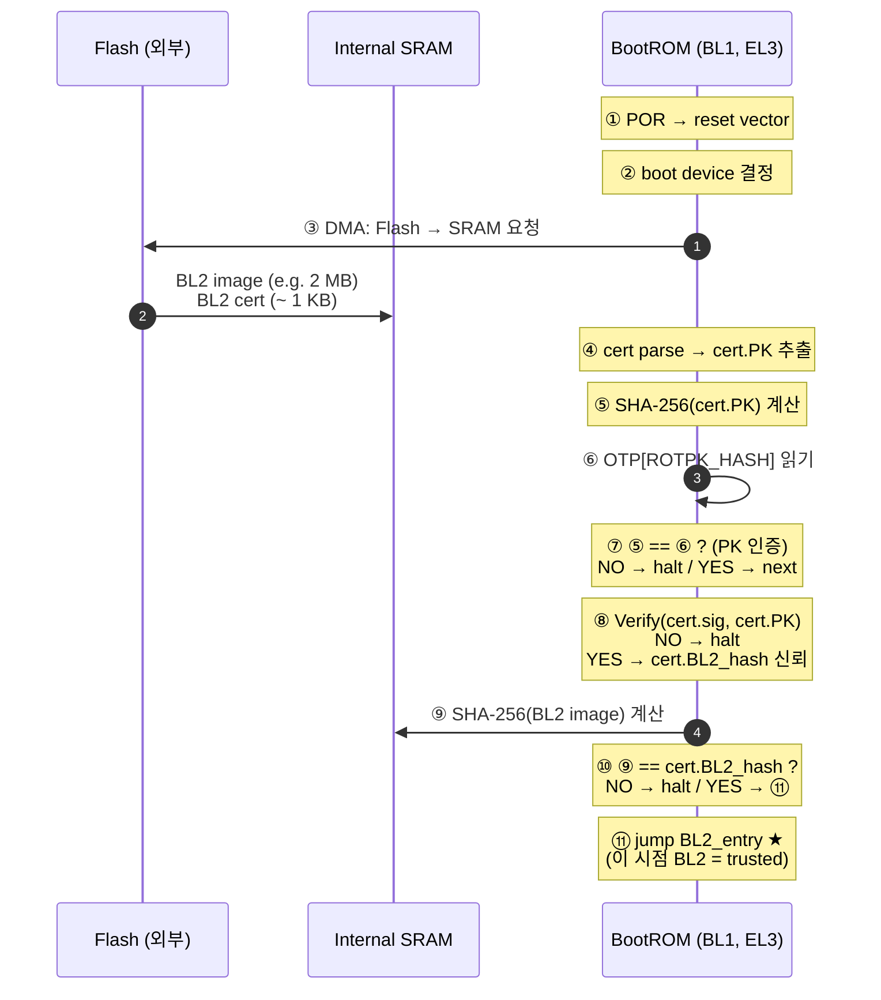
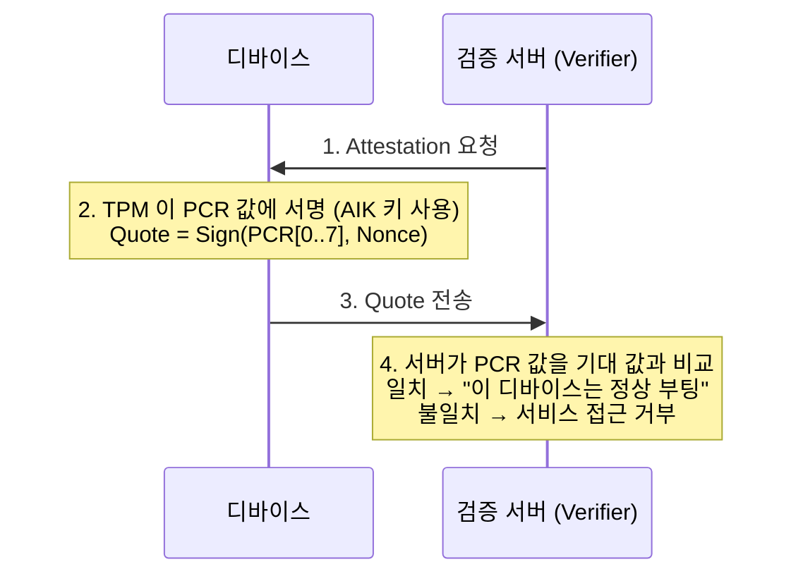
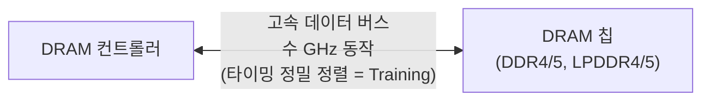

# Module 02 — Chain of Trust & Boot Stages

<!-- DV-SKOOL-CH-CTX:start -->
<div class="chapter-context" data-cat="soc">
  <a class="chapter-back" href="../">
    <span class="chapter-back-arrow">←</span>
    <span class="chapter-back-icon">🔐</span>
    <span class="chapter-back-text">SoC Secure Boot</span>
  </a>
  <span class="chapter-divider">›</span>
  <span class="chapter-marker">Module 02</span>
</div>
<!-- DV-SKOOL-CH-CTX:end -->

<!-- DV-SKOOL-CH-TOC:start -->
<div class="page-toc">
  <span class="page-toc-label">목차</span>
  <a class="page-toc-link" href="#1-why-care-이-모듈이-왜-필요한가">1. Why care?</a>
  <a class="page-toc-link" href="#2-intuition-비유와-한-장-그림">2. Intuition</a>
  <a class="page-toc-link" href="#3-작은-예-bl1-bl2-한-건의-인증-체인-검증-추적">3. 작은 예 — BL1→BL2 인증 체인 추적</a>
  <a class="page-toc-link" href="#4-일반화-trust-전파-모델과-blast-radius">4. 일반화 — Trust 전파 + Blast Radius</a>
  <a class="page-toc-link" href="#5-디테일-bl-stage-별-책임-secure-vs-measured-vs-verified-dram-training">5. 디테일 — BL stage / Secure vs Measured vs Verified / DRAM training</a>
  <a class="page-toc-link" href="#6-흔한-오해-와-dv-디버그-체크리스트">6. 흔한 오해 + DV 디버그 체크리스트</a>
  <a class="page-toc-link" href="#7-핵심-정리-key-takeaways">7. 핵심 정리</a>
</div>
<!-- DV-SKOOL-CH-TOC:end -->

!!! objective "학습 목표"
    이 모듈을 마치면:

    - **Trace** 부팅 단계 (BootROM → BL1 → BL2 → BL31 → BL33 → kernel) 별 책임 분리를 추적할 수 있다.
    - **Apply** 각 단계의 verify-then-execute 패턴 (서명 검증 후 jump) 을 적용할 수 있다.
    - **Identify** 한 단계의 침해가 어떻게 다음 단계로 전파되는지 (또는 차단되는지) 식별할 수 있다.
    - **Distinguish** Secure Boot (서명) vs Verified Boot (해시) vs Measured Boot (TPM PCR) 를 보장 대상 관점에서 구별할 수 있다.
    - **Justify** BL2 가 별도 단계로 분리된 이유 (DRAM training, 코드 크기, 업데이트 가능성) 를 설명할 수 있다.

!!! info "사전 지식"
    - [Module 01](01_hardware_root_of_trust.md) — HW RoT, OTP, ROTPK
    - 비대칭 서명 검증 흐름 (Module 03 에서 더 깊게)
    - ARM Exception Level 의 일반 개념 (EL3 / EL2 / EL1 / EL0)

---

## 1. Why care? — 이 모듈이 왜 필요한가

### 1.1 시나리오 — _Chain_ 의 _한 link_ 가 깨지면

당신의 secure boot 가 _BL1 → BL2 → kernel_ 3 단계. 모든 단계에 서명 검증.

**Attack 시도**: 공격자가 _BL2 image_ 를 위조 (custom code 삽입).

정상 동작:
1. BootROM 이 BL1 서명 검증 → OK → BL1 실행.
2. BL1 이 BL2 서명 검증 → **FAIL** (위조됨) → boot abort.

**Chain 의 한 link 누락 시나리오**: BL1 이 _BL2 서명 검증_ 단계를 _skip_ (구현 누락 또는 race condition).
1. BootROM 이 BL1 서명 검증 → OK.
2. BL1 이 BL2 _no verify_ → BL2 (위조됨) 실행 → kernel 위조.

**결과**: HW RoT 가 강해도 _SW chain 의 한 link 누락_ 으로 전체 무효.

검증의 핵심: **모든 link 가 _다음 단계 진입 전_ 서명 검증 통과** 확인.

HW RoT 만으로는 모든 것을 검증할 수 없습니다 — BootROM 면적이 한정되고, DRAM 도 안 켜져 있고, OS 의 모든 코드를 ROM 에 담을 수도 없습니다. 그래서 **trust 는 _전파_ 됩니다**: 한 단계 가 다음 단계의 서명을 확인한 뒤에만 제어권을 넘긴다는 릴레이.

이 한 가지 invariant 가 깨지면 — 즉 **"검증자 자신이 검증되지 않은 상태에서 다음 단계로 jump 가 일어나면"** — Secure Boot 의 모든 후속 검증은 의미가 없습니다. Module 05 의 Fault Injection, Module 07 의 BL1→BL2 Jump 직전 검증 생략 케이스가 모두 이 invariant 의 위반.

이후 모듈은 모두 _이 chain 의 어느 link 를 깊게 보는가_ 의 차이입니다 (M03 = link 위에 도장 찍는 도구, M04 = 누가 어디서 link 데이터를 가져오나, M05 = 공격자가 link 어디를 노리나, M07 = 그 link 들을 어떻게 검증할까).

---

## 2. Intuition — 비유와 한 장 그림

!!! tip "💡 한 줄 비유"
    **Chain of Trust** ≈ **릴레이 인계 — 한 사람이 다음 사람에게 _봉인된 봉투_ 를 넘긴다**.<br>
    각 주자는 (1) 다음 주자의 신분증 (cert) 을 확인하고, (2) 봉투 봉인 (signature) 이 깨졌는지 보고, (3) 통과면 봉투 + 바통 인계, 실패면 트랙 멈춤. 한 주자가 가짜면 그 다음 _모든_ 주자도 무효 — 왜냐면 가짜가 다음 주자의 신분증을 발급해 버릴 수 있기 때문.

### 한 장 그림 — Chain 위에서 trust 가 흐르는 방향

```d2
direction: down

OTP: "OTP[ROTPK_HASH]\n(제조 시점 anchor — Module 01)"
BL1: "BL1 (ROM)\nSec EL3\n① cert 의 PK 를 hash → OTP 와 비교\n② 일치 시 cert.sig 검증 → cert.BL2_hash 신뢰\n③ SHA-256(BL2) == cert.BL2_hash\n④ 모두 PASS → BL2 entry 로 jump"
BL2: "BL2\nSec EL1\n⑤ BL31/32/33 cert 를 같은 방법으로 검증\n(Trusted Key cert → BL3x content cert)\n⑥ 검증 PASS 한 image 만 DRAM 에 풀어서 jump"
BL31: "BL31\nEL3"
BL32: "BL32\nS-EL1"
BL33: "BL33\nNS-EL1/2\n(검증된 chain 끝, OS 로 진입)"
OTP -> BL1
BL1 -> BL2: "trust transfer\n(verify-then-execute)"
BL2 -> BL31
BL2 -> BL32
BL2 -> BL33
```

### 왜 이렇게 설계됐는가 — Design rationale

세 가지 압력이 동시에 풀려야 했습니다.

1. **BL1 만으로 모든 일 하기 = 위험** — ROM 이 모든 init / DRAM training / FW 검증 / OS load 를 다 하면 ROM 면적 폭증 + 한 버그 = fleet 전체 영향.
2. **단계마다 권한이 달라야** — BL1 (EL3) 는 모든 보안 자원, BL2 (EL1) 는 DRAM init, BL31 (EL3) 는 secure monitor, BL33 (NS-EL1) 는 일반 부트로더. _각 단계는 자기 권한만큼만 망친다_ → blast radius 제한.
3. **업데이트 유연성** — BL1 = ROM (변경 불가), BL2/BL3x = Flash (필드 업데이트 가능). _가장 자주 바뀌는 코드를 가장 안 변하는 곳에 두지 않는다_.

이 셋의 교집합이 단계 분리 + verify-then-execute pattern 입니다.

---

## 3. 작은 예 — BL1 → BL2 한 건의 인증 체인 검증 추적

가장 단순한 시나리오. POR 직후 BL1 이 BL2 image 한 개와 BL2 cert 한 개를 Flash 에서 SRAM 으로 로드한 뒤, 검증 후 BL2 entry 로 점프하는 1 cycle.



| Step | 누가 | 무엇을 | 의미 |
|---|---|---|---|
| ① | SoC HW | Power-on reset vector → BL1 entry | Mask ROM 안의 고정 주소 |
| ② | BL1 | OTP[BOOT_DEV_CFG] + pinstrap → boot device 결정 | OTP > pinstrap (Module 04) |
| ③ | BL1 | DMA: BL2 + cert 를 internal SRAM 으로 | external DRAM 미초기화 |
| ④ | BL1 | cert 파싱 → PK 필드 추출 | X.509 변형 또는 ARM TF-A FIP cert |
| ⑤ | HW Crypto | SHA-256(cert.PK) | constant-time HW |
| ⑥ | BL1 | OTP read → 32 B ROTPK_HASH | program-once 영역 |
| ⑦ | BL1 | constant-time memcmp | mismatch = 비인가 cert (공격자 키) → halt |
| ⑧ | HW Crypto | RSA/ECDSA verify(cert.sig, cert.PK, cert.body) | sig 검증 통과 = cert 의 BL2_hash 가 원본 |
| ⑨ | HW Crypto | SHA-256(loaded BL2 image) | TOCTOU 방어 위해 SRAM 영역 lock 후 계산 (Module 05) |
| ⑩ | BL1 | hash == cert.BL2_hash | image 무결성 — Flash 에서 변조 안 됐나 |
| ⑪ | BL1 | branch BL2_entry | _이 시점부터 BL2 가 trusted_ — 다음 link 가 시작 |

```c
// ⑦~⑪ 의 BL1 측 의사코드. 실제 production 에서는 단계별 결과를 ❶독립 변수에 저장 +
// ❷ 마지막에 모든 ok 플래그를 한 번에 비교하여 단일 분기 글리치를 방어.
status_t bl1_verify_bl2(const cert_t *cert, const uint8_t *bl2, size_t bl2_len) {
    bool ok_pk    = (constant_time_memcmp(sha256(cert->pk), otp_rotpk_hash, 32) == 0);
    bool ok_sig   = crypto_hw_verify(cert->body, cert->sig, cert->pk);
    bool ok_image = (constant_time_memcmp(sha256(bl2), cert->bl2_hash, 32) == 0);

    if (!(ok_pk && ok_sig && ok_image)) {
        log_event(BL1_VERIFY_FAIL);   // ⑦/⑧/⑩ 어느 곳이 fail 인지 부가 기록
        halt_or_fallback();           // OTP 정책에 따라
    }
    return SUCCESS;                   // → ⑪ jump BL2_entry
}
```

!!! note "여기서 잡아야 할 두 가지"
    **(1) 검증은 _세 겹_ 이지 한 겹이 아니다** — PK 인증 + sig 인증 + image 무결성. 이 셋 중 어느 하나라도 fail = halt. Module 05 의 Glitchy Descriptor 같은 attack 은 이 셋 _중 하나_ 의 분기를 글리치로 건너뛰는 시도.<br>
    **(2) chain 의 _다음_ link 는 동일한 패턴을 _자기 cert_ 로 반복** — BL2 가 BL31 cert 검증할 때도 ⑦~⑪ 가 그대로. 그래서 한 link 만 정확히 이해하면 chain 전체가 보입니다.

---

## 4. 일반화 — Trust 전파 모델과 Blast Radius

### 4.1 Verify-then-execute 의 일반형

> **Stage N 이 Stage N+1 의 (PK 인증 + cert.sig + image hash) 를 모두 검증한 후에만 entry 로 jump 한다.**

이 invariant 가 모든 단계에서 **동일** 하게 적용됩니다 — 그래서 chain 의 어느 link 를 보든 검증 패턴 자체는 동일합니다. 차이는 _누가 무엇으로 무엇을 검증하는가_ (key hierarchy, image format) 뿐.

### 4.2 Trust 전파 vs Blast Radius

```
침해 시 영향 범위:

BL1 침해  → 전체 시스템 (최악의 경우)         ← 그래서 BL1 은 ROM, 변경 불가
BL2 침해  → Secure + Non-Secure 전부
BL31 침해 → Secure Monitor → TrustZone 붕괴
BL32 침해 → TEE 만 영향 (Normal World 안전)
BL33 침해 → Normal World 만 (Secure World 안전)

앞 단계일수록 = 높은 보안 요구사항 = 변경 불가능한 매체에 위치
```

**핵심 원리**: Chain of Trust 는 _단방향_ 입니다. Stage N 이 침해되면 N+1 이후 모든 단계가 신뢰 불가 — 검증자 자체가 오염되었기 때문. 그러나 N _이전_ 단계는 안전. 이것이 단계 분리의 또 다른 이유 — 피해 범위 제한.

### 4.3 키 계층 — 왜 ROTPK 가 직접 image 를 서명하지 않는가

```d2
direction: down

ROTPK: "ROTPK (OTP hash)\n절대 변경 불가"
TK: "Trusted Key\n(cert 안에 포함, 교체 가능)"
NTK: "Non-Trusted Key\n(cert 안에 포함, 교체 가능)"
BL2K: "BL2 Key\n(이미지별 content key)"
BL32K: "BL32 Key\n(이미지별 content key)"
BL33K: "BL33 Key\n(이미지별 content key)"
ROTPK -> TK
ROTPK -> NTK
TK -> BL2K
TK -> BL32K
NTK -> BL33K
```

ROTPK 가 _직접_ 모든 image 에 서명하면, 키 침해 = OTP 변경 필요 = OTP 변경 불가 → **칩 폐기**. 중간 키 (Trusted Key) 를 두어 ROTPK 는 _Trusted Key cert 만_ 서명하게 함으로써, 중간 키 유출 시 ROTPK 는 무사한 채 중간 키만 교체 가능.

자세한 키 계층 분석은 [Module 03](03_crypto_in_boot.md) 에서.

---

## 5. 디테일 — BL Stage / Secure vs Measured vs Verified / DRAM Training

### 5.1 ARM Trusted Firmware 부팅 단계

```d2
direction: down

BL1: "BL1 (BootROM)\n저장: Mask ROM | 메모리: Internal SRAM\n권한: Secure EL3 | 크기: 수십~수백 KB\n- CPU 초기화\n- 보안 HW 초기화\n- Boot Device 접근\n- BL2 로드 + 검증 (ROTPK 사용)\n- BL2 로 Jump"
BL2: "BL2 (FSBL)\n저장: Flash/UFS | 메모리: SRAM → DRAM\n권한: Secure EL1 | 크기: 수 MB 까지\n- DRAM 컨트롤러 초기화\n- 추가 HW 초기화\n- BL31/32/33 로드+검증\n- Secure World 설정"
BL31: "BL31\nSecure Monitor (ATF)\nEL3 | DRAM 실행"
BL32: "BL32\nSecure OS (TEE) / OP-TEE\nS-EL1 | DRAM 실행"
BL33: "BL33\nNon-Sec Bootldr / U-Boot\nNS-EL1/2 | DRAM 실행"
OS: "OS (Linux, Android)\nNormal World\nNS-EL1"
BL1 -> BL2
BL2 -> BL31
BL2 -> BL32
BL2 -> BL33
BL33 -> OS
```

### 5.2 단계별 요약 테이블

| 단계 | 저장 위치 | 실행 메모리 | Exception Level | 핵심 역할 | 업데이트? |
|------|----------|-----------|-----------------|----------|----------|
| BL1 | Mask ROM | Internal SRAM | Secure EL3 | HW 초기화 + BL2 인증 | 불가 (ROM Patch 만) |
| BL2 | Flash/UFS | SRAM → DRAM | Secure EL1 | DRAM 초기화 + BL3x 인증 | 가능 |
| BL31 | Flash/UFS | DRAM | Secure EL3 | Secure Monitor (SMC) | 가능 |
| BL32 | Flash/UFS | DRAM | Secure EL1 | TEE OS (OP-TEE) | 가능 |
| BL33 | Flash/UFS | DRAM | Non-Secure EL1/2 | Normal 부트로더 | 가능 |

```d2
direction: right

A: "BL1\ninit + auth\n(ROM)"
B: "BL2\nDRAM + auth\n(SRAM → DRAM)"
C: "BL31\nSecure Monitor\n(EL3)"
D: "BL32\nTEE OS\n(S-EL1)"
E: "BL33\nNormal Bootloader\n(NS-EL1)"
A -> B
B -> C
B -> D
B -> E
```

### 5.3 인증서 체인 — 인증 전파 구조

```d2
direction: down

OTP: "OTP (eFuse)\nROTPK Hash"
ROOT: "Root Certificate\n(ROTPK 로 서명됨)"
TKC: "Trusted Key Certificate\n(Root Key 로 서명됨)"
BL2C: "BL2 Cert\n(BL2 해시, 키로 서명됨)"
BL3C: "BL3 Cert\n(BL33 해시, 키로 서명됨)"
OTP -> ROOT
ROOT -> TKC: "Root Key 가 검증"
TKC -> BL2C
TKC -> BL3C
```

#### BL2 검증 시퀀스 (상세)

1. OTP 에서 ROTPK 해시 읽기
2. Root Certificate 의 공개키를 해시 → OTP 해시와 비교
3. 일치 → Root Key 로 Trusted Key Certificate 의 서명 검증
4. Trusted Key 로 BL2 Content Certificate 의 서명 검증
5. Certificate 내의 BL2 해시와 실제 BL2 이미지 해시 비교
6. 모두 통과 → BL2 실행 허용

**왜 다중 계층 인증서인가?** 키 교체 (Key Rotation) 와 폐기 (Revocation) 를 위해서. ROTPK 가 직접 이미지를 서명하면 키 침해 시 OTP 를 변경해야 하는데 이는 불가능. 중간 키를 두면 ROTPK 를 건드리지 않고도 키를 교체 가능.

### 5.4 Secure Boot vs Verified Boot vs Measured Boot

면접에서 자주 혼동되는 세 가지 부팅 보안 개념. **서로 다른 것을 보장합니다.**

| | Secure Boot | Verified Boot | Measured Boot |
|--|-------------|--------------|---------------|
| **핵심 질문** | "이 코드가 **신뢰할 수 있는가?**" | "이 코드가 **예상한 것인가?**" | "이 코드가 **무엇인지 기록했는가?**" |
| **동작** | 서명 검증 실패 → **부팅 중단** | 해시 검증 실패 → **부팅 중단 또는 경고** | 해시를 측정하여 **기록만 함** (중단 안 함) |
| **판단 시점** | 부팅 시 (로컬) | 부팅 시 (로컬) | 부팅 후 (원격 검증자가 판단) |
| **신뢰 근거** | 서명 키 소유자 (제조사) | 기대 해시값 (dm-verity 등) | 외부 검증자 (Remote Attestation) |
| **실패 시** | 부팅 거부 (hard fail) | 부팅 거부 또는 경고 (설정에 따라) | 부팅은 진행, 원격 서비스가 거부 가능 |
| **대표 구현** | ARM TF Secure Boot, UEFI Secure Boot | Android Verified Boot (AVB), Chrome OS | TPM PCR, ARM PSA Attestation, DICE |

```
Secure Boot:    [서명 검증] → PASS → 실행 | FAIL → 중단!
                 "인가된 코드만 실행"

Verified Boot:  [해시 검증] → PASS → 실행 | FAIL → 중단 또는 경고
                 "변조되지 않은 코드만 실행"

Measured Boot:  [해시 측정] → 기록(PCR) → 항상 실행
                 "무엇이 실행되었는지 증명 가능"
                      ↓
                 Remote Attestation: 외부가 PCR 값으로 신뢰 판단
```

#### 실무에서는 조합하여 사용

```
BL1 (BootROM)  → Secure Boot (서명 검증, 실패 시 중단)
BL2 (FSBL)     → Secure Boot + Measured Boot (검증 + 측정 기록)
BL33 (U-Boot)  → Verified Boot (dm-verity로 파티션 무결성)
OS (Linux)     → Measured Boot (IMA/TPM으로 런타임 측정)
```

**면접 답변 프레임**: "Secure Boot 는 '실행 자격' 을 검증하고, Verified Boot 는 '무결성' 을 검증하며, Measured Boot 는 '무엇이 실행되었는지' 를 기록한다. 실무에서는 이 셋을 계층적으로 조합한다."

### 5.5 Measured Boot — TPM PCR Extend 메커니즘

```
부팅 과정에서 각 단계를 "측정"하여 TPM의 PCR에 기록:

  BL1 실행 전:
    PCR[0] = SHA-256(BL1 코드)

  BL2 실행 전:
    PCR[1] = SHA-256(PCR[1]_old || SHA-256(BL2 코드))
                       ↑ Extend 연산: 이전 값과 연쇄
                       → 개별 측정값 위조 불가 (해시 체인)

  BL3x 실행 전:
    PCR[2] = Extend(PCR[2], SHA-256(BL31))
    PCR[3] = Extend(PCR[3], SHA-256(BL32))

  OS 실행 후:
    PCR[4..7] = OS 커널, 드라이버, 설정 등
```

#### PCR Extend 가 중요한 이유

| 방식 | 동작 | 문제 |
|------|------|------|
| 단순 덮어쓰기 | PCR = Hash(BL2) | 공격자가 나중에 원하는 값으로 교체 가능 |
| **Extend** | PCR = Hash(PCR_old ∥ new_data) | 이전 값에 의존 → 과거 측정을 위조할 수 없음 |

#### Remote Attestation — 원격 신뢰 판단



#### DICE (Device Identifier Composition Engine) — 경량 대안

TPM 이 없는 경량 IoT 디바이스를 위한 TCG 표준:

| | TPM 기반 | DICE 기반 |
|--|---------|----------|
| HW 요구사항 | TPM 칩 (별도 IC) | 소량의 HW 로직 (UDS + CDI 도출) |
| 비용 | 높음 | 낮음 |
| 적합 대상 | PC, 서버, 고급 SoC | IoT, MCU, 저가 SoC |
| 측정 방식 | PCR Extend | CDI (Compound Device Identifier) 체인 |

```d2
direction: down

UDS: "UDS (Unique Device Secret)\nHW 에 고정 (OTP/PUF)"
C1: "CDI_BL1 = KDF(UDS, Hash(BL1))\nBL1 의 ID"
C2: "CDI_BL2 = KDF(CDI_BL1, Hash(BL2))\nBL1+BL2 의 ID"
NOTE: "각 단계의 CDI 가\n이전 단계에 의존\n→ 체인 무결성"
UDS -> C1
C1 -> C2
C2 -> NOTE
```

### 5.6 BL2 의 DRAM Training — 왜 별도 단계가 필요한가

BL2 의 가장 중요한 역할은 DRAM 컨트롤러 초기화입니다. 이것이 왜 별도 단계가 필요할 만큼 복잡한지 이해해야 합니다.

#### DRAM Training 이란?



#### 왜 Training 이 필요한가?

| 요인 | 문제 | 영향 |
|------|------|------|
| **PVT 변동** | 공정 (Process), 전압 (Voltage), 온도 (Temperature) 편차 | 칩마다 최적 타이밍이 다름 |
| **보드 레이아웃** | PCB 배선 길이, 임피던스 불일치 | 신호 도달 시간 편차 |
| **DRAM 칩 편차** | 제조사/로트별 특성 차이 | 동일 설계여도 타이밍 마진 다름 |
| **고속 동작** | DDR5 4800MT/s → 1비트 = ~208ps | 수십 ps 오차도 데이터 손상 |

#### Training 시퀀스 (간략화)

```
BL2 DRAM 초기화 단계:

1. DRAM 컨트롤러 레지스터 기본 설정
   - 주파수, CAS Latency, Bank 구조 등

2. ZQ Calibration
   - 출력 임피던스를 기준 저항에 맞춤
   - PVT 보상의 첫 단계

3. Write Leveling
   - DQS (스트로브)와 CK (클럭) 정렬
   - 보드 배선 차이 보상

4. Read/Write Training (Gate Training, Eye Training)
   - 데이터 eye의 중심을 찾아 샘플링 포인트 최적화
   - 각 바이트 레인별 독립 수행
   +-----------+
   |  ╱╲  ╱╲  |  ← Data Eye Diagram
   | ╱  ╲╱  ╲ |     중심에서 샘플링해야 안정적
   |←─ margin─→|
   +-----------+

5. CA (Command/Address) Training
   - 명령/주소 버스 타이밍 정렬

6. VREF Training
   - 기준 전압 최적화 (DDR4/5의 Decision Feedback EQ)

소요 시간: 수십~수백 ms (부팅 시간의 상당 부분 차지)
```

#### 왜 BootROM(BL1) 에서 하지 않는가?

| 이유 | 설명 |
|------|------|
| **코드 크기** | Training 코드만 수십~수백 KB → ROM 면적 부담 |
| **DRAM 종류 다양성** | DDR4, LPDDR4, DDR5, LPDDR5 각각 다른 Training → ROM 에 모두 포함 불가 |
| **버그 수정 불가** | Training 알고리즘 버그 → ROM 수정 불가 = 실리콘 재작업 |
| **업데이트 필요** | 새 DRAM 벤더/칩 지원을 위해 Training 파라미터 업데이트 필요 |

**핵심 정리**: "DRAM Training 은 PVT 변동과 보드 특성을 보상하여 수 GHz 데이터 버스의 타이밍 마진을 확보하는 과정이다. 코드 크기와 업데이트 필요성 때문에 BL1 (ROM) 이 아닌 BL2 (Flash, 업데이트 가능) 에서 수행한다."

### 5.7 Exception Level 과 보안 아키텍처

```
+----------------------------------------------------+
|                  ARM Exception Levels               |
|                                                     |
|  EL3 (Secure Monitor)                               |
|    - 최고 권한, Secure/Non-Secure 전환 관리          |
|    - BL1(BootROM), BL31(ATF) 실행                   |
|    - SMC (Secure Monitor Call)로 진입                |
|                                                     |
|  EL2 (Hypervisor)                                   |
|    - VM 관리 (Non-Secure 측)                        |
|    - Secure EL2는 ARMv8.4-A부터 지원               |
|                                                     |
|  S-EL1 (Secure OS)        | NS-EL1 (Normal OS)     |
|    - BL32 (OP-TEE)        | - Linux, Android       |
|    - Trusted App 실행     | - BL33 (U-Boot)        |
|                                                     |
|  S-EL0 (Secure App)       | NS-EL0 (User App)      |
|    - TA (Trusted App)     | - 일반 앱              |
+----------------------------------------------------+
```

**면접 팁**: 화이트보드에 Boot Stage 를 그릴 때 Exception Level (EL3 / S-EL1 / NS-EL1) 을 반드시 함께 표시. 대부분의 지원자가 이를 생략하는데, 포함하면 ARM 보안 아키텍처에 대한 깊은 이해를 즉시 보여줄 수 있습니다.

---

## 6. 흔한 오해 와 DV 디버그 체크리스트

### 흔한 오해

!!! danger "❓ 오해 1 — 'Boot stage 가 적을수록 안전'"
    **실제**: Stage 분리는 attack surface 분리 + 권한 escalation 방어. ROM 이 모든 일 하면 ROM 버그 = fleet 전체 영향. Stage 분리가 더 안전합니다 (separation of concern).<br>
    **왜 헷갈리는가**: "단순 = 안전" 의 직관. 실제로는 separation of concern 이 더 안전.

!!! danger "❓ 오해 2 — 'Verify-then-execute 만 잘 하면 chain 이 끊기지 않는다'"
    **실제**: 검증 함수가 SUCCESS 를 반환했어도 `if (ret == OK) jump_to(BL2);` 의 _분기 자체_ 가 글리치로 건너뛰어질 수 있습니다 (Module 05 Fault Injection). 이중 검증 + Flow Integrity Magic Value 가 같이 있어야 chain 이 안전.<br>
    **왜 헷갈리는가**: "값 검증 = 흐름 검증" 의 단순화.

!!! danger "❓ 오해 3 — 'Secure Boot 와 Measured Boot 는 같은 거다'"
    **실제**: Secure Boot 는 _차단_, Measured Boot 는 _기록_. Secure Boot 는 부팅 중 fail 이면 halt, Measured Boot 는 항상 부팅 + 사후 Remote Attestation 으로 외부가 판단. 둘은 _직교_ 하므로 보통 같이 씁니다.<br>
    **왜 헷갈리는가**: 둘 다 "boot 보안" 카테고리.

!!! danger "❓ 오해 4 — 'BL1 에서 OS 까지 직접 점프하면 빠르고 안전'"
    **실제**: BL1 은 SRAM 만 사용 (DRAM 미초기화). SRAM = 수십~수백 KB, OS = 수십 MB. 물리적으로 불가능. 또한 OS 의 코드 변경 빈도 vs ROM 의 변경 불가 = 호환성 지옥.<br>
    **왜 헷갈리는가**: 단계 수만 보고 "가벼운 게 좋다" 의 직관.

!!! danger "❓ 오해 5 — 'BL2 가 침해되면 BL1 도 같이 위험'"
    **실제**: Chain of Trust 는 _단방향_. BL2 가 침해돼도 BL1 (ROM) 은 변경 불가하므로 안전. 그러나 BL2 이후 모든 단계는 무효 — 검증자가 오염됐기 때문.<br>
    **왜 헷갈리는가**: "한 link 가 깨지면 전체가 깨진다" 의 일반 chain 직관 — secure boot 는 단방향 chain.

### DV 디버그 체크리스트 (Chain 검증에서 자주 보는 실패)

| 증상 | 1차 의심 | 어디 보나 |
|---|---|---|
| BL1 verify SUCCESS 인데 BL2 가 garbage 실행 | `if (ret==OK) jump` 단일 분기가 글리치로 우회 | BL1 verify 함수의 분기 위치 — 이중 검증 + flow integrity magic 있는가 |
| BL2 hash 불일치인데 부팅 진행 | TOCTOU — 검증과 jump 사이 SRAM 변조 | SRAM lock 시점, DMA disable 여부 (Module 05) |
| Cert 파싱 단계에서 segfault | 손상된 cert 길이/오프셋 → 버퍼 오버런 | cert size sanity check, ASN.1 파서의 bound 검증 |
| BL31 검증 PASS 인데 BL32 검증 FAIL | Trusted Key cert 가 BL31 만 cover, BL32 는 별도 키 | TF-A FIP 의 cert tree — 어떤 cert 가 어떤 image 를 cover 하는지 |
| Measured Boot PCR 값이 매 부팅 다름 | PCR 측정 순서 변경 또는 측정 누락 | PCR extend log 의 순서 + 측정 대상 byte 범위 |
| Remote Attestation 실패 | TPM Quote 의 nonce mismatch 또는 AIK 키 만료 | Verifier 의 nonce 발급 vs device 의 응답 nonce |
| BL2 가 DRAM init 후 garbage read | Training 미완료 상태에서 DRAM 접근 | BL2 DRAM training step log → ZQ/Write Lvl/Eye 모두 PASS 인지 |
| Verified Boot 통과 후 dm-verity error | rootfs 의 Merkle tree 가 partition 과 분리되어 변조됨 | dm-verity hash tree 의 root hash 가 boot cert 와 묶여 있는가 |

!!! warning "실무 주의점 — BL1→BL2 Jump 직전 검증 생략 경로"
    **현상**: 서명 검증 함수가 SUCCESS 를 반환했지만 실제 이미지 무결성은 깨진 채로 BL2 로 jump 하여, 이후 단계에서 임의 코드가 Secure EL3 권한으로 실행된다.

    **원인**: BL1 코드에서 `signature_verify()` 반환값을 `if (ret != SUCCESS) halt();` 패턴으로 확인하는 대신, 반환값을 변수에 저장 후 다른 경로에서 분기하는 구조일 때 컴파일러 최적화 또는 글리치 공격으로 분기가 건너뛰어진다. verify-then-execute 패턴이 단일 조건 분기로 구현된 경우 취약.

    **점검 포인트**: BootROM DV 에서 `signature_verify()` 반환값을 `FAIL` 로 주입한 뒤 BL2 entry point 가 실행되지 않음을 확인. 로그에서 `BL1_VERIFY_FAIL → HALT` 시퀀스 추적. 이중 검증 패턴 (반환값 + 독립 hash 재확인) 구현 여부를 코드 리뷰로 점검.

---

## 7. 핵심 정리 (Key Takeaways)

- **Trust 는 _전파_ 됨** — 한 단계가 다음 단계를 검증한 후에만 jump. HW RoT 가 anchor, 그 외는 검증된 chain.
- **Verify-then-execute 패턴은 모든 단계에서 동일** — PK 인증 + cert.sig 검증 + image hash, 셋 다 PASS 만 jump.
- **단계 분리 = blast radius 제한** — BL1 침해 = 전체, BL33 침해 = NS-EL1 만. 그래서 BL1 = ROM (변경 불가).
- **Secure ≠ Verified ≠ Measured** — _차단_ / _차단 또는 경고_ / _기록만_ — 셋은 직교, 보통 같이 사용.
- **BL2 분리 이유 = DRAM training + 코드 크기 + 업데이트** — BL1 (ROM, immutable) 에 넣을 수 없는 모든 것이 BL2 로.

!!! warning "실무 주의점 (요약)"
    - `signature_verify()` 의 _분기 자체_ 가 글리치 surface — 이중 검증 + Flow Integrity 가 _쌍_ 으로 있어야 안전.
    - Measured Boot 의 PCR 측정 순서가 빌드마다 다르면 Remote Attestation 의 expected PCR 도 매번 갱신해야 함.
    - DRAM training 미완료 상태의 DRAM 접근은 random data — 검증 환경에서 BL2 entry 후 첫 DRAM access 가 wait_training_done() 뒤인지 assertion 으로 잡기.

### 7.1 자가 점검

!!! question "🤔 Q1 — BL1 ROM 화 (Bloom: Analyze)"
    BL1 만 ROM, BL2 부터는 flash. 왜 _BL1_ 이 ROM 이어야 하는가?
    ??? success "정답"
        BL1 = trust anchor 의 _코드_ 측. ROM 이어야 하는 이유:
        - **불변성**: flash 라면 공격자가 BL1 자체를 갈아끼움 → chain 전체 무력화.
        - **trade-off**: ROM 은 패치 불가 → 결함이 silicon revision 으로만 수정. 그래서 BL1 코드 크기를 최소화하고 검증을 1 순위로 함.
        - **BL2 가 flash 인 이유**: DRAM training / SoC 별 init / 정책 업데이트가 필요 → 가변성 필요. BL1 이 BL2 를 _검증_ 하므로 flash 라도 안전.

!!! question "🤔 Q2 — Measured vs Verified (Bloom: Evaluate)"
    Verified Boot 만으로 충분하지 않고 Measured Boot 가 추가로 필요한 시나리오?
    ??? success "정답"
        Verified Boot 는 _차단_, Measured 는 _기록_ — 둘은 직교:
        - **시나리오**: Cloud TEE 에서 Remote Attestation 필요 시 — 서버가 _어떤_ BL/OS 가 동작 중인지 PCR hash 로 확인.
        - Verified 만 있으면 "통과/실패" 만 알 수 있고, _버전/구성_ 은 모름.
        - Measured 가 있어야 "v1.2.3 + config A 로 부팅됨" 같은 _내용_ attestation 가능.
        - 결론: Verified = local 차단, Measured = remote 가시성. 둘 다 필요.

### 7.2 출처

**Internal (Confluence)**
- `Boot Chain Verification` — BL1→BL2→BL3x 시퀀스
- `Measured Boot DV` — PCR extend / TPM event log

**External**
- ARM *Trusted Firmware-A (TF-A) Documentation* — BL1/BL2/BL31/BL33 단계
- TCG *PC Client Platform Firmware Profile* — PCR / Measured Boot 명세

## 다음 단계

- 📝 [**Module 02 퀴즈**](quiz/02_chain_of_trust_boot_stages_quiz.md)
- ➡️ [**Module 03 — Crypto in Boot**](03_crypto_in_boot.md): 위 chain 의 _도장 찍는 도구_ — hash, signature, 키 계층, PQC.

<div class="chapter-nav">
  <a class="nav-prev" href="../01_hardware_root_of_trust/">
    <div class="nav-label">◀ 이전</div>
    <div class="nav-title">Hardware Root of Trust (하드웨어 신뢰 기반)</div>
  </a>
  <a class="nav-next" href="../03_crypto_in_boot/">
    <div class="nav-label">다음 ▶</div>
    <div class="nav-title">Secure Boot 암호학 — 서명 검증과 키 관리</div>
  </a>
</div>


--8<-- "abbreviations.md"
--8<-- "_inc/topic_abbr.md"
