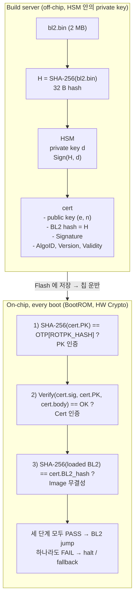
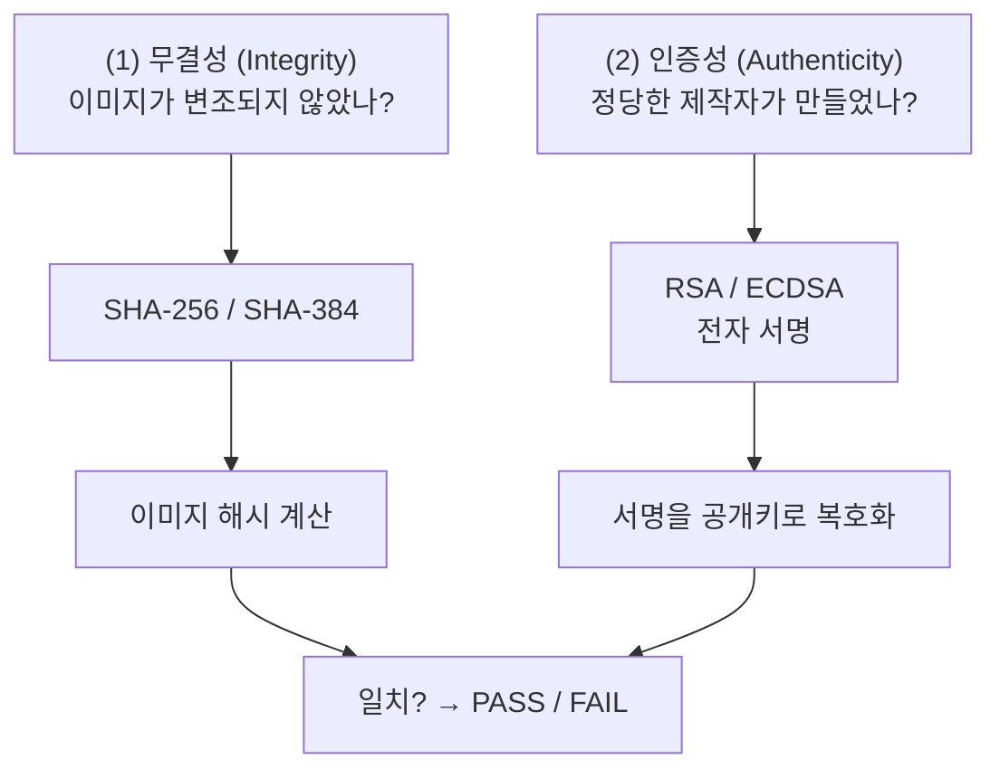
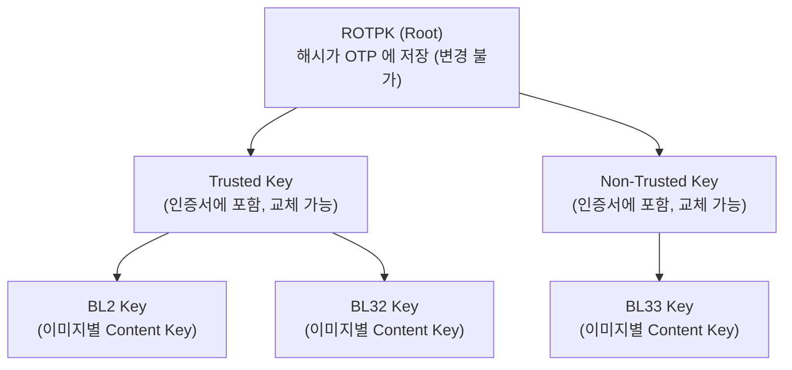
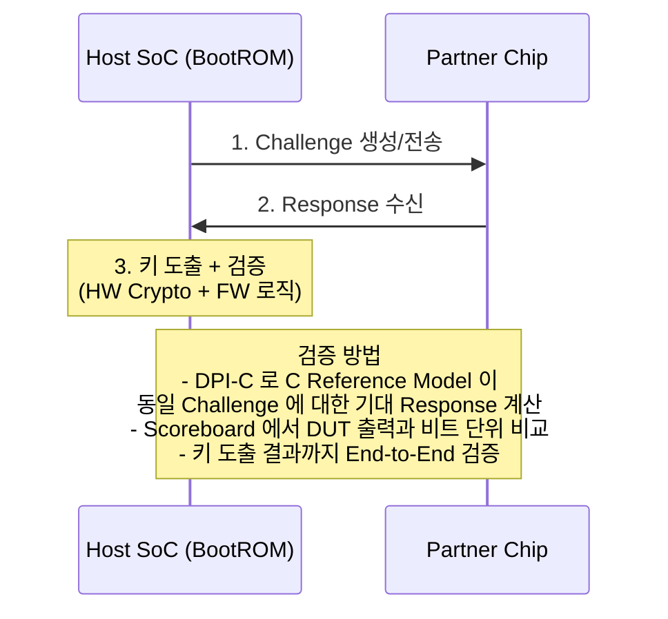

# Module 03 — Crypto in Boot

<!-- DV-SKOOL-CH-CTX:start -->
<div class="chapter-context" data-cat="soc">
  <a class="chapter-back" href="../">
    <span class="chapter-back-arrow">←</span>
    <span class="chapter-back-icon">🔐</span>
    <span class="chapter-back-text">SoC Secure Boot</span>
  </a>
  <span class="chapter-divider">›</span>
  <span class="chapter-marker">Module 03</span>
</div>
<!-- DV-SKOOL-CH-CTX:end -->

<!-- DV-SKOOL-CH-TOC:start -->
<div class="page-toc">
  <span class="page-toc-label">목차</span>
  <a class="page-toc-link" href="#1-why-care-이-모듈이-왜-필요한가">1. Why care?</a>
  <a class="page-toc-link" href="#2-intuition-비유와-한-장-그림">2. Intuition</a>
  <a class="page-toc-link" href="#3-작은-예-한-건의-rsa-2048-서명-검증을-step-by-step">3. 작은 예 — RSA-2048 서명 검증 한 건</a>
  <a class="page-toc-link" href="#4-일반화-hash-signature-key-hierarchy">4. 일반화 — Hash / Signature / Key Hierarchy</a>
  <a class="page-toc-link" href="#5-디테일-알고리즘-비교-pqc-hw-engine-co-verification">5. 디테일 — 알고리즘/PQC/HW Engine/Co-verification</a>
  <a class="page-toc-link" href="#6-흔한-오해-와-dv-디버그-체크리스트">6. 흔한 오해 + DV 디버그 체크리스트</a>
  <a class="page-toc-link" href="#7-핵심-정리-key-takeaways">7. 핵심 정리</a>
</div>
<!-- DV-SKOOL-CH-TOC:end -->

!!! objective "학습 목표"
    이 모듈을 마치면:

    - **Distinguish** Hash (무결성), MAC (무결성+인증), 비대칭 서명 (인증성+부인방지) 을 보장 대상으로 구별할 수 있다.
    - **Apply** RSA-2048/4096, ECDSA (P-256/P-384), SHA-256/384 를 boot signature 시나리오에 적용할 수 있다.
    - **Trace** Anti-rollback counter 의 증가/검증 흐름을 OTP/RPMB 기준으로 추적할 수 있다.
    - **Identify** Key hierarchy (ROTPK / Trusted Key / Content Key) 의 lifecycle 과 침해 시 영향 범위를 식별할 수 있다.
    - **Compare** RSA vs ECDSA vs ML-DSA (PQC) 를 키/서명 크기, 검증 속도, HW 면적 관점에서 비교할 수 있다.

!!! info "사전 지식"
    - 해시 (collision resistance) / 비대칭 키 (public/private) 기본
    - [Module 01](01_hardware_root_of_trust.md) — ROTPK / OTP
    - [Module 02](02_chain_of_trust_boot_stages.md) — verify-then-execute, cert tree

---

## 1. Why care? — 이 모듈이 왜 필요한가

Module 02 의 chain 은 _신뢰 전파_ 의 _구조_ 였습니다. 이번 모듈은 그 구조 위에 _도장_ 을 찍는 도구 — Hash, Signature, Key Hierarchy, Anti-rollback. 도구를 정확히 모르면 chain 의 어느 link 가 _왜_ 안전한지 설명하지 못합니다.

특히 면접/실무에서 가장 자주 나오는 세 가지: (1) "RSA vs ECDSA 어느 쪽?" (2) "PQC 전환 어떻게?" (3) "ROTPK 가 침해되면?" — 이 세 질문은 모두 이 모듈의 도구 이해도를 측정합니다. 도구를 잡으면 Module 04 (boot device) 의 RPMB HMAC, Module 05 (attack surface) 의 side-channel, Module 07 (DV) 의 DPI-C golden reference 가 모두 같은 어휘로 보입니다.

---

## 2. Intuition — 비유와 한 장 그림

!!! tip "💡 한 줄 비유"
    **Crypto in Boot** ≈ **봉인된 인계 봉투**.<br>
    봉투 안에 _내용물 (image)_ + _내용물 지문 (hash)_ + _발신인 도장 (signature)_ 이 들어 있고, 수신인은 (1) 도장을 _공인 도장 등록부 (OTP ROTPK hash)_ 와 대조해 발신인이 정당한지 보고, (2) 도장이 찍힌 지문이 봉투에 든 지문과 같은지 보고, (3) 그 지문이 실제 내용물의 지문과 같은지 본다. 셋 다 일치해야 봉투를 연다.

### 한 장 그림 — 빌드와 부팅의 두 시간축



### 왜 이 디자인인가 — Design rationale

세 가지 압력이 동시에 풀려야 했습니다.

1. **이미지가 너무 크다** — 2 MB image 자체에 RSA 서명을 직접 만들 수 없음 (RSA 입력 = key length 이내). 그래서 _hash 를 서명_.
2. **OTP 공간이 비싸다** — RSA-2048 PK = 256 B, 그 자체를 OTP 에 넣으면 한 슬롯 폐기 시 256 B 손실. _hash (32 B)_ 만 OTP, 실제 PK 는 cert.
3. **키 침해 = OTP 변경 불가** — ROTPK 가 직접 모든 image 를 서명하면 키 유출 = 칩 폐기. _중간 키 계층_ 으로 ROTPK 는 cert tree 의 root 만 서명.

이 셋이 합쳐져 (image hash 를 서명) + (OTP 에 PK hash 만 저장) + (cert tree 다단 계층) 패턴이 완성됩니다.

---

## 3. 작은 예 — 한 건의 RSA-2048 서명 검증을 step-by-step

가장 단순한 시나리오. BL2 cert 안에 RSA-2048 PK 와 Signature 가 들어 있고, BootROM 이 cert 1 개를 검증.

### 입력 데이터 (가정)

| 항목 | 값 |
|---|---|
| `cert.PK` | RSA public key, e=65537, n = 256 B (2048 bit) |
| `cert.body` | 인증서의 to-be-signed 영역 (BL2 hash 포함) |
| `cert.sig` | 256 B (Sign(SHA-256(cert.body), d) 의 결과, RSASSA-PKCS1-v1_5) |
| `cert.bl2_hash` | 32 B (build 시 SHA-256(bl2.bin)) |
| `OTP[ROTPK_HASH]` | 32 B = SHA-256(cert.PK) at provisioning |
| `bl2.bin` | 2 MB Flash 에서 SRAM 으로 로드된 image |

### 검증 단계

```
   Step           누가             무엇을                                값/상태
   ────           ─────            ──────                                ────────
   ① cert load   BootROM/DMA      Flash → SRAM (cert + bl2)             cert: 1 KB, bl2: 2 MB
   ② parse       BootROM          cert 의 PK / body / sig 분리           포인터 3개
   ③ pk-hash     HW SHA-256       SHA-256(cert.PK)                       h_pk (32 B)
   ④ otp-read    BootROM          OTP[ROTPK_HASH] 읽기                   h_otp (32 B)
   ⑤ pk-cmp      BootROM          constant_time_memcmp(h_pk, h_otp, 32) PASS or FAIL
                                                                          ↓ FAIL → halt
   ⑥ body-hash   HW SHA-256       SHA-256(cert.body)                     h_body (32 B)
   ⑦ rsa-verify  HW RSA           sig^e mod n  →  decoded H'             H' (32 B + padding)
   ⑧ verify-cmp  BootROM          H' == h_body && padding 정상           PASS or FAIL
                                                                          ↓ FAIL → halt
   ⑨ bl2-hash    HW SHA-256       SHA-256(loaded BL2)                    h_bl2 (32 B)
   ⑩ image-cmp   BootROM          h_bl2 == cert.bl2_hash                 PASS or FAIL
                                                                          ↓ FAIL → halt
   ⑪ jump        BootROM          BL2_entry 로 분기                       ★ trust 전파
```

### 단계별 의미

| Step | 의미 | 실패 시 의심 |
|---|---|---|
| ① | image + cert 가 SRAM 에 안전하게 도달 | DMA 오류, Flash 오류, cert 오프셋 잘못 |
| ② | cert format 파싱 (X.509 변형 또는 FIP) | cert 손상, ASN.1 boundary error |
| ③ | PK 의 신원 확인 — cert 의 PK 가 진짜 ROTPK 의 PK 인가 | HW SHA-256 결과 mismatch (HW Crypto 버그) |
| ④ | 제조 시점 anchor 와 비교 준비 | OTP read margin 부족 |
| ⑤ | _PK 인증_ — 공격자가 자기 키를 cert 에 넣었나 | mismatch = 비정당 cert → halt |
| ⑥ | cert body 자체의 hash | cert 의 일부 필드가 변조됐나 |
| ⑦ | RSA verify: `sig^e mod n` → 원래 hash 복원 | RSA HW IP 동작 + padding 디코딩 |
| ⑧ | _Cert 인증_ — cert body 가 사인 시점 그대로인가 | sig 변조, padding 변조 |
| ⑨ | 실제 image (Flash 에서 막 로드된 것) 의 hash | TOCTOU 또는 Flash 오류 |
| ⑩ | _Image 무결성_ — cert 가 보장한 hash 와 실제 image 가 같은가 | image 변조, cert.bl2_hash 변조 |
| ⑪ | trust 전파 — BL2 가 _trusted_ 로 격상 | _분기 자체_ 가 글리치 surface (Module 05) |

```c
// ②~⑪ 의 BootROM 측 의사코드 (단순화). production 코드는 모든 단계의 OK 플래그를
// 마지막에 한 번에 비교해 단일 분기 글리치를 방어 (Module 05 참조).
status_t verify_bl2_rsa2048(const cert_t *cert, const uint8_t *bl2, size_t bl2_len) {
    uint8_t h_pk[32], h_otp[32], h_body[32], h_image[32], decoded[32 + RSA_PAD_LEN];

    // ③④⑤ — PK 인증
    crypto_hw_sha256(cert->pk, cert->pk_len, h_pk);
    otp_read(OTP_ROTPK_HASH_OFFSET, h_otp, 32);
    if (constant_time_memcmp(h_pk, h_otp, 32) != 0)         return FAIL_PK_MISMATCH;

    // ⑥⑦⑧ — Cert 인증
    crypto_hw_sha256(cert->body, cert->body_len, h_body);
    crypto_hw_rsa2048_verify(cert->sig, cert->pk, decoded);  // sig^e mod n
    if (rsa_pkcs1_unpad(decoded, h_body) != OK)              return FAIL_SIG_INVALID;

    // ⑨⑩ — Image 무결성
    crypto_hw_sha256(bl2, bl2_len, h_image);
    if (constant_time_memcmp(h_image, cert->bl2_hash, 32) != 0) return FAIL_IMAGE_HASH;

    return SUCCESS;
}
```

!!! note "여기서 잡아야 할 두 가지"
    **(1) "image 를 직접 서명" 이 아니라 "image hash 를 서명"** — RSA 입력은 key length 이내, 2 MB image 직접 서명 불가. 그래서 _SHA-256 (32 B) 을 입력_ 으로.<br>
    **(2) 검증은 _세 layer_ 의 동시 PASS** — PK 인증 (③~⑤) + Cert 인증 (⑥~⑧) + Image 무결성 (⑨~⑩). 한 layer 라도 fail 이면 halt. 공격자가 한 layer 만 우회해도 다른 layer 가 잡습니다.

---

## 4. 일반화 — Hash / Signature / Key Hierarchy

### 4.1 두 연산의 결합 — 무결성 + 인증성



### 4.2 Hash 의 핵심 속성

| 속성 | 의미 | 비유 |
|------|------|------|
| Preimage Resistance (역상 저항성) | 해시에서 원본을 복원할 수 없음 | 지문에서 사람을 재구성 불가 |
| Second Preimage Resistance (제2 역상 저항성) | 같은 해시를 가진 다른 입력을 찾을 수 없음 | 같은 지문을 가진 사람 찾기 불가 |
| Collision Resistance (충돌 저항성) | 같은 해시를 가진 어떤 두 입력도 찾을 수 없음 | 동일 지문인 두 사람 찾기 불가 |

### 4.3 키 계층 구조 — 왜 다단인가



| 이유 | 설명 |
|------|------|
| 키 교체 (Key Rotation) | 중간 키가 유출되면 ROTPK 를 건드리지 않고 교체 가능 |
| 키 격리 (Key Isolation) | Trusted World 키 유출이 Non-Trusted 에 영향 없음 |
| 책임 분리 | BL32 (TEE) 와 BL33 (Normal) 팀이 각자의 키를 관리 |
| 선택적 폐기 (Revocation) | 특정 이미지 키만 폐기, 전체 재서명 불필요 |

**치명적 시나리오**: ROTPK 가 직접 모든 이미지를 서명 → 키 침해 시 OTP 변경 필요 → OTP 변경 불가 → 칩 폐기. 키 계층이 이 재앙을 방지합니다.

### 4.4 Anti-Rollback — 시간 축의 트러스트 무결성

서명은 _누가_ 만들었는지만 보장. _최신_ 인지는 별도 메커니즘이 필요.

```
v1.0 --- 취약점 발견 ──→ v2.0 (패치됨)

공격:
  1. 정당하게 서명된 v1.0 image 보관
  2. v2.0 배포 후 Flash 를 v1.0 으로 교체
  3. v1.0 은 유효한 서명 보유 → Secure Boot PASS
  4. v1.0 취약점 악용

방어 (OTP Anti-Rollback Counter, ARC):
   bit[0..31] = blown 비트 누적 = current min version
   if (image.version < otp.min_version) REJECT
   else proceed with verify;

업데이트:
   새 FW 설치 성공 → ARC 비트 추가 blow
   blow 후에는 이전 버전 부팅이 영구적으로 불가능

한계:
   OTP 비트 수 = 메이저 업데이트 횟수 한계 (32 bit → 32 회)
   → RPMB 를 보조 카운터로 사용 (Module 04 에서)
```

---

## 5. 디테일 — 알고리즘 / PQC / HW Engine / Co-verification

### 5.1 Secure Boot 에서 사용되는 해시 알고리즘

| 알고리즘 | 출력 크기 | 용도 | 비고 |
|---------|----------|------|------|
| SHA-256 | 256 bit (32 B) | 가장 일반적, ROTPK 해시 저장 | OTP 공간 효율적 |
| SHA-384 | 384 bit | ECDSA-384 와 쌍으로 사용 | 보안 강화 |
| SHA-512 | 512 bit | 높은 보안 요구사항 | OTP 소비 큼 |

### 5.2 왜 OTP 에 ROTPK 자체가 아닌 해시를 저장하는가

> RSA-2048 공개키 = 256 B, ECDSA-256 공개키 = 64 B. SHA-256 해시 = 키 크기와 무관하게 항상 32 B. OTP 는 비트당 비용이 비싸고 용량이 제한적 (일반적으로 수 KB) 이므로 해시가 OTP 공간을 절약.

### 5.3 서명 생성 vs 서명 검증 — 두 시간축

#### 서명 생성 (오프라인, 빌드 서버)

```
빌드 서버 (보안실)
  1. BL2 컴파일 → bl2.bin (2 MB)
  2. H = SHA-256(bl2.bin) → 32 B
  3. Sig = Sign(H, PrivateKey)
     RSA:   Sig = H^d mod n
     ECDSA: Sig = (r, s) from k, H, d
  4. 인증서 생성 {PublicKey, BL2 Hash, Signature, AlgoID, Version}
  5. bl2.bin + 인증서 → Flash 이미지
```

#### 서명 검증 (부팅 시, SoC 내부)

```
BootROM 실행 중:
  1. 인증서에서 Public Key 추출
  2. SHA-256(PK) == OTP_ROTPK_Hash? → PK 인증
  3. Verify(Cert.Hash, Cert.Sig, PK) → 해시 인증
     RSA:   Sig^e mod n == H?
     ECDSA: 곡선 연산으로 (r, s) 검증
  4. SHA-256(로드된 BL2) == Cert.Hash? → 이미지 무결성
  3개 모두 PASS → BL2 실행 허용
```

#### 왜 이미지를 직접 서명하지 않고 해시를 서명하는가

| | 이미지 직접 서명 | 해시를 서명 (실제 방식) |
|---|----------------|----------------------|
| 입력 크기 | 2 MB 전체 이미지 | 32 B (SHA-256) |
| RSA 연산 | RSA 는 입력 크기 제한 → 불가능 | 32 B → 즉시 |
| 범용성 | 이미지 크기마다 다름 | 항상 고정 크기 |

### 5.4 RSA vs ECDSA — 면접 단골 비교

| | RSA | ECDSA |
|--|-----|-------|
| 수학적 기반 | 큰 소인수 분해 | 타원곡선 이산로그 |
| 키 크기 (동일 보안 수준) | 2048-4096 bit | 256-384 bit |
| 서명 크기 | 256-512 B | 64-96 B |
| 검증 속도 | **빠름** (단순한 공개키 연산) | 느림 (곡선 연산) |
| 서명 속도 | 느림 | 빠름 |
| HW 면적 | 큼 (큰 모듈러 지수 연산) | 작음 |
| Secure Boot 적합성 | 검증 속도 우위 (부팅 시간) | 키/서명 크기 우위 (OTP/인증서) |

**면접 답변**: "RSA 는 검증이 빠르다 (부팅 시간 우위). ECDSA 는 키와 서명이 작다 (OTP 와 인증서 크기 우위). 현대 SoC 는 ECDSA 를 선호 — 더 작은 HW Crypto 엔진 면적, PQC 전환 시 하이브리드 방식의 용이함. 다만 RSA 의 빠른 검증 속도는 부팅 시간이 극도로 중요할 때 여전히 유리하다."

**팁**: "왜 A 가 B 보다 좋은가?" 질문에는 A 의 장점과 **B 의 한 가지 장점도** 함께 언급. 트레이드오프 인식을 보여줍니다.

### 5.5 NIST Curve vs Brainpool

| | NIST Curves | Brainpool Curves |
|--|-------------|-----------------|
| 개발 | NSA/NIST (미국) | BSI/ECC Brainpool (유럽) |
| 소수 선택 | Quasi-Mersenne (특수 구조) | 랜덤 소수 (검증 가능한 랜덤) |
| 성능 | 빠름 — Fast Reduction 가능 | 느림 — 일반 BigNum 연산 |
| 신뢰도 | 논란 ("NSA 백도어?") | 높음 — 투명한 파라미터 생성 |
| 채택률 | 지배적 (TLS, Secure Boot) | 유럽 정부/군사, BSI 권장 |
| HW 가속 | 대부분의 SoC 에 최적화 회로 있음 | HW 가속 거의 없음 |

**결론**: NIST = "빠르지만 파라미터가 의심스러움", Brainpool = "느리지만 투명함". 대부분의 상용 SoC 는 HW 가속 지원 때문에 NIST P-256 사용.

### 5.6 PQC (양자내성 암호학)

#### 왜 필요한가?

양자컴퓨터의 Shor 알고리즘이 RSA 와 ECDSA 를 다항식 시간에 깨뜨릴 수 있음.

#### NIST PQC 표준 (2024년 8월)

| 표준 | 원래 이름 | 용도 | 수학적 기반 | 비고 |
|------|----------|------|-----------|------|
| FIPS 204 (ML-DSA) | CRYSTALS-Dilithium | 전자 서명 | Module Lattice | 빠른 서명/검증, Secure Boot 1순위 후보 |
| FIPS 205 (SLH-DSA) | SPHINCS+ | 전자 서명 | 해시 기반 | 보수적, 최소한의 수학적 가정 |
| FIPS 203 (ML-KEM) | CRYSTALS-Kyber | 키 교환 | Module Lattice | Secure Boot 에 직접 사용되지 않음 |

#### PQC 의 Secure Boot 적용 과제

| | 현재 (ECDSA-256) | PQC (ML-DSA-65) |
|--|-------------------|-----------------|
| 공개키 | 64 B | 1,952 B |
| 서명 | 64 B | 3,309 B |
| 검증 시간 | ~1 ms | ~2-5 ms |

#### 전환 전략

- **하이브리드**: ECDSA + PQC 이중 서명, 둘 다 검증 → 호환성 + 미래 대비
- **해시 기반 (SLH-DSA)**: 해시 안전성만 가정 → 가장 보수적, 그러나 매우 큰 서명 (~17 KB)
- **Crypto-Agility**: 교체 가능한 알고리즘으로 부팅 체인 설계, OTP 에 알고리즘 ID 포함

### 5.7 ROTPK 침해 — 최악의 경우와 대응

**영향**: 공격자가 Private Key 를 가지면 악성 BL2 를 정당한 것으로 서명 가능 → 전체 Chain of Trust 붕괴.

**대응**:

1. **OTP 키 폐기**: 복수의 ROTPK 슬롯 (4-8개) 사전 할당, 침해된 키의 폐기 비트 blow, 다음 슬롯 활성화
2. **키 계층**: 중간 키만 유출됐다면 ROTPK 는 무사 → 중간 키만 교체
3. **FW 업데이트 + Anti-Rollback**: 새 키로 서명된 FW 배포, Anti-Rollback 카운터 증가
4. **근본적 한계**: OTP 슬롯 소진 → 더 이상 키 교체 불가 → 칩 폐기
5. **예방이 최선**: Private Key 를 HSM 에 저장, 에어갭 서명 환경, 엄격한 접근 로깅

### 5.8 HW Crypto Engine vs SW Crypto

| | HW Crypto Engine | SW Crypto |
|--|-----------------|-----------|
| 속도 | 수~수십 ms | 수백 ms ~ 수 초 |
| 부채널 방어 | 가능 (constant-time, 전력 차폐) | 매우 어려움 |
| 부팅 시간 영향 | 최소 | 심각 (특히 RSA-4096) |
| 면적/비용 | 추가 실리콘 필요 | 없음 |
| BootROM 에서 | **필수** | 사용하지 않음 |

### 5.9 DPI-C HW/SW Co-verification — 인터칩 키 교환

#### 왜 DPI-C 가 필요한가?

BootROM 의 보안 핸드셰이크 (특히 인터칩 키 교환) 는 HW + FW 협력으로 동작. FW 의 C 코드를 DPI-C 로 Scoreboard 에 연동하면:

1. **FW 전달 전에도 검증 시작 가능** — C 모델이 Golden Reference 역할
2. **독립적 검증** — RTL 과 별도로 작성된 C 코드로 비교 → 동일 버그 재현 방지
3. **복잡한 프로토콜 검증** — Challenge-Response, 키 도출 등 C 레벨에서 기대값 계산

#### 인터칩 키 교환 프로토콜 (Meta/Apple 협업)



자세한 DPI-C 아키텍처는 [Module 07 (DV 방법론)](07_bootrom_dv_methodology.md) 에서 다룹니다.

---

## 6. 흔한 오해 와 DV 디버그 체크리스트

### 흔한 오해

!!! danger "❓ 오해 1 — 'Crypto 알고리즘만 강하면 안전하다'"
    **실제**: Algorithm 외에 key management, OTP write protection, RNG quality, side-channel 방어, glitch 방어 등이 같이 critical. RSA-4096 을 써도 RNG 가 약하면 private key 추출 가능, OTP write protection 이 안 걸렸으면 ROTPK 자체가 변조 가능.<br>
    **왜 헷갈리는가**: Algorithm 비교 (RSA vs ECC) 가 가시적이지만 implementation hygiene 이 더 자주 실패 source.

!!! danger "❓ 오해 2 — 'SHA-256 hash 가 같으면 image 도 같다'"
    **실제**: Collision resistance 는 _공격자가 의도적으로 같은 hash 의 다른 image 를 만들기 어렵다_ 는 의미일 뿐, "같으면 같다" 가 절대 보장은 아닙니다 — 단지 확률적으로. 그러나 SHA-256 의 collision attack 은 현재 지구상 컴퓨팅 자원으로 불가능 → 실무에서는 같다고 봐도 무방.<br>
    **왜 헷갈리는가**: 수학적 보장 vs 실무적 보장의 혼동.

!!! danger "❓ 오해 3 — 'PQC 만 쓰면 양자에 안전'"
    **실제**: PQC 알고리즘 자체도 _수학적 가정_ (Module Lattice, Hash) 위에서 성립. 양자컴퓨터 + 미래 알고리즘 발견에 대비해 _하이브리드 (ECDSA + ML-DSA)_ 가 권고. 또한 ML-DSA-65 의 PK = 1.9 KB 라 OTP 에 PK hash 만 넣는 패턴은 그대로 유효.<br>
    **왜 헷갈리는가**: "post-quantum" 이라는 단어가 절대 안전을 시사.

!!! danger "❓ 오해 4 — 'Anti-Rollback 만 있으면 downgrade 차단'"
    **실제**: ARC 가 OTP 가 아닌 OTP-emulated (rewriteable) 영역에 있으면 우회 가능. counter 의 _진짜 immutable_ 여부가 핵심 — Module 04 의 RPMB 가 보조 역할일 때도 ARC 의 메이저 버전은 OTP 가 책임져야 안전.<br>
    **왜 헷갈리는가**: "기능 이름 = 동작 보장" 의 직관.

### DV 디버그 체크리스트 (Crypto 검증에서 자주 보는 실패)

| 증상 | 1차 의심 | 어디 보나 |
|---|---|---|
| RSA verify FAIL 인데 cert/sig 는 골든 빌드 | Padding (PKCS#1 v1.5) 디코딩 오류 또는 endian 불일치 | RSA HW 의 input/output endian, padding spec 일치 |
| ECDSA verify intermittent FAIL | nonce k 재사용 또는 RNG 약함 | sign 측 nonce 생성 path, build server 의 RNG entropy log |
| SHA-256 hash 값이 reference 와 다름 | DMA 가 image 의 일부를 읽지 못함 (잘린 input) | hash 입력 length 검증 + Flash read 완료 시점 |
| 검증 PASS 인데 wrong key 로 sig 됐을 가능성 | OTP[ROTPK_HASH] 가 _공격자 키_ 의 hash | OTP write log + ROTPK provisioning script |
| Anti-Rollback bypass — 구버전 image 가 부팅 | ARC backing storage 가 OTP-emulated | ARC fuse map 의 backing → 진짜 OTP 인지, RPMB 인지, EEPROM 인지 |
| Constant-time memcmp 가 timing leak | 컴파일러 최적화로 early-out | 어셈블리 dump 에서 분기 패턴 확인 |
| HW Crypto throughput 이 spec 보다 느림 | DMA 채널 충돌 또는 clock gating | crypto IP 의 busy/done 레지스터 + clock tree |
| Cert chain 의 중간 cert 만 변조됐는데 검증 PASS | Trusted Key cert 검증을 BootROM 이 skip | TF-A FIP cert 검증 순서 (Root → Trusted → Content) 모두 PASS 인지 |

!!! warning "실무 주의점 — Anti-Rollback 카운터 미증가 후 FW 업데이트"
    **현상**: 취약점이 패치된 FW 를 배포했지만 공격자가 이전 버전 이미지로 downgrade 하여 패치 이전 취약점을 재활용한다. Secure Boot 서명 검증은 통과한다.

    **원인**: FW 업데이트 절차에서 이미지 서명 검증 후 flash 기록까지는 수행하지만, OTP Anti-Rollback 카운터 blow 단계를 누락. 카운터 blow 는 비가역적 작업이므로 별도 스크립트로 분리된 경우 자동화 실패 시 조용히 건너뛰어진다.

    **점검 포인트**: FW 업데이트 시나리오 DV 에서 업데이트 완료 후 OTP counter 값이 `current_version_counter + 1` 로 증가했는지 읽기 검증. BootROM 로그의 `ANTI_RB_CHECK` 항목에서 image version < OTP counter 조건 차단 동작 확인.

---

## 7. 핵심 정리 (Key Takeaways)

- **검증 = Hash + Signature + Anti-rollback** — 무결성 + 인증성 + 시간 축 무결성, 셋이 직교.
- **Image 가 아니라 Image hash 를 서명** — 입력 크기 고정 + RSA 입력 한계 우회.
- **OTP 에는 PK 가 아니라 PK hash (32 B)** — 알고리즘 무관 고정 폭, 공간 절약.
- **Key hierarchy** — ROTPK (OTP, 변경 불가) → Trusted Key (cert, 교체 가능) → Content Key (image 별). 침해 격리 + 키 교체 가능.
- **PQC 전환은 _하이브리드_ 가 default** — ECDSA + ML-DSA 이중 서명, OTP 에 알고리즘 ID 포함.

!!! warning "실무 주의점 (요약)"
    - HSM 에서만 private key 사용. 빌드 서버에서도 평문 노출 금지.
    - Constant-time memcmp 는 컴파일러 최적화로 사라질 수 있음 — `volatile` + `memcmp_s` 또는 어셈블리 검증.
    - PQC 전환을 미리 준비하지 않으면 PK 1.9 KB / Sig 3.3 KB 가 cert tree 와 boot time 을 깨뜨릴 수 있음.

## 다음 단계

- 📝 [**Module 03 퀴즈**](quiz/03_crypto_in_boot_quiz.md)
- ➡️ [**Module 04 — Boot Device & Boot Mode**](04_boot_device_and_boot_mode.md): cert + image 가 _어디에서_ 어떻게 읽혀 오는가 — UFS, eMMC, USB DL, RPMB.

<div class="chapter-nav">
  <a class="nav-prev" href="../02_chain_of_trust_boot_stages/">
    <div class="nav-label">◀ 이전</div>
    <div class="nav-title">Chain of Trust & Boot Stages (신뢰 체인과 부팅 단계)</div>
  </a>
  <a class="nav-next" href="../04_boot_device_and_boot_mode/">
    <div class="nav-label">다음 ▶</div>
    <div class="nav-title">Boot Device & Boot Mode (부팅 장치와 부팅 모드)</div>
  </a>
</div>


--8<-- "abbreviations.md"
--8<-- "_inc/topic_abbr.md"
