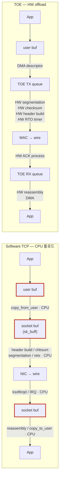
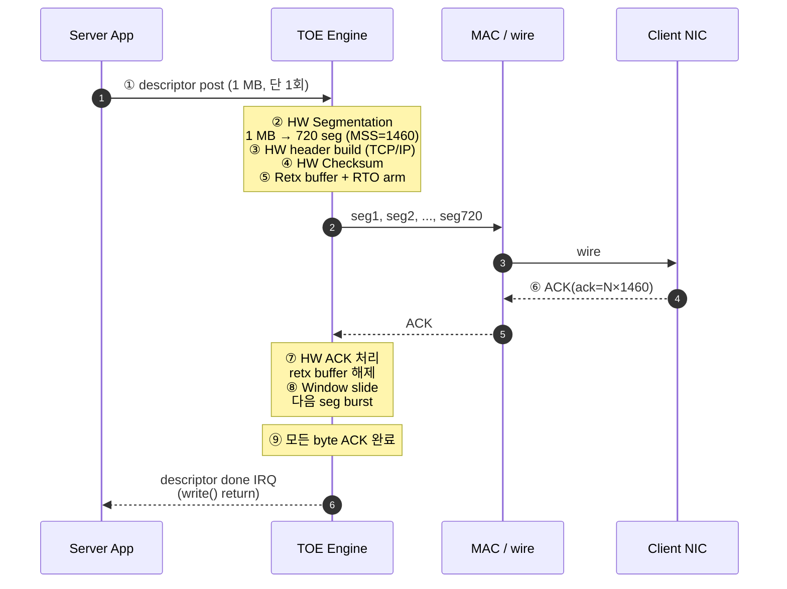
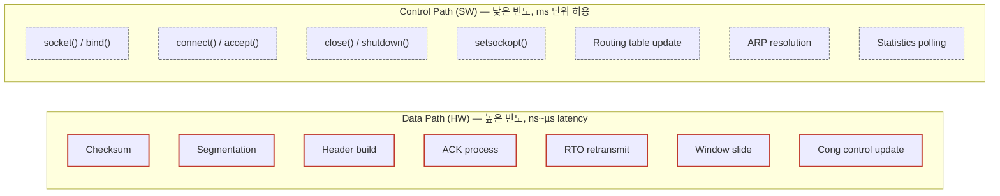
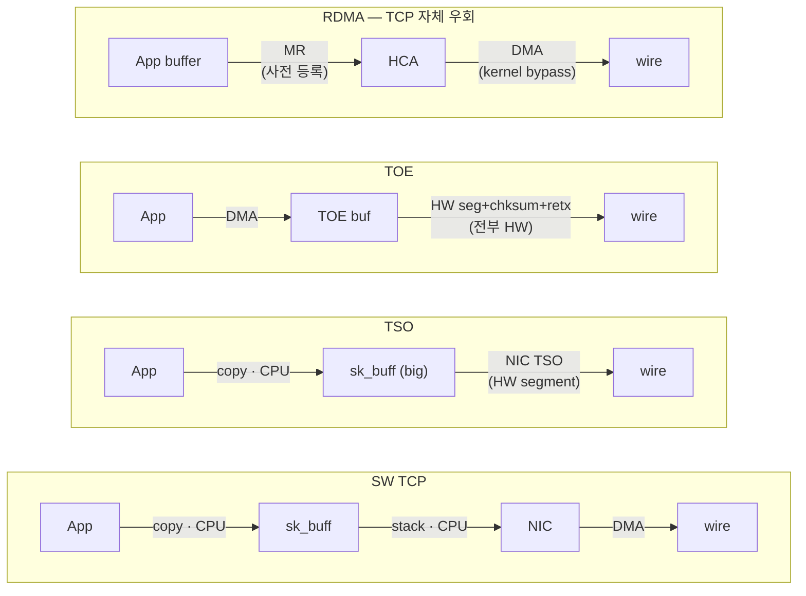
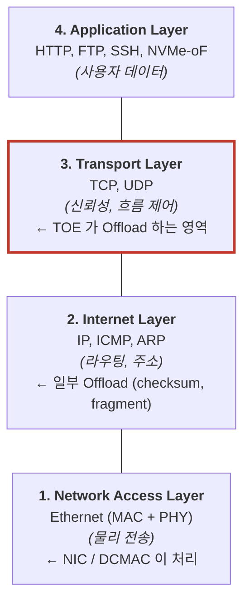
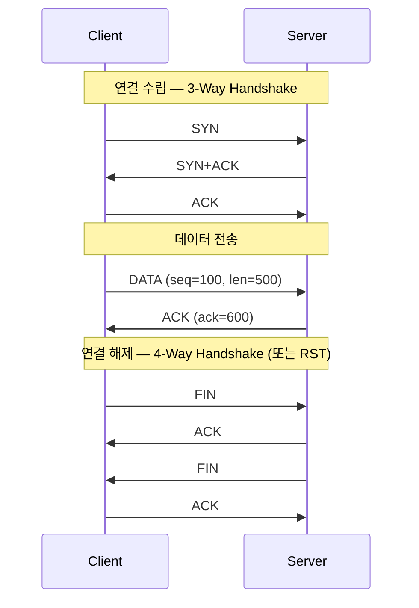

# Module 01 — TCP/IP & TOE Concept

<!-- DV-SKOOL-CH-CTX:start -->
<div class="chapter-context" data-cat="network">
  <a class="chapter-back" href="../">
    <span class="chapter-back-arrow">←</span>
    <span class="chapter-back-icon">📡</span>
    <span class="chapter-back-text">TOE</span>
  </a>
  <span class="chapter-divider">›</span>
  <span class="chapter-marker">Module 01</span>
</div>
<!-- DV-SKOOL-CH-CTX:end -->

<!-- DV-SKOOL-CH-TOC:start -->
<div class="page-toc">
  <span class="page-toc-label">목차</span>
  <a class="page-toc-link" href="#1-why-care-이-모듈이-왜-필요한가">1. Why care?</a>
  <a class="page-toc-link" href="#2-intuition-비유와-한-장-그림">2. Intuition</a>
  <a class="page-toc-link" href="#3-작은-예-1-mb-http-응답이-toe-를-거쳐-나가는-여정">3. 작은 예 — 1 MB HTTP 응답</a>
  <a class="page-toc-link" href="#4-일반화-offload-의-스펙트럼과-toe-의-범위">4. 일반화 — Offload 스펙트럼</a>
  <a class="page-toc-link" href="#5-디테일-tcpip-스택-tcp-기능-toe-효과">5. 디테일 — 스택, 기능, 효과</a>
  <a class="page-toc-link" href="#6-흔한-오해-와-dv-디버그-체크리스트">6. 흔한 오해 + 디버그</a>
  <a class="page-toc-link" href="#7-핵심-정리-key-takeaways">7. 핵심 정리</a>
</div>
<!-- DV-SKOOL-CH-TOC:end -->

!!! objective "학습 목표"
    이 모듈을 마치면:

    - **Trace** TCP/IP 스택 처리 단계와 host CPU 의 부하 발생 지점을 단계별로 추적할 수 있다.
    - **Distinguish** Partial offload (checksum, segmentation) 와 Full offload (state machine 전체) 의 경계를 구분할 수 있다.
    - **Quantify** 100 GbE 라인레이트에서 CPU 가 TCP 처리에 쓰는 cycle/packet 을 어림셈으로 계산할 수 있다.
    - **Identify** TOE 의 등장 동기 (HPC, hyperscale data center, AI/storage 가속) 와 한계 영역을 식별한다.
    - **Compare** Checksum/TSO/LRO/TOE/RDMA/DPDK 의 offload 범위 차이를 비교한다.

!!! info "사전 지식"
    - TCP/IP 스택 (3-way handshake, ACK, sliding window, sk_buff)
    - NIC 의 일반 동작 원리 (descriptor ring, DMA, IRQ)

---

## 1. Why care? — 이 모듈이 왜 필요한가

### 1.1 시나리오 — 100 Gbps 에서 _CPU 코어 다 잃기_

당신의 서버 100 Gbps NIC. TCP/IP 모든 처리 _SW_ 에서. 측정:

- 100 Gbps 양방향 처리 → CPU 코어 _4-8 개 100% 점유_ (Mellanox WP, 2014).
- 64 코어 서버 → 12% 코어 손실 _전부 통신만_.
- Application 의 가용 CPU = 56 코어.

또는 hardware offload (TOE):
- TCP segmentation, checksum, ACK/timer 모두 _NIC HW_.
- CPU 부담 = ~0.5 코어 (connection 관리만).
- Application 의 가용 CPU = 63.5 코어.

**5-7 코어 차이** = _수만 USD_ 의 서버 가치. Cloud 운영자는 _수십만 서버 fleet_ → 누적 절감 _수십억 USD_.

이게 TOE 가 _대규모 데이터센터_ 에서 _필수_ 인 이유.

이후 모든 TOE 모듈은 한 가정에서 출발합니다 — **"100 Gbps 라인레이트에서 host CPU 가 TCP/IP 를 처리하면 코어 여러 개가 100 % 점유되어 애플리케이션이 멈춘다"**. 왜 TOE 의 connection table 이 hardware 에 있어야 하는지, 왜 RTO 타이머가 SW timer 가 아니라 HW timer wheel 인지, 왜 DV TB 가 host agent 와 network agent 를 둘 다 두어야 하는지 — 전부 이 한 가정의 파생입니다.

이 모듈을 건너뛰면 이후의 모든 architecture/기능/검증 결정이 "그냥 외워야 하는 규칙" 으로 보입니다. 반대로 이 가정을 정확히 잡고 나면, 디테일을 만날 때마다 **"아, 이게 CPU cycle 을 줄이려는 거구나"** 처럼 _이유_ 가 보입니다.

---

## 2. Intuition — 비유와 한 장 그림

!!! tip "💡 한 줄 비유"
    **TCP** = 등기 우편. 원본을 보관하다가 ACK 가 안 오면 다시 보낸다.<br>
    **CPU SW TCP** = 한 명의 우체부가 모든 등기 봉투의 송장 작성·체크섬·재전송 타이머·창구 응대를 _직접_ 수행 — 처리량이 라인레이트를 못 따라감.<br>
    **TOE** = 등기 처리 전용 자동화 라인. 송장 작성·CRC·재전송·창구 응대를 전용 HW 가 처리하고, CPU 는 _연결 개설_ 같은 드문 결정만 한다.

### 한 장 그림 — SW TCP path vs TOE path



빨간 박스가 SW TCP 에서는 packet 마다 발생하지만, TOE 에서는 모두 **HW pipeline** 안에서 처리됩니다. CPU 는 `connect()` / `accept()` / `close()` 같은 **연결당 1~2 회** 의 control path 만 담당.

### 왜 이렇게 설계됐는가 — Design rationale

100 Gbps 라인레이트에서 64 byte 패킷 도착 간격은 **~5.12 ns**. CPU 한 코어가 packet 하나에 쓸 수 있는 cycle 은 사실상 한 자릿수 — checksum 한 번 못 돌립니다. 즉 **CPU 가 packet 별로 끼는 한 라인레이트를 못 채웁니다**. 그래서 TOE 의 세 축 — **Data path 의 HW offload + Connection state 의 HW 보존 + Control path 의 SW 잔류** — 는 동시에 만족돼야 의미가 있고, 셋 중 하나라도 빠지면 전체가 의미를 잃습니다. 이 세 축이 곧 TOE 의 architecture, 기능 분배, 그리고 검증 환경의 구조를 결정합니다.

---

## 3. 작은 예 — 1 MB HTTP 응답이 TOE 를 거쳐 나가는 여정

가장 단순한 시나리오. 웹 서버가 클라이언트에게 **1 MB HTTP 응답** 을 보냅니다. 연결은 이미 ESTABLISHED 상태, MSS = 1460 byte 라고 가정.



| Step | 누가 | 무엇을 | 의미 |
|---|---|---|---|
| ① | App + driver | `write()` → 1 MB buffer 의 descriptor 1 개를 TOE 에 post | CPU 는 _한 번_ 만 개입. SW TCP 라면 720 회의 segment 처리가 필요 |
| ② | TOE HW | 1 MB → 720 개 segment (MSS = 1460) 로 분할 (TSO 의 full-offload 버전) | CPU 가 segmentation 안 함 — 핵심 cycle 절감 |
| ③ | TOE HW | segment 마다 TCP header (seq, ack, window, flags) 와 IP header (src, dst, length, ttl) 채움 | Connection table 에서 4-tuple lookup → 상태 가져옴 |
| ④ | TOE HW | TCP checksum (pseudo header + payload) 와 IP checksum 계산해 헤더에 삽입 | pipeline 으로 1 cycle/word — 1500 B ≈ 94 cycle |
| ⑤ | TOE HW | retransmission buffer 에 사본 보관 + 연결별 RTO 타이머 arm | ACK 가 안 오면 자동 재전송 |
| ⑥ | Peer NIC | ACK packet 송신 (cumulative ACK, 일정 간격) | 보통 두 segment 마다 1 ACK |
| ⑦ | TOE HW | RX path 에서 ACK 수신 → connection table 의 send_unacked 갱신 → retx buffer 해당 영역 해제 | 모두 HW 가 처리 |
| ⑧ | TOE HW | window slide → 다음 burst 의 segment 송신 (cwnd × MSS 만큼) | Congestion control 도 HW 가 직접 |
| ⑨ | TOE HW | 마지막 byte ACK 도착 → descriptor 완료 IRQ 또는 polling completion | App 의 `write()` 가 return |

```c
// Step ① 의 SW 측 코드. 이 한 줄이 ②~⑨ 를 트리거.
ssize_t n = write(socket_fd, buf, 1024 * 1024);   // 1 MB
// SW TCP 라면 같은 write() 가 내부에서 720 회 segment 처리.
// TOE 라면 descriptor 1 개 post → HW 가 720 segment 자동 처리.
```

!!! note "여기서 잡아야 할 두 가지"
    **(1) CPU 개입 횟수의 비대칭** — SW TCP 는 packet 마다 (수백~수천 cycle), TOE 는 1 MB 당 1~2 회 (descriptor post + completion). 이게 TOE 의 본질. <br>
    **(2) Connection state 가 HW 안에 있다** — Step ③ 의 header build 가 가능하려면 seq/ack/window/cwnd 가 HW 가 즉시 읽을 수 있는 곳에 있어야 함. 이게 다음 모듈의 Connection Table 이야기로 이어집니다.

---

## 4. 일반화 — Offload 의 스펙트럼과 TOE 의 범위

### 4.1 Offload 의 4 단계 — 어디까지 HW 가 가져가나

| 단계 | Offload 항목 | 남는 SW 부담 | HW 복잡도 |
|---|---|---|---|
| **Stateless** | Checksum (IP/TCP/UDP) | Segmentation, retx, window, FSM 모두 SW | 낮음 |
| **Segment** | + TSO (TX), LRO (RX) | retx, window, FSM 은 여전히 SW | 중간 |
| **Stateful (TOE)** | + Connection state, retx, RTO, flow/cong control | 연결 setup/teardown 만 SW | 높음 |
| **Bypass (RDMA)** | TCP 자체를 우회, user-space 가 NIC 에 직접 명령 | TCP API 호환 안 됨 | 매우 높음 |

핵심: **TOE 는 "stateful offload"** — 연결 상태가 HW 에 있다는 점에서 TSO/LRO 와 본질적으로 다름.

### 4.2 데이터 패스 vs 컨트롤 패스 — 분리의 원칙



**원칙**: "자주 발생하는 Data Path 는 HW 로, 드문 Control Path 는 SW 로." 이 한 줄이 TOE architecture 모든 결정의 근거입니다.

### 4.3 DMA / TSO / TOE / RDMA — 한 그림



오른쪽으로 갈수록 CPU 개입이 줄지만, _기존 socket API 호환성_ 도 같이 줄어듭니다 — RDMA 는 별도 verbs API. TOE 는 **socket API 를 유지하면서 가장 많은 cycle 을 줄이는 지점**.

---

## 5. 디테일 — TCP/IP 스택, TCP 기능, TOE 효과

### 5.1 TCP/IP 4 계층 모델



### 5.2 TCP 의 핵심 기능 (UDP 와의 차이)

| 기능 | TCP | UDP |
|------|-----|-----|
| 연결 | Connection-oriented (3-way handshake) | Connectionless |
| 신뢰성 | 보장 (ACK, 재전송) | 미보장 |
| 순서 보장 | Sequence Number 로 보장 | 미보장 |
| 흐름 제어 | Window 기반 | 없음 |
| 혼잡 제어 | Slow Start, Congestion Avoidance | 없음 |
| 오버헤드 | 높음 (헤더 20B+, 상태 관리) | 낮음 (헤더 8B) |

UDP 는 헤더 8 B + 상태 관리 없음 → **CPU 부하가 작아 offload 효과 미미**. TCP 는 packet 마다 반복 연산이 많아 **HW offload 효과 극대화**.

### 5.3 TCP 연결 수명 주기



→ **연결 setup/teardown 은 연결당 1 회**. 데이터 전송은 packet 당 발생 → 빈도 격차가 100 만 배 이상. 이 비대칭이 HW/SW 분리의 근거.

### 5.4 TCP 헤더 구조 (TOE HW 가 만들어야 하는 필드)

```
 0                   1                   2                   3
 0 1 2 3 4 5 6 7 8 9 0 1 2 3 4 5 6 7 8 9 0 1 2 3 4 5 6 7 8 9 0 1
+-+-+-+-+-+-+-+-+-+-+-+-+-+-+-+-+-+-+-+-+-+-+-+-+-+-+-+-+-+-+-+-+
|          Source Port          |       Destination Port        |
+-+-+-+-+-+-+-+-+-+-+-+-+-+-+-+-+-+-+-+-+-+-+-+-+-+-+-+-+-+-+-+-+
|                        Sequence Number                        |
+-+-+-+-+-+-+-+-+-+-+-+-+-+-+-+-+-+-+-+-+-+-+-+-+-+-+-+-+-+-+-+-+
|                    Acknowledgment Number                      |
+-+-+-+-+-+-+-+-+-+-+-+-+-+-+-+-+-+-+-+-+-+-+-+-+-+-+-+-+-+-+-+-+
| Offset| Rsv |N|C|E|U|A|P|R|S|F|         Window Size          |
+-+-+-+-+-+-+-+-+-+-+-+-+-+-+-+-+-+-+-+-+-+-+-+-+-+-+-+-+-+-+-+-+
|           Checksum            |       Urgent Pointer          |
+-+-+-+-+-+-+-+-+-+-+-+-+-+-+-+-+-+-+-+-+-+-+-+-+-+-+-+-+-+-+-+-+
|                    Options (가변)                             |
+-+-+-+-+-+-+-+-+-+-+-+-+-+-+-+-+-+-+-+-+-+-+-+-+-+-+-+-+-+-+-+-+

핵심 필드:
  Sequence Number: 바이트 단위 전송 위치 (순서 보장)
  ACK Number:      다음으로 기대하는 바이트 번호
  Window Size:     수신 버퍼 여유 공간 (흐름 제어)
  Flags:           SYN/ACK/FIN/RST/PSH (연결 상태 관리)
  Checksum:        헤더 + 데이터 무결성 검증
```

### 5.5 100 Gbps 에서 CPU 가 부담하는 비용 — 어림셈

```
100 Gbps 네트워크에서 CPU TCP 처리:

  64 B 패킷 기준: ~150 M packets/sec (라인레이트)
  각 패킷마다 CPU 가:
    1. Checksum 계산/검증
    2. Sequence Number 관리
    3. ACK 생성/처리
    4. Window 크기 관리
    5. 재전송 타이머 관리
    6. 메모리 복사 (커널 → 유저 공간)

  결과:
    CPU 코어 여러 개가 TCP 처리에 100% 점유
    → 애플리케이션 처리 능력 없음
    → CPU 가 "네트워크 프로세서" 로 전락
```

### 5.6 TOE 적용 후 효과

```
TOE 있을 때:

  NIC → TOE HW:
    - Checksum 계산/검증 (HW, 1 cycle)
    - TCP Segmentation (HW)
    - ACK 생성 (HW)
    - 재전송 관리 (HW)
    - 흐름 제어 (HW)

  CPU:
    - 연결 수립/해제만 관여 (Control Path)
    - 데이터 전달만 수행 (Data Path 은 DMA)
    - → CPU 부하 80~90% 감소
    - → 애플리케이션에 CPU 할당 가능
```

| 항목 | SW TCP (CPU) | TOE (HW) |
|------|-------------|----------|
| Throughput | ~40 Gbps (CPU 한계) | 100 Gbps+ (라인 레이트) |
| Latency | ~10–50 µs (커널 경유) | ~1–5 µs (HW 직접) |
| CPU 사용률 | 80–100 % (TCP 처리) | ~10 % (제어만) |
| 연결 수 | 수만 (메모리/CPU 한계) | 수백만 (HW 상태 테이블) |
| 전력 | 높음 (CPU 풀로드) | 낮음 (전용 HW 효율) |

### 5.7 TOE vs 다른 Offload 기술

| 기술 | Offload 범위 | 복잡도 | 성능 | 사용 사례 |
|------|-------------|--------|------|----------|
| **Checksum Offload** | Checksum 만 | 낮음 | 약간 향상 | 거의 모든 NIC |
| **TSO/LSO** | TCP Segmentation 만 | 중간 | 중간 향상 | 대부분의 NIC |
| **TOE** | TCP/IP 전체 | 높음 | 대폭 향상 | 서버, 가속기, 스토리지 |
| **RDMA** | TCP 우회 (직접 메모리 접근) | 매우 높음 | 최고 | HPC, 저지연 |
| **DPDK** | 커널 우회 (유저스페이스) | 높음 | 높음 | NFV, 라우터 |

```
Offload 수준:

  Checksum Offload ⊂ TSO ⊂ TOE
  (부분)            (중간)  (전체)

  RDMA: TCP 자체를 우회 → 다른 범주
  DPDK: SW이지만 커널을 우회 → Offload라기보다 최적화
```

### 5.8 실무 주의점 — Partial Checksum Offload 와 부분 헤더 처리 오류

!!! warning "실무 주의점 — Partial Checksum Offload와 부분 헤더 처리 오류"
    **현상**: RX 체크섬 오프로드를 활성화했을 때 특정 패킷에서만 IP/TCP 체크섬 오류가 보고되며, 동일 패킷을 SW 스택으로 처리하면 정상이다.

    **원인**: Partial offload는 IP/TCP 헤더가 단일 DMA 버퍼에 연속으로 존재한다고 가정한다. IP 옵션 필드가 있거나 TCP 헤더가 세그먼트 경계에 걸리면 HW가 헤더 끝 위치를 잘못 계산하여 체크섬 오류를 발생시킨다.

    **점검 포인트**: TB에서 IP Options(IHL>5) 패킷과 TCP Options(Data Offset>5) 패킷을 별도 시나리오로 구성. `csum_start`와 `csum_offset` 디스크립터 필드가 옵션 길이에 따라 정확히 갱신되는지 DMA 디스크립터 덤프에서 확인.

---

## 6. 흔한 오해 와 DV 디버그 체크리스트

### 흔한 오해

!!! danger "❓ 오해 1 — 'TOE 는 TCP 전체를 HW 에서 처리한다'"
    **실제**: TOE 는 **stateful 한 데이터 패스** (Checksum, Segmentation, 재전송, Flow/Congestion control) 만 HW 가 처리합니다. **연결 수립/해제 같은 control path 는 여전히 CPU(SW)** 가 담당. <br>
    **왜 헷갈리는가**: "TCP offload" 라는 표현이 _전부_ 라는 인상을 주지만, 실제 분배는 빈도 기준 (Data path = 빈번 → HW, Control path = 드묾 → SW).

!!! danger "❓ 오해 2 — 'TOE = 빠른 NIC'"
    **실제**: 일반 NIC + Checksum/TSO 도 100 Gbps 라인레이트 자체는 채울 수 있습니다. TOE 의 차별점은 **CPU 점유율** (보통 5–10× 감소) 과 **tail latency**. throughput 만 보면 큰 차이가 안 날 수도 있음. <br>
    **왜 헷갈리는가**: 마케팅 자료가 "라인레이트" 만 강조해서.

!!! danger "❓ 오해 3 — 'TOE 가 있으면 항상 throughput 이 향상된다'"
    **실제**: TOE 가 효과 있는 워크로드는 **small packet, 다수 connection, CPU bound** 환경. **Large MTU (jumbo frame) + bulk transfer** 에서는 일반 NIC + GSO 만으로도 충분하고, TOE 의 connection table lookup 오버헤드가 오히려 작은 손해를 줄 수도 있습니다.<br>
    **왜 헷갈리는가**: "HW = 항상 빠름" 이라는 직관. 실제로는 workload-dependent.

!!! danger "❓ 오해 4 — 'Connection state 는 한번 만들어지면 영구 보존된다'"
    **실제**: TOE Connection Table 은 고정 크기 SRAM. TIME_WAIT 만료, RST, idle timeout 등으로 entry 가 회수되며, 비활성 connection 은 LRU 로 DRAM 에 swap-out 됩니다. 재접근 시 swap-in 지연이 발생. <br>
    **왜 헷갈리는가**: "stateful" 이 _상태가 무한히 유지된다_ 로 들려서.

!!! danger "❓ 오해 5 — 'UDP 도 TOE 가 처리해야 한다'"
    **실제**: UDP 는 헤더 8 B + 상태 관리 없음. 즉 packet 당 CPU 부담이 작아 offload 의 ROI 가 낮습니다. TOE 가 UDP 의 checksum 정도는 도와줄 수 있어도, "TCP Offload Engine" 이름에서 보듯 핵심은 TCP. <br>
    **왜 헷갈리는가**: "프로토콜 스택 전체 = TCP+UDP" 이미지 때문.

### DV 디버그 체크리스트 (TOE 개념 단계에서 마주칠 첫 실패들)

| 증상 | 1차 의심 | 어디 보나 |
|---|---|---|
| `write()` 가 빨라졌는데 throughput 이 그대로 | TOE descriptor 가 너무 작게 분할 (1 MB 가 1024 개 1 KB descriptor 로) | host driver 의 SG list, descriptor count |
| TOE 활성화했더니 small packet workload 가 _느려짐_ | connection table lookup latency > 절약된 CPU cycle | 워크로드 통계: pkt size 분포, conn 수 |
| Checksum offload 켰더니 특정 패킷만 fail | IP options 또는 TCP options 가 있어 헤더 길이 가변 | §5.8 의 csum_start/csum_offset 갱신 |
| iperf 결과 SW vs TOE 가 같은 값 | TSO 가 이미 동작 중이라 추가 offload 효과 없음 | `ethtool -k` 로 features 확인 |
| Connection 다수 생성 시 새 conn 거부 | Connection Table full 또는 TIME_WAIT 누적 | conn table used count, half-open count |
| ACK 가 늦게 오는 듯한 latency 증가 | CPU 가 ACK process 까지 하느라 대기 큐 누적 (TOE 가 ACK offload 안 켜진 경우) | TOE config 의 ack offload flag |
| `tcpdump` 로는 정상인데 app 이 데이터 못 받음 | RX path DMA descriptor lookup 실패 | host RX ring 의 producer/consumer pointer |
| RDMA-aware app 이 TOE 를 안 씀 | RDMA 는 TCP 자체를 우회 → TOE 와 다른 범주 | app 의 socket family (AF_INET vs AF_RDMA) |

이 체크리스트는 이후 모듈에서 더 정교한 형태로 다시 나옵니다. 지금 단계에서는 "TOE 효과 = (workload 가 small packet + many conn + CPU bound) ✕ (TOE config 가 stateful offload 켜져 있음)" 만 기억하세요.

---

## 7. 핵심 정리 (Key Takeaways)

- **TOE = TCP/IP HW offload**. Host CPU 부하 ↓ + throughput ↑ + tail latency ↓.
- **Partial offload**: checksum, TSO/LRO (segment offload). 일반 NIC 도 지원.
- **Full offload (= TOE)**: connection state machine 전체 HW. RDMA / iWARP 등 특수 NIC.
- **동기**: 100 GbE 에서 packet rate 가 1.5 M pps/Gbps → CPU cycle/packet 한도 초과.
- **활용**: HPC, hyperscale (AWS Nitro, Azure SmartNIC), storage networks (NVMe-oF).
- **HW/SW 분리 원칙**: 빈도 높은 Data Path = HW, 드문 Control Path = SW. 이 한 줄이 TOE 모든 설계 결정의 근거.

!!! warning "실무 주의점"
    - "TOE = 빠르다" 는 **CPU 점유율 / tail latency** 의 이야기. throughput 만 보면 일반 NIC + TSO 도 라인레이트 가능.
    - **Workload dependence**: small packet + many conn + CPU bound 일 때 효과 큼. bulk + jumbo 는 효과 작음.
    - **Connection state 유한**: Table full, TIME_WAIT 누적 시 새 연결 거부 가능 → 검증의 핵심 abnormal scenario.

### 7.1 자가 점검

!!! question "🤔 Q1 — TOE vs TSO/LRO (Bloom: Apply)"
    NIC 옵션:
    - (a) Plain NIC + SW TCP.
    - (b) NIC + TSO (Segmentation) + LRO (Receive Coalescing) — partial offload.
    - (c) Full TOE — connection state, retry, timer 모두 HW.

    어느 워크로드에 어느 것?

    ??? success "정답"
        - **Bulk transfer** (큰 file): (b) TSO/LRO 충분. Full TOE 의 _connection 비용_ 정당화 안 됨.
        - **Many small connections** (HTTP, RPC): **(c) Full TOE** — 수천 connection 의 _SW overhead_ 가 큼.
        - **Low CPU budget**: (c) — CPU 점유율 minimize.

        Full TOE 는 _design 복잡_, _interop_ 어려움 → bulk 워크로드에는 보통 (b) 가 cost-effective.

!!! question "🤔 Q2 — Stateful offload 검증 어려움 (Bloom: Analyze)"
    Stateless offload (TSO) 보다 stateful (TOE) 검증이 _왜 어려운가_?

    ??? success "정답"
        - **State space 폭발**: connection state (open, established, fin_wait, ...) × 동시 연결 수 × abnormal scenario.
        - **Interop**: 각 OS / driver / peer 가 다른 TCP 변형. RFC 의 모든 corner 정확.
        - **Long-tail bug**: 수 시간 운영 후만 보이는 state corruption. 짧은 시뮬에서 _안 잡힘_.

        해법: random workload + long simulation + state coverage cross.

### 7.2 출처

**External**
- IETF RFC 793 *TCP*, RFC 5681 *TCP Congestion Control*
- RFC 2018 *SACK*, RFC 1323 *PAWS*
- *Sockets Direct Protocol* — IBTA WP
- Chelsio TOE technical specifications

---

## 다음 단계

→ [Module 02 — TOE Architecture](02_toe_architecture.md): TOE 의 가정 위에서 TX/RX path, Connection Table, Timer Wheel, Memory hierarchy 가 어떻게 그려지는지.

- 📝 [**Module 01 퀴즈**](quiz/01_tcp_ip_and_toe_concept_quiz.md)

<div class="chapter-nav">
  <a class="nav-prev" href="../">
    <div class="nav-label">◀ 이전</div>
    <div class="nav-title">코스 홈</div>
  </a>
  <a class="nav-next" href="../02_toe_architecture/">
    <div class="nav-label">다음 ▶</div>
    <div class="nav-title">TOE 아키텍처</div>
  </a>
</div>


--8<-- "abbreviations.md"
