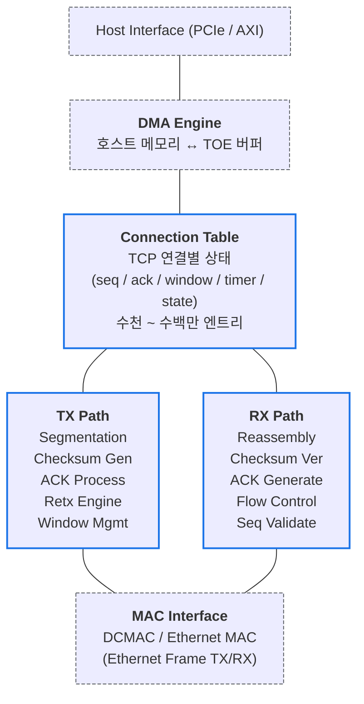
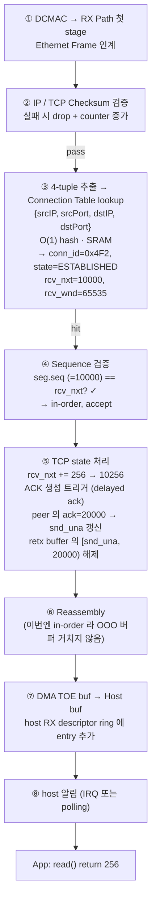
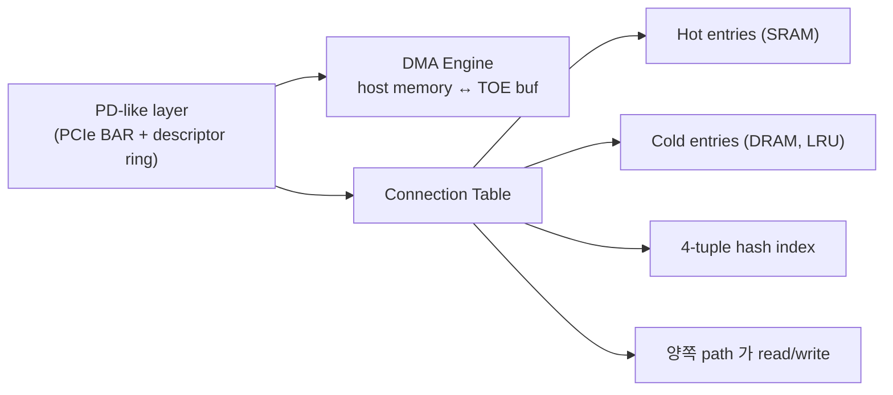
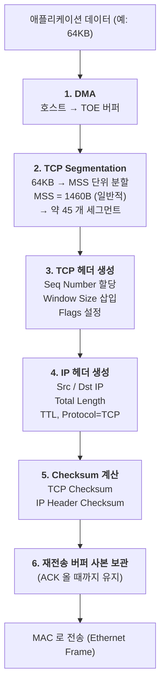
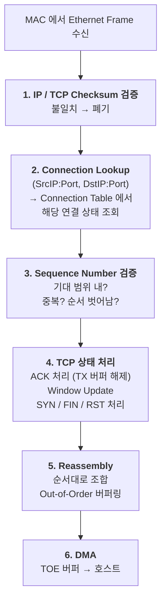
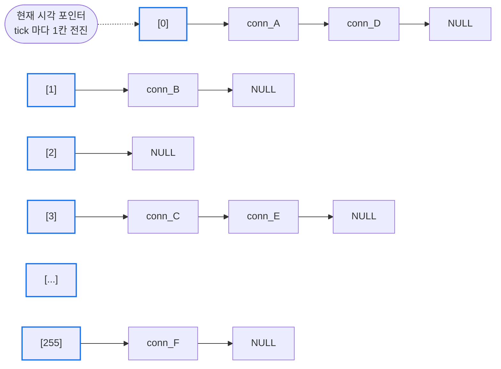
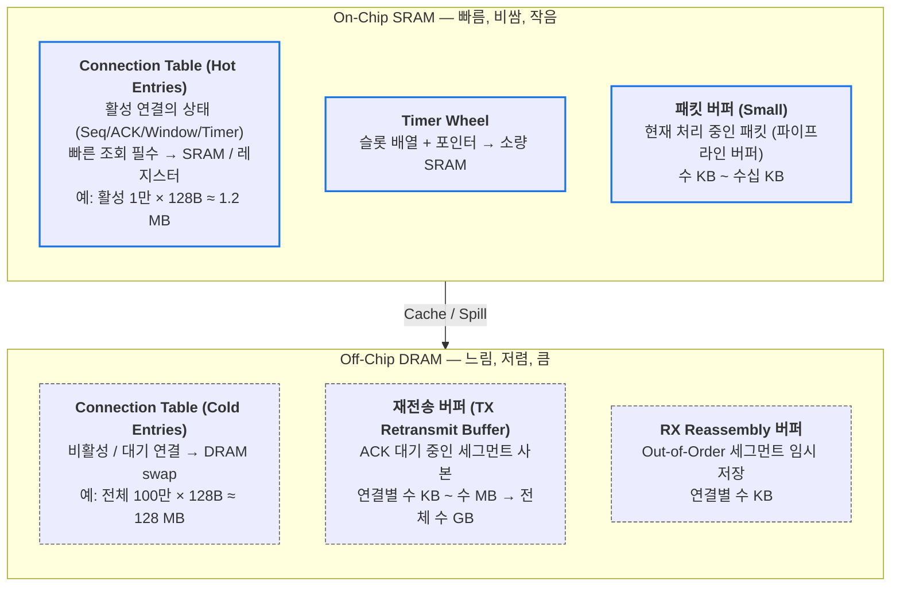
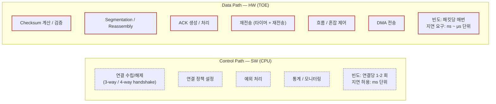
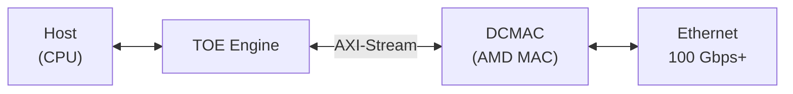

# Module 02 — TOE Architecture

<!-- DV-SKOOL-CH-CTX:start -->
<div class="chapter-context" data-cat="network">
  <a class="chapter-back" href="../">
    <span class="chapter-back-arrow">←</span>
    <span class="chapter-back-icon">📡</span>
    <span class="chapter-back-text">TOE</span>
  </a>
  <span class="chapter-divider">›</span>
  <span class="chapter-marker">Module 02</span>
</div>
<!-- DV-SKOOL-CH-CTX:end -->

<!-- DV-SKOOL-CH-TOC:start -->
<div class="page-toc">
  <span class="page-toc-label">목차</span>
  <a class="page-toc-link" href="#1-why-care-이-모듈이-왜-필요한가">1. Why care?</a>
  <a class="page-toc-link" href="#2-intuition-비유와-한-장-그림">2. Intuition</a>
  <a class="page-toc-link" href="#3-작은-예-한-tcp-segment-가-rx-path-에서-host-까지-가는-여정">3. 작은 예 — RX path 한 segment</a>
  <a class="page-toc-link" href="#4-일반화-toe-의-네-기둥">4. 일반화 — TOE 네 기둥</a>
  <a class="page-toc-link" href="#5-디테일-블록-tx-rx-table-timer-memory">5. 디테일 — 블록 / 타이머 / 메모리</a>
  <a class="page-toc-link" href="#6-흔한-오해-와-dv-디버그-체크리스트">6. 흔한 오해 + DV 디버그 체크리스트</a>
  <a class="page-toc-link" href="#7-핵심-정리-key-takeaways">7. 핵심 정리</a>
</div>
<!-- DV-SKOOL-CH-TOC:end -->

!!! objective "학습 목표"
    이 모듈을 마치면:

    - **Diagram** TOE 의 TX path, RX path, Connection Table, Timer Wheel, Memory hierarchy 의 블록 관계를 그릴 수 있다.
    - **Trace** 한 TCP segment 가 RX path 의 6 단계를 거쳐 host buffer 에 도착하는 흐름을 추적할 수 있다.
    - **Apply** Segmentation / Reassembly / Checksum / Flow control 이 어느 pipeline stage 에서 일어나는지 매핑한다.
    - **Distinguish** Stateful vs Stateless offload 의 구조 차이를 connection state 의 위치 관점에서 구분한다.
    - **Plan** 동시 connection 수 (수천~수백만) 를 위한 SRAM/DRAM hierarchy 와 LRU 정책을 설계한다.
    - **Justify** 왜 RTO 타이머가 개별 카운터가 아니라 Timer Wheel 로 구현되는지 정당화할 수 있다.

!!! info "사전 지식"
    - [Module 01](01_tcp_ip_and_toe_concept.md)
    - TCP state machine (LISTEN/SYN_SENT/ESTABLISHED/FIN_WAIT 등)

---

## 1. Why care? — 이 모듈이 왜 필요한가

Module 01 에서 "TOE 는 stateful offload" 라는 한 줄을 잡았습니다. 이 모듈은 그 한 줄이 **실제 칩 안에서 어떻게 블록으로 나뉘는가** 를 보여줍니다. TX path 의 6 단계, RX path 의 6 단계, 그 사이를 잇는 Connection Table, 수백만 연결의 RTO 를 처리하는 Timer Wheel, SRAM/DRAM 하이어라키 — 이 다섯이 TOE 의 골격입니다.

이 모듈을 건너뛰면 Module 03 (Key Functions) 에서 "Checksum 이 어디서 일어나는지", "재전송 버퍼가 어디 있는지" 같은 위치 질문에 답할 수 없습니다. 또 Module 04 (DV) 의 scoreboard 와 monitor 가 어느 인터페이스에서 hook 되는지도 이 architecture 위에서만 의미가 있습니다.

---

## 2. Intuition — 비유와 한 장 그림

!!! tip "💡 한 줄 비유"
    **Connection Table** ≈ **은행 창구 번호표 시스템**.<br>
    수백만 명의 고객 (TCP 연결) 이 각자 자기 순서 (Seq Number) 와 잔액 (Window) 을 갖고 있고, 창구 (TOE pipeline) 는 번호표 (4-tuple 해시) 로 해당 고객 파일을 O(1) 에 꺼내 처리한다. 활성 고객은 창구 옆 캐비넷 (SRAM) 에, 휴면 고객은 지하 보관소 (DRAM) 에.

### 한 장 그림 — TOE 전체 블록 다이어그램



### 왜 이 디자인인가 — Design rationale

세 가지 요구가 동시에 풀려야 했습니다.

1. **Full-duplex 라인레이트** → TX path 와 RX path 가 _독립_ pipeline. 한쪽 stall 이 다른 쪽을 멈추지 않게.
2. **수백만 연결의 상태 보존** → Connection Table 이 모든 packet pipeline 의 _공통 노드_. 양쪽 path 가 lookup/update 함.
3. **연결당 RTO 타이머 + 메모리 효율** → Timer Wheel + SRAM/DRAM tiering. 모든 연결을 SRAM 에 올릴 수 없고, 모든 카운터를 매 cycle 검사할 수도 없음.

이 세 요구의 교집합이 위 그림 — TX/RX 양쪽 path + 중앙 Connection Table + Timer Wheel + Memory hierarchy.

---

## 3. 작은 예 — 한 TCP segment 가 RX path 에서 host 까지 가는 여정

가장 단순한 시나리오. peer 가 우리 server 의 ESTABLISHED 연결로 **256 byte TCP segment** 를 보냅니다 (seq=10000, len=256, ack=20000, window=65535).



| Step | 어느 블록 | 무엇을 | 의미 |
|---|---|---|---|
| ① | DCMAC → TOE | Ethernet Frame 의 payload (IP/TCP) 를 TOE RX 에 인계 | AXI-S 인터페이스, 백프레셔 가능 |
| ② | RX Checksum Verify | IP header + TCP pseudo header + payload 의 1's complement sum | 실패 시 silent drop + counter |
| ③ | Connection Lookup | {srcIP, srcPort, dstIP, dstPort} 의 hash → Connection Table entry | O(1) 평균 (충돌은 chaining) |
| ④ | Seq Validate | seg.seq == rcv_nxt → in-order. (≠ → OOO 버퍼 또는 drop) | 기대 범위 밖이면 DUP ACK |
| ⑤ | TCP State Update | rcv_nxt += len, snd_una 갱신, retx buffer 해제 | Connection Table 의 state RMW |
| ⑥ | Reassembly | in-order 라 직통, OOO 라면 buffer 에 저장 후 gap 채워질 때까지 대기 | 본 예시는 in-order |
| ⑦ | RX DMA | TOE 의 RX buffer → host memory descriptor 가 가리키는 영역 | descriptor ring 의 producer pointer 증가 |
| ⑧ | Host notify | IRQ 또는 polling 방식으로 app 이 read() 가능 신호 | NAPI / busy-poll 정책 |

```c
// app 측 (변하지 않음 — 이 모든 과정이 socket API 뒤에 숨음)
ssize_t n = recv(sock, buf, 256, 0);   // returns 256
// SW TCP 라면 같은 recv() 가 내부에서 Step ②~⑧ 을 CPU 가 수행.
// TOE 라면 모두 HW. CPU 는 IRQ/polling 한 번만.
```

!!! note "여기서 잡아야 할 두 가지"
    **(1) Connection Table 이 모든 packet 의 통과점** — Step ③ 의 lookup 이 실패하면 그 packet 은 _그 어떤 처리도 받지 못함_. 즉 connection table 의 정확성이 RX path 의 모든 정확성을 좌우. <br>
    **(2) State update 가 atomic 해야 한다** — Step ⑤ 의 rcv_nxt/snd_una/retx buffer 갱신이 partial 로 끝나면 다음 packet 이 잘못된 state 를 봅니다. HW 구현에서는 single-write atomicity + per-conn lock 이 필요.

---

## 4. 일반화 — TOE 의 네 기둥

TOE architecture 는 다음 네 기둥으로 정형화됩니다.

### 4.1 데이터 패스 (TX/RX) — 반복 packet 처리

```
TX Path                                  RX Path
────────                                 ────────
1. Host DMA                              1. Checksum verify
2. TCP Segmentation                      2. Connection lookup
3. Header build (TCP/IP)                 3. Seq validate
4. Checksum gen                          4. State update (FSM, ACK)
5. Retx buffer + RTO arm                 5. Reassembly
6. To MAC                                6. RX DMA → host
```

대칭적이지만 한 곳에서 만남: **Connection Table**. TX 는 read 위주 (header build 시 seq/ack 가져옴), RX 는 read+write (state update).

### 4.2 컨트롤 패스 (CPU side) — 드문 결정

| 결정 | CPU 가 하는 이유 | 빈도 |
|---|---|---|
| `socket()` / `bind()` | OS file descriptor 와의 연결 | conn 당 1 회 |
| `connect()` / `accept()` | 3-way handshake 트리거, 정책 검사 (firewall, conntrack) | conn 당 1 회 |
| `setsockopt()` | TCP_NODELAY, SO_KEEPALIVE 등 정책 변경 | 드묾 |
| `close()` | FIN 시퀀스 시작, conn entry 회수 | conn 당 1 회 |
| Routing/ARP update | 외부 이벤트 (BGP, ARP refresh) | 분 단위 |

**원칙 재확인**: "자주 발생하는 Data Path 를 HW 로, 드문 Control Path 를 SW 로". Data path = ns~µs latency 요구, Control path = ms 단위 허용.

### 4.3 Connection Table — Stateful 의 본진



이 한 표가 TOE 의 "stateful" 의 모든 것:

- **TCP FSM state** (CLOSED/LISTEN/SYN_RCVD/ESTABLISHED/...)
- **Sequence numbers** (snd_una, snd_nxt, rcv_nxt)
- **Window** (snd_wnd, rcv_wnd, snd_wl1/wl2)
- **Congestion** (cwnd, ssthresh, dup_ack_count)
- **RTT estimate** (srtt, rttvar)
- **Timer pointer** (Timer Wheel slot 위치)
- **Retx buffer pointer** (DRAM 영역의 시작 + 길이)

### 4.4 Timer Wheel + Memory hierarchy

수백만 connection 의 RTO 타이머는 _동시에_ tick 검사할 수 없음. → Hashed Timing Wheel 자료구조로 슬롯에 등록 → 매 tick 에 _현재 슬롯_ 만 처리 → O(1).

수백만 connection 의 모든 state 를 SRAM 에 둘 수 없음. → 활성은 SRAM, 비활성은 DRAM, LRU 로 swap.

이 두 결정이 TOE 의 _scale 을 결정_ 합니다 (10K conn vs 1M conn).

---

## 5. 디테일 — 블록 / TX-RX / Table / Timer / Memory

### 5.1 TX Path (송신 경로)



### 5.2 RX Path (수신 경로)



### 5.3 Connection Table — 엔트리 구조와 Lookup

#### 엔트리 구조

```
Connection Table Entry:

+------+------+------+------+--------+--------+-------+-------+
| Src  | Dst  | Src  | Dst  | State  | Seq    | Ack   | Window|
| IP   | IP   | Port | Port | (FSM)  | Number | Number| Size  |
+------+------+------+------+--------+--------+-------+-------+
| Retx Timer  | RTT Estimate | Congestion | Retx Buffer |
|             |              | Window     | Pointer     |
+-------------+--------------+------------+-------------+

State (TCP FSM):
  CLOSED → LISTEN → SYN_RCVD → ESTABLISHED
  ESTABLISHED → FIN_WAIT_1 → FIN_WAIT_2 → TIME_WAIT → CLOSED
```

#### Connection Lookup 방법

| 방법 | 원리 | 속도 | 메모리 |
|------|------|------|--------|
| Hash Table | 4-tuple 해시 → 인덱스 | O(1) 평균 | 중간 |
| CAM (Content Addressable Memory) | 병렬 매칭 | O(1) 보장 | 큼 (비쌈) |
| TCAM | 와일드카드 매칭 가능 | O(1) 보장 | 매우 큼 |

**실무**: 대부분의 TOE 는 **Hash Table** 사용 — 비용 효율적이고 충분히 빠름. 충돌은 체이닝으로 처리.

### 5.4 타이머 관리 아키텍처 — 수백만 연결의 RTO

TOE 가 수백만 TCP 연결을 관리할 때, 각 연결별 RTO 타이머를 HW 에서 어떻게 효율적으로 구현하는지가 핵심 설계 과제다.

#### 순수 개별 타이머 (비현실적)

```
연결 100만 개 × 개별 타이머 = 100만 개 카운터
  - 매 클럭마다 100만 개 카운터 감소 검사 → 불가능
  - 면적/전력 폭발
```

#### Timer Wheel (Hashed Timing Wheel) — 실무 표준

핵심 아이디어: 시간을 슬롯으로 나누고, 만료 시점에 해당하는 슬롯에 연결을 등록.



Timer Wheel 구조 예: 256 슬롯, 1 ms 해상도.

동작:

1. **타이머 등록**: RTO=300ms 인 conn_X → 슬롯 `(현재 + 300) % 256` 에 삽입
2. **Tick**: 매 1 ms 마다 포인터 1 칸 전진
3. **만료 확인**: 현재 슬롯의 연결 리스트 순회 → 만료된 연결 처리
4. **갱신**: ACK 수신 시 기존 슬롯에서 제거 → 새 슬롯에 삽입

계층적 Timer Wheel (큰 RTO 범위 지원):

- Level 0: 1 ms 해상도, 256 슬롯 (0~255 ms)
- Level 1: 256 ms 해상도, 256 슬롯 (0~65 초)
- Level 1 만료 → Level 0 으로 재등록 (cascade)

복잡도:

- 등록 / 삭제: O(1)
- Tick 당 처리: 평균 O(1) (슬롯당 연결 수가 균등 분포일 때)
- 메모리: 슬롯 수 × 포인터 + 연결별 링크 (Connection Table 에 통합)

#### DV 검증 포인트 — 타이머

| 시나리오 | 확인 사항 |
|---------|----------|
| 정확한 만료 시점 | RTO 설정값과 실제 만료 시각 차이 ≤ 1 tick |
| ACK 수신 → 타이머 취소 | ACK 후 해당 연결의 재전송 미발생 |
| Exponential Backoff | 재전송마다 RTO 2배 증가 |
| 다수 연결 동시 만료 | 같은 슬롯에 여러 연결 → 모두 처리 |
| 타이머 갱신 (재시작) | 새 데이터 전송 시 타이머 리셋 |

### 5.5 메모리 아키텍처 — 버퍼와 테이블 배치

TOE 성능은 메모리 대역폭과 용량에 크게 의존한다. On-chip(SRAM)과 Off-chip(DRAM)을 적절히 분배하는 것이 설계 핵심.



설계 트레이드오프:

- SRAM 증가 → 성능 ↑, 면적/비용 ↑
- DRAM 의존 → 비용 ↓, 지연 ↑ (메모리 컨트롤러 경유)
- 캐싱 전략: 활성 연결을 SRAM 에 유지, LRU 로 교체
- 100 Gbps 달성: 재전송 버퍼 대역폭이 병목 → DRAM 채널 수 중요

#### DV 검증 포인트 — 메모리

| 시나리오 | 확인 사항 |
|---------|----------|
| Connection Table 가득 참 | 새 연결 거부 또는 LRU 교체 정상 동작 |
| SRAM ↔ DRAM 스왑 | 비활성 연결 swap-out 후 재활성화 시 상태 일관성 |
| 재전송 버퍼 오버플로 | 버퍼 한계 시 오래된 데이터 폐기 정책 |
| OOO 버퍼 가득 참 | 추가 OOO 패킷 처리 (폐기 또는 ACK으로 재요청) |

### 5.6 HW/SW 분리 — Control Path vs Data Path



핵심: "자주 발생하는 Data Path 를 HW 로, 드문 Control Path 를 SW 로".

### 5.7 TOE 와 DCMAC 연동 (이력서 연결)



DCMAC (AMD):

- 100 / 200 / 400 Gbps Ethernet MAC
- Ethernet Frame 송수신
- FCS (Frame Check Sequence) 처리
- Pause Frame (흐름 제어)

TOE ↔ DCMAC 인터페이스:

- AXI-Stream 기반
- TX: TOE → DCMAC (TCP 세그먼트 → Ethernet Frame)
- RX: DCMAC → TOE (Ethernet Frame → TCP 세그먼트)

검증 포인트:

- TOE 와 DCMAC 간 AXI-S 핸드셰이크 정확성
- Frame 크기, 정렬, 패딩 정확성
- 백프레셔 (DCMAC busy 시 TOE 대기)
- 에러 전파 (CRC 에러 → TOE 에 통지)

### 5.8 실무 주의점 — SYN Flood 시 Connection Table 고갈

!!! warning "실무 주의점 — SYN Flood 시 Connection Table 고갈"
    **현상**: SYN 패킷이 대량으로 유입될 때 정상 클라이언트의 연결 요청이 거부되며, `conn_table_full` 상태 비트가 set 된다.

    **원인**: TOE의 Connection Table은 고정 크기(예: 64K entry)이다. Half-open 상태(SYN_RCVD)인 항목이 SYN-ACK 응답 없이 쌓이면 테이블이 포화된다. SYN Cookie 미지원 또는 Half-open 타임아웃이 너무 길게 설정된 경우 더욱 취약하다.

    **점검 포인트**: 시뮬레이션에서 SYN only 시퀀스를 1K회 이상 인가하여 `conn_table_used` 카운터가 포화에 도달하는 사이클을 측정. 이후 정상 SYN이 DROP 되는지 확인하고, half-open 타임아웃 레지스터를 최솟값으로 설정 후 재시험.

---

## 6. 흔한 오해 와 DV 디버그 체크리스트

### 흔한 오해

!!! danger "❓ 오해 1 — 'Connection State 는 한번 만들어지면 영구 보존된다'"
    **실제**: Connection Table 은 고정 크기. TIME_WAIT 만료, RST, idle timeout 등으로 entry 가 회수되며, 비활성 connection 은 LRU 로 DRAM 에 swap-out 됩니다. 재접근 시 swap-in 지연.<br>
    **왜 헷갈리는가**: "stateful offload" 가 _상태가 무한히 유지된다_ 로 들려서.

!!! danger "❓ 오해 2 — 'TX path 와 RX path 는 같은 Connection Table 을 동시에 쓰니 conflict 이 자주 난다'"
    **실제**: 같은 연결의 TX/RX 가 같은 entry 를 만지지만, 보통 _서로 다른 필드_ (TX 는 snd_*, RX 는 rcv_*). 그래도 atomicity 는 필요해서 entry 단위 single-write 또는 per-conn lock 으로 보호. 충돌 자체는 드뭄. <br>
    **왜 헷갈리는가**: "shared resource = 항상 contention" 이라는 직관.

!!! danger "❓ 오해 3 — 'Hash Table 은 충돌 때문에 CAM 보다 느리다'"
    **실제**: 잘 설계된 hash + 충분히 큰 bucket 이면 평균 O(1), 충돌은 통계적으로 드물어 chaining 으로 충분. CAM 은 면적/전력 비용이 100~1000× 높아서 실무에서 꺼립니다.<br>
    **왜 헷갈리는가**: 교과서가 "최악 O(n)" 을 강조해서.

!!! danger "❓ 오해 4 — '모든 RTO 타이머를 매 cycle 검사하면 된다'"
    **실제**: 100 만 카운터 × 매 cycle 비교는 면적/전력 폭발. Timer Wheel 로 _현재 슬롯_ 만 검사 → tick 당 평균 O(1). 핵심 발명. <br>
    **왜 헷갈리는가**: "per-conn timer = per-conn counter" 라는 매핑이 직관적이라.

!!! danger "❓ 오해 5 — '재전송 버퍼는 SRAM 에 있어야 빠르다'"
    **실제**: Retx buffer 는 연결별 수 KB~MB → 전체 수 GB 단위 → SRAM 불가. 반드시 DRAM. SRAM 은 _state_ 만 저장 (수십 byte/conn). 데이터 자체는 DRAM. <br>
    **왜 헷갈리는가**: "빠른 path = 모두 SRAM" 이라는 단순화.

### DV 디버그 체크리스트 (Architecture 검증에서 자주 보는 실패)

| 증상 | 1차 의심 | 어디 보나 |
|---|---|---|
| 같은 4-tuple 인데 entry 가 두 개 | Connection lookup hash 충돌 처리 버그 | Hash bucket chain 의 4-tuple equal check |
| RX path 가 valid packet 을 drop | Connection lookup miss (state 가 CLOSED 로 보이거나) | Connection Table 의 conn_id 와 state 필드 |
| TX path 가 stall (descriptor 처리 안 됨) | Connection Table 의 snd_wnd = 0 (peer 가 zero window) | snd_wnd 와 peer 의 ACK window 필드 |
| Timer Wheel 의 같은 슬롯에서 일부 conn 만 만료 | List traversal 도중 stop 또는 LRU 로 DRAM 에 swap-out 된 entry 누락 | Timer Wheel slot 의 list iteration 로직 |
| RTO 가 의도한 값보다 길게 발생 | Timer Wheel 의 cascade (level 1 → level 0) 시 정확도 손실 | level 1 만료 시 level 0 재등록 슬롯 계산 |
| Connection 다수 생성 후 일부 random 하게 reset | Connection Table eviction 정책이 active conn 도 evict | LRU 의 timestamp 갱신 누락 |
| OOO 버퍼 overflow 후 packet drop 안 함 | RX path 의 backpressure 가 MAC 까지 전파 안 됨 | AXI-S `tready` 신호의 흐름 |
| TX retx buffer 가 free 안 됨 → throughput 점진 하락 | RX path 의 ACK 처리가 retx buffer pointer 갱신 누락 | ACK 도착 시 snd_una 와 retx buffer release pointer |
| `tcpdump` 로 packet 정상인데 host app 못 받음 | RX DMA descriptor ring 의 producer pointer 안 올라감 | RX descriptor ring 의 head/tail pointer |
| DCMAC 백프레셔 시 TX 가 hang | TOE 의 AXI-S `tready` 응답 누락 | TOE-DCMAC 인터페이스의 valid/ready handshake |

이 체크리스트는 Module 03 (Key Functions) 와 Module 04 (DV) 에서 더 정교하게 다시 나옵니다. 지금 단계에서는 "Architecture 실패 = (Connection lookup, State atomicity, Timer wheel, DMA descriptor) 4 곳 중 하나" 라는 분류만 기억하세요.

---

## 7. 핵심 정리 (Key Takeaways)

- **TX/RX Path 분리**: 독립 pipeline → full-duplex. 한쪽 stall 이 다른 쪽을 멈추지 않음.
- **Connection Table**: 4-tuple (src/dst IP+port) → connection state. Hash 기반 lookup, O(1) 평균. **모든 packet 의 통과점**.
- **Stateful**: TCP 상태 머신을 HW 가 직접 관리 (LISTEN→SYN→ESTABLISHED→...). Reordering buffer, retransmission timer 도 HW.
- **Timer Wheel**: 수백만 RTO 를 O(1) tick 으로 처리. 개별 카운터 방식은 면적/전력 폭발.
- **Memory hierarchy**: 활성 connection state 는 SRAM, idle 은 DRAM, retx/reassembly buffer 는 DRAM. Cache hit rate 가 throughput 좌우.
- **AXI host interface**: descriptor ring (TX/RX), interrupt, doorbell. control path 는 SW, data path 는 DMA.

!!! warning "실무 주의점"
    - Connection Table SRAM 크기 = 동시 _활성_ 연결 수의 상한. 그 이상은 DRAM swap → latency 변동.
    - Timer Wheel cascade 의 정확도는 level 1 → level 0 재등록 시 slot 계산이 핵심.
    - Retx buffer 의 DRAM 대역폭은 종종 throughput 의 병목 — 채널 수와 access pattern 검토 필수.

---

## 다음 단계

→ [Module 03 — TOE Key Functions](03_toe_key_functions.md): 위 architecture 위에서 5 대 기능 (Checksum / Segmentation+Reassembly / Retransmission / Flow Control / Congestion Control) 이 어떻게 동작하는지.

- 📝 [**Module 02 퀴즈**](quiz/02_toe_architecture_quiz.md)

<div class="chapter-nav">
  <a class="nav-prev" href="../01_tcp_ip_and_toe_concept/">
    <div class="nav-label">◀ 이전</div>
    <div class="nav-title">TCP/IP 기본 + TOE 개념</div>
  </a>
  <a class="nav-next" href="../03_toe_key_functions/">
    <div class="nav-label">다음 ▶</div>
    <div class="nav-title">TOE 핵심 기능 상세</div>
  </a>
</div>


--8<-- "abbreviations.md"
