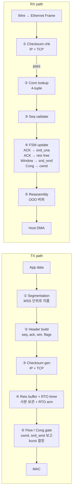
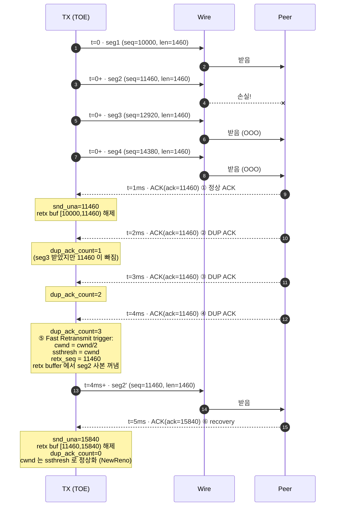
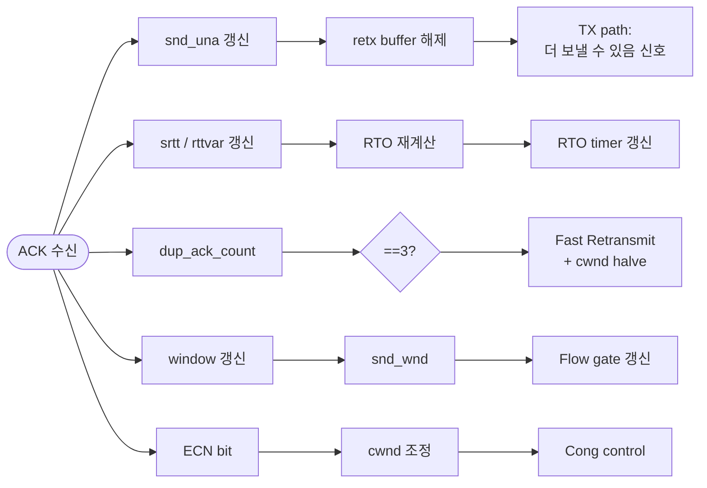
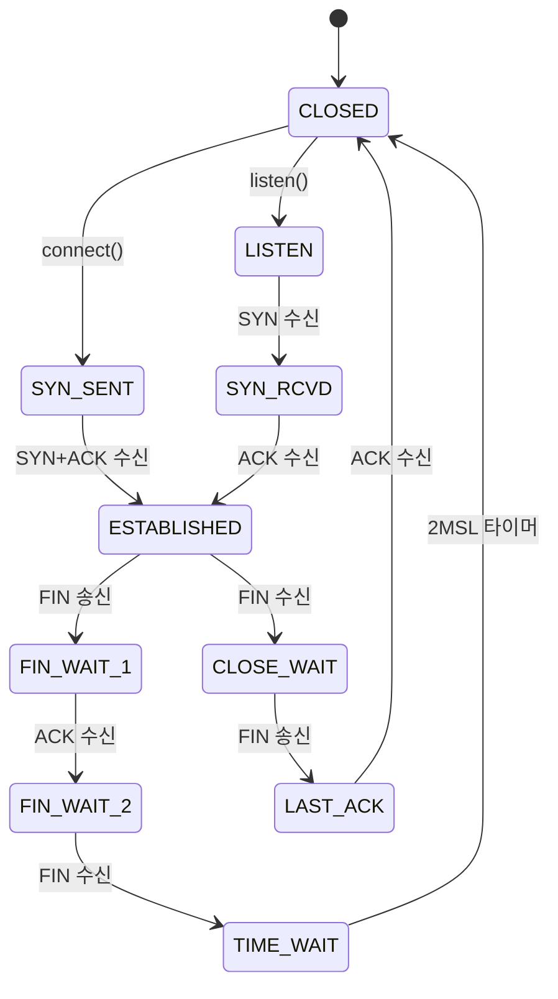
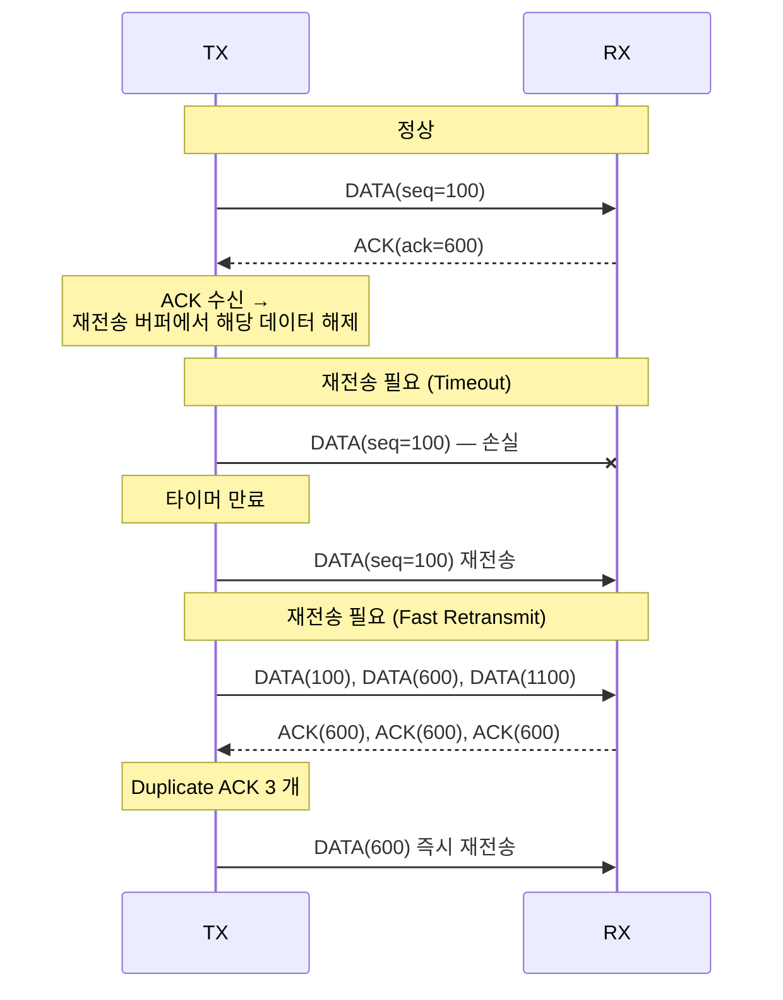
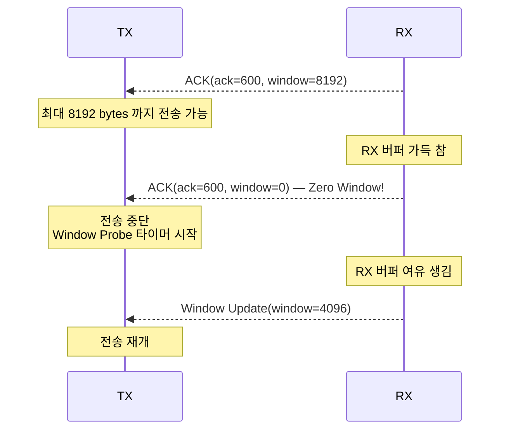
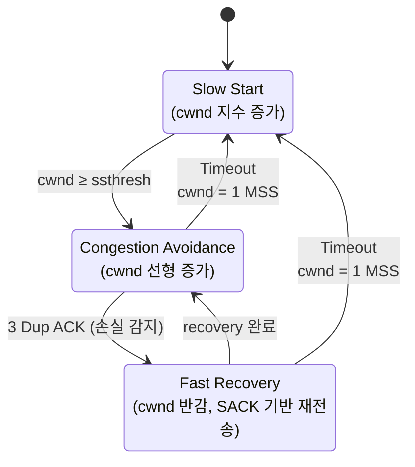

# Module 03 — TOE Key Functions

<!-- DV-SKOOL-CH-CTX:start -->
<div class="chapter-context" data-cat="network">
  <a class="chapter-back" href="../">
    <span class="chapter-back-arrow">←</span>
    <span class="chapter-back-icon">📡</span>
    <span class="chapter-back-text">TOE</span>
  </a>
  <span class="chapter-divider">›</span>
  <span class="chapter-marker">Module 03</span>
</div>
<!-- DV-SKOOL-CH-CTX:end -->

<!-- DV-SKOOL-CH-TOC:start -->
<div class="page-toc">
  <span class="page-toc-label">목차</span>
  <a class="page-toc-link" href="#1-why-care-이-모듈이-왜-필요한가">1. Why care?</a>
  <a class="page-toc-link" href="#2-intuition-비유와-한-장-그림">2. Intuition</a>
  <a class="page-toc-link" href="#3-작은-예-한-segment-가-손실되어-fast-retransmit-까지-가는-한-사이클">3. 작은 예 — 손실 → Fast Retransmit</a>
  <a class="page-toc-link" href="#4-일반화-5-대-기능과-tcp-fsm">4. 일반화 — 5 대 기능 + FSM</a>
  <a class="page-toc-link" href="#5-디테일-checksum-segmentation-retx-flow-cong-options">5. 디테일 — 5 대 기능 상세</a>
  <a class="page-toc-link" href="#6-흔한-오해-와-dv-디버그-체크리스트">6. 흔한 오해 + DV 디버그 체크리스트</a>
  <a class="page-toc-link" href="#7-핵심-정리-key-takeaways">7. 핵심 정리</a>
</div>
<!-- DV-SKOOL-CH-TOC:end -->

!!! objective "학습 목표"
    이 모듈을 마치면:

    - **Apply** Checksum offload (IP/TCP/UDP), TSO (TCP Segmentation Offload), LRO (Large Receive Offload) 를 시나리오에 매핑할 수 있다.
    - **Trace** Retransmission timer + RTO 계산 + duplicate ACK 기반 fast retransmit 의 한 사이클을 추적할 수 있다.
    - **Apply** RFC 6298 의 SRTT/RTTVAR/RTO 공식을 dry-run 으로 계산할 수 있다.
    - **Distinguish** Reno / NewReno / Cubic 의 cwnd 증가 곡선 차이와 HW 구현 비용 차이를 구분한다.
    - **Implement** Window Scale, SACK, Timestamps 의 협상과 효과를 시나리오에 적용한다.
    - **Decompose** TCP 11 상태 FSM 의 전이를 HW state machine 으로 분해한다.

!!! info "사전 지식"
    - [Module 01-02](01_tcp_ip_and_toe_concept.md)
    - TCP/IP detail: window, ACK, RTT/RTO

---

## 1. Why care? — 이 모듈이 왜 필요한가

### 1.1 시나리오 — _Interop 실패_ 의 원인

당신의 TOE 가 Linux peer 와 통신. 정상 데이터는 OK, _packet loss 발생_ 시 _connection drop_.

추적:
- Linux 의 _SACK block_ 송신 → 당신의 TOE 가 _ignore_.
- Linux 는 _SACK 통한 selective retransmit_ 기대 → 안 옴 → timeout → drop.

원인: TOE 가 **RFC 2018 SACK 미구현**. _Linux peer 가 RFC compliant_, 당신의 TOE 가 _아님_.

이게 _TCP interop_ 의 어려움. TCP 의 _수십 개 RFC_ (2018 SACK, 1323 PAWS, 5681 congestion control, ...) 모두 _정확히_ 구현되어야 _다양한 peer_ 와 호환.

검증의 90% 는 _abnormal scenario_ — packet loss, OOO, duplicate, timeout, zero window — 의 _복구 동작_ 검증.

Module 02 의 architecture 가 _블록 배치_ 였다면, 이 모듈은 그 블록들 _안에서 실행되는 알고리즘_ 입니다. **Checksum / Segmentation+Reassembly / Retransmission / Flow Control / Congestion Control** — 이 5 가지가 packet 마다 반복되며, 각각의 alg 가 정확히 RFC 를 따라야 peer 와 호환됩니다.

검증의 90 % 는 이 5 가지 기능의 _상태 조합_ 을 커버하는 일입니다. 즉 이 모듈의 어휘 — RTO, SRTT, cwnd, ssthresh, SACK block, PAWS — 가 이후 **거의 모든 DV scoreboard / SVA / coverage bin** 에 등장합니다.

---

## 2. Intuition — 비유와 한 장 그림

!!! tip "💡 한 줄 비유"
    **TCP 의 핵심 = 신뢰성** ≈ **등기 우편의 다섯 가지 약속**.<br>
    (1) 봉투에 도장 (Checksum) (2) 큰 짐은 나누어 보냄 (Segmentation) (3) ACK 안 오면 다시 보냄 (Retransmission) (4) 받는 쪽 우편함 안 차게 (Flow Control) (5) 도로 막히면 천천히 (Congestion Control).

### 한 장 그림 — 5 대 기능의 위치



5 대 기능: ① Segmentation / Reassembly · ③ Checksum · ④ Retransmission · ⑤ Flow + Cong control.

### 왜 이 디자인인가 — Design rationale

다섯 기능은 _독립 알고리즘_ 이지만, 모두 **packet 마다 trigger** 되고 모두 **Connection Table 의 같은 entry** 를 만집니다. 그래서 pipeline 으로 연결 (단일 packet 이 5 stage 를 통과) 하되, state 갱신은 마지막 stage 에서 atomic 하게. 5 대 기능을 따로 보면 단순하지만, _조합_ 이 검증의 어려움 (예: zero window + 패킷 손실 + OOO 동시).

---

## 3. 작은 예 — 한 segment 가 손실되어 Fast Retransmit 까지 가는 한 사이클

가장 단순한 시나리오. ESTABLISHED 연결에서 4 개의 데이터 segment 를 연속 전송 → 두 번째가 wire 에서 손실 → peer 가 dup ACK 을 보내옴 → Fast Retransmit.



| Step | 어느 기능 | 무엇을 | 의미 |
|---|---|---|---|
| ① | Retx (ACK 처리) | snd_una 갱신, retx buffer 해제 | cumulative ACK 의 정상 동작 |
| ②③④ | Retx (Dup ACK 검출) | rx ack_num == prev_rx_ack 패턴 카운트 | 손실 신호 |
| ④ | Cong control | dup_ack == 3 → cwnd halve, ssthresh 갱신 | RFC 5681 |
| ⑤ | Retx (Fast Retransmit) | retx buffer 에서 seg2 꺼내 즉시 재전송 | RTO 만료 기다리지 않음 |
| ⑥ | Retx + Cong | recovery 완료, cwnd 복구 | NewReno 의 partial ACK 처리 |

```c
// SVA 로 표현하면 (Module 04 에서 완전한 형태로 다시):
property fast_retx_on_3_dup_ack;
  @(posedge clk) (dup_ack_count == 3)
    |=> ##[1:4] (tx_valid && tx_seq == prev_rx_ack);
endproperty
```

!!! note "여기서 잡아야 할 두 가지"
    **(1) Retransmission 과 Congestion control 은 분리할 수 없다** — Step ④ 에서 _동시에_ retx + cwnd halve 가 일어남. 두 기능이 같은 trigger (3 dup ACK) 를 공유. <br>
    **(2) Retx buffer 의 _free 시점_ 이 throughput 을 결정** — Step ① 의 retx buf 해제가 늦어지면 buffer pool 이 차서 새 segment 가 stall. 즉 ACK 처리가 늦어지면 throughput 이 떨어집니다.

---

## 4. 일반화 — 5 대 기능과 TCP FSM

### 4.1 5 대 기능의 책임 분담

| 기능 | TX 시 책임 | RX 시 책임 | Connection Table 의 어느 필드 |
|---|---|---|---|
| **Checksum** | 헤더+payload 의 1's complement sum | sum 계산 후 헤더값과 비교 | (없음 — stateless 연산) |
| **Segmentation/Reassembly** | App buffer → MSS 단위로 자름 | OOO 버퍼링 + 순서 재조합 | rcv_nxt, OOO buffer pointer |
| **Retransmission** | retx buffer 보관 + RTO arm | ACK 수신 시 buffer 해제, dup ACK 카운트 | snd_una, snd_nxt, RTO timer slot, srtt, rttvar, dup_ack_count |
| **Flow Control** | snd_wnd 검사 후 송신 | rx 버퍼 여유 → ACK 의 window 필드 | snd_wnd, rcv_wnd |
| **Congestion Control** | cwnd 검사, slow start/cong avoid 단계 갱신 | ECN, dup ACK 검출 | cwnd, ssthresh, cong_state, W_max |

### 4.2 5 대 기능 사이의 trigger 관계



ACK 한 개가 5 대 기능 중 4 개를 동시에 trigger. 이 _공유 trigger_ 가 검증의 복잡도를 높입니다.

### 4.3 TCP FSM (HW 구현)



HW 에서 이 FSM 의 모든 전이를 정확하게 구현해야 함 → 검증의 핵심 대상.

11 개 state × 모든 합법 전이 + 모든 invalid trigger 무시 — 이게 Module 04 의 FSM coverage 의 모집합.

---

## 5. 디테일 — Checksum / Segmentation / Retx / Flow / Cong / Options

### 5.1 Checksum — 무결성 검증

#### TCP Checksum 계산

```
TCP Checksum 대상:
  Pseudo Header (IP 정보 일부) + TCP Header + TCP Payload

Pseudo Header:
  +--------+--------+--------+--------+
  | Source IP Address (32 bit)        |
  +--------+--------+--------+--------+
  | Destination IP Address (32 bit)   |
  +--------+--------+--------+--------+
  | Zero   |Protocol| TCP Length      |
  +--------+--------+--------+--------+

계산:
  1. 대상 데이터를 16-bit 워드로 분할
  2. 모든 워드를 1의 보수 합산 (carry 포함)
  3. 결과의 1의 보수 → Checksum

HW 구현:
  - 파이프라인으로 16-bit 합산 → 1 cycle/word
  - 1500B 패킷: ~94 cycles (vs SW: 수백~수천 cycles)
```

#### DV 검증 포인트 — Checksum

| 시나리오 | 확인 사항 |
|---------|----------|
| 정상 Checksum | TX: 올바른 Checksum 삽입, RX: 검증 PASS |
| Checksum 오류 | RX: 의도적 오류 → 패킷 폐기 |
| 0-length payload | 헤더만 있는 패킷 (ACK 등) → Checksum 정확 |
| 최대 크기 패킷 (Jumbo) | 9KB 패킷 → Checksum 정확 |

### 5.2 TCP Segmentation / Reassembly

#### TX: Segmentation (TSO — TCP Segmentation Offload)

```
애플리케이션: 64KB 데이터 전송 요청

SW (TSO 없이):
  커널이 64KB를 MSS(1460B) 단위로 분할
  → 45개 세그먼트 각각에 TCP/IP 헤더 생성
  → CPU 부하 큼

HW (TOE Segmentation):
  64KB를 한 번에 TOE에 전달
  TOE HW가 자동 분할:
    Segment 1: seq=0,     data[0:1459]
    Segment 2: seq=1460,  data[1460:2919]
    ...
    Segment 45: seq=64240, data[64240:65535]
  각 세그먼트에 TCP/IP 헤더 자동 생성
```

#### RX: Reassembly

```
문제: 네트워크에서 패킷이 순서대로 도착하지 않을 수 있음

  수신 순서:  seg3, seg1, seg5, seg2, seg4
  기대 순서:  seg1, seg2, seg3, seg4, seg5

  Out-of-Order Buffer:
    Seq 1460 도착 (seg1 기대 중에 seg2 도착) → 버퍼에 저장
    Seq 0 도착 (seg1) → seg1 전달 + 버퍼에서 seg2도 전달
    ...
    → 순서대로 재조합하여 호스트에 전달

  HW 구현:
    - Linked list 또는 Bitmap으로 수신된 범위 추적
    - 기대 Seq와 일치하면 즉시 전달
    - 불일치하면 OOO 버퍼에 저장
```

#### DV 검증 포인트 — Segmentation/Reassembly

| 시나리오 | 확인 사항 |
|---------|----------|
| 순차 수신 | 분할 없이 즉시 전달 |
| Out-of-Order | 재정렬 후 순서대로 전달 |
| 중복 세그먼트 | 중복 감지 + 폐기 |
| 갭 있는 수신 | 갭 이전까지만 전달, 나머지 대기 |

### 5.3 Retransmission — 재전송

#### 재전송이 필요한 경우



#### HW 재전송 엔진

```d2
direction: down

ENG: "**Retransmission Engine**"
B1: "**1. 재전송 버퍼**\n전송한 세그먼트 사본 보관\nACK 수신 시 해당 범위 해제"
B2: "**2. RTO 타이머**\n연결별 독립 타이머\nRTT 기반 동적 계산\n타이머 만료 → 재전송"
B3: "**3. Fast Retransmit**\nDuplicate ACK 3 개 감지\n타이머 만료 전에 즉시 재전송"
B4: "**4. SACK 처리**\n손실된 세그먼트만 선택적 재전송\n불필요한 재전송 방지"
ENG -> B1
ENG -> B2
ENG -> B3
ENG -> B4
```

#### RTO 계산 — Jacobson/Karn's Algorithm (RFC 6298)

TOE HW 가 연결별로 RTO 를 동적으로 계산해야 한다. SW 에서는 커널이 하지만, TOE 에서는 **고정소수점 연산으로 HW 구현**한다.

```
1. RTT 샘플 측정
   - 세그먼트 전송 시각 T1 기록
   - 해당 ACK 수신 시각 T2 기록
   - RTT_sample = T2 - T1

2. SRTT (Smoothed RTT) — EWMA 기반
   SRTT = (1 - α) × SRTT + α × RTT_sample     (α = 1/8)

3. RTTVAR (RTT Variance)
   RTTVAR = (1 - β) × RTTVAR + β × |SRTT - RTT_sample|  (β = 1/4)

4. RTO 계산
   RTO = SRTT + max(G, 4 × RTTVAR)
   (G = clock granularity, 보통 1ms)

5. RTO 제한
   RTO_min = 1초 (RFC 권장)
   RTO_max = 60초

Dry Run 예시:
  초기: SRTT=0, RTTVAR=0, RTO=1초(초기값)

  RTT_sample = 100ms (첫 번째 측정)
    SRTT    = 100ms
    RTTVAR  = 50ms (= RTT_sample / 2)
    RTO     = 100 + 4×50 = 300ms

  RTT_sample = 120ms (두 번째)
    SRTT    = (7/8)×100 + (1/8)×120 = 102.5ms
    RTTVAR  = (3/4)×50 + (1/4)×|102.5 - 120| = 41.875ms
    RTO     = 102.5 + 4×41.875 = 270ms

  RTT_sample = 80ms (세 번째 — RTT 감소)
    SRTT    = (7/8)×102.5 + (1/8)×80 = 99.7ms
    RTTVAR  = (3/4)×41.875 + (1/4)×|99.7 - 80| = 36.3ms
    RTO     = 99.7 + 4×36.3 = 244.9ms

HW 구현 포인트:
  - α=1/8, β=1/4 → 비트 시프트로 구현 가능 (÷8 = >>3, ÷4 = >>2)
  - 고정소수점 (예: Q16.16) 으로 정밀도 확보
  - 연결별 SRTT, RTTVAR 레지스터 → Connection Table에 저장
```

**Karn's Algorithm**: 재전송된 세그먼트의 ACK 로는 RTT 를 측정하지 않음 (어떤 전송의 ACK 인지 모호). 재전송 시 RTO 를 두 배로 증가 (Exponential Backoff).

#### DV 검증 포인트 — Retransmission

| 시나리오 | 확인 사항 |
|---------|----------|
| RTO 타이머 만료 | 정확한 시간에 재전송 발생, Exponential Backoff (2배 증가) |
| Fast Retransmit | Dup ACK 3개 시점에 즉시 재전송, 2개에서는 미발생 |
| SACK 기반 재전송 | 손실 구간만 선택적 재전송, 나머지는 불필요 재전송 없음 |
| ACK 수신 → 버퍼 해제 | Cumulative ACK로 해당 범위까지 버퍼 해제 |
| Karn's Algorithm | 재전송 세그먼트 ACK로 RTT 미측정 |
| RTO 계산 정확성 | SRTT/RTTVAR 갱신값이 RFC 6298 공식과 일치 |
| 최대 재전송 횟수 | 상한(보통 15회) 초과 시 연결 RST |
| 재전송 + OOO 동시 | 재전송 세그먼트가 OOO로 도착해도 정상 처리 |

### 5.4 Flow Control — 흐름 제어

#### TCP Window 기반 흐름 제어

수신자가 Window Size 로 "내 버퍼에 여유 공간이 이만큼 있다" 알림.



#### DV 검증 포인트 — Flow Control

| 시나리오 | 확인 사항 |
|---------|----------|
| Zero Window | TX 전송 중단 + Window Probe 전송 |
| Window Update | TX 전송 재개, 새 Window 크기 준수 |
| Window Shrink | Window 축소 시 이미 전송된 데이터 처리 |
| Sliding Window | 전송량이 Window를 초과하지 않음 |

### 5.5 Congestion Control — 혼잡 제어



- **cwnd** (Congestion Window): 네트워크가 허용하는 전송량
- **ssthresh**: Slow Start 임계값
- 실제 전송량 = `min(cwnd, rwnd)` (rwnd = 수신자 Window)

#### Congestion Control 알고리즘 비교

TOE 구현 시 어떤 알고리즘을 지원할지 결정해야 한다. 각각의 특성:

```
[ TCP Reno ] — 기본, 가장 단순
  Slow Start: cwnd 1 MSS에서 시작, ACK마다 1 MSS 증가 (지수적)
  Congestion Avoidance: RTT마다 1 MSS 증가 (선형)
  Loss 감지:
    - 3 Dup ACK → cwnd = cwnd/2, ssthresh = cwnd/2, Fast Recovery
    - Timeout → cwnd = 1 MSS, ssthresh = cwnd/2, Slow Start
  약점: 다중 패킷 손실 시 성능 급락 (한 번에 하나만 복구)

[ TCP NewReno ] — Reno 개선, 대부분의 구현
  Reno와 동일하지만 Fast Recovery 개선:
    - Partial ACK (일부만 확인) → Fast Recovery 유지, 다음 손실 복구
    - Full ACK (전부 확인) → Fast Recovery 종료
  장점: 다중 손실을 한 Recovery 주기에서 처리 가능
  HW 구현: Reno 대비 추가 로직 적음 — Partial ACK 감지 + Recovery 유지

[ TCP Cubic ] — Linux 기본, 현대 표준
  핵심: cwnd를 시간의 3차 함수(cubic function)로 증가
    W(t) = C × (t - K)³ + W_max
    K = ³√(W_max × β / C)  (β = 0.7, C = 0.4)
  특성:
    - 손실 직후: 빠르게 W_max의 70%까지 회복
    - W_max 근처: 조심스럽게 접근 (plateau)
    - W_max 초과: 다시 적극적 증가 (probing)
  장점: 높은 BDP(Bandwidth-Delay Product) 네트워크에서 대역폭 활용 극대화
  HW 구현: 3차 함수 → LUT 또는 근사 연산 필요, Reno보다 복잡

  Dry Run (Cubic cwnd 변화):
    W_max = 100 MSS (이전 손실 시점), β = 0.7
    → 손실 직후: cwnd = 100 × 0.7 = 70 MSS
    → K = ³√(100 × 0.3 / 0.4) ≈ 4.2초
    → t=1s: W(1) = 0.4×(1-4.2)³ + 100 = 0.4×(-32.8) + 100 = 86.9 MSS
    → t=4s: W(4) = 0.4×(4-4.2)³ + 100 = 0.4×(-0.008) + 100 ≈ 100 MSS
    → t=6s: W(6) = 0.4×(6-4.2)³ + 100 = 0.4×5.8 + 100 = 102.3 MSS (probing)
```

#### TOE 에서의 알고리즘 선택

| 알고리즘 | HW 복잡도 | 성능 | 일반적 선택 |
|---------|----------|------|-----------|
| Reno | 낮음 | 보통 | 기본 지원 (필수) |
| NewReno | 낮음~중간 | 좋음 | 대부분 지원 |
| Cubic | 중간~높음 | 최고 | 고성능 TOE에서 지원 |

실무: 대부분의 TOE 는 **NewReno 를 기본**, 고급 TOE 는 **Cubic 추가 지원**. 알고리즘 선택을 SW 설정 가능하게 하는 경우도 있음.

#### HW 구현의 핵심 과제

| 과제 | 설명 |
|------|------|
| 연결별 독립 cwnd | 수백만 연결 × cwnd 상태 = 대량 메모리 |
| 타이머 관리 | 연결별 RTO 타이머 → HW 타이머 배열 |
| RTT 추정 | EWMA 기반 RTT 계산 → 고정소수점 연산 |
| SACK 처리 | SACK 블록 파싱 + 선택적 재전송 결정 |
| Cubic 연산 | 3차 함수 → LUT/근사, W_max/K 연결별 저장 |

#### DV 검증 포인트 — Congestion Control

| 시나리오 | 확인 사항 |
|---------|----------|
| Slow Start 지수 증가 | ACK마다 cwnd 1 MSS 증가, 실제 전송량 확인 |
| ssthresh 전환 | cwnd ≥ ssthresh에서 Congestion Avoidance로 전환 |
| Congestion Avoidance 선형 | RTT당 cwnd 1 MSS 증가, 지수적 증가 아님 |
| 3 Dup ACK → Fast Recovery | cwnd/ssthresh 반감, 즉시 재전송 |
| Timeout → Slow Start | cwnd=1 MSS, ssthresh=cwnd/2 |
| Partial ACK (NewReno) | Fast Recovery 유지 + 다음 손실 복구 |
| min(cwnd, rwnd) 준수 | 실제 전송량이 두 윈도우 중 작은 값 이하 |
| 초기 cwnd (IW) | RFC 6928: IW = min(10×MSS, max(2×MSS, 14600)) |

### 5.6 TCP Options — TOE 가 처리해야 하는 확장

TCP 기본 헤더 외에 **Options 필드**를 통해 확장 기능을 협상한다. TOE HW 는 이 옵션들을 파싱하고 처리해야 한다.

#### 핵심 TCP Options

```
TCP Options (SYN 패킷에서 협상, 이후 데이터 패킷에서 사용):

+------+------+--------------------------+----------------------------------+
| Kind | Len  | Option                   | TOE HW 영향                       |
+------+------+--------------------------+----------------------------------+
|  2   |  4   | MSS (Max Segment Size)   | Segmentation 단위 결정            |
|  3   |  3   | Window Scale             | Window Size 확장 (최대 1GB)       |
|  4   |  2   | SACK Permitted           | SACK 지원 여부 협상               |
|  5   | 가변 | SACK Blocks              | 선택적 재전송 범위 정보           |
|  8   | 10   | Timestamps (TSopt)       | RTT 측정 + PAWS                   |
+------+------+--------------------------+----------------------------------+
```

#### Window Scale (RFC 7323)

```
문제: TCP 헤더의 Window Size는 16비트 → 최대 65,535 bytes
  100Gbps에서 RTT=1ms → BDP = 12.5MB → 65KB Window로는 부족

해결: Window Scale 옵션
  3-way Handshake 시 SYN에서 Scale Factor 교환:
    Client → SYN (Window Scale = 7) → Server
    Server → SYN+ACK (Window Scale = 8) → Client

  이후 Window Size 해석:
    실제 Window = Header_Window × 2^Scale
    예: Window=1024, Scale=7 → 실제 = 1024 × 128 = 131,072 bytes

  HW 영향:
    - Connection Table에 Scale Factor 저장 (TX용, RX용 각각)
    - Window 계산 시 시프트 연산 추가
    - 최대 Scale=14 → Window 최대 1GB (= 65535 × 2^14)
```

#### SACK (Selective Acknowledgment, RFC 2018)

```
문제: Cumulative ACK만으로는 "어디까지 받았는지"만 알 수 있음
  → 하나 손실되면 그 뒤 전체를 재전송해야 할 수 있음

해결: SACK 옵션으로 수신한 범위를 명시적으로 알려줌
  수신 상태: [0-999 OK] [1000-1499 LOST] [1500-2999 OK] [3000-3499 LOST] [3500-4999 OK]
  ACK: ack=1000, SACK blocks = {1500-3000, 3500-5000}
  → TX는 1000-1499, 3000-3499만 재전송

  SACK 블록 구조 (Options 필드 내):
    +----------+----------+
    | Left Edge | Right Edge |  ← 수신된 연속 구간
    +----------+----------+
    최대 4개 블록 (Options 공간 제약: 40-12=28 bytes, 블록당 8 bytes)

  HW 영향:
    - SACK 블록 파싱 로직 (가변 길이)
    - 재전송 버퍼에서 손실 구간만 선별 전송
    - Scoreboard 자료구조로 수신/미수신 범위 추적
```

#### Timestamps (RFC 7323)

```
Timestamps 옵션 — 두 가지 목적:
  1. RTTM (Round-Trip Time Measurement)
     → RTO 계산용 정밀 RTT 측정
  2. PAWS (Protection Against Wrapped Sequences)
     → 고속 네트워크에서 Sequence Number 중복 방지

  구조: TSval (송신 시각) + TSecr (에코 시각)
    TX → [TSval=1000, TSecr=500] → RX
    RX → [TSval=600, TSecr=1000] → TX
    RTT = 현재 시각 - TSecr = RTT 측정

  PAWS:
    100Gbps에서 Seq Number (32비트)가 ~17초에 한 바퀴 (wrap)
    → 이전 연결의 지연 패킷이 현재 연결에서 유효해 보일 수 있음
    → Timestamp가 단조 증가하므로, 오래된 패킷을 걸러냄

  HW 영향:
    - 패킷 송수신 시 Timestamp 삽입/추출
    - Connection Table에 TS_recent (최근 수신 Timestamp) 저장
    - PAWS 검증: 수신 TSval < TS_recent → 패킷 폐기
    - 자체 타이머 클럭 (보통 1ms 해상도)
```

#### DV 검증 포인트 — TCP Options

| 시나리오 | 확인 사항 |
|---------|----------|
| MSS 협상 | SYN에서 MSS 교환 후 Segmentation 크기 반영 |
| Window Scale 적용 | Scale Factor 적용 후 실제 Window 크기 정확 |
| Window Scale=0 | 미사용 시 기본 16비트 Window 동작 |
| SACK 협상 | SYN에서 SACK Permitted 교환, 이후 SACK 블록 사용 |
| SACK 기반 선택적 재전송 | 손실 구간만 재전송, 나머지 미전송 |
| SACK 블록 4개 최대 | 5개 이상 블록 상황에서 우선순위 올바른지 |
| Timestamps RTT 측정 | TSecr 기반 RTT가 실제 왕복 시간과 일치 |
| PAWS 필터링 | 오래된 Timestamp 패킷 폐기 |
| Options 미지원 peer | 옵션 없는 SYN 수신 시 해당 기능 비활성화 |

### 5.7 실무 주의점 — RTO 타이머와 Fast Retransmit 동시 트리거

!!! warning "실무 주의점 — RTO 타이머와 Fast Retransmit 동시 트리거"
    **현상**: 패킷 손실 시나리오에서 동일 세그먼트가 두 번 재전송되며 수신 측에서 중복 ACK 폭주가 발생한다.

    **원인**: 3 Duplicate ACK로 Fast Retransmit이 이미 발동되었음에도 RTO 타이머가 동시에 만료되면 RTX 엔진이 두 경로에서 동일 세그먼트를 독립적으로 전송한다. HW 구현에서 Fast Retransmit 진입 시 RTO 타이머를 반드시 리셋해야 하는데 이 처리가 누락되기 쉽다.

    **점검 포인트**: 패킷 손실 주입 직후 `rto_timer_active`와 `fast_retx_trigger` 신호가 동시에 High인 사이클이 있는지 파형에서 확인. 두 신호가 동시 assert 되면 어느 쪽이 실제로 전송을 먼저 수행했는지 `tx_seq_num` 로그로 추적.

---

## 6. 흔한 오해 와 DV 디버그 체크리스트

### 흔한 오해

!!! danger "❓ 오해 1 — 'RTO 는 고정 값이다'"
    **실제**: RTO 는 RTT (Round-Trip Time) 측정 기반 동적 계산 (RFC 6298). SRTT/RTTVAR 의 EWMA 로 매 ACK 마다 갱신. 네트워크 상태 변화에 자동 적응.<br>
    **왜 헷갈리는가**: "timeout = 고정 상수" 의 일상 직관.

!!! danger "❓ 오해 2 — 'Fast Retransmit 은 dup ACK 1 개부터 trigger 된다'"
    **실제**: dup ACK **3 개** 가 표준 (RFC 5681). 1~2 개는 OOO 일 수도 있어 손실 신호로 보기엔 약함. 3 개부터 _통계적으로_ 손실로 판정. <br>
    **왜 헷갈리는가**: "ACK 가 같다 = 손실" 의 단순화.

!!! danger "❓ 오해 3 — 'SACK 가 cumulative ACK 를 대체한다'"
    **실제**: SACK 은 cumulative ACK 의 **보조** 정보. 헤더의 ACK 필드는 여전히 cumulative, SACK options 는 추가로 _수신 완료 범위_ 를 알려줌. 둘 다 사용. <br>
    **왜 헷갈리는가**: "Selective ACK = ACK 의 진화형" 으로 들려서.

!!! danger "❓ 오해 4 — 'Cubic 이 항상 Reno 보다 빠르다'"
    **실제**: Cubic 은 _높은 BDP_ 환경 (장거리, 고대역폭) 에서 Reno 대비 우월. _저 BDP_ 환경 (단거리 LAN) 에서는 Reno 와 성능 차이 적고, Cubic 의 W_max 회복 로직이 작은 이득에 비해 HW 비용이 클 수 있음. <br>
    **왜 헷갈리는가**: "Linux 기본 = 항상 좋음" 이라는 추정.

!!! danger "❓ 오해 5 — 'Window Scale 은 SYN 한 번이면 양방향 적용된다'"
    **실제**: Window Scale 은 **방향별 독립** 협상. Client 와 Server 가 각각 SYN/SYN-ACK 에서 자신의 Scale 을 알리고, 양방향에 _서로 다른_ Scale 이 적용될 수 있음. Connection Table 도 두 값을 분리 저장. <br>
    **왜 헷갈리는가**: "한 옵션 = 양방향" 이라는 직관.

### DV 디버그 체크리스트 (Key Functions 검증에서 자주 보는 실패)

| 증상 | 1차 의심 | 어디 보나 |
|---|---|---|
| Checksum mismatch — 특정 size 패킷만 | TCP/IP options 가 있어 헤더 길이 가변, HW 가 length 잘못 계산 | options 길이 vs Data Offset 필드 |
| Fast Retransmit 이 안 됨 (dup ACK 만 쌓임) | dup_ack_count 가 다른 ACK 에서 reset 됨 | RX path 의 dup_ack_count 갱신 조건 |
| 같은 segment 가 두 번 재전송 | RTO 만료 + Fast Retransmit 동시 발동 (§5.7 참고) | `rto_timer_active` 와 `fast_retx_trigger` 동시 high |
| RTO 가 의도보다 짧음 | SRTT 초기값 0 이어서 첫 ACK 후 RTO = RTT_sample × 5 | 초기 SRTT/RTTVAR 처리 |
| Karn's algorithm 누락 — 재전송 segment 의 ACK 로 RTT 측정 | retx flag 가 설정 안 된 채 ACK 수신 | retx 시 segment 의 retx flag |
| Zero Window 에서도 데이터 전송 | snd_wnd 갱신 누락 또는 race | RX path ACK 처리 후 snd_wnd 값 |
| Cubic 의 cwnd 가 갑자기 1 로 떨어짐 | RTO timeout 처리에서 epoch_start/W_max 덮어쓰기 | Cubic state 의 latch 시점 |
| SACK 블록 4 개 초과 시 일부 손실 segment 재전송 누락 | SACK parser 가 4 개에서 truncate, scoreboard 가 모름 | SACK parser 의 block count 와 scoreboard 영역 |
| PAWS 가 정상 패킷도 drop | TS_recent 갱신 시점 (수신 직후 vs ACK 직전) 의 race | TS_recent 갱신 순서 |
| FIN 후 즉시 close 되지 않음 | TIME_WAIT 의 2MSL timer 가 너무 김 (정상이지만 검증에서 hang 처럼 보임) | TIME_WAIT 진입 시각 + 2MSL 설정값 |

---

## 7. 핵심 정리 (Key Takeaways)

- **5 대 기능**: Checksum, Segmentation/Reassembly, Retransmission, Flow Control, Congestion Control. 각각이 packet 마다 발생 → HW offload 가치 큼.
- **Checksum offload**: IP/TCP/UDP 모두. TX 는 zero-fill 후 HW 가 채움, RX 는 HW 가 검증 → status 에 보고.
- **TSO (Large Send)**: SW 가 큰 buffer (64 KB) 보내면 HW 가 MTU 단위 (1500) 로 자동 분할. CPU SW segmentation 회피.
- **LRO (Large Receive)**: HW 가 연속된 segment 를 합쳐 SW 에 한 번에 전달. Receive overhead ↓.
- **Retransmission**: RTO timer expire 또는 3 dup ACK → fast retransmit. RTO 는 RFC 6298 의 SRTT/RTTVAR 로 동적 계산.
- **Congestion Control**: Reno → NewReno → Cubic 진화. NewReno 가 실무 최소, Cubic 이 고성능 표준.
- **Options**: MSS / Window Scale / SACK / Timestamps — 모두 SYN 협상 후 Connection Table 에 저장.

!!! warning "실무 주의점"
    - RTO timer 와 Fast Retransmit 의 _동시 trigger_ 는 가장 흔한 HW 버그 — Fast Retx 진입 시 반드시 RTO timer 리셋.
    - SACK 의 4 블록 제한은 _Options 필드 공간 계산_ 의 결과, 임의의 상한이 아님.
    - PAWS 는 _100 Gbps 에서 Seq wrap 이 17 초마다_ 일어나서 필수, 저속 환경에서는 비활성도 무방.

### 7.1 자가 점검

!!! question "🤔 Q1 — RTO 계산 (Bloom: Apply)"
    측정한 RTT 가 _10ms, 12ms, 8ms, 15ms_. RFC 6298 로 SRTT, RTTVAR, RTO?

    ??? success "정답"
        RFC 6298:
        - SRTT = (1-α) × SRTT_prev + α × RTT_new, α=1/8.
        - RTTVAR = (1-β) × RTTVAR + β × |SRTT - RTT|, β=1/4.
        - RTO = SRTT + max(G, 4 × RTTVAR), G=clock granularity.

        대략 SRTT ≈ 11ms, RTTVAR ≈ 2ms, RTO ≈ 11 + 8 = **~19ms**.

        Min RTO 1초 강제 (RFC) — 위 계산이 1초 미만이면 _1초_ 사용.

!!! question "🤔 Q2 — Cubic vs Reno (Bloom: Evaluate)"
    DC 내 1ms RTT vs WAN 100ms RTT. 어느 congestion control?

    ??? success "정답"
        - **DC (1ms RTT, low BDP)**: Reno 충분. Cubic 의 _큰 cwnd 회복_ 이 의미 없음.
        - **WAN (100ms RTT, high BDP)**: **Cubic 우월** — 큰 BDP 에서 _빠른 회복_ 능력 발휘.

        DCQCN / DCTCP 가 DC RDMA 의 표준 — DC 환경에 특화.

### 7.2 출처

**External**
- RFC 6298 *Computing TCP's Retransmission Timer*
- RFC 5681 *TCP Congestion Control*
- RFC 2018 *SACK*
- RFC 1323 *PAWS / Timestamps*
- Cubic 원논문 (Ha et al., 2008)

---

## 다음 단계

→ [Module 04 — TOE DV Methodology](04_toe_dv_methodology.md): 위 5 대 기능을 실제로 검증하는 UVM 환경 — Host agent / Network agent / Reference model / Scoreboard / SVA / Coverage.

- 📝 [**Module 03 퀴즈**](quiz/03_toe_key_functions_quiz.md)

<div class="chapter-nav">
  <a class="nav-prev" href="../02_toe_architecture/">
    <div class="nav-label">◀ 이전</div>
    <div class="nav-title">TOE 아키텍처</div>
  </a>
  <a class="nav-next" href="../04_toe_dv_methodology/">
    <div class="nav-label">다음 ▶</div>
    <div class="nav-title">TOE DV 검증 전략</div>
  </a>
</div>


--8<-- "abbreviations.md"
