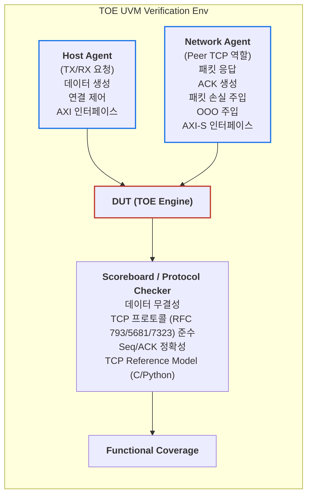
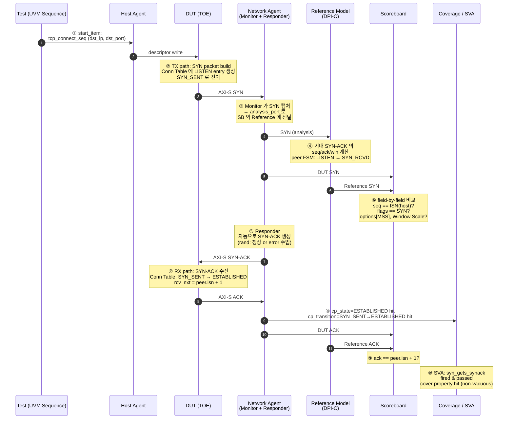

# Module 04 — TOE DV Methodology

<!-- DV-SKOOL-CH-CTX:start -->
<div class="chapter-context" data-cat="network">
  <a class="chapter-back" href="../">
    <span class="chapter-back-arrow">←</span>
    <span class="chapter-back-icon">📡</span>
    <span class="chapter-back-text">TOE</span>
  </a>
  <span class="chapter-divider">›</span>
  <span class="chapter-marker">Module 04</span>
</div>
<!-- DV-SKOOL-CH-CTX:end -->

<!-- DV-SKOOL-CH-TOC:start -->
<div class="page-toc">
  <span class="page-toc-label">목차</span>
  <a class="page-toc-link" href="#1-why-care-이-모듈이-왜-필요한가">1. Why care?</a>
  <a class="page-toc-link" href="#2-intuition-비유와-한-장-그림">2. Intuition</a>
  <a class="page-toc-link" href="#3-작은-예-한-tcp-connection-의-3-way-handshake-가-tb-를-거치는-경로">3. 작은 예 — handshake transaction 추적</a>
  <a class="page-toc-link" href="#4-일반화-검증-4-축-과-시나리오-카테고리">4. 일반화 — 검증 4 축 + 시나리오</a>
  <a class="page-toc-link" href="#5-디테일-tb-구성-coverage-reference-scoreboard-sva-agent">5. 디테일 — TB 구성 요소</a>
  <a class="page-toc-link" href="#6-흔한-오해-와-dv-디버그-체크리스트">6. 흔한 오해 + DV 디버그 체크리스트</a>
  <a class="page-toc-link" href="#7-핵심-정리-key-takeaways">7. 핵심 정리</a>
</div>
<!-- DV-SKOOL-CH-TOC:end -->

!!! objective "학습 목표"
    이 모듈을 마치면:

    - **Design** TOE 검증 환경 (UVM env + Host agent + Network agent + Reference model + Scoreboard + SVA + Coverage) 을 설계할 수 있다.
    - **Trace** 한 TCP transaction (예: 3-way handshake) 이 TB 의 어느 컴포넌트를 거치는지 추적한다.
    - **Apply** TCP FSM transition coverage 와 Error/Recovery cross coverage 를 정의한다.
    - **Implement** Packet loss / reorder / duplication / corrupt 의 error injection 시나리오를 Reactive agent 로 구현한다.
    - **Justify** Reference model 을 C/C++ + DPI-C 로 두는 결정의 trade-off 를 설명한다.
    - **Plan** Performance regression (concurrent connection scaling, throughput at line-rate, latency under load) 을 설계한다.

!!! info "사전 지식"
    - [Module 01-03](01_tcp_ip_and_toe_concept.md)
    - [UVM](../../uvm/), [AXI-Stream](../../amba_protocols/03_axi_stream/)

---

## 1. Why care? — 이 모듈이 왜 필요한가

### 1.1 시나리오 — _복합 시나리오_ 의 silent bug

당신의 TOE happy path 모든 test 통과. Silicon 후 _수 시간_ 운영 시 _가끔_ corruption.

추적:
- _Packet loss_ + _OOO arrival_ + _Zero Window_ + _RTO_ 가 _동시_ 발생 시 _bug_.
- Happy path 또는 _단일_ abnormal 만 test 했으면 안 잡힘.

해법: **복합 abnormal scenario** test:
- 4 abnormal 조합 × N 시나리오 = 수십 test.
- 각 조합의 _상태 cover_ 가 _필수_.

검증의 _진짜 가치_ 는 _복합 abnormal_ 시나리오에서 나옴. Happy path 만 test = false safety.

Module 01~03 가 _DUT 가 무엇을 하는가_ 였다면, 이 모듈은 _그것이 정확히 동작하는지를 어떻게 증명하는가_ 입니다. TOE 의 검증은 단순히 "happy path 통과" 로는 부족합니다 — 실제 silent bug 들은 **packet loss + OOO + Zero Window + RTO 동시 발생** 같은 _복합 abnormal_ 상황에서 나타납니다.

이 모듈을 건너뛰면 검증 환경이 직관적으로 구축은 되지만, _coverage hole_ 과 _vacuous SVA_ 가 가득해서 "테스트 통과 = 안전" 이 보장되지 않습니다. 반대로 이 모듈의 4 축 (Protocol / Functional / Performance / Error recovery) 을 잡으면, 어떤 시나리오를 어디에 hook 해야 하는지가 명확해집니다.

---

## 2. Intuition — 비유와 한 장 그림

!!! tip "💡 한 줄 비유"
    **TOE DV** ≈ **등기 우편 검수원**.<br>
    분실 / 지연 / 순서꼬임 / 중복 / 봉투 훼손 — 모든 시나리오를 의도적으로 만들어 넣고, 우편 시스템 (TOE) 이 정확히 복구하는지 확인. 정상 도착만 보면 부족하고, _이상 상황의 복구 동작_ 이 진짜 검증 대상.

### 한 장 그림 — UVM 검증 환경



### 왜 이 디자인인가 — Design rationale

세 가지 요구가 동시에 풀려야 했습니다.

1. **양쪽 인터페이스에서 자극** — Host 쪽 (PCIe/AXI) 과 Network 쪽 (AXI-S/MAC) 양방향에서 transaction 을 만들 수 있어야 함 → Agent 두 개.
2. **TCP 의 stateful 특성을 따라가는 reactive 응답** — 미리 만든 패킷이 아니라, DUT 의 출력에 _따라_ 적절한 ACK/SYN-ACK/FIN 을 만들어야 함 → Reactive Agent 패턴.
3. **기대값을 누가 만드는가** — 데이터 비교는 byte 단위지만 _Seq/ACK 같은 protocol 필드_ 의 기대값은 TCP 자체를 시뮬레이션해야 알 수 있음 → Reference model.

이 세 요구의 교집합이 위 그림 — Host agent + Reactive Network agent + Reference model + Scoreboard + Coverage + SVA.

---

## 3. 작은 예 — 한 TCP connection 의 3-way handshake 가 TB 를 거치는 경로

가장 단순한 시나리오. 테스트가 active open (DUT 가 client) 으로 새 TCP 연결을 만듭니다. peer (Network agent) 가 응답.



| Step | TB 컴포넌트 | 무엇을 | 왜 |
|---|---|---|---|
| ① | UVM Sequence | `tcp_connect_seq.start(host_seqr)` 호출 | 테스트 의도를 transaction 으로 |
| ② | DUT (TX path) | SYN packet 만들고 Conn Table 에 entry 생성 | 검증 대상의 첫 동작 |
| ③ | Network Agent Monitor | AXI-S 에서 SYN 캡처, analysis_port 에 publish | DUT 출력 관찰 |
| ④ | Reference Model | TCP 시뮬레이션 → 기대 SYN-ACK 계산 | scoreboard 비교 기준 생성 |
| ⑤ | Network Agent Responder | SYN-ACK 자동 생성 (또는 의도적 drop/corrupt) | reactive peer 시뮬 |
| ⑥ | Scoreboard | DUT SYN vs Reference SYN field-by-field 비교 | 프로토콜 정확성 |
| ⑦ | DUT (RX path) | SYN-ACK 수신, FSM 전이 | 다음 검증 대상 |
| ⑧ | Coverage | cp_state, cp_transition bin 적중 | structural completeness |
| ⑨ | Scoreboard | DUT ACK vs Reference ACK 비교 | 3-way 종결 검증 |
| ⑩ | SVA | `syn_gets_synack` property 가 fire 되고 pass | 시간적 인과 관계 |

```systemverilog
// Step ① 의 UVM sequence (의사 코드)
class tcp_connect_seq extends uvm_sequence#(host_descriptor);
  rand bit [31:0] dst_ip;
  rand bit [15:0] dst_port;
  task body();
    host_descriptor desc = host_descriptor::type_id::create("desc");
    `uvm_do_with(desc, { desc.cmd == CMD_CONNECT;
                         desc.dst_ip == local::dst_ip;
                         desc.dst_port == local::dst_port; })
  endtask
endclass
```

!!! note "여기서 잡아야 할 두 가지"
    **(1) Reactive 의 의미** — Step ⑤ 의 SYN-ACK 은 _DUT 의 SYN 을 Monitor 가 본 후_ Responder 가 만들어냅니다. 미리 정해진 패킷이 아닙니다. 그래서 DUT 가 ISN (Initial Sequence Number) 을 어떻게 바꾸든 적절히 응답. <br>
    **(2) Coverage 와 SVA 의 역할 분담** — Coverage 는 "어떤 상태를 _겪었는가_", SVA 는 "그 상태에서 _규칙을 지켰는가_". 둘 다 있어야 vacuous pass 를 막습니다.

---

## 4. 일반화 — 검증 4 축 과 시나리오 카테고리

### 4.1 검증 4 축

| 축 | 무엇을 검증 | 도구 | 기준 |
|---|---|---|---|
| **Protocol Compliance** | RFC 793/5681/7323 준수 | SVA, Reference Model | RFC + IEEE spec |
| **Functional Correctness** | 데이터 무결성, FSM 전이, Seq/ACK | Scoreboard | byte-level + field-level |
| **Performance** | Throughput, Latency, Concurrent connection | Long regression | 100 Gbps line rate, ~µs latency |
| **Error Recovery** | Loss/OOO/Dup/Corrupt 후 복구 | Network Agent injection | RFC 의 retransmit / fast retx 동작 |

이 4 축이 _하나라도 빠지면_ 검증 끝났다고 말 못 함. 보통 시간 부족 → Performance 가 가장 먼저 희생되는데 위험.

### 4.2 시나리오 카테고리

#### Positive (정상 동작)

| 카테고리 | 시나리오 | 검증 포인트 |
|---------|---------|-----------|
| **연결** | 3-way handshake 정상 | SYN→SYN+ACK→ACK 상태 전이 |
| | 4-way handshake 해제 | FIN 시퀀스 + TIME_WAIT |
| **데이터** | 단일 세그먼트 전송 | Seq/ACK, Checksum, 데이터 일치 |
| | 대량 데이터 (Bulk) | Segmentation + 순서 보장 |
| | 양방향 동시 전송 | Full-duplex 정확 동작 |
| **흐름** | Window 기반 전송 제한 | Window 초과 전송 없음 |
| | Window Update 후 재개 | 업데이트 즉시 반영 |

#### Negative / 에러 시나리오

| 카테고리 | 시나리오 | 검증 포인트 |
|---------|---------|-----------|
| **패킷 손실** | TX 패킷 드롭 | RTO 타이머 → 재전송 |
| | ACK 패킷 드롭 | Dup ACK or RTO → 재전송 |
| **순서** | Out-of-Order 수신 | Reassembly 정확 + ACK 정확 |
| | 중복 패킷 수신 | 중복 감지 + 폐기 |
| **무결성** | Checksum 오류 패킷 | 패킷 폐기, 재전송 유도 |
| | 잘린 패킷 (Truncated) | 정상 에러 처리 |
| **흐름** | Zero Window | 전송 중단 + Probe |
| | RST 수신 | 연결 즉시 해제 |
| **혼잡** | Dup ACK 3개 (Fast Retx) | 즉시 재전송 + cwnd 조정 |
| | Timeout (Slow Start 복귀) | cwnd=1 MSS, ssthresh 조정 |

#### Stress / 성능 시나리오

| 시나리오 | 측정 항목 |
|---------|----------|
| 최대 동시 연결 | Connection Table 한계 |
| 라인 레이트 전송 | Throughput 100 Gbps 도달? |
| 다수 연결 × 동시 전송 | 처리량 유지, 공정성 |
| 패킷 손실률 변화 (1%, 5%, 10%) | 재전송 효율, 처리량 변화 |

### 4.3 Coverage Model — 구조적 완전성

```
[CG1] TCP FSM Coverage
  - cp_state: {CLOSED, LISTEN, SYN_SENT, SYN_RCVD, ESTABLISHED,
               FIN_WAIT_1, FIN_WAIT_2, CLOSE_WAIT, LAST_ACK, TIME_WAIT}
  - cp_transition: 모든 유효한 상태 전이 쌍
  → 모든 FSM 전이가 커버되었는가?

[CG2] Data Transfer Coverage
  - cp_segment_size: {MIN(1B), TYPICAL(1460B), MSS, JUMBO(9000B)}
  - cp_direction: {TX_ONLY, RX_ONLY, BIDIRECTIONAL}
  - cp_data_volume: {SINGLE_SEG, SMALL(<10KB), MEDIUM, LARGE(>1MB)}
  - cross: segment_size × direction × data_volume

[CG3] Error/Recovery Coverage
  - cp_error_type: {PKT_LOSS, DUP_ACK, CHECKSUM_ERR, OOO, RST, TIMEOUT}
  - cp_recovery: {RETX_RTO, FAST_RETX, PKT_DROP, CONN_RESET}
  - cross: error_type × recovery

[CG4] Flow/Congestion Coverage
  - cp_window_state: {NORMAL, ZERO_WINDOW, WINDOW_UPDATE, SHRINK}
  - cp_congestion_state: {SLOW_START, CONG_AVOID, FAST_RECOVERY}
  - cross: window_state × congestion_state

[CG5] Connection Scale Coverage
  - cp_num_connections: {1, 10, 100, 1000, MAX}
  - cp_concurrent_activity: {IDLE, LOW, MEDIUM, HIGH, FULL}
```

---

## 5. 디테일 — TB 구성 / Coverage / Reference / Scoreboard / SVA / Agent

### 5.1 Reference Model — TCP 동작의 기준 모델

Scoreboard 가 DUT 출력을 비교하려면 **기대값(expected)** 이 필요하다. TCP 는 프로토콜 자체가 복잡하므로, 별도의 Reference Model 이 기대값을 생성한다.

```
Reference Model 구조:

  +------------------+        +------------------+
  | Host Agent       |        | Network Agent    |
  | (TX/RX 요청)     |        | (Peer TCP 역할)  |
  +--------+---------+        +--------+---------+
           |                           |
           v                           v
  +------------------------------------------------------------+
  |                    DUT (TOE Engine)                          |
  +------------------------------------------------------------+
           |                           |
           v                           v
  +------------------------------------------------------------+
  |                     Scoreboard                              |
  |  +--------------------------------------------------+       |
  |  | TCP Reference Model (C/C++ or SystemVerilog DPI) |       |
  |  |                                                  |       |
  |  |  입력: Host Agent가 보내는 TX 요청               |       |
  |  |        Network Agent가 보내는 수신 패킷          |       |
  |  |  내부: TCP 상태 머신 시뮬레이션                  |       |
  |  |        Seq/ACK 추적, Window 관리, 재전송 로직   |       |
  |  |  출력: 기대 TX 패킷 (seq, ack, flags, data)      |       |
  |  |        기대 RX 데이터 (호스트에 전달될 데이터)   |       |
  |  +--------------------------------------------------+       |
  |                                                             |
  |  비교:                                                      |
  |    DUT TX 패킷 vs Reference TX 패킷                         |
  |    DUT RX 데이터 vs Reference RX 데이터                     |
  |    허용 범위: 타이밍 차이 OK, 데이터/프로토콜 차이 FAIL     |
  +------------------------------------------------------------+

구현 방식:
  1. C/C++ 모델 + DPI-C: Linux TCP 스택 축소판, DPI로 SV에서 호출
     장점: 기존 TCP 코드 재사용, 정밀
     단점: 유지보수 복잡

  2. SystemVerilog 모델: SV로 TCP FSM + Seq/ACK 로직 직접 구현
     장점: 디버그 용이 (같은 시뮬레이터)
     단점: 개발 비용 높음

  3. Python 모델 + Socket: Python Scapy 등으로 패킷 생성/파싱
     장점: 빠른 개발, 유연
     단점: co-simulation 오버헤드

실무에서 가장 흔한 조합: C++ Reference Model + DPI-C
```

### 5.2 Scoreboard 설계 — 트랜잭션 레벨 비교

```
TOE Scoreboard 핵심 비교 항목:

class toe_scoreboard extends uvm_scoreboard;

  // 비교 큐: DUT 출력 vs Reference Model 기대값
  uvm_tlm_analysis_fifo #(tcp_segment) dut_tx_fifo;     // DUT가 송신한 패킷
  uvm_tlm_analysis_fifo #(tcp_segment) ref_tx_fifo;     // Reference가 예측한 패킷
  uvm_tlm_analysis_fifo #(tcp_data)    dut_rx_data_fifo; // DUT가 호스트에 전달한 데이터
  uvm_tlm_analysis_fifo #(tcp_data)    ref_rx_data_fifo; // Reference 예측 데이터

  task compare_tx();
    tcp_segment dut_seg, ref_seg;
    forever begin
      dut_tx_fifo.get(dut_seg);
      ref_tx_fifo.get(ref_seg);

      // 1. 데이터 무결성
      assert(dut_seg.payload == ref_seg.payload)
        else `uvm_error("SB", $sformatf("TX payload mismatch: seq=%0d", dut_seg.seq))

      // 2. TCP 헤더 필드
      assert(dut_seg.seq_num  == ref_seg.seq_num)   // Sequence Number
      assert(dut_seg.ack_num  == ref_seg.ack_num)   // ACK Number
      assert(dut_seg.flags    == ref_seg.flags)      // SYN/ACK/FIN/RST
      assert(dut_seg.window   == ref_seg.window)     // Window Size

      // 3. Checksum (DUT가 계산, Reference가 예측)
      assert(dut_seg.checksum == ref_seg.checksum)

      // 4. 타이밍은 정확 일치 불필요 — 허용 범위 내 확인
      assert(abs(dut_seg.time - ref_seg.time) < TIMING_TOLERANCE)
    end
  endtask

비교 전략:
  - 데이터 무결성: byte-by-byte 정확 일치 (허용 오차 없음)
  - 프로토콜 필드: Seq/ACK/Flags 정확 일치
  - 타이밍: 허용 범위 내 (HW 파이프라인 지연 고려)
  - 순서: 재전송 패킷의 순서는 유연하게 처리 (out-of-order 허용)
```

### 5.3 SVA (SystemVerilog Assertions) — 프로토콜 준수 검증

Coverage Model 이 "어떤 상황을 겪었는지" 추적한다면, SVA 는 "매 순간 규칙을 지키는지" 감시한다.

```systemverilog
// === TCP 프로토콜 준수 SVA 예시 ===

module toe_protocol_checker (
  input logic        clk, rst_n,
  input logic        tx_valid, tx_ready,
  input logic [31:0] tx_seq_num, tx_ack_num,
  input logic [15:0] tx_window,
  input logic [5:0]  tx_flags,  // {URG, ACK, PSH, RST, SYN, FIN}
  input logic        rx_valid,
  input logic [31:0] rx_seq_num, rx_ack_num,
  input logic [15:0] rx_window
);

  // 1. SYN에는 반드시 ACK가 응답 (3-way handshake)
  //    SYN 수신 후 일정 시간 내 SYN+ACK 송신
  property syn_gets_synack;
    @(posedge clk) disable iff (!rst_n)
    (rx_valid && rx_flags[1] && !rx_flags[4])  // SYN 수신 (SYN=1, ACK=0)
    |-> ##[1:SYN_RESPONSE_TIMEOUT]
        (tx_valid && tx_flags[1] && tx_flags[4]); // SYN+ACK 송신
  endproperty
  assert property (syn_gets_synack)
    else `uvm_error("SVA", "SYN received but no SYN+ACK response");

  // 2. Zero Window 시 데이터 전송 금지
  property no_data_on_zero_window;
    @(posedge clk) disable iff (!rst_n)
    (peer_window == 0 && tx_valid && tx_payload_len > 0)
    |-> (tx_flags[1] || tx_flags[0]);  // Zero Window에서 허용: ACK, FIN만
  endproperty
  assert property (no_data_on_zero_window)
    else `uvm_error("SVA", "Data sent during Zero Window");

  // 3. ACK Number는 단조 증가 (같은 연결 내)
  logic [31:0] prev_ack;
  always_ff @(posedge clk)
    if (tx_valid && tx_flags[4]) prev_ack <= tx_ack_num;

  property ack_monotonic_increase;
    @(posedge clk) disable iff (!rst_n)
    (tx_valid && tx_flags[4] && prev_ack != 0)
    |-> (tx_ack_num >= prev_ack);  // Wrap-around은 별도 처리 필요
  endproperty
  assert property (ack_monotonic_increase)
    else `uvm_error("SVA", $sformatf("ACK decreased: %0d -> %0d", prev_ack, tx_ack_num));

  // 4. Retransmission: Dup ACK 3개 후 Fast Retransmit 발생
  int dup_ack_count;
  always_ff @(posedge clk)
    if (rx_valid && rx_ack_num == prev_rx_ack && rx_flags[4])
      dup_ack_count <= dup_ack_count + 1;
    else
      dup_ack_count <= 0;

  property fast_retransmit_on_3_dup_ack;
    @(posedge clk) disable iff (!rst_n)
    (dup_ack_count == 3)
    |-> ##[1:FAST_RETX_TIMEOUT]
        (tx_valid && tx_seq_num == prev_rx_ack); // 손실 지점부터 재전송
  endproperty
  assert property (fast_retransmit_on_3_dup_ack)
    else `uvm_error("SVA", "No Fast Retransmit after 3 Dup ACKs");

  // 5. 각 assertion에 대응하는 cover property
  cover property (syn_gets_synack);
  cover property (no_data_on_zero_window);
  cover property (ack_monotonic_increase);
  cover property (fast_retransmit_on_3_dup_ack);

endmodule
```

SVA 설계 원칙:

- **프로토콜 불변량**: 항상 참이어야 하는 규칙 (Zero Window 시 미전송)
- **인과 관계**: 이벤트 A → 이벤트 B (SYN → SYN+ACK)
- **타이밍 제약**: `##[min:max]` 로 HW 파이프라인 지연 허용
- **모든 assertion 에 cover**: assertion 미위반 ≠ 미테스트, cover 로 실제 동작 확인

### 5.4 Network Agent 설계 — 에러 주입

```
Network Agent가 Peer TCP 역할을 하면서 의도적으로 에러를 주입:

class network_agent extends uvm_agent;

  // 에러 주입 설정
  rand int   pkt_loss_rate;     // 0-100% 패킷 손실률
  rand int   ooo_rate;          // Out-of-Order 확률
  rand int   dup_rate;          // 중복 패킷 확률
  rand bit   corrupt_checksum;  // Checksum 오류 주입
  rand int   delay_min, delay_max; // 응답 지연 범위

  constraint reasonable {
    pkt_loss_rate inside {[0:10]};
    ooo_rate      inside {[0:20]};
    dup_rate      inside {[0:5]};
  }

핵심: 네트워크의 비결정론적 특성을 Constrained Random으로 모델링
→ 실제 네트워크에서 발생 가능한 모든 조합을 커버
```

#### Network Agent 동작 흐름 — 상세

```
Network Agent의 실제 동작은 Driver + Responder 패턴:

  ┌─────────────────────────────────────────────────────────────┐
  │                  Network Agent                               │
  │                                                              │
  │  Sequence                                                    │
  │  ├── 연결 수립: SYN → SYN+ACK 응답 생성                     │
  │  ├── 데이터 응답: 수신 데이터에 ACK 생성                    │
  │  └── 연결 종료: FIN → ACK+FIN 응답 생성                     │
  │                                                              │
  │  Driver (TX → DUT)                                           │
  │  ├── 패킷을 AXI-Stream으로 DUT에 주입                       │
  │  ├── 에러 주입 결정 (loss/ooo/dup/corrupt)                  │
  │  │   ├── Loss: 패킷을 전송하지 않음 (drop)                  │
  │  │   ├── OOO: 패킷 순서를 재배열 (reorder queue)            │
  │  │   ├── Dup: 같은 패킷을 2회 전송                          │
  │  │   └── Corrupt: Checksum 필드 변조                        │
  │  └── 지연 주입: delay_min~delay_max 사이 랜덤 대기          │
  │                                                              │
  │  Monitor (RX ← DUT)                                          │
  │  ├── DUT가 송신한 패킷 캡처                                  │
  │  ├── TCP 헤더 파싱 (seq, ack, flags, window, options)       │
  │  ├── analysis_port로 Scoreboard에 전달                      │
  │  └── 수신 패킷에 대한 응답 트리거 (Reactive Agent)          │
  │                                                              │
  │  Responder (핵심 — Reactive 동작)                            │
  │  ├── DUT TX 패킷 수신 → 자동으로 적절한 응답 생성           │
  │  │   ├── DATA 수신 → ACK 생성 (ack = seq + len)             │
  │  │   ├── SYN 수신 → SYN+ACK 생성                            │
  │  │   ├── FIN 수신 → ACK + FIN 생성                          │
  │  │   └── RST 수신 → 연결 정리                               │
  │  └── 에러 주입은 응답 생성 후 Driver에서 적용               │
  └─────────────────────────────────────────────────────────────┘

핵심 설계 결정:
  - Reactive Agent: Monitor가 DUT 출력을 보고 Responder가 응답 생성
  - 에러 주입은 Sequence/Driver 레벨에서 적용 (Responder 자체는 정상 응답 생성)
  - config_db로 에러율 조절 → 테스트마다 다른 네트워크 환경 시뮬레이션
```

### 5.5 이력서 연결 — TOE 검증 기여

```
Resume: "Enhanced the TCP Offload Engine verification environment
         by developing new test scenarios and expanding functional coverage"

기여 포인트:
  1. 새로운 테스트 시나리오 개발
     - 복합 에러 시나리오 (패킷 손실 + OOO + Zero Window 동시)
     - DCMAC 연동 에러 (MAC CRC 에러 → TOE 에러 처리)
     - 대규모 연결 스트레스 (Connection Table 한계)

  2. Functional Coverage 확장
     - TCP FSM 전이 커버리지 (이전에 미커버된 전이 식별)
     - Error/Recovery 교차 커버리지 추가
     - Flow/Congestion 상태 조합 커버리지 추가

  3. DCMAC 서브시스템 연동 검증
     - TOE ↔ DCMAC AXI-S 인터페이스 검증
     - End-to-End 데이터 무결성 (Host → TOE → DCMAC → 외부)
```

### 5.6 실무 주의점 — Congestion Window 와 CUBIC 상태 불일치

!!! warning "실무 주의점 — Congestion Window와 CUBIC 상태 불일치"
    **현상**: 혼잡 이벤트(패킷 손실) 이후 ssthresh와 cwnd가 예상보다 훨씬 작게 감소하거나, 다음 RTT에서 cwnd가 CUBIC 공식 대신 슬로우 스타트처럼 급격히 증가한다.

    **원인**: HW CUBIC 구현은 cwnd 감소 시 `W_max`(감소 직전 윈도우)와 `epoch_start`(혼잡 시작 시각)를 저장해야 한다. 연속 혼잡 이벤트가 짧은 간격으로 발생할 때 이 값이 덮어쓰이면 이후 CUBIC 볼록 함수 계산이 틀려진다.

    **점검 포인트**: 2회 연속 패킷 손실 시나리오에서 `cubic_w_max`, `cubic_epoch_start` 레지스터 값을 각 손실 직후 래치하여 이론값과 비교. `cwnd` 변화 곡선을 로그에 기록하고 RTT 단위로 CUBIC 계산값과 일치하는지 검증.

---

## 6. 흔한 오해 와 DV 디버그 체크리스트

### 흔한 오해

!!! danger "❓ 오해 1 — 'TOE 검증 = 정상 path 만 검증하면 충분'"
    **실제**: 정상 path 는 일부분. SYN flood, RST 폭주, out-of-order, dup ACK, connection table 고갈 등 abnormal path 가 silent bug 의 source. <br>
    **왜 헷갈리는가**: "happy path 통과 = 신뢰성 OK" 라는 sim-mindset. 실제 stateful 검증은 abnormal 이 핵심.

!!! danger "❓ 오해 2 — 'SVA 가 fail 안 했으니 검증 끝'"
    **실제**: assertion 이 한 번도 fail 하지 않은 것은 두 가지 가능성 — (a) 실제 규칙이 잘 지켜졌거나, (b) 해당 조건이 _한 번도 발생하지 않아_ assertion 이 평가조차 안 된 vacuous pass. 모든 assertion 에 cover property 를 두어 antecedent 가 hit 했는지 확인해야 검증된 것. <br>
    **왜 헷갈리는가**: "no error = pass" 의 직관.

!!! danger "❓ 오해 3 — 'Network Agent 는 미리 만든 패킷 시퀀스를 재생하면 된다'"
    **실제**: TCP 는 stateful 이라 Network Agent 의 응답이 _DUT 의 출력에 의존_. ACK.ack_num 은 DUT 가 보낸 seq+len 이어야 함. Pre-programmed 는 DUT 동작 (재전송, OOO, window 조정) 을 예측 불가능. Reactive 패턴이 필수. <br>
    **왜 헷갈리는가**: "test = pre-recorded scenario" 의 일반 패턴.

!!! danger "❓ 오해 4 — 'Reference Model 은 cycle accurate 해야 한다'"
    **실제**: Reference 는 _프로토콜 정확성_ 을 검증하는 게 목표 — 데이터/Seq/ACK/Flags 같은 _값_ 만 정확하면 됨. 타이밍은 HW pipeline 깊이 + 메모리 access 로 cycle 단위 차이가 정상이라 _허용 범위_ 비교. <br>
    **왜 헷갈리는가**: "정확한 reference = cycle accurate" 라는 추정.

!!! danger "❓ 오해 5 — 'Performance regression 은 마지막에 한 번만 돌리면 된다'"
    **실제**: TOE 는 architecture 변경이 _throughput / latency / fairness_ 에 큰 영향. Performance 회귀는 _continuous_ — daily/weekly 로 throughput, p99 latency, conn scaling 을 측정하지 않으면 silent regression 이 누적. <br>
    **왜 헷갈리는가**: Performance 측정 비용이 커서 "release 직전" 타이밍이라는 인식.

### DV 디버그 체크리스트 (TOE 검증 환경에서 자주 보는 실패)

| 증상 | 1차 의심 | 어디 보나 |
|---|---|---|
| Scoreboard 가 매번 첫 packet 부터 mismatch | Reference Model 의 ISN seed 가 DUT 와 다름 | RNG seed, ISN 초기화 시점 |
| Network Agent 가 SYN-ACK 안 보냄 | Responder 가 LISTEN state 가 아님 (sequence 가 active open 으로 잘못 시작) | sequence 의 listen vs connect 분기 |
| Coverage hit 0 인 transition 다수 | sequence 가 생성 안 한 시나리오 (예: simultaneous open) | sequence library 의 시나리오 enum |
| SVA 가 항상 vacuous pass | antecedent 조건이 너무 좁아 발생 안 함 | cover property 의 hit count |
| Throughput regression 이 갑자기 5 % 떨어짐 | retx buffer 의 DRAM 채널 access pattern 변화 | Memory subsystem stats |
| 같은 seed 로 재현 안 됨 | DPI-C 의 외부 함수가 non-deterministic (file IO, time) | Reference Model 의 외부 의존성 |
| Long regression 에서 random 한 hang | 특정 conn 의 retx buffer 가 안 free | conn별 retx buffer pointer 추적 |
| `compare_tx` 의 timing tolerance 가 너무 작아서 false fail | TOLERANCE 설정이 pipeline depth 보다 작음 | TIMING_TOLERANCE 값 vs DUT pipeline |
| FSM coverage 가 LAST_ACK / TIME_WAIT 미달성 | 4-way close sequence 가 없음 | sequence library 의 close 시나리오 |
| CUBIC 의 W_max race (§5.6) | 연속 packet loss 시 epoch_start latch 시점 | epoch_start vs loss event 시각 |

---

## 7. 핵심 정리 (Key Takeaways)

- **검증 4 축**: Protocol compliance (RFC 793/1323), Functional correctness, Performance, Error recovery. 하나라도 빠지면 검증 미완성.
- **State machine coverage**: TCP 11 state + 모든 transition (LISTEN → SYN_RCVD → ESTABLISHED 등). 미커버 transition = 검증 hole.
- **Error injection**: packet loss, reorder, duplication, corruption. RTO, fast retransmit, dup ACK 의 복구 동작 검증.
- **Reference model**: TCP reference (Linux kernel TCP 또는 Python scapy) — DUT 응답 비교의 기준. 보통 C++ + DPI-C.
- **Reactive Agent**: Network Agent 가 Monitor + Responder 로 DUT 출력을 보고 적절한 응답 생성. Pre-programmed 는 stateful 프로토콜에 부적합.
- **SVA + Coverage 짝**: assertion 에 cover property 를 짝지어 vacuous pass 방지.
- **Performance**: concurrent connection scaling, throughput at line rate, latency under load. 회귀 측정 _continuous_.

!!! warning "실무 주의점"
    - Reference Model 의 _seed/ISN_ 동기화 — DUT 와 Reference 가 같은 ISN 을 써야 비교 가능.
    - SVA 의 _vacuous pass 함정_ — cover property 가 0 hit 이면 그 assertion 은 미검증.
    - Long regression 의 _hang detection_ — global watchdog 와 conn-level timeout 둘 다 필요.

### 7.1 자가 점검

!!! question "🤔 Q1 — Reactive vs Passive agent (Bloom: Apply)"
    Network agent. _Pre-programmed sequence_ vs _Reactive responder_. 어느 것?

    ??? success "정답"
        **Reactive**.

        Pre-programmed: 정해진 시퀀스 (예: SYN+SYN_ACK+ACK+...) → DUT 응답이 예상과 다르면 _stuck_.

        Reactive: DUT 출력 monitor → _상태_ 보고 _적절한 응답_ 결정. Stateful protocol 의 필수 pattern.

        예: DUT 가 SYN 보냄 → Network 가 _SYN_ACK_ 응답 (PASS) 또는 _RST_ 응답 (negative test).

!!! question "🤔 Q2 — State machine coverage (Bloom: Analyze)"
    TCP _11 state_. 각 state pair 의 _transition_ 모두 검증. 몇 개 시나리오?

    ??? success "정답"
        TCP state diagram 의 _legal transition_: ~30 개.
        - LISTEN → SYN_RCVD, SYN_RCVD → ESTABLISHED, ESTABLISHED → FIN_WAIT_1, ...
        - 각 transition 마다 1 시나리오 → **30+ 직접 시나리오**.

        Cross with abnormal (RST inject, simultaneous close, ...) → **100+ 시나리오**.

### 7.2 출처

**External**
- RFC 793 *TCP* state diagram
- *UVM Reactive Agents* — Cadence/Synopsys best practices
- *T1 TCP State Coverage* methodology

---

## 다음 단계

→ [Module 05 — Quick Reference Card](05_quick_reference_card.md): 5 모듈의 핵심을 한 장으로. 면접 골든 룰 + 이력서 연결 + TCP 핵심 수치.

- 📝 [**Module 04 퀴즈**](quiz/04_toe_dv_methodology_quiz.md)

<div class="chapter-nav">
  <a class="nav-prev" href="../03_toe_key_functions/">
    <div class="nav-label">◀ 이전</div>
    <div class="nav-title">TOE 핵심 기능 상세</div>
  </a>
  <a class="nav-next" href="../05_quick_reference_card/">
    <div class="nav-label">다음 ▶</div>
    <div class="nav-title">TOE — Quick Reference Card</div>
  </a>
</div>


--8<-- "abbreviations.md"
