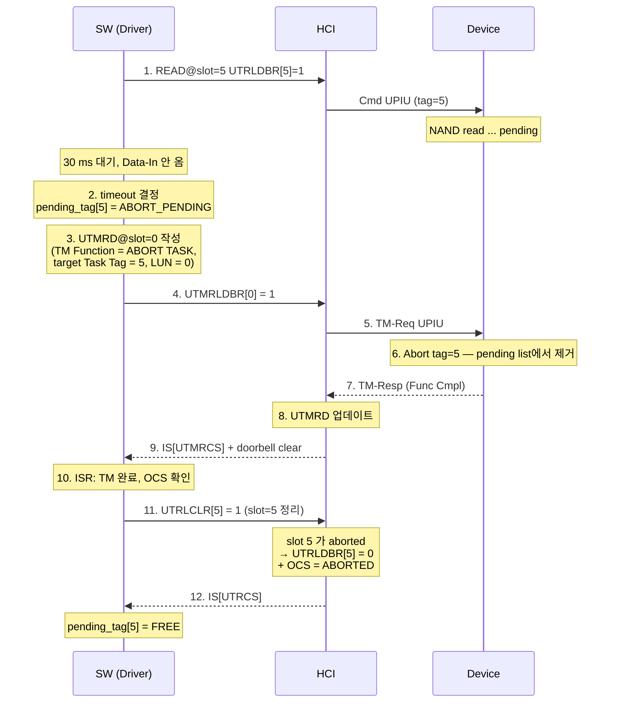

# Module 03 — UPIU & Command Flow

<!-- DV-SKOOL-CH-CTX:start -->
<div class="chapter-context" data-cat="memory">
  <a class="chapter-back" href="../">
    <span class="chapter-back-arrow">←</span>
    <span class="chapter-back-icon">💿</span>
    <span class="chapter-back-text">UFS HCI</span>
  </a>
  <span class="chapter-divider">›</span>
  <span class="chapter-marker">Module 03</span>
</div>
<!-- DV-SKOOL-CH-CTX:end -->

<!-- DV-SKOOL-CH-TOC:start -->
<div class="page-toc">
  <span class="page-toc-label">목차</span>
  <a class="page-toc-link" href="#1-why-care-이-모듈이-왜-필요한가">1. Why care?</a>
  <a class="page-toc-link" href="#2-intuition-비유와-한-장-그림">2. Intuition</a>
  <a class="page-toc-link" href="#3-작은-예-task-mgmt-abort-task-한-사이클">3. 작은 예 — Abort Task 한 사이클</a>
  <a class="page-toc-link" href="#4-일반화-upiu-종류와-multi-upiu-sequence">4. 일반화 — UPIU 종류 + multi-UPIU sequence</a>
  <a class="page-toc-link" href="#5-디테일-scsi-매핑-well-known-lu-query-tm-error">5. 디테일</a>
  <a class="page-toc-link" href="#6-흔한-오해-와-dv-디버그-체크리스트">6. 흔한 오해 + DV 디버그 체크리스트</a>
  <a class="page-toc-link" href="#7-핵심-정리-key-takeaways">7. 핵심 정리</a>
</div>
<!-- DV-SKOOL-CH-TOC:end -->

!!! objective "학습 목표"
    이 모듈을 마치면:

    - **Identify** UPIU 의 6 종류 (Command / Response / Data In/Out / Task Mgmt / Query / NOP / Reject) 및 용도.
    - **Trace** READ / WRITE / QUERY UPIU 의 전체 흐름을 host 와 device 양측에서 추적한다.
    - **Apply** Task Tag (0~31) 와 LUN 으로 multi-command + multi-LU 시나리오를 작성한다.
    - **Distinguish** Sense Data, Response Code, Status Code 의 의미와 fault 처리.
    - **Decompose** Task Management 명령 (Abort / LUN Reset 등) 의 별도 list / doorbell / IRQ 경로를 분해한다.

!!! info "사전 지식"
    - [Module 01-02](01_ufs_protocol_stack.md)
    - SCSI CDB 기본 (READ / WRITE / INQUIRY 등)

---

## 1. Why care? — 이 모듈이 왜 필요한가

### 1.1 시나리오 — Task Tag _swap_ 의 corruption

당신의 UFS storage 가 _32 command 동시_ in-flight. 각 command 의 Task Tag _0-31_:

```
Cmd 0 (Tag=5): "Read sector 100, 1MB"
Cmd 1 (Tag=10): "Read sector 200, 1MB"
```

UFS 가 OoO response 가능:
```
Resp 1 (Tag=10): "data from sector 200" → driver buffer at Cmd 1's address
Resp 0 (Tag=5): "data from sector 100" → driver buffer at Cmd 0's address
```

**Bug 시나리오**: HCI 가 _Resp 의 Tag field_ 만 잘못 해석 (예: bit swap):
```
Resp 1 actual Tag=10, parsed as Tag=5 → wrong driver buffer (Cmd 0's) → sector 200's data overwrites sector 100's expected data
```

**Silent data corruption**. _Same time same flow_ 에서만 발생, _race-dependent_, 재현 어려움.

Task Tag lifecycle 의 정확한 _spec compliance_ + DV scoreboard 의 _per-Tag tracking_ 이 _silent bug 의 안전망_.

**UPIU 는 UFS 의 통신 단위** 입니다. 모든 명령 / 응답 / 데이터가 UPIU 로 캡슐화되므로 검증의 거의 모든 시나리오가 UPIU 정합성 + flow 정확성으로 귀결됩니다. Command UPIU 한 번에 Response UPIU 가 항상 한 번 — 이 _request/response 짝_ 만 정확히 잡으면 어떤 SCSI 명령도 같은 패턴으로 검증할 수 있습니다.

특히 **Task Tag 매칭 오류 = 잘못된 응답 매핑** 입니다. driver 가 잘못된 command 에 응답을 받으면 데이터 corruption 으로 직결. Task Tag lifecycle 을 정확히 잡아야 multi-LU + multi-command 시나리오에서 silent bug 를 거를 수 있습니다.

---

## 2. Intuition — 비유와 한 장 그림

!!! tip "💡 한 줄 비유"
    **UPIU command flow** = 식당의 _주문서 ↔ 영수증_ 짝. 주문서(**Command UPIU**) 보내고 영수증(**Response UPIU**) 받는 한 쌍이 한 transaction. **Task Tag** 가 "같은 주문 식별자" — 같은 손님이 동시에 32 개 주문을 넣어도 영수증마다 Tag 가 붙어 있어 어떤 주문에 대한 응답인지 즉시 매칭.

### 한 장 그림 — 4 가지 명령의 UPIU 전개

=== "READ (data path)"

    ```d2
shape: sequence_diagram

H: "Host"
D: "Device"
H: "Host"
D: "Device"
H: "Host"
D: "Device"
H: "Host"
D: "Device"

# Note over H: 같은 Task Tag 로 묶임 (single tag)
# Note over H: single tag, RTT 가 buffer 협상
# Note over H: Tag 는 Q-Resp 매칭용
# Note over H: Task Tag = abort 대상
H -> D: "Command UPIU"
D -> H: "Data-In UPIU × N" { style.stroke-dash: 4 }
D -> H: "Response UPIU" { style.stroke-dash: 4 }
# unparsed: ```
# unparsed: === "WRITE (data path)"
# unparsed: ```mermaid
# unparsed: sequenceDiagram
H -> D: "Command UPIU"
D -> H: "RTT (buffer ready 알림)" { style.stroke-dash: 4 }
H -> D: "Data-Out UPIU × N1"
D -> H: "RTT (next chunk)" { style.stroke-dash: 4 }
H -> D: "Data-Out UPIU × N2"
D -> H: "Response UPIU" { style.stroke-dash: 4 }
# unparsed: ```
# unparsed: === "QUERY (control path)"
# unparsed: ```mermaid
# unparsed: sequenceDiagram
H -> D: "Query Request UPIU"
D -> H: "Query Response UPIU" { style.stroke-dash: 4 }
# unparsed: ```
# unparsed: === "ABORT (task mgmt)"
# unparsed: ```mermaid
# unparsed: sequenceDiagram
H -> D: "TM Request UPIU\n(UTMRD, UTMRLDBR)"
D -> H: "TM Response UPIU" { style.stroke-dash: 4 }
# unparsed: ```
# unparsed: ### 왜 이 디자인인가 — Design rationale
# unparsed: 세 가지 패턴이 동시에 풀려야 했습니다.
# unparsed: 1. **고정 길이 header + 가변 length payload** — Cmd (16 B CDB), Response (sense), Data (~MTU), Query (parameter), TM (control) 이 모두 같은 12 B header 로 시작 → driver / HCI 가 _Transaction Type_ 만 보고 디스패치.
# unparsed: 2. **Multi-packet 메시지** (READ 4 KB → Data-In × N) 의 식별 — Task Tag 가 모든 fragment 에 동일하게 붙어 reassembly 가능.
# unparsed: 3. **Data path 와 Task Mgmt 의 분리** — Abort / Reset 이 _별도 list (UTMRL)_ 과 _별도 doorbell (UTMRLDBR)_ 로 가야 Transfer 가 stuck 됐을 때도 control 가능.
# unparsed: 이 셋의 교집합이 **공통 12 B UPIU header + Transaction Type 디스패치 + Task Tag lifecycle + Transfer/Task-Mgmt 분리** 의 디자인입니다.
# unparsed: ---
# unparsed: ## 3. 작은 예 — Task Mgmt Abort Task 한 사이클
# unparsed: 가장 단순한 시나리오. slot=5 의 READ 명령이 device 에서 응답 없이 stuck. SW 가 30 ms timeout 후 **Abort Task** 를 발행 → device 가 해당 task 를 취소 → Transfer slot 이 정리. 이 한 사이클의 두 list / 두 doorbell / 두 IRQ 흐름을 추적합니다.


### 단계별 추적

| Step | 누가 | 무엇을 | 의미 |
|---|---|---|---|
| ① | SW | slot=5 에 READ 발행 | 정상 명령 — 평소 패턴 |
| ② | SW | Watchdog 30 ms 후 timeout 인식 | Task Mgmt 진입 결정 |
| ③ | SW | UTMRD slot=0 작성 (Function=ABORT_TASK, Task Tag=5, LUN=0) | Transfer 와 _별도 list_ 에 작성 |
| ④ | SW | `UTMRLDBR[0] = 1` | 별도 doorbell (UTRLDBR 와 분리) |
| ⑤ | HCI | TM Request UPIU 조립 → 송신 | Transaction Type = Task Mgmt Req |
| ⑥ | Device | Abort 대상 task 의 pending state 제거 | Device 측 책임 |
| ⑦ | Device | TM Response UPIU (Function Complete) | Device → Host |
| ⑧ | HCI | UTMRD update + UTMRLDBR clear | TM 의 OCS 갱신 |
| ⑨ | HCI | IS[UTMRCS] = 1 + IRQ | 별도 IRQ bit |
| ⑩ | SW | ISR 에서 TM 완료 인지 | Function Code 확인 |
| ⑪ | SW | `UTRLCLR[5] = 1` 로 transfer slot 정리 | Transfer side cleanup |
| ⑫ | HCI | UTRLDBR[5] = 0, OCS = ABORTED, IS[UTRCS] | Transfer slot 의 final state |

```c
// SW 측 ② ~ ④ 의 골격
if (time_after(jiffies, utrd[5].submit_jiffies + msecs_to_jiffies(30))) {
    struct utp_task_req_desc *utmrd = &utmrl[0];
    build_tm_req(utmrd, /*func=*/TM_ABORT_TASK,
                 /*lun=*/0, /*target_tag=*/5);
    utmrd->ocs = OCS_INVALID;
    wmb();
    hci_writel(BIT(0), UTMRLDBR);   // ④ 별도 doorbell
}
// ⑪ TM 완료 후
hci_writel(BIT(5), UTRLCLR);        // transfer slot cleanup
```

!!! note "여기서 잡아야 할 두 가지"
    **(1) Transfer 와 Task Mgmt 는 _완전히 별도 채널_** 이다. UTRL ↔ UTRLDBR ↔ IS[UTRCS] 와 UTMRL ↔ UTMRLDBR ↔ IS[UTMRCS] 가 평행하게 존재. Transfer 가 stuck 돼도 Task Mgmt 는 동작 — _이 분리가 곧 복구 가능성_. <br>
    **(2) Abort 후 Task Tag reuse 는 _ABORTED OCS 까지 본 뒤_** 가능하다. TM Response 만 보고 reuse 하면 race — UTRLCLR 발행 → IS[UTRCS] → OCS=ABORTED 확인 후에야 free.

---

## 4. 일반화 — UPIU 종류와 multi-UPIU sequence

### 4.1 UPIU 6 종류와 Transaction Type

| UPIU Type | TT | 방향 | 누가 시작 | data segment |
|-----------|----|----|----------|------------|
| Command | 0x01 | H → D | SW | 0 (CDB 는 fixed field) |
| Data-Out | 0x02 | H → D | SW (RTT 후) | up to MTU |
| Data-In | 0x22 | D → H | Device | up to MTU |
| Response | 0x21 | D → H | Device | sense data (옵션) |
| Query Request | 0x16 | H → D | SW | descriptor 등 |
| Query Response | 0x36 | D → H | Device | descriptor data |
| Task Mgmt Request | 0x04 | H → D | SW | 0 |
| Task Mgmt Response | 0x24 | D → H | Device | 0 |
| NOP OUT | 0x00 | H → D | SW | 0 |
| NOP IN | 0x20 | D → H | Device | 0 |
| Reject | 0x3F | D → H | Device | 0 |

### 4.2 한 명령 당 UPIU sequence

| 명령 종류 | UPIU sequence |
|----------|--------------|
| READ | Cmd → Data-In × N → Response |
| WRITE | Cmd → RTT × M → (Data-Out × N₁) → RTT → (Data-Out × N₂) → ... → Response |
| QUERY (Read Attr/Flag) | Q-Req → Q-Resp |
| QUERY (Read Descriptor) | Q-Req → Q-Resp (data segment 에 descriptor) |
| Task Mgmt | TM-Req → TM-Resp |
| NOP | NOP OUT → NOP IN |

이 sequence 가 **검증의 monitor 분기** 의 기본 구조 — 같은 Task Tag 의 UPIU 가 이 순서대로 도착하는지 / 누락 / 순서 위반 / 잉여를 체크.

### 4.3 Task Tag lifecycle

```d2
direction: right

INITIAL { shape: circle; style.fill: "#333" }
INITIAL -> FREE
FREE -> SUBMITTED: "1. UTRD 작성 + UTRLDBR set"
SUBMITTED -> IN_FLIGHT: "2. HCI 가 Cmd UPIU 송신"
IN_FLIGHT -> COMPLETED: "3. Response UPIU 수신\n(또는 ABORTED OCS)"
COMPLETED -> FREE: "4. OCS 읽고 SW 가 free 처리"
# unparsed: note right of COMPLETED
# unparsed: 재사용 가능 시점 = 4 이후
# unparsed: 3 만으로는 부족 — race
# unparsed: end note
```

**핵심 invariant**: 같은 Task Tag 가 동시에 두 명령에 할당되면 안 된다. Response 가 먼저 도착한 명령 / 나중 도착한 명령을 구분 못 함 → silent corruption.

---

## 5. 디테일 — SCSI 매핑 / Well-Known LU / Query / TM / Error

### 5.1 주요 SCSI 명령

| 명령 | CDB Opcode | 용도 | 데이터 방향 |
|------|-----------|------|-----------|
| READ(10) | 0x28 | 데이터 읽기 | Device → Host |
| WRITE(10) | 0x2A | 데이터 쓰기 | Host → Device |
| TEST UNIT READY | 0x00 | 디바이스 상태 확인 | 없음 |
| INQUIRY | 0x12 | 디바이스 정보 조회 | Device → Host |
| REQUEST SENSE | 0x03 | 에러 정보 조회 | Device → Host |
| SYNC CACHE | 0x35 | 캐시 플러시 | 없음 |
| UNMAP | 0x42 | 블록 해제 (TRIM) | Host → Device |
| START STOP UNIT | 0x1B | 전원 관리 | 없음 |

### 5.2 READ UPIU 흐름

```
1. Command UPIU (Host → Device)
   +------------------------------------------+
   | Header:                                   |
   |   Transaction Type = 0x01 (Command)       |
   |   Task Tag = 5 (이 명령의 식별자)          |
   |   LUN = 0 (Boot LU 또는 User LU)         |
   | CDB:                                      |
   |   Opcode = 0x28 (READ_10)                |
   |   LBA = 0x1000 (읽을 위치)                |
   |   Transfer Length = 8 (8 블록 = 4KB)      |
   | Expected Data Length = 4096              |
   +------------------------------------------+

2. Data-In UPIU (Device → Host) × N개
   +------------------------------------------+
   | Header:                                   |
   |   Transaction Type = 0x02 (Data-In)       |
   |   Task Tag = 5 (같은 태그)                |
   | Data Segment:                             |
   |   읽은 데이터 (최대 PRDT 크기 단위)        |
   +------------------------------------------+

3. Response UPIU (Device → Host)
   +------------------------------------------+
   | Header:                                   |
   |   Transaction Type = 0x21 (Response)      |
   |   Task Tag = 5                            |
   |   Response = 0x00 (TARGET_SUCCESS)        |
   |   Status = 0x00 (GOOD)                   |
   | Residual Count = 0 (전부 전송 완료)       |
   +------------------------------------------+
```

### 5.3 WRITE UPIU 흐름

```
1. Command UPIU (Host → Device)
   Opcode = 0x2A (WRITE_10), LBA, Length

2. RTT UPIU (Device → Host) — Ready to Transfer
   "데이터 보내도 좋다" 신호 + 전송 가능한 크기

3. Data-Out UPIU (Host → Device) × N개
   실제 쓰기 데이터

4. Response UPIU (Device → Host)
   완료 상태
```

### 5.4 Well-Known LU

```
UFS Device는 여러 Logical Unit을 지원 — 각각 독립적인 "가상 디스크"

  +-----------------------------------------------+
  | UFS Device                                     |
  |                                                |
  | LUN 0: User LU 0 (주 저장 공간)               |
  | LUN 1: User LU 1 (옵션)                       |
  | LUN 2: User LU 2 (옵션)                       |
  | ...                                            |
  |                                                |
  | Well-Known LUs (특수 목적):                     |
  |   LUN 0xD0: Boot W-LU (Boot A)                |
  |   LUN 0xB0: RPMB W-LU                         |
  |   LUN 0x50: Device W-LU                        |
  +-----------------------------------------------+

Well-Known LU 상세:

  | W-LU | LUN | 용도 |
  |------|-----|------|
  | Boot W-LU A | 0xD0 (0x30+Well-Known) | Boot 이미지 저장 (Primary) |
  | Boot W-LU B | 0xD1 | Boot 이미지 저장 (Secondary/Recovery) |
  | RPMB W-LU | 0xB0 (0x44+Well-Known) | Replay Protected Memory Block — 보안 저장소 |
  | Device W-LU | 0x50 | 디바이스 레벨 설정 접근 |

Boot W-LU:
  - bBootLunEn Attribute로 활성화 여부 결정
  - Boot LU A 또는 B 선택 가능 (Fallback 용도)
  - BootROM이 READ 명령으로 BL2 이미지 로드

RPMB W-LU:
  - HMAC(SHA-256) 기반 인증된 Read/Write
  - Replay Attack 방지 (Write Counter)
  - Secure Storage 용도: 키, 인증서, 중요 설정
  - 일반 READ/WRITE가 아닌 SECURITY PROTOCOL IN/OUT 명령 사용
```

### 5.5 NOP OUT / NOP IN

```
NOP = No Operation — 링크 상태 확인 (Ping)

NOP OUT UPIU (Host → Device):
  +------------------------------------------+
  | Header:                                   |
  |   Transaction Type = 0x00 (NOP OUT)       |
  |   Task Tag = N                            |
  |   (나머지 필드는 Reserved/0)              |
  +------------------------------------------+
  | Data Segment: 없음                        |
  +------------------------------------------+

NOP IN UPIU (Device → Host):
  +------------------------------------------+
  | Header:                                   |
  |   Transaction Type = 0x20 (NOP IN)        |
  |   Task Tag = N (같은 태그)                |
  |   Response = 0x00 (SUCCESS)               |
  +------------------------------------------+
  | Data Segment: 없음                        |
  +------------------------------------------+

사용 시점:
  1. Link Startup 직후 — 디바이스 생존 확인
     → NOP IN 미응답 시 디바이스 비정상 → 재시도 또는 Fallback
  2. Idle 중 주기적 Ping — 링크 유지 확인
  3. Hibernate 복귀 후 — 링크 정상 동작 확인

흐름:
  SW: NOP OUT UTRD 작성 → Doorbell
  HCI: NOP OUT UPIU 전송 → Device
  Device: NOP IN UPIU 응답
  HCI: 완료 처리 → Interrupt
  SW: 응답 확인 (타임아웃 시 에러)
```

### 5.6 Query 명령 — 디바이스 설정/상태

```
Query Request UPIU (Host → Device):
  +------------------------------------------+
  | Header (12 bytes):                        |
  |   Transaction Type = 0x16 (Query Req)     |
  |   Task Tag = N                            |
  | Query Function (1B):                      |
  |   0x01 = Read Descriptor                  |
  |   0x02 = Write Descriptor                 |
  |   0x03 = Read Attribute                   |
  |   0x04 = Write Attribute                  |
  |   0x05 = Read Flag                        |
  |   0x06 = Set Flag                         |
  |   0x07 = Clear Flag                       |
  |   0x08 = Toggle Flag                      |
  | Descriptor Type / IDN (1B)                |
  | Index (1B)                                |
  | Selector (1B)                             |
  | Length (2B): 데이터 세그먼트 크기          |
  | Value (4B): Attribute 값 (Read/Write Attr)|
  +------------------------------------------+
  | Data Segment (가변):                       |
  |   Write Descriptor 시 → 쓸 Descriptor 데이터|
  +------------------------------------------+

Query Response UPIU (Device → Host):
  +------------------------------------------+
  | Header:                                   |
  |   Transaction Type = 0x36 (Query Resp)    |
  |   Task Tag = N                            |
  |   Query Response = 0x00 (Success)         |
  |                    0xF6 (Parameter Not Readable) |
  |                    0xFE (General Failure)  |
  | Value (4B): Attribute 값 (Read Attr 응답) |
  +------------------------------------------+
  | Data Segment (가변):                       |
  |   Read Descriptor 시 → 읽은 Descriptor 데이터|
  +------------------------------------------+
```

| Query Function | 용도 | 예시 |
|---------------|------|------|
| Read Descriptor | 디바이스 정보 읽기 | Device Descriptor, Unit Descriptor |
| Write Descriptor | 디바이스 설정 변경 | Configuration Descriptor |
| Read Attribute | 속성 읽기 | bBootLunEn, bCurrentPowerMode |
| Write Attribute | 속성 변경 | bRefClkFreq |
| Read Flag | 플래그 읽기 | fDeviceInit, fPurgeEnable |
| Set/Clear/Toggle Flag | 플래그 변경 | fPurgeEnable 설정 |

```
BootROM이 UFS 부팅 시 사용하는 Query:

  1. Read Attribute: bBootLunEn
     → Boot LU가 활성화되어 있는지 확인
     → 0이면 Boot 불가 → 다음 부팅 장치로 Fallback

  2. Read Descriptor: Unit Descriptor (Boot LU)
     → Boot LU의 크기, 블록 크기 확인

  3. READ(Boot LU): BL2 이미지 로드
```

### 5.7 Task Management — 명령 제어

| 명령 | 용도 | 시나리오 |
|------|------|---------|
| ABORT TASK | 특정 명령 중단 | 타임아웃된 명령 취소 |
| ABORT TASK SET | LUN의 모든 명령 중단 | LUN 단위 복구 |
| LOGICAL UNIT RESET | LUN 리셋 | LUN 오류 복구 |
| QUERY TASK | 명령 상태 조회 | 진행 상태 확인 |

```
Task Management 흐름:

  SW: UTMRD 작성 → UTMRLDBR 셋
  HCI: Task Mgmt UPIU 전송 → Device
  Device: 해당 명령 중단/리셋 → Task Mgmt Response
  HCI: UTMRD 업데이트 → Interrupt
  SW: ISR에서 완료 처리

  별도의 Doorbell(UTMRLDBR)과 별도의 Request List(UTMRL) 사용
  → Transfer Request와 독립적으로 처리
```

### 5.8 에러 처리 흐름

```
에러 감지 경로:

  1. UniPro Layer 에러
     - CRC 에러 → NAK → 재전송 (HCI 투명)
     - Link Down → IS[UE] 인터럽트 → SW 복구

  2. UPIU 레벨 에러
     - Response Status ≠ GOOD
     - Residual Count ≠ 0 (불완전 전송)
     → SW가 Response UPIU 확인 → 재시도 또는 에러 보고

  3. HCI 레벨 에러
     - DMA 에러 (PRDT 주소 잘못) → IS 인터럽트
     - 타임아웃 (Device 무응답) → SW가 Task Mgmt로 복구

에러 복구 단계:
  Level 1: 명령 재시도
  Level 2: Abort Task
  Level 3: LUN Reset
  Level 4: Host Reset (HCE 토글)
  Level 5: Full Link Reset (UniPro 재초기화)
```

### 5.9 Device-Initiated 동작

```
UFS는 Host-initiated가 기본이지만, Device가 자발적으로 알리는 메커니즘도 있음:

  1. Attention (예외 이벤트 통지)
     - Device가 Host에게 "확인해야 할 이벤트가 있다" 알림
     - UniPro 레벨의 인터럽트 → IS[UE] 또는 별도 메커니즘
     - Host가 Query로 Exception Event Status 읽기:
       → Urgent BKOPS needed (백그라운드 작업 긴급)
       → Excessive Write → Performance throttling
       → Device Life Time 경고

  2. Background Operations (BKOPS)
     - Device가 내부적으로 수행하는 Garbage Collection, Wear Leveling 등
     - bBackgroundOpsStatus Attribute로 상태 확인:
       0x00 = Not required
       0x01 = Non-critical (idle 시 수행)
       0x02 = Performance impacted (빨리 수행 필요)
       0x03 = Critical (즉시 수행 필요)
     - Host가 fBackgroundOpsEn Flag를 Set → Device가 BKOPS 시작
     - Critical 상태를 무시하면 → Write 성능 급격히 하락

  3. Write Booster Flush
     - SLC 버퍼의 데이터를 TLC/QLC로 이동
     - Device가 자동으로 Idle 시 수행
     - Host가 강제로 트리거 가능: fWriteBoosterBufferFlushEn Flag

이 동작들은 검증 시 Device Agent가 시뮬레이션해야 하며,
Host Agent가 적절히 응답하는 시나리오를 포함해야 함.
```

---

## 6. 흔한 오해 와 DV 디버그 체크리스트

### 흔한 오해

!!! danger "❓ 오해 1 — 'Task Tag 는 unique 면 충분하다'"
    **실제**: Task Tag 는 "command 발행 ~ completion (OCS writeback) 사이" 에는 unique 해야 하지만, 그 후엔 reuse 가능 — _그 reuse 시점_ 이 핵심입니다. Response UPIU 만 받고 reuse 하면 race. UTRLDBR clear + OCS read 까지 끝나야 free.<br>
    **왜 헷갈리는가**: "unique key" 라는 단순 직관 + lifecycle 의 미묘한 reuse 시점이 spec 깊은 곳에 있어서.

!!! danger "❓ 오해 2 — 'WRITE 도 READ 처럼 Cmd 후 바로 Data 보내면 됨'"
    **실제**: WRITE 는 반드시 **Cmd → RTT → Data-Out** 순서. Device 의 internal write buffer 가 ready 됐다고 RTT 로 알려야 host 가 Data-Out 전송. RTT 의 _Data Transfer Count_ 가 한 번에 받을 크기를 지정하므로 큰 WRITE 는 RTT/Data-Out 이 여러 round 반복.<br>
    **왜 헷갈리는가**: READ 의 즉시 data-in 패턴과 대칭일 거라는 직관.

!!! danger "❓ 오해 3 — 'UPIU 의 Task Tag 와 UTRD slot 은 같다'"
    **실제**: 일반적인 driver / HCI 에서는 같게 운영하지만 (slot N → Task Tag N), spec 상 _필수가 아닙니다_. HCI 가 다른 매핑을 쓰면 scoreboard 의 매칭 키가 바뀌어야 함. 우리 사내 IP 기준은 _같다_ 로 가정하지만, 검증 시 매핑 invariant 를 명시적으로 assertion 으로 둬야 합니다.<br>
    **왜 헷갈리는가**: 가장 흔한 1:1 매핑이 spec 의 강제처럼 보임.

!!! danger "❓ 오해 4 — 'Abort 는 발행하면 즉시 명령이 사라진다'"
    **실제**: Abort 발행 → Device 가 인지 → Device 가 pending list 에서 제거 → TM Response → HCI 가 transfer slot OCS 를 ABORTED 로 갱신 → IS[UTRCS]. 이 사이에 in-flight Data-In 이 남아 있으면 _늦게 도착한 Data-In_ 의 Task Tag 가 이미 free 된 슬롯과 충돌. 그래서 reuse 는 OCS=ABORTED 까지 본 후.<br>
    **왜 헷갈리는가**: "Abort = 즉시" 라는 직관.

!!! danger "❓ 오해 5 — 'CRC 에러 = 명령 실패'"
    **실제**: UniPro DL 의 CRC 에러는 _NAK 후 자동 재전송_ — HCI / driver 에 노출되지 않습니다. driver 가 보는 건 _재전송도 실패한 link error_ (IS[UE]) 뿐. UPIU 레벨 에러는 _Response UPIU 의 Status_ 와 _Residual Count_ 를 보고 판단.<br>
    **왜 헷갈리는가**: "CRC fail = transfer fail" 의 일반 직관.

### DV 디버그 체크리스트 (이 모듈 내용으로 마주칠 첫 실패)

| 증상 | 1차 의심 | 어디 보나 |
|---|---|---|
| Response UPIU 가 안 옴 (slot stuck) | UPIU sequence 깨짐 (Data-In 누락 / 잘못된 tag) | UniPro monitor 의 UPIU 시퀀스, Task Tag 일치 |
| WRITE 가 hang | RTT 안 옴 / RTT Data Transfer Count 불일치 | Device agent 의 buffer 상태, RTT field |
| 다른 LU 의 응답이 매칭됨 | Task Tag reuse 너무 빠름 | OCS writeback 시점 vs reuse 시점 |
| Abort 했는데 Data-In 이 계속 옴 | Device 측 abort handling lag | TM Response 시점, in-flight Data-In count |
| Query Read Attr 결과가 0 | bBootLunEn 미설정 또는 잘못된 IDN | Q-Req 의 IDN/Index/Selector |
| INQUIRY 결과 길이가 의도보다 짧음 | Residual Count 가 nonzero 인데 SW 무시 | Response UPIU 의 Residual Count |
| RPMB read 가 access denied | HMAC counter / nonce mismatch | Security Protocol IN/OUT 의 인증 chain |
| LUN Reset 후 다른 LU 도 영향 | 잘못된 LUN 으로 reset 발행 | UTMRD 의 LUN field |

### 흔한 오해 5 (추가) — 디버그 의문

!!! danger "❓ 오해 6 — 'NOP IN 만 받으면 link 가 정상이다'"
    **실제**: NOP 은 _UTP layer 까지_ 가 정상임을 알려줍니다. UniPro link 가 fluctuation 중이면 가끔 NOP 은 통과하지만 큰 Data-In 이 NAK 으로 깨질 수 있음. 종합적인 link health 는 UE 카운터 + AFC 통계 + actual transfer 로 판단.<br>
    **왜 헷갈리는가**: "ping 통과 = link OK" 의 일반 직관.

---

## 7. 핵심 정리 (Key Takeaways)

- **UPIU 6+ 종**: Command / Response / Data-In / Data-Out / Query Req-Resp / Task Mgmt Req-Resp / NOP / Reject. 모든 명령은 UPIU 로 캡슐.
- **공통 12 B header** + Transaction Type 디스패치 + 4 B 단위 길이 — driver/HCI 의 단순화 핵심.
- **Task Tag (0~31)** = queue depth 32 의 식별자. lifecycle = SUBMIT → IN-FLIGHT → COMPLETE → FREE. reuse 는 OCS writeback 후.
- **READ**: Cmd → Data-In × N → Response. **WRITE**: Cmd → RTT → Data-Out × N (반복) → Response.
- **Query** = control path. Read/Write × Descriptor/Attribute/Flag 의 6 function. BootROM 이 bBootLunEn 등에 사용.
- **Task Mgmt** = 별도 list (UTMRL) + 별도 doorbell (UTMRLDBR) + 별도 IRQ (IS[UTMRCS]). Transfer 가 stuck 돼도 동작 가능.
- **Sense Data** = SCSI sense key + ASC/ASCQ. 명령 실패 시 Response UPIU 에 동봉.

!!! warning "실무 주의점 — Task Tag 재사용 시점 오해"
    **현상**: 다른 LU 로 보낸 명령이 엉뚱한 LU 의 응답과 매칭되어 scoreboard mismatch 가 발생한다.

    **원인**: Response UPIU 수신만으로 Task Tag 를 재사용 가능하다고 판단했지만, 실제로는 OCS clear + UTRLDBR slot bit clear 까지 끝나야 free 상태다.

    **점검 포인트**: pending_tag table 을 OCS write-back 시점에만 갱신하는지, 같은 Tag 가 두 LU 로 동시에 발행되지 않는지 sequence-level assertion 으로 확인.

### 7.1 자가 점검

!!! question "🤔 Q1 — Task Tag lifecycle (Bloom: Apply)"
    Task Tag 의 _re-use 가능_ 시점?

    ??? success "정답"
        3 조건 _모두_ 충족:
        1. **Response UPIU 수신**.
        2. **OCS (Overall Command Status) write-back** to UTRD.
        3. **UTRLDBR slot bit clear**.

        한 단계라도 빠지면 _race_ — 다른 LU 응답이 wrong tag 와 매칭.

        SVA: `assert property (tag_reuse |-> $past(all_3_conditions_met))`.

!!! question "🤔 Q2 — OoO Response (Bloom: Analyze)"
    Multi-LU + 32 outstanding. Tag 5 와 Tag 10 의 response 가 _OoO_ 도착. Scoreboard 매칭?

    ??? success "정답"
        **Tag 로 매칭** (FIFO 아님).

        - Per-Tag queue 또는 hash map: Tag 5 의 expected → Tag 5 의 actual.
        - FIFO pop_front 사용 시 _spurious mismatch_ 폭증.

        UFS 의 OoO 는 _서로 다른 Tag 사이_ 만. 같은 Tag 는 _in-order_ (한 번에 한 outstanding).

### 7.2 출처

**External**
- JEDEC JESD220 *UFS* — UPIU formats
- SCSI Architecture Model (SAM)

---

## 다음 모듈

→ [Module 04 — HCI DV Methodology](04_hci_dv_methodology.md): UPIU sequence 와 Task Tag lifecycle 을 어떻게 UVM env / scoreboard / SVA / coverage 로 검증할지.

[퀴즈 풀어보기 →](quiz/03_upiu_command_flow_quiz.md)

<div class="chapter-nav">
  <a class="nav-prev" href="../02_hci_architecture/">
    <div class="nav-label">◀ 이전</div>
    <div class="nav-title">UFS HCI 아키텍처</div>
  </a>
  <a class="nav-next" href="../04_hci_dv_methodology/">
    <div class="nav-label">다음 ▶</div>
    <div class="nav-title">UFS HCI DV 검증 전략</div>
  </a>
</div>


--8<-- "abbreviations.md"
--8<-- "_inc/topic_abbr.md"
