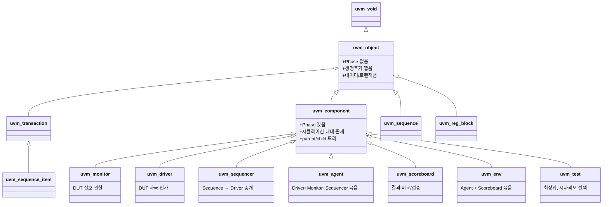
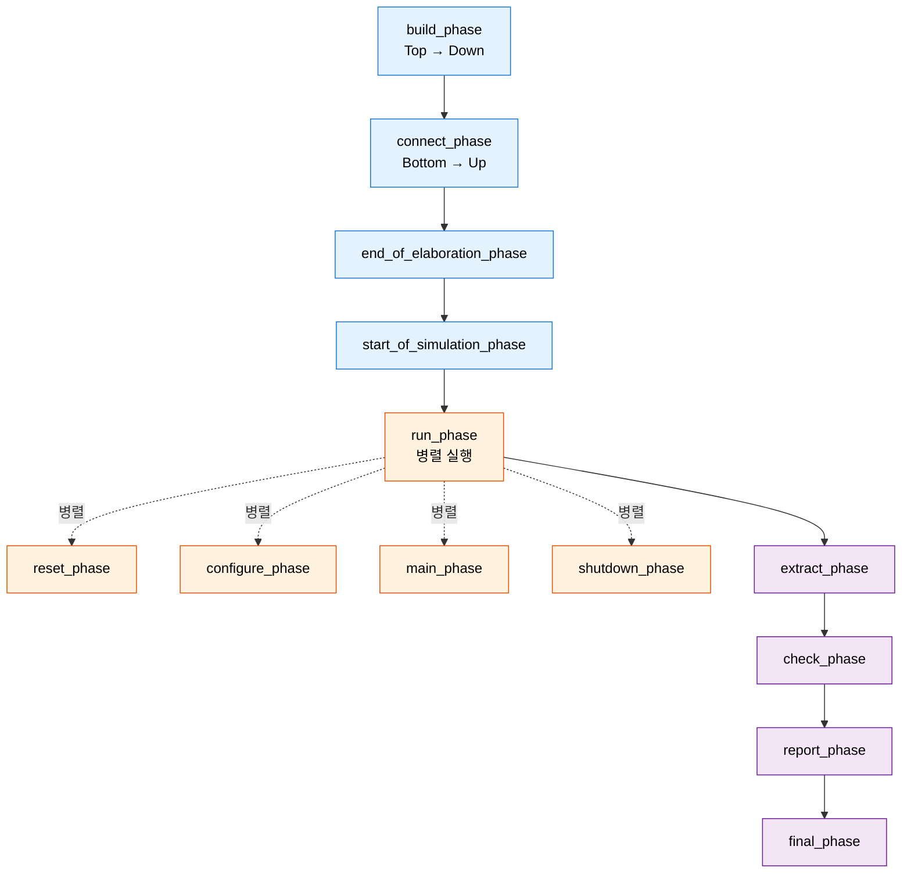
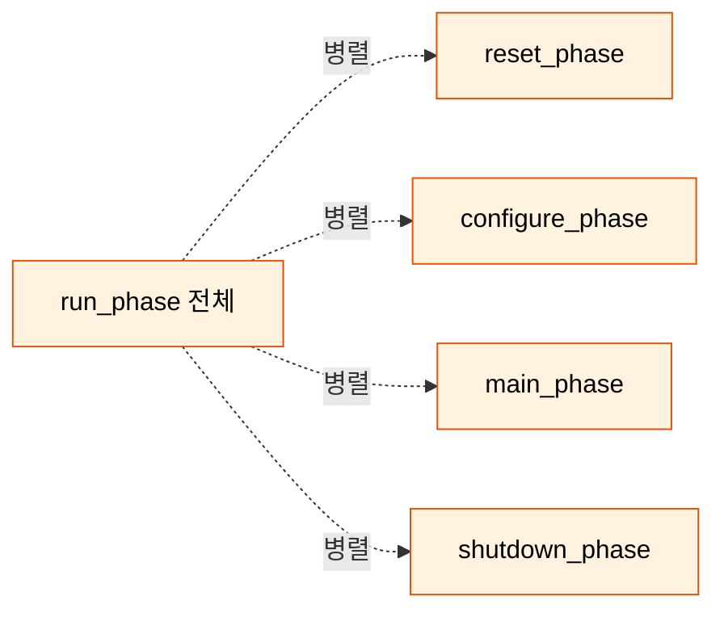
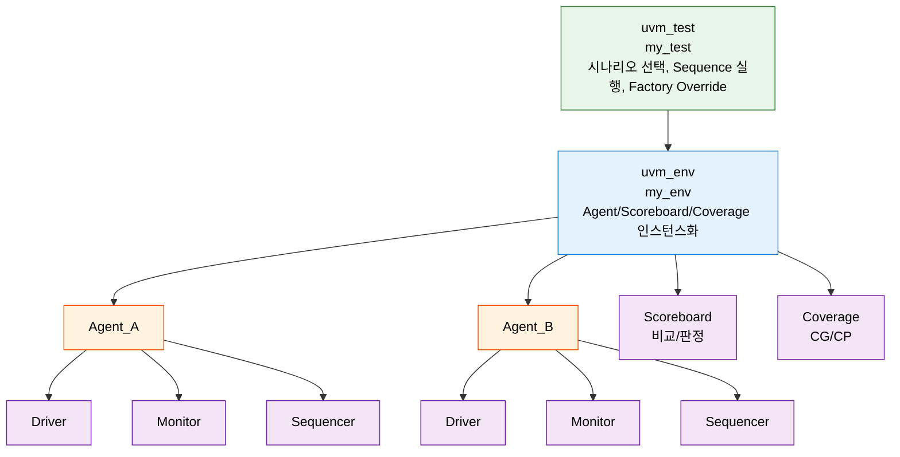

# Module 01 — UVM 아키텍처 & Phase

<div class="learning-meta">
  <span class="meta-badge meta-time">⏱ 17분</span>
  <span class="meta-badge meta-level-advanced">📊 Advanced</span>
</div>

!!! objective "학습 목표"
    이 모듈을 마치면:

    - **Diagram** UVM의 핵심 클래스 계층(`uvm_object` vs `uvm_component`)을 화이트보드로 그리고 두 분기의 책임을 설명할 수 있다.
    - **Trace** UVM Phase의 실행 순서(top-down build → bottom-up connect → 병렬 run → cleanup)를 따라가며 각 Phase에서 무엇이 일어나는지 추적할 수 있다.
    - **Apply** `raise_objection` / `drop_objection`을 사용해 `run_phase` 종료 시점을 안전하게 제어하는 코드를 작성할 수 있다.
    - **Distinguish** drain time과 `phase_ready_to_end` 콜백의 역할을 비교하고 언제 어느 것을 쓸지 판단할 수 있다.
    - **Decide** sub-phase(reset/configure/main/shutdown)를 사용할지, `run_phase` 단일로 갈지 환경 복잡도에 따라 결정할 수 있다.

!!! info "사전 지식"
    - SystemVerilog 객체지향(class, virtual function, polymorphism) — [Glossary](glossary.md) 참고 필요 시
    - `function` vs `task`의 차이 (시간 소비 가능 여부)
    - 기본 시뮬레이터 사용 경험 (VCS/Questa/Xcelium)

## 왜 이 모듈이 중요한가

UVM의 **모든 동작은 Phase 위에 얹혀 있습니다**. Driver/Monitor가 어디서 어떻게 생성되는지, 왜 build_phase에서 컴포넌트를 만들고 connect_phase에서 포트를 연결해야 하는지, 시뮬레이션이 왜 어느 시점에 종료되는지를 이해하지 못하면 디버깅이 추측 게임이 됩니다.

실무에서 가장 흔한 UVM 버그 3가지가 모두 이 모듈에서 다룹니다:

1. **build/connect 순서 위반** — connect에서 자식이 아직 생성되지 않아 NULL 참조
2. **Objection 누락** — `drop_objection`을 빠뜨려 시뮬이 hang
3. **drain time 부족** — 마지막 트랜잭션 처리 전 종료되어 false error

---

## 핵심 개념

> **UVM = SystemVerilog 기반의 검증 방법론 프레임워크.** 클래스 계층으로 재사용 가능한 검증 환경을 구축하고, Phase 메커니즘으로 빌드/연결/실행의 순서를 보장하며, Factory/config_db로 유연한 객체 생성/설정을 제공.

---

## UVM 클래스 계층



!!! note "두 분기의 본질적 차이"
    - **`uvm_object`**: 데이터(트랜잭션, 시퀀스, 설정값). Phase 없음. 자유롭게 생성/소멸.
    - **`uvm_component`**: 검증 인프라(Driver, Monitor 등). Phase 있음. 트리 구조에 속함. 시뮬레이션 동안 살아있음.

### Factory 등록 매크로

`uvm_component`와 `uvm_object`는 등록 매크로와 생성자 시그니처가 다릅니다:

```systemverilog
// uvm_component 등록 (name + parent 필수)
class my_driver extends uvm_driver #(my_item);
  `uvm_component_utils(my_driver)

  function new(string name, uvm_component parent);
    super.new(name, parent);
  endfunction
endclass

// uvm_object 등록 (name만, parent 없음)
class my_item extends uvm_sequence_item;
  `uvm_object_utils(my_item)

  function new(string name = "my_item");
    super.new(name);
  endfunction
endclass
```

**왜 차이가 있나?** Component는 트리에 속해 부모를 알아야 하므로 `parent` 인자가 필수. Object는 트리에 속하지 않으므로 부모가 불필요.

---

## UVM Phase

### Phase 실행 모델



### Phase 핵심 규칙

| 규칙 | 설명 | 위반 시 |
|------|------|---------|
| **Build: Top → Down** | 부모가 먼저 build → 자식 생성 가능 | child가 NULL일 때 접근 시도 → 런타임 에러 |
| **Connect: Bottom → Up** | 자식이 먼저 포트 생성 → 부모가 연결 | 연결 시 자식 포트가 없음 |
| **Run: 병렬 실행** | 모든 컴포넌트의 run_phase가 동시 시작 | 시간 의존 코드면 동기화 필요 |
| **Objection** | run_phase는 모든 objection이 drop되면 종료 | drop 누락 → hang |
| **Phase 순서 보장** | 이전 phase 미완 시 다음 phase 진입 안 함 | (UVM이 자동 보장) |

### Objection — Phase 종료 제어

```systemverilog
class my_test extends uvm_test;
  task run_phase(uvm_phase phase);
    phase.raise_objection(this);  // "아직 끝나지 않음"

    // 테스트 시나리오 실행
    my_seq.start(env.agent.sequencer);

    phase.drop_objection(this);   // "이제 끝남"
    // 모든 컴포넌트의 objection이 drop되면 run_phase 종료
  endtask
endclass
```

!!! warning "Objection 흔한 함정"
    - **raise 없이 drop** → UVM_ERROR
    - **drop 안 하면** → 시뮬레이션 무한 대기(hang). 디버그 시 가장 짜증나는 증상.
    - 보통 `uvm_test`에서만 raise/drop. 다른 컴포넌트가 raise하면 종료 시점이 흩어져 트레이스 어려움.

### Drain Time — 안전한 종료 보장

**문제**: `drop_objection` 직후 `run_phase`가 종료되면, DUT 파이프라인에 처리 중인 트랜잭션이 남아있을 수 있음. → Scoreboard가 expected는 갖고 있지만 actual을 못 받음 → false error.

세 가지 해결책:

```systemverilog
// 해결 1: drop_objection에 drain_time 인자
phase.drop_objection(this, "test done", 1000);
//                         ^desc       ^drain_time (시뮬레이션 시간 단위)

// 해결 2: 명시적 대기 후 drop
#(DUT_LATENCY * 2);
// 또는: wait(scoreboard.all_matched);
phase.drop_objection(this);

// 해결 3: phase_ready_to_end 콜백 (다음 절)
```

### phase_ready_to_end — 컴포넌트 자율 종료 지연

```systemverilog
class my_scoreboard extends uvm_scoreboard;
  `uvm_component_utils(my_scoreboard)
  my_item expected_queue[$];

  function void phase_ready_to_end(uvm_phase phase);
    if (phase.get_name() != "run") return;

    // 미매칭 항목 있으면 종료 지연
    if (expected_queue.size() > 0) begin
      phase.raise_objection(this, "waiting for remaining items");

      fork begin
        fork
          wait(expected_queue.size() == 0);
          #500ns;  // 안전 타임아웃
        join_any
        disable fork;
        phase.drop_objection(this);
      end join_none
    end
  endfunction
endclass
```

**호출 시점**: `run_phase`의 모든 objection이 drop된 직후, UVM이 각 컴포넌트의 `phase_ready_to_end()`를 호출 → 컴포넌트가 추가 objection 가능 → 모두 drop되면 진짜 종료.

| | drain_time | phase_ready_to_end |
|---|---|---|
| 누가 관리 | Test (중앙 집중) | 각 컴포넌트 (분산) |
| 장점 | 단순, 한곳에서 제어 | 컴포넌트가 자기 상태 자율 판단 |
| 단점 | 환경 전체 지연 추정 어려움 | 여러 컴포넌트가 raise하면 종료 시점 분산 |
| 실무 권장 | 둘 다 — drain으로 기본 마진, ready_to_end로 보험 | |

### Sub-Phase (run_phase 세분화)



핵심: **`run_phase`와 sub-phase는 병렬 실행**. 따라서 둘 중 하나만 쓰는 것이 혼란을 방지.

```systemverilog
// Sub-phase 활용 (SoC-level 통합 검증)
class complex_test extends uvm_test;
  task reset_phase(uvm_phase phase);
    phase.raise_objection(this);
    vif.rst_n <= 0;
    repeat(10) @(posedge vif.clk);
    vif.rst_n <= 1;
    repeat(5) @(posedge vif.clk);
    phase.drop_objection(this);
  endtask

  task configure_phase(uvm_phase phase);
    phase.raise_objection(this);
    reg_seq.start(env.reg_agent.sequencer);
    phase.drop_objection(this);
  endtask

  task main_phase(uvm_phase phase);
    phase.raise_objection(this);
    traffic_seq.start(env.data_agent.sequencer);
    phase.drop_objection(this);
  endtask

  task shutdown_phase(uvm_phase phase);
    phase.raise_objection(this);
    #(PIPELINE_DEPTH * CLK_PERIOD);
    phase.drop_objection(this);
  endtask
endclass
```

### Sub-Phase 사용 판단

| 상황 | 권장 | 이유 |
|------|------|------|
| 대부분의 IP-level 테스트 | `run_phase`만 | 단순, 직관적 |
| Reset이 여러 번 (예: warm/cold reset 검증) | sub-phase | reset_phase 반복 호출 가능 |
| 여러 Agent 단계별 동기화 필요 | sub-phase | 모두 reset 완료 후 configure 보장 |
| SoC-level 통합 검증 | sub-phase | 복수 Agent 단계 동기화 필수 |

---

## UVM 환경 계층 구조



**계층 원칙**: 각 레벨은 **자신의 직접 자식만** 생성. test가 driver를 직접 만들지 않고, env가 만들지도 않으며, agent가 driver를 만든다.

---

## 워크스루: 최소 UVM 환경 만들기

다음은 build → connect → run → drop_objection까지 실제 실행되는 최소 환경입니다. 빈 시뮬레이터에서 컴파일/실행해보면 Phase가 어떻게 흐르는지 직접 관찰할 수 있습니다.

### 1단계: 가짜 Driver와 Env

```systemverilog
class my_driver extends uvm_driver;
  `uvm_component_utils(my_driver)
  function new(string name, uvm_component parent);
    super.new(name, parent);
  endfunction

  task run_phase(uvm_phase phase);
    `uvm_info("DRV", "run_phase start", UVM_LOW)
    #100ns;
    `uvm_info("DRV", "run_phase end", UVM_LOW)
  endtask
endclass

class my_env extends uvm_env;
  `uvm_component_utils(my_env)
  my_driver drv;

  function new(string name, uvm_component parent);
    super.new(name, parent);
  endfunction

  function void build_phase(uvm_phase phase);
    super.build_phase(phase);
    drv = my_driver::type_id::create("drv", this);  // (1) 자식 생성
    `uvm_info("ENV", "build_phase done", UVM_LOW)
  endfunction
endclass
```

### 2단계: Test에서 objection 관리

```systemverilog
class my_test extends uvm_test;
  `uvm_component_utils(my_test)
  my_env env;

  function new(string name, uvm_component parent);
    super.new(name, parent);
  endfunction

  function void build_phase(uvm_phase phase);
    super.build_phase(phase);
    env = my_env::type_id::create("env", this);
  endfunction

  task run_phase(uvm_phase phase);
    phase.raise_objection(this);                       // (2) 시작
    `uvm_info("TEST", "run starts", UVM_LOW)
    #500ns;
    `uvm_info("TEST", "scenario done", UVM_LOW)
    phase.drop_objection(this, "done", 200);           // (3) drain 200ns
  endtask
endclass
```

### 3단계: 실행하면 보이는 로그 흐름

```
UVM_INFO ... [ENV ] build_phase done            ← (1) build, top-down
UVM_INFO ... [TEST] run starts                  ← (2) raise → run 시작
UVM_INFO ... [DRV ] run_phase start             ← run은 병렬, driver도 동시 시작
UVM_INFO ... [DRV ] run_phase end               ← driver가 먼저 끝남
UVM_INFO ... [TEST] scenario done               ← test의 run_phase 완료
                                                  ↓ drain 200ns 동안 추가 진행
                                                  ↓ extract → check → report → final
```

이 로그 패턴을 머릿속에 박아두면 실제 디버그에서 **"이 시점에 무슨 phase가 돌고 있는지"**가 즉시 보입니다.

---

## 연습문제

!!! question "Exercise 1 (Apply, ★)"
    `my_env`에 monitor를 하나 추가하고, 그 monitor의 `connect_phase`에서 `analysis_export`를 scoreboard에 연결하는 코드를 써보세요. 어떤 순서로 build/connect가 호출되는지 trace해서 NULL 참조가 발생하지 않을 조건을 명시하세요.

    ??? answer "모범 답안"
        ```systemverilog
        class my_env extends uvm_env;
          `uvm_component_utils(my_env)
          my_monitor   mon;
          my_scoreboard sb;
          ...
          function void build_phase(uvm_phase phase);
            super.build_phase(phase);
            mon = my_monitor::type_id::create("mon", this);
            sb  = my_scoreboard::type_id::create("sb",  this);
          endfunction
          function void connect_phase(uvm_phase phase);
            super.connect_phase(phase);
            mon.ap.connect(sb.actual_imp);  // 자식의 포트가 build에서 이미 생성됨 → 안전
          endfunction
        endclass
        ```
        **순서 보장**: `build_phase`가 top-down으로 끝난 후에야 `connect_phase`가 시작됨. 따라서 `connect_phase` 시점에 `mon.ap`와 `sb.actual_imp`가 모두 존재. 만약 `build_phase`에서 mon/sb 둘 중 하나의 create를 빼먹으면 NULL 참조.

!!! question "Exercise 2 (Analyze, ★★)"
    다음 코드는 시뮬레이션이 hang됩니다. 원인 두 가지를 찾아보세요.

    ```systemverilog
    class buggy_test extends uvm_test;
      task run_phase(uvm_phase phase);
        phase.raise_objection(this);
        my_seq.start(env.agent.sequencer);
        // (의도: drop_objection을 작성하지 않음)
      endtask

      task main_phase(uvm_phase phase);
        // 빈 main_phase
      endtask
    endclass
    ```

    ??? answer "모범 답안"
        1. **`drop_objection` 누락** — `run_phase`에서 raise만 하고 drop이 없으니 영원히 종료 안 됨. UVM은 raise/drop 카운트가 0이 될 때까지 phase를 유지.
        2. **`run_phase`와 `main_phase` 동시 사용** — 둘은 병렬 실행되므로 직관적이지 않은 타이밍이 발생. 빈 `main_phase`가 즉시 종료되더라도 `run_phase`의 raise가 살아있어 시뮬은 hang. 실무 권장: 둘 중 하나만 사용.

!!! question "Exercise 3 (Evaluate, ★★★)"
    drain time과 `phase_ready_to_end` 둘 다 사용해야 하는 상황과, 둘 중 하나면 충분한 상황을 각각 한 가지씩 실제 검증 시나리오로 들어보세요.

    ??? answer "예시 답안"
        - **둘 다 필요한 경우**: 다중 Agent + 비대칭 latency. 예: AXI Agent의 latency는 짧지만 PCIe Agent의 latency가 길고 가변적. drain_time 1000ns로 기본 마진 확보 + PCIe Scoreboard에서 `phase_ready_to_end`로 미매칭 큐 추가 대기. 하나만 쓰면 마진 부족 또는 과도하게 긴 drain.
        - **하나면 충분한 경우**: 단일 Agent + DUT의 deterministic latency(예: pipeline depth=10, 항상 10 cycle 후 출력). drain_time을 PIPELINE_DEPTH * CLK_PERIOD * 2로 잡으면 충분.

---

## 핵심 정리

- **`uvm_object` vs `uvm_component`**: 데이터(Phase 없음, 자유 생명주기) vs 인프라(Phase 있음, 트리 구조). 등록 매크로/생성자 시그니처가 이 차이를 반영.
- **Phase 흐름**: build(top-down) → connect(bottom-up) → run(병렬) → cleanup. 자식 생성은 build에서, 포트 연결은 connect에서. 순서 위반은 NULL 참조로 즉시 드러남.
- **Objection 패턴**: 보통 `uvm_test`에서만 raise/drop. drop 누락이 가장 흔한 hang 원인.
- **Drain time vs phase_ready_to_end**: 전자는 중앙 집중(Test가 관리), 후자는 분산(컴포넌트 자율). 실무는 양쪽 다 사용해 안전 마진 확보.
- **Sub-phase**: SoC-level 다중 Agent 동기화에 유용. IP-level은 `run_phase` 단일이 단순. 둘 병렬 실행이므로 혼용 금지.
- **계층 원칙**: 각 컴포넌트는 자신의 직접 자식만 생성. 디버그 시 트리를 따라 내려가며 추적 가능.

---

## Q&A

**Q: UVM의 Phase가 왜 필요한가?**

> 복잡한 검증 환경에서 컴포넌트 생성→연결→실행→정리의 순서를 자동으로 보장하기 위해서다. Phase 없이는 build 전에 connect를 시도하거나, 모든 컴포넌트가 준비되기 전에 시뮬레이션이 시작될 수 있다. Phase 메커니즘이 이 순서를 강제하므로, 개별 컴포넌트는 자신의 Phase 함수만 구현하면 전체 순서가 자동으로 맞춰진다.

**Q: `uvm_component`와 `uvm_object`의 핵심 차이는?**

> 세 가지: (1) Phase — component는 Phase 콜백이 있고 object는 없다. (2) 계층 — component는 parent/child 트리에 속하고 object는 독립적. (3) 생명주기 — component는 시뮬레이션 내내 존재하고 object는 생성/소멸이 자유롭다.

**Q: Objection 메커니즘의 목적은?**

> `run_phase`의 종료 시점을 제어한다. 어떤 컴포넌트든 objection을 raise하면 `run_phase`가 유지되고, 모든 objection이 drop되면 종료된다. 보통 test에서만 raise/drop하여 전체 시나리오 완료를 관리한다.

**Q: Drain time이 필요한 이유는?**

> Sequence가 마지막 트랜잭션을 보낸 직후 drop_objection하면 DUT 파이프라인에 처리 중인 데이터가 남아 있을 수 있다. 이 상태에서 run_phase가 종료되면 Scoreboard에서 expected는 있지만 actual이 도착하지 않아 false error가 발생한다. drain time으로 DUT가 모든 출력을 완료할 시간을 확보한다.

**Q: `run_phase`의 sub-phase를 실무에서 사용하는가?**

> IP-level 검증에서는 대부분 `run_phase`만 사용한다. sub-phase는 SoC-level 통합 검증처럼 여러 Agent가 '모두 리셋 완료 후 설정 시작' 같은 단계별 동기화가 필요할 때 유용하다.

---

## 다음 단계

- 📝 [**Module 01 퀴즈**](quiz/01_architecture_and_phase_quiz.md) — 5문항으로 이해도 점검
- ➡️ [**Module 02 — Agent / Driver / Monitor**](02_agent_driver_monitor.md) — DUT 인터페이스 컴포넌트 설계

<div class="chapter-nav">
  <a class="nav-prev" href="index.md">
    <div class="nav-label">◀ 이전</div>
    <div class="nav-title">코스 홈</div>
  </a>
  <a class="nav-next" href="02_agent_driver_monitor.md">
    <div class="nav-label">다음 ▶</div>
    <div class="nav-title">Agent / Driver / Monitor</div>
  </a>
</div>
