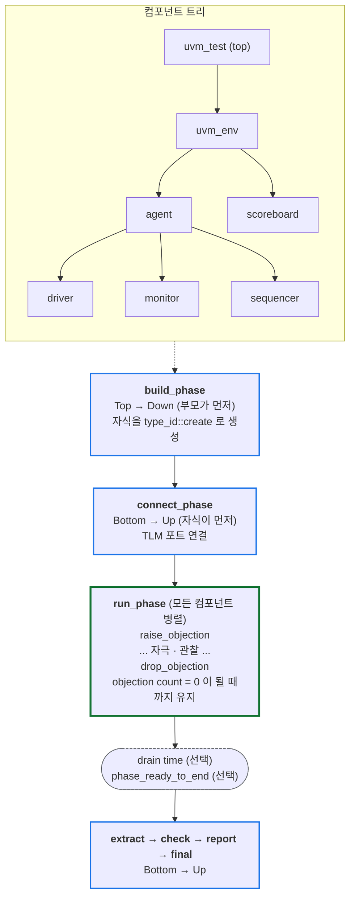
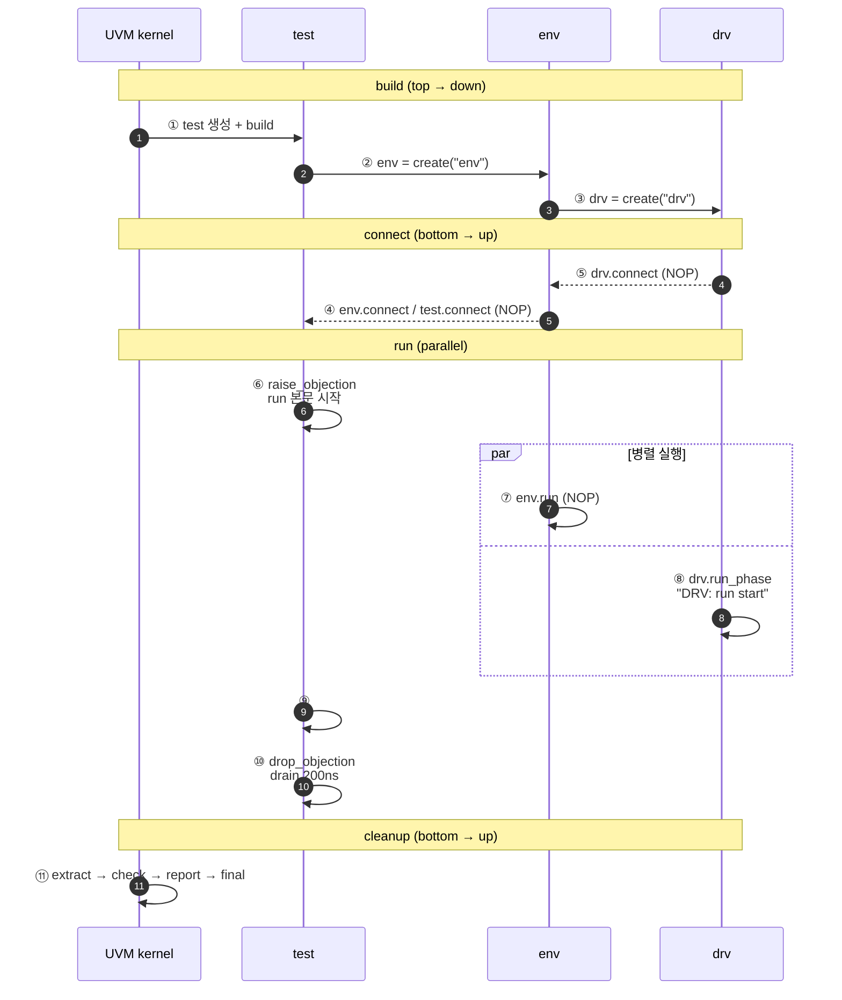
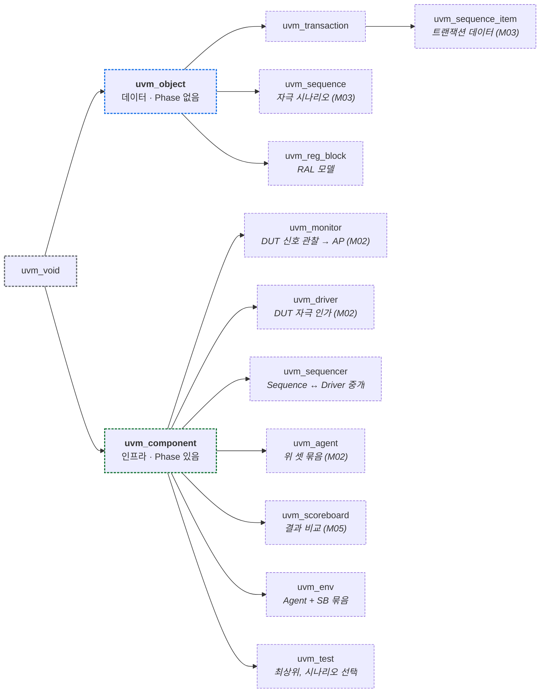

# Module 01 — UVM 아키텍처 & Phase

<!-- DV-SKOOL-CH-CTX:start -->
<div class="chapter-context" data-cat="core">
  <a class="chapter-back" href="../">
    <span class="chapter-back-arrow">←</span>
    <span class="chapter-back-icon">🧪</span>
    <span class="chapter-back-text">UVM</span>
  </a>
  <span class="chapter-divider">›</span>
  <span class="chapter-marker">Module 01</span>
</div>
<!-- DV-SKOOL-CH-CTX:end -->

<!-- DV-SKOOL-CH-TOC:start -->
<div class="page-toc">
  <span class="page-toc-label">목차</span>
  <a class="page-toc-link" href="#1-why-care-uvm-아키텍처가-왜-필요한가">1. Why care?</a>
  <a class="page-toc-link" href="#2-intuition-공연-리허설과-한-장-그림">2. Intuition</a>
  <a class="page-toc-link" href="#3-작은-예-build-connect-run-한-사이클을-step-by-step-으로-따라가기">3. 작은 예 — build→run 한 사이클</a>
  <a class="page-toc-link" href="#4-일반화-클래스-계층-과-phase-모델">4. 일반화 — 클래스 계층 + Phase 모델</a>
  <a class="page-toc-link" href="#5-디테일-objection-drain-time-sub-phase-환경-계층">5. 디테일</a>
  <a class="page-toc-link" href="#6-흔한-오해-와-dv-디버그-체크리스트">6. 흔한 오해 + DV 디버그 체크리스트</a>
  <a class="page-toc-link" href="#7-핵심-정리-key-takeaways">7. 핵심 정리</a>
</div>
<!-- DV-SKOOL-CH-TOC:end -->

!!! objective "학습 목표"
    이 모듈을 마치면:

    - **Diagram** UVM 의 핵심 클래스 계층 (`uvm_object` vs `uvm_component`) 을 그리고 두 분기의 책임을 설명할 수 있다.
    - **Trace** UVM Phase 의 실행 순서 (top-down build → bottom-up connect → 병렬 run → cleanup) 를 한 사이클 따라가며 각 phase 가 무엇을 하는지 추적할 수 있다.
    - **Apply** `raise_objection` / `drop_objection` 으로 `run_phase` 종료 시점을 안전하게 제어하는 코드를 작성할 수 있다.
    - **Distinguish** drain time 과 `phase_ready_to_end` 콜백의 역할을 비교하고 언제 어느 것을 쓸지 판단할 수 있다.
    - **Decide** sub-phase (reset/configure/main/shutdown) 를 사용할지, `run_phase` 단일로 갈지 환경 복잡도에 따라 결정할 수 있다.

!!! info "사전 지식"
    - SystemVerilog 객체지향 (class, virtual function, polymorphism)
    - `function` vs `task` 차이 (시간 소비 가능 여부)
    - 기본 시뮬레이터 사용 경험 (VCS / Questa / Xcelium)

---

## 1. Why care? — UVM 아키텍처가 왜 필요한가

### 1.1 시나리오 — UVM _없는_ 시뮬

당신은 SystemVerilog 만으로 testbench 작성:
- DUT instance
- BFM (Bus Functional Model) — task / function 으로
- Stimulus — initial block 에서
- Checker — always block 에서 RTL 비교

규모가 작으면 OK. 그런데 _수개월 후_:
- BFM 이 _이 test 와 저 test 에서 다른 reset 순서_ 필요 → BFM 코드 분기.
- Checker 가 _stimulus 와 race condition_ — 시작 시점 misalignment.
- 새 test 추가 시 _BFM 재사용_ 어려움 — 매번 reset / init 직접 작성.
- 검증 progress 측정 (coverage) _수동_.

**UVM 의 해법**:
- **Phase 표준화** — build → connect → run → check → report. 모든 component 가 _같은 시점_ 에 같은 일.
- **Component 재사용** — driver/monitor 한 번 만들면 모든 test 에서.
- **Sequence layer** — stimulus 가 BFM 과 _decoupled_.
- **Coverage 통합** — 자동 측정.

결과: testbench _복잡도_ 가 _IP 면적의 선형_ 으로 증가. UVM 없으면 _제곱_ 또는 _exponential_.

이후 모든 UVM 모듈은 한 가정에서 출발합니다 — **"검증 환경의 모든 구성 요소는 동일한 Phase 위에서 같은 순서로 build / connect / run / cleanup 한다"**. Driver / Monitor / Sequencer / Scoreboard 가 어떻게 협력하는지, 왜 build_phase 에서 자식을 만들어야 하고 connect_phase 에서 포트를 잇는지, 시뮬레이션이 왜 어느 시점에 멈추는지 — 전부 이 가정의 파생입니다.

이 모듈을 건너뛰면 이후 챕터들의 모든 코드 패턴이 "그냥 외워야 하는 관습" 으로 보입니다. 반대로 Phase 흐름이 머리에 박히면 디버그 중 "이 시점에 무슨 phase 가 도는가" 가 즉시 보이고, build/connect 순서 위반·objection 누락·drain time 부족 — UVM 의 가장 흔한 hang 3종이 한 눈에 분류됩니다.

---

## 2. Intuition — 공연 리허설과 한 장 그림

!!! tip "💡 한 줄 비유"
    **UVM Phase** ≈ **공연의 리허설 → 본 공연 → 정리 단계**.<br>
    무대 설치 (build) → 음향 연결 (connect) → 공연 (run) → 사후 정리 (extract / check / report) 가 모든 공연팀에 동일하게 적용되듯이, build → connect → run → check 는 **모든 컴포넌트** 에 동일한 순서로 진행. 한 단계가 모든 곳에서 끝나야 다음 단계가 _모든 곳에서_ 시작.

### 한 장 그림 — Phase 흐름과 컴포넌트 트리



### 왜 이렇게 설계됐는가 — Design rationale

세 가지 요구가 동시에 풀려야 했습니다.

1. **수십 개 컴포넌트가 흩어져 있어도 부모는 자식이 _만들어진 후에만_ 자식 핸들에 접근해야** → build_phase 가 top-down 순으로 진행되도록 강제.
2. **자식의 TLM 포트가 _존재한 후에만_ 부모가 연결할 수 있어야** → connect_phase 는 bottom-up.
3. **자극 / 관찰 / 비교가 동시에 진행되어야 하고, 시뮬레이션이 깔끔히 끝나야** → run_phase 는 병렬 + objection 메커니즘으로 종료 시점 일원화.

이 세 요구의 교집합이 **Phase 자동 순서 보장 + objection-기반 종료 모델** 입니다. 개별 컴포넌트는 자기 phase 함수만 구현하면, 나머지는 UVM 이 알아서 정렬해 줍니다.

---

## 3. 작은 예 — build → connect → run 한 사이클을 step-by-step 으로 따라가기

가장 단순한 시나리오. `uvm_test` 가 `uvm_env` 를 만들고, env 가 driver 한 개를 만든 뒤, driver 가 1 개의 transaction 을 자극하고 run_phase 가 종료되는 흐름.

### 단계별 다이어그램



### 단계별 의미

| Step | 누가 | 무엇을 | 왜 |
|---|---|---|---|
| ① | UVM kernel | `run_test()` 가 `uvm_test_top` 인스턴스를 factory 로 생성 | `uvm_test` 는 항상 최상위 |
| ② | test.build_phase | `env = my_env::type_id::create("env", this)` | 부모 build 가 먼저 끝나야 자식 build 가 의미 있음 |
| ③ | env.build_phase | `drv = my_driver::type_id::create("drv", this)` | top-down: env 가 먼저 build, 이 안에서 drv create |
| ④ | test.connect_phase | (NOP — 직접 자식 포트 없음) | bottom-up 이지만 test 는 leaf 가 아님 |
| ⑤ | env.connect_phase | TLM 연결이 있다면 여기 (예: `mon.ap.connect(sb.imp)`) | 자식 포트가 build 에서 이미 만들어졌어야 NULL 안 남 |
| ⑥ | test.run_phase | `phase.raise_objection(this)` | "아직 안 끝났다" 표시 — objection count = 1 |
| ⑦ | env.run_phase | (이 예에서는 빈 task — fork 만 함) | run 은 모든 컴포넌트 병렬 |
| ⑧ | drv.run_phase | `uvm_info("DRV", "run start"); #100ns; uvm_info("DRV", "run end");` | driver 가 동시에 도는 동안 test 는 시나리오 진행 |
| ⑨ | test.run_phase | `#500ns;` 시나리오 종료 | drain 전 마지막 본문 |
| ⑩ | test.run_phase | `phase.drop_objection(this, "done", 200)` | objection count = 0 + 200 ns drain |
| ⑪ | UVM kernel | extract → check → report → final | bottom-up cleanup |

### 실제 코드 (전부 합쳐서)

```systemverilog
class my_driver extends uvm_driver;
  `uvm_component_utils(my_driver)
  function new(string name, uvm_component parent);
    super.new(name, parent);
  endfunction
  task run_phase(uvm_phase phase);
    `uvm_info("DRV", "run_phase start", UVM_LOW)
    #100ns;
    `uvm_info("DRV", "run_phase end", UVM_LOW)
  endtask
endclass

class my_env extends uvm_env;
  `uvm_component_utils(my_env)
  my_driver drv;
  function new(string name, uvm_component parent);
    super.new(name, parent);
  endfunction
  function void build_phase(uvm_phase phase);
    super.build_phase(phase);
    drv = my_driver::type_id::create("drv", this);  // ③
    `uvm_info("ENV", "build_phase done", UVM_LOW)
  endfunction
endclass

class my_test extends uvm_test;
  `uvm_component_utils(my_test)
  my_env env;
  function new(string name, uvm_component parent);
    super.new(name, parent);
  endfunction
  function void build_phase(uvm_phase phase);
    super.build_phase(phase);
    env = my_env::type_id::create("env", this);   // ②
  endfunction
  task run_phase(uvm_phase phase);
    phase.raise_objection(this);                  // ⑥
    `uvm_info("TEST", "run starts", UVM_LOW)
    #500ns;                                        // ⑨
    `uvm_info("TEST", "scenario done", UVM_LOW)
    phase.drop_objection(this, "done", 200);      // ⑩
  endtask
endclass
```

### 실행하면 보이는 로그

```
UVM_INFO ... [ENV ] build_phase done            ← (1)(2)(3) build, top-down
UVM_INFO ... [TEST] run starts                  ← (6) raise → run 시작
UVM_INFO ... [DRV ] run_phase start             ← (8) run 은 병렬
UVM_INFO ... [DRV ] run_phase end               ← driver 가 먼저 끝남
UVM_INFO ... [TEST] scenario done               ← (9) test run 본문 끝
                                                  ↓ drain 200 ns
                                                  ↓ extract → check → report → final
UVM_INFO ... [Report Server] PASSED             ← report_phase 출력
```

!!! note "여기서 잡아야 할 두 가지"
    **(1) Phase 마다 hierarchy 방향이 다르다.** build = top-down, connect = bottom-up, run = 병렬, cleanup = bottom-up. 잘못된 phase 에서 자식/부모 핸들에 접근하면 NULL.<br>
    **(2) run_phase 종료는 _시간_ 이 아니라 _objection count_ 가 결정한다.** `#500ns` 가 끝나도 objection 이 안 drop 되면 시뮬은 hang. drop 만 해도 drain 이 모자라면 마지막 transaction 이 잘림.

---

## 4. 일반화 — 클래스 계층 과 Phase 모델

### 4.1 두 분기의 본질

| | `uvm_object` | `uvm_component` |
|---|---|---|
| 무엇을 표현 | 데이터 (트랜잭션, 시퀀스, 설정값) | 검증 인프라 (driver, monitor, env...) |
| Phase | 없음 | 있음 (build / connect / run / ... ) |
| 트리 구조 | 속하지 않음 | parent / child 트리에 속함 |
| 생명주기 | 자유 (생성·복사·소멸 자유로움) | 시뮬 동안 살아 있음 |
| 등록 매크로 | `` `uvm_object_utils `` | `` `uvm_component_utils `` |
| 생성자 | `function new(string name = "...")` | `function new(string name, uvm_component parent)` |

이 분리가 곧 _데이터 / 인프라_ 분리이며, 이후 모든 챕터의 어휘.

### 4.2 클래스 계층 — UVM 의 6 컴포넌트 + 3 데이터



이후 모든 모듈에서 이 9 개가 등장합니다. 새 클래스가 나오면 일단 이 9 개 중 하나의 변형/특수화인지 확인하세요.

### 4.3 Phase 의 3 그룹

| 그룹 | 방향 | 시간 소비 | 주요 phase |
|---|---|---|---|
| **Build** | top-down | function (시간 0) | build_phase, connect_phase, end_of_elaboration_phase, start_of_simulation_phase |
| **Run** | 병렬 | task (시간 소비) | run_phase + sub-phase (reset/configure/main/shutdown) |
| **Cleanup** | bottom-up | function (시간 0) | extract_phase, check_phase, report_phase, final_phase |

규칙:
- function-phase 는 시간을 소비하지 않음 → `#delay`, `@event`, `wait` 사용 금지.
- task-phase (run / sub-phase) 만 시간 소비 가능.
- 한 그룹의 모든 phase 가 끝나야 다음 그룹 시작.

### 4.4 Phase 의 5 가지 핵심 규칙

| 규칙 | 설명 | 위반 시 |
|------|------|---------|
| **Build: Top → Down** | 부모가 먼저 build → 자식 생성 가능 | child 가 NULL 일 때 접근 시도 → 런타임 에러 |
| **Connect: Bottom → Up** | 자식이 먼저 포트 생성 → 부모가 연결 | 연결 시 자식 포트가 없음 → NULL deref |
| **Run: 병렬 실행** | 모든 컴포넌트의 run_phase 가 동시 시작 | 시간 의존 코드면 fork/join 또는 event 동기화 필요 |
| **Objection** | run_phase 는 모든 objection 이 drop 되면 종료 | drop 누락 → hang |
| **Phase 순서 보장** | 이전 phase 미완 시 다음 phase 진입 안 함 | UVM 이 자동 보장 |

---

## 5. 디테일 — Objection / Drain Time / Sub-Phase / 환경 계층

### 5.1 Factory 등록 매크로 — Component vs Object

`uvm_component` 와 `uvm_object` 는 등록 매크로와 생성자 시그니처가 다릅니다.

```systemverilog
// uvm_component 등록 (name + parent 필수)
class my_driver extends uvm_driver #(my_item);
  `uvm_component_utils(my_driver)

  function new(string name, uvm_component parent);
    super.new(name, parent);
  endfunction
endclass

// uvm_object 등록 (name 만, parent 없음)
class my_item extends uvm_sequence_item;
  `uvm_object_utils(my_item)

  function new(string name = "my_item");
    super.new(name);
  endfunction
endclass
```

**왜 차이가 있나?** Component 는 트리에 속해 부모를 알아야 하므로 `parent` 인자 필수. Object 는 트리에 속하지 않으므로 부모 불필요.

### 5.2 Objection — Phase 종료 제어

```systemverilog
class my_test extends uvm_test;
  task run_phase(uvm_phase phase);
    phase.raise_objection(this);  // "아직 끝나지 않음"

    // 테스트 시나리오 실행
    my_seq.start(env.agent.sequencer);

    phase.drop_objection(this);   // "이제 끝남"
    // 모든 컴포넌트의 objection 이 drop 되면 run_phase 종료
  endtask
endclass
```

!!! warning "Objection 흔한 함정"
    - **raise 없이 drop** → UVM_ERROR
    - **drop 누락** → 시뮬레이션 무한 대기 (hang). 디버그 시 가장 짜증나는 증상.
    - 보통 `uvm_test` 에서만 raise/drop. 다른 컴포넌트가 raise 하면 종료 시점이 흩어져 트레이스 어려움.

### 5.3 Drain Time — 안전한 종료 보장

**문제**: `drop_objection` 직후 `run_phase` 가 종료되면, DUT 파이프라인에 처리 중인 트랜잭션이 남아 있을 수 있음. → Scoreboard 가 expected 는 갖고 있지만 actual 을 못 받음 → false error.

세 가지 해결책:

```systemverilog
// 해결 1: drop_objection 에 drain_time 인자
phase.drop_objection(this, "test done", 1000);
//                         ^desc       ^drain_time (시뮬레이션 시간 단위)

// 해결 2: 명시적 대기 후 drop
#(DUT_LATENCY * 2);
// 또는: wait(scoreboard.all_matched);
phase.drop_objection(this);

// 해결 3: phase_ready_to_end 콜백 (다음 절)
```

### 5.4 phase_ready_to_end — 컴포넌트 자율 종료 지연

```systemverilog
class my_scoreboard extends uvm_scoreboard;
  `uvm_component_utils(my_scoreboard)
  my_item expected_queue[$];

  function void phase_ready_to_end(uvm_phase phase);
    if (phase.get_name() != "run") return;

    // 미매칭 항목 있으면 종료 지연
    if (expected_queue.size() > 0) begin
      phase.raise_objection(this, "waiting for remaining items");

      fork begin
        fork
          wait(expected_queue.size() == 0);
          #500ns;  // 안전 타임아웃
        join_any
        disable fork;
        phase.drop_objection(this);
      end join_none
    end
  endfunction
endclass
```

**호출 시점**: `run_phase` 의 모든 objection 이 drop 된 직후, UVM 이 각 컴포넌트의 `phase_ready_to_end()` 를 호출 → 컴포넌트가 추가 objection 가능 → 모두 drop 되면 진짜 종료.

| | drain_time | phase_ready_to_end |
|---|---|---|
| 누가 관리 | Test (중앙 집중) | 각 컴포넌트 (분산) |
| 장점 | 단순, 한 곳에서 제어 | 컴포넌트가 자기 상태 자율 판단 |
| 단점 | 환경 전체 지연 추정 어려움 | 여러 컴포넌트가 raise 하면 종료 시점 분산 |
| 실무 권장 | 둘 다 — drain 으로 기본 마진, ready_to_end 로 보험 | |

### 5.5 Sub-Phase (run_phase 세분화)

핵심: **`run_phase` 와 sub-phase 는 병렬 실행**. 둘 중 하나만 쓰는 것이 혼란을 방지.

```systemverilog
// Sub-phase 활용 (SoC-level 통합 검증)
class complex_test extends uvm_test;
  task reset_phase(uvm_phase phase);
    phase.raise_objection(this);
    vif.rst_n <= 0;
    repeat(10) @(posedge vif.clk);
    vif.rst_n <= 1;
    repeat(5) @(posedge vif.clk);
    phase.drop_objection(this);
  endtask

  task configure_phase(uvm_phase phase);
    phase.raise_objection(this);
    reg_seq.start(env.reg_agent.sequencer);
    phase.drop_objection(this);
  endtask

  task main_phase(uvm_phase phase);
    phase.raise_objection(this);
    traffic_seq.start(env.data_agent.sequencer);
    phase.drop_objection(this);
  endtask

  task shutdown_phase(uvm_phase phase);
    phase.raise_objection(this);
    #(PIPELINE_DEPTH * CLK_PERIOD);
    phase.drop_objection(this);
  endtask
endclass
```

#### Sub-Phase 사용 판단

| 상황 | 권장 | 이유 |
|------|------|------|
| 대부분의 IP-level 테스트 | `run_phase` 만 | 단순, 직관적 |
| Reset 이 여러 번 (warm/cold reset 검증) | sub-phase | reset_phase 반복 호출 가능 |
| 여러 Agent 단계별 동기화 필요 | sub-phase | 모두 reset 완료 후 configure 보장 |
| SoC-level 통합 검증 | sub-phase | 복수 Agent 단계 동기화 필수 |

### 5.6 UVM 환경 계층 구조

<div class="layered-box layered-test">
  <div class="layered-label">uvm_test <small>(my_test)</small></div>
  <div class="layered-desc">시나리오 선택 · Sequence 실행 · Factory Override</div>
  <div class="layered-box layered-env">
    <div class="layered-label">uvm_env <small>(my_env)</small></div>
    <div class="layered-desc">Agent / Scoreboard / Coverage 인스턴스화 + 연결</div>
    <div class="layered-grid">
      <div class="layered-box layered-agent">
        <div class="layered-label">Agent_A</div>
        <div class="layered-grid">
          <div class="layered-mini mini-drv"><strong>Driver</strong>자극 인가</div>
          <div class="layered-mini mini-mon"><strong>Monitor</strong>신호 관찰</div>
          <div class="layered-mini mini-sqr"><strong>Sequencer</strong>중개</div>
        </div>
      </div>
      <div class="layered-box layered-agent">
        <div class="layered-label">Agent_B</div>
        <div class="layered-grid">
          <div class="layered-mini mini-drv"><strong>Driver</strong>자극 인가</div>
          <div class="layered-mini mini-mon"><strong>Monitor</strong>신호 관찰</div>
          <div class="layered-mini mini-sqr"><strong>Sequencer</strong>중개</div>
        </div>
      </div>
      <div class="layered-box layered-sb">
        <div class="layered-label">Scoreboard</div>
        <div class="layered-desc">DUT 출력 vs 기대값 비교 · Pass/Fail 판정</div>
      </div>
      <div class="layered-box layered-cov">
        <div class="layered-label">Coverage</div>
        <div class="layered-desc">Covergroup · Coverpoint · Cross 수집</div>
      </div>
    </div>
  </div>
</div>

**계층 원칙**: 각 레벨은 **자신의 직접 자식만** 생성. test 가 driver 를 직접 만들지 않고, env 가 만들지도 않으며, agent 가 driver 를 만든다. 이 원칙이 깨지면 trees 가 어그러져 build/connect 순서 보장이 깨진다.

### 5.7 Phase 그리드 — 한 장 정리

<div class="phase-grid">
  <div class="phase-col phase-build">
    <div class="phase-col-header">Build Phases<span class="phase-col-direction">↓ Top → Down · 순차</span></div>
    <div class="phase-step">build_phase</div>
    <div class="phase-step">connect_phase</div>
    <div class="phase-step">end_of_elaboration_phase</div>
    <div class="phase-step">start_of_simulation_phase</div>
    <div class="phase-step-note">컴포넌트 생성 → TLM 연결 → 시뮬 시작 직전 준비</div>
  </div>
  <div class="phase-col phase-run">
    <div class="phase-col-header">Run Phase<span class="phase-col-direction">⇄ 병렬 실행 (시간 소비)</span></div>
    <div class="phase-step">run_phase</div>
    <div class="phase-step phase-step-sub">┣ reset_phase</div>
    <div class="phase-step phase-step-sub">┣ configure_phase</div>
    <div class="phase-step phase-step-sub">┣ main_phase</div>
    <div class="phase-step phase-step-sub">┗ shutdown_phase</div>
    <div class="phase-step-note">run_phase 와 sub-phase 는 병렬. 둘 중 하나만 사용 권장.</div>
  </div>
  <div class="phase-col phase-cleanup">
    <div class="phase-col-header">Cleanup Phases<span class="phase-col-direction">↑ Bottom → Up · 순차</span></div>
    <div class="phase-step">extract_phase</div>
    <div class="phase-step">check_phase</div>
    <div class="phase-step">report_phase</div>
    <div class="phase-step">final_phase</div>
    <div class="phase-step-note">결과 수집 → 최종 검증 → 보고 → 정리</div>
  </div>
</div>

---

## 6. 흔한 오해 와 DV 디버그 체크리스트

### 흔한 오해

!!! danger "❓ 오해 1 — 'build_phase 가 모든 컴포넌트에서 동시에 실행된다'"
    **실제**: build_phase 는 **top-down 으로 순차** — 부모가 먼저 build, 자식이 그 다음. connect_phase 는 반대로 bottom-up. 즉 build 시점에 자식 핸들은 _직전 줄에서 create 한 것만_ 유효합니다.<br>
    **왜 헷갈리는가**: phase 가 "동시에 시작" 한다는 직관이 강해서 — 실제로는 hierarchy 순서가 정해져 있고 잘못 가정하면 self.child = null 상태에서 connect 시도.

!!! danger "❓ 오해 2 — 'drop_objection 만 호출하면 시뮬이 깨끗이 끝난다'"
    **실제**: drop 직후 `run_phase` 가 즉시 종료되므로, DUT 파이프라인에 처리 중인 transaction 이 _빨려 나가지 못합니다_. drain time 또는 `phase_ready_to_end` 로 마지막 outflow 가 끝날 때까지 기다려야 false miss 가 안 생깁니다.<br>
    **왜 헷갈리는가**: "objection = 종료 신호" 라는 단순 모델 때문에 — 실제로는 종료의 _시작 신호_ 일 뿐.

!!! danger "❓ 오해 3 — 'run_phase 와 main_phase 를 둘 다 쓰면 시나리오가 더 잘 분리된다'"
    **실제**: 둘은 **병렬 실행** 이라 raise/drop 책임이 한쪽에만 있으면 다른 쪽이 먼저 끝나거나 hang. 실무에서는 둘 중 하나만 사용 — IP-level 은 `run_phase`, SoC-level 다중 단계 동기화는 sub-phase 풀세트.<br>
    **왜 헷갈리는가**: 이름이 "phase 가 더 세분화된 버전" 처럼 들려서 — 실제로는 _대체_ 가 아니라 _병행_ 옵션.

!!! danger "❓ 오해 4 — '`new()` 로 컴포넌트를 만들어도 동작은 똑같다'"
    **실제**: 동작은 비슷해 보이지만 **factory override 가 먹지 않습니다**. `type_id::create("name", parent)` 로 만들어야 type/instance override 가 적용 — Module 04 의 핵심.<br>
    **왜 헷갈리는가**: SystemVerilog 에서 `new` 가 표준 생성 방법이므로.

!!! danger "❓ 오해 5 — 'Phase 간에 시간이 흐른다'"
    **실제**: build / connect / extract / check / report / final 은 **모두 function** — 시간이 0 에서 진행됩니다. 시간을 소비하는 phase 는 run + sub-phase 뿐. 따라서 build_phase 안에서 `#10ns` 쓰면 컴파일 에러.<br>
    **왜 헷갈리는가**: "phase = 시간상 단계" 라는 일반 직관 때문에.

### DV 디버그 체크리스트 (이 모듈 내용으로 마주칠 첫 실패들)

| 증상 | 1차 의심 | 어디 보나 |
|---|---|---|
| `UVM_FATAL` "null object access" in connect_phase | build 에서 자식 create 누락 또는 `super.build_phase(phase)` 빠짐 | env / agent 의 build_phase 첫 줄, 자식 create 줄 |
| 시뮬이 영원히 안 끝남 (hang) | objection drop 누락 | run_phase 로그 마지막에 `drop_objection` 메시지 있는지 |
| Scoreboard 가 마지막 transaction 을 못 받고 false error | drain time 부족 | `drop_objection(this, "...", N)` 의 N, 또는 `phase_ready_to_end` |
| 컴포넌트 트리가 비정상적 — env 아래 agent 가 안 보임 | derived test 가 `super.build_phase(phase)` 호출 누락 | hierarchy print (`+UVM_VERBOSITY=UVM_HIGH` 또는 `uvm_top.print()`) |
| `set_type_override` 가 안 먹힘 | 컴포넌트가 `new()` 로 직접 생성 (factory 우회) | grep `= new(` for component 클래스 |
| run_phase 가 즉시 종료 | sub-phase 만 raise 했는데 main 도 raise 안 함 / 그 반대 | 어느 phase 함수에 raise/drop 이 있는지 일관성 |
| `UVM_ERROR raise without prior raise` | drop 만 호출 또는 raise/drop 카운트 불일치 | raise/drop 개수가 같은지, 동일 phase argument 인지 |
| build_phase 안에서 `#10ns` → 컴파일 에러 | function-phase 에 시간 사용 | build/connect 는 function — 시간 소비 코드는 run 으로 |

---

## 7. 핵심 정리 (Key Takeaways)

- **`uvm_object` vs `uvm_component`**: 데이터 (Phase 없음, 자유 생명주기) vs 인프라 (Phase 있음, 트리 구조). 등록 매크로와 생성자 시그니처가 이 차이를 반영.
- **Phase 흐름**: build (top-down) → connect (bottom-up) → run (병렬) → cleanup (bottom-up). 자식 생성은 build 에서, 포트 연결은 connect 에서 — 순서 위반은 NULL 참조로 즉시 드러남.
- **Objection 패턴**: 보통 `uvm_test` 에서만 raise/drop. drop 누락 = 가장 흔한 hang 원인.
- **Drain time vs phase_ready_to_end**: 전자는 중앙 집중 (Test 가 관리), 후자는 분산 (컴포넌트 자율). 실무는 양쪽 다 사용해 안전 마진 확보.
- **Sub-phase**: SoC-level 다중 Agent 동기화에 유용. IP-level 은 `run_phase` 단일이 단순. 둘 병렬 실행이므로 혼용 금지.

!!! warning "실무 주의점"
    - 모든 derived test 의 `build_phase` / `connect_phase` 첫 줄에 `super.<phase>(phase)` 호출 — 이걸 빼면 base 가 만든 env / config_db / factory override 가 전부 사라짐.
    - function-phase 에 `#delay` 쓰지 말 것 — 컴파일 에러 또는 무시.
    - Component 생성은 항상 `type_id::create(...)` — `new()` 직접 호출 시 factory override 불가.

### 7.1 자가 점검

!!! question "🤔 Q1 — Phase 가 9 단계인 이유 (Bloom: Analyze)"
    `build → connect → end_of_elaboration → start_of_simulation → run → extract → check → report → final`. 5 단계로 줄이지 않고 9 단계로 분리한 _이유_ 1 가지?
    ??? success "정답"
        Phase 분리의 핵심:
        - **선후 보장**: build (top→bottom) 와 connect (bottom→top) 가 _분리_ 되어 있어야 자식이 부모보다 먼저 생성 + 연결은 자식 핸들이 준비된 후.
        - **function vs task 구분**: build/connect/extract/check/report = function (time 0), run = task (time advance). 같은 phase 에 시간 진행 + 비진행 혼재 시 race.
        - **report vs final**: report 는 메시지 출력, final 은 dump close — 순서가 뒤집히면 dump 가 잘림.
        - 5 단계 통합 시: ordering 가정이 어그러져 race 발생, "어디서 죽었는지" 분리 불가.

!!! question "🤔 Q2 — `super.build_phase` 누락 (Bloom: Apply)"
    Derived test 가 `super.build_phase(phase)` 를 안 부르면 어떤 _증상_ 이 시뮬레이션에서 나타날까?
    ??? success "정답"
        Base test 가 생성하는 모든 것이 사라짐:
        - **env null pointer**: base 의 `env = env_t::type_id::create(...)` 미실행 → derived 에서 `env.scoreboard` 접근 시 NULL dereference FATAL.
        - **config_db 항목 누락**: base 의 `uvm_config_db#(...)::set(...)` 미실행 → agent 가 vif 못 찾아 FATAL.
        - **factory override 누락**: base 의 `set_type_override_by_type(...)` 미실행 → custom seq 가 default 로 동작.
        - 디버그 단서: `phase build_phase` 라인이 정확히 1 줄만 출력 (정상은 base + derived = 2 줄).

### 7.2 출처

**Internal (Confluence)**
- `UVM Phase Mechanics` — 9 단계 ordering + super 호출 규칙
- `Common UVM Pitfalls` — 누락 증상 매트릭스

**External**
- *UVM 1.2 User's Guide* §4 (Phasing) — Accellera
- IEEE 1800.2-2020 *UVM Reference Manual* — phase 정의

---

## 다음 모듈

→ [Module 02 — Agent / Driver / Monitor](02_agent_driver_monitor.md): 이 챕터의 Phase 위에 _DUT 인터페이스_ 컴포넌트 (driver / monitor / sequencer) 가 어떻게 얹히는지, Active / Passive 분리는 어떻게 하는지.

[퀴즈 풀어보기 →](quiz/01_architecture_and_phase_quiz.md)


--8<-- "abbreviations.md"
