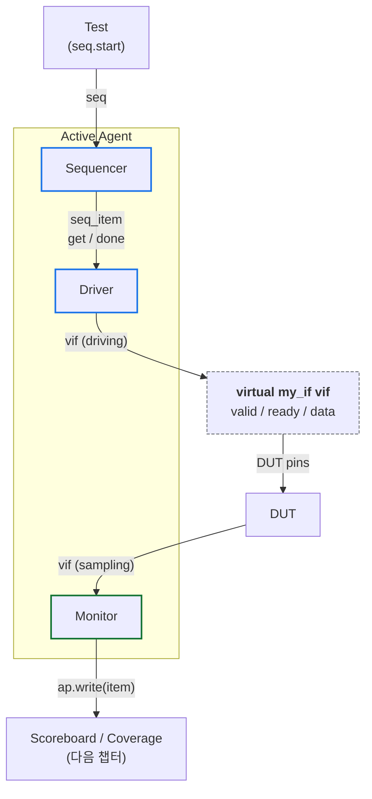
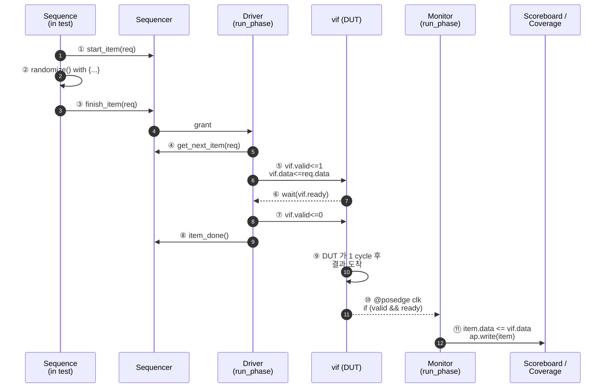
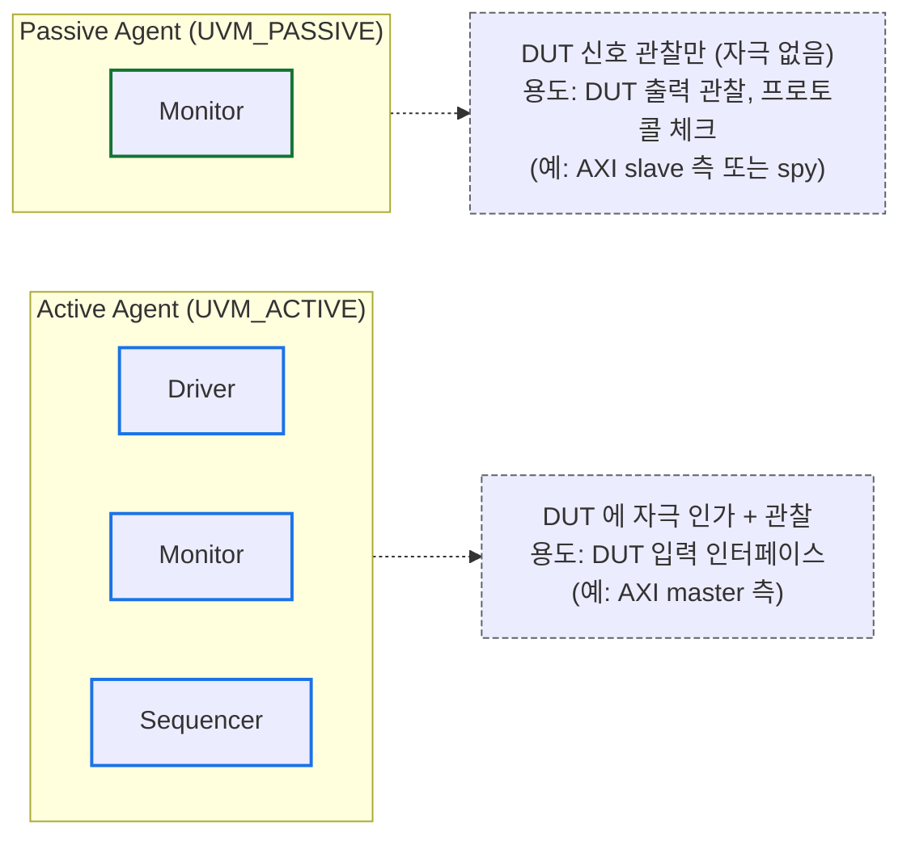
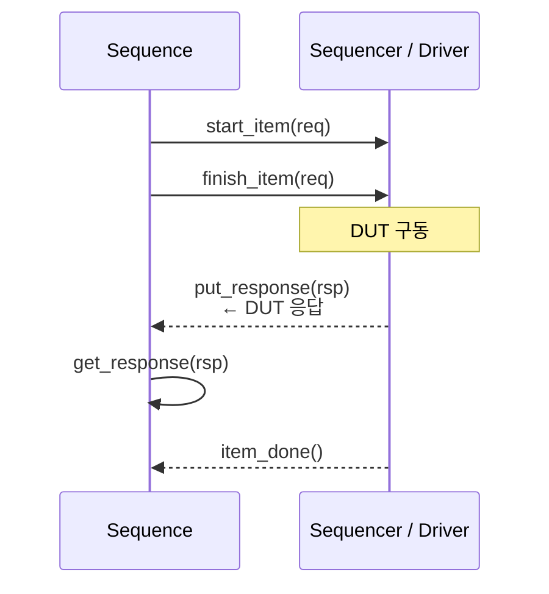

# Module 02 — Agent / Driver / Monitor

<!-- DV-SKOOL-CH-CTX:start -->
<div class="chapter-context" data-cat="core">
  <a class="chapter-back" href="../">
    <span class="chapter-back-arrow">←</span>
    <span class="chapter-back-icon">🧪</span>
    <span class="chapter-back-text">UVM</span>
  </a>
  <span class="chapter-divider">›</span>
  <span class="chapter-marker">Module 02</span>
</div>
<!-- DV-SKOOL-CH-CTX:end -->

<!-- DV-SKOOL-CH-TOC:start -->
<div class="page-toc">
  <span class="page-toc-label">목차</span>
  <a class="page-toc-link" href="#1-why-care-agent-가-uvm-재사용의-최소-단위인-이유">1. Why care?</a>
  <a class="page-toc-link" href="#2-intuition-인터뷰어-vs-관찰자-와-한-장-그림">2. Intuition</a>
  <a class="page-toc-link" href="#3-작은-예-한-transaction-이-driver-dut-monitor-로-흐르는-과정">3. 작은 예 — 한 transaction 의 흐름</a>
  <a class="page-toc-link" href="#4-일반화-agent-구조-와-active-passive-패턴">4. 일반화 — Agent 구조 + Active/Passive</a>
  <a class="page-toc-link" href="#5-디테일-driver-monitor-pipelining-arbitration-vif-전달">5. 디테일</a>
  <a class="page-toc-link" href="#6-흔한-오해-와-dv-디버그-체크리스트">6. 흔한 오해 + DV 디버그 체크리스트</a>
  <a class="page-toc-link" href="#7-핵심-정리-key-takeaways">7. 핵심 정리</a>
</div>
<!-- DV-SKOOL-CH-TOC:end -->

!!! objective "학습 목표"
    이 모듈을 마치면:

    - **Design** Active / Passive 모드 분리를 갖춘 Agent 를 build_phase 에서 분기 구현할 수 있다.
    - **Implement** `get_next_item` / `item_done` 짝을 사용하는 정상 Driver 와 Pipelining Driver 를 각각 작성할 수 있다.
    - **Distinguish** Driver (인가) 와 Monitor (관찰) 의 책임 경계를 코드 리뷰에서 식별할 수 있다.
    - **Connect** Virtual Interface 를 top → config_db → Agent 경로로 전달해 Driver / Monitor 에 연결할 수 있다.
    - **Trace** 한 transaction 이 sequencer → driver → DUT → monitor → analysis port 로 흘러가는 경로를 단계별로 추적할 수 있다.

!!! info "사전 지식"
    - [Module 01 — UVM 아키텍처 & Phase](01_architecture_and_phase.md) (Phase 흐름, 컴포넌트 생성)
    - SystemVerilog `interface` 와 `modport`
    - `clocking block` 의 의미 (signal sampling / driving timing)

---

## 1. Why care? — Agent 가 UVM 재사용의 최소 단위인 이유

### 1.1 시나리오 — 같은 AXI agent, _Master_ + _Slave_

당신은 AXI bridge 검증. 두 측면:
- **AXI master agent**: bridge 의 master IF 에 stimulus.
- **AXI slave agent**: bridge 의 slave IF 에서 응답.

순진한 해법: 두 개의 _별도 agent class_ 작성. _200% 작업량_.

UVM 해법: **같은 agent class** + `is_active` config:
- `UVM_ACTIVE` → Driver + Sequencer + Monitor (stimulus).
- `UVM_PASSIVE` → Monitor only (observe).

같은 코드, _config 한 줄_ 차이. AXI bridge → 한 agent, master 측은 active, slave 측은 passive. 또는 양쪽 모두 active (양방향 traffic).

또한 _PCIe RC vs EP_, _AXI master vs slave_ 같은 _dual role_ 모든 경우에 _같은 agent_ 재사용. UVM 재사용성의 _핵심_.

이후 검증 환경의 모든 _프로토콜 인터페이스_ 는 Agent 한 개로 캡슐화됩니다. Agent 의 설계가 잘못되면 — 예를 들어 Active / Passive 분리를 안 두면 — 같은 인터페이스를 다른 위치에서 (PCIe RC vs EP, AXI master vs slave) 검증할 때 Agent 를 새로 짜야 합니다. 그래서 이 모듈의 패턴 (Active/Passive 분기, Driver/Monitor 책임 분리, vif 전달) 은 _재사용성의 출발점_ 입니다.

또한 디버그 관점에서도, 자극 / 관찰 / 비교의 책임이 어느 컴포넌트에 있는지 명확해야 fail log 에서 prefix (`[DRV]`, `[MON]`, `[SQR]`) 만 보고 어느 책임자에게 책임이 있는지 즉시 분류할 수 있습니다.

---

## 2. Intuition — 인터뷰어 vs 관찰자, 와 한 장 그림

!!! tip "💡 한 줄 비유"
    **Active Agent ↔ Passive Agent** ≈ **취재팀의 인터뷰어 (Active) ↔ 관찰자 (Passive)**.<br>
    인터뷰어는 질문 (자극) 을 던지고 답을 받지만 (Driver + Sequencer + Monitor), 관찰자는 입을 열지 않고 _받아 적기만_ 합니다 (Monitor only). 같은 회사 (Agent 클래스) 에서 모드만 바꿔 양쪽 역할을 모두 수행할 수 있어야 재사용성이 큽니다.

### 한 장 그림 — Active Agent 가 DUT 인터페이스를 다루는 모습



> Passive Agent: 위에서 Sequencer + Driver 두 박스를 통째로 제거 → Monitor 만.

### 왜 이렇게 설계됐는가 — Design rationale

세 가지 요구의 교집합:

1. **자극과 관찰의 책임이 분리되어야** → Driver 와 Monitor 가 _다른 클래스_. Driver 는 vif 를 driving, Monitor 는 sampling 만.
2. **시나리오 (sequence) 와 자극 변환 (driver) 이 분리되어야** → Sequencer 가 둘 사이의 표준 중개. sequence 가 어떤 driver 인지 몰라도 동작해야.
3. **같은 Agent 클래스를 DUT 입력 / 출력 양쪽에 재사용** → Active / Passive 모드 분기. Passive 시에는 Driver + Sequencer 를 _아예 만들지 않음_ — 메모리·시뮬 시간 절약.

이 세 요구가 곧 **Active/Passive 분기 build_phase + Sequencer-Driver TLM port** 의 디자인 결정.

---

## 3. 작은 예 — 한 transaction 이 driver → DUT → monitor 로 흐르는 과정

가장 단순한 시나리오. Sequence 가 valid/ready 핸드셰이크 transaction 한 개를 만들고, Active Agent 의 driver 가 DUT 에 인가, monitor 가 sample 해서 Scoreboard 로 보냅니다.

### 단계별 다이어그램



### 단계별 의미

| Step | 누가 | 무엇을 | 왜 |
|---|---|---|---|
| ① | Sequence (test 에서) | `start_item(req)` — sequencer 에 요청 등록 | sequencer arbitration 진입 |
| ② | Sequence | `req.randomize() with {addr inside {...}; }` | 자극 데이터 결정 |
| ③ | Sequence | `finish_item(req)` — sequencer 가 driver 에게 forward | sequence ↔ driver 의 표준 핸드셰이크 |
| ④ | Driver.run_phase | `seq_item_port.get_next_item(req)` — blocking | sequencer 에서 transaction 수신 |
| ⑤ | Driver | `vif.valid <= 1; vif.data <= req.data` | pin-level 변환 (transaction → 신호) |
| ⑥ | Driver | `wait(vif.ready)` 또는 `@(posedge vif.clk)` 로 handshake | DUT 가 받았는지 확인 |
| ⑦ | Driver | `vif.valid <= 0` (idle) | 다음 transaction 까지 idle |
| ⑧ | Driver | `seq_item_port.item_done()` | sequencer 에 "끝났다" 알림 — 다음 item 받기 가능 |
| ⑨ | DUT | (1 cycle 후) 결과를 vif 로 출력 | 일반적인 DUT 응답 |
| ⑩ | Monitor.run_phase | `@(posedge vif.clk); if (valid && ready)` | sampling 시점 결정 |
| ⑪ | Monitor | `item.data = vif.data; ap.write(item)` | pin → transaction 역변환 + analysis port broadcast |

### 실제 코드 (Driver / Monitor 짧은 버전)

```systemverilog
// Driver
task run_phase(uvm_phase phase);
  forever begin
    seq_item_port.get_next_item(req);                // ④
    @(posedge vif.clk);
    vif.valid <= 1'b1;                                // ⑤
    vif.data  <= req.data;
    while (!vif.ready) @(posedge vif.clk);            // ⑥
    vif.valid <= 1'b0;                                // ⑦
    seq_item_port.item_done();                        // ⑧
  end
endtask

// Monitor
task run_phase(uvm_phase phase);
  forever begin
    my_item item = my_item::type_id::create("item");
    @(posedge vif.clk);                               // ⑩
    if (vif.valid && vif.ready) begin
      item.data = vif.data;                           // ⑪
      ap.write(item);
    end
  end
endtask
```

!!! note "여기서 잡아야 할 두 가지"
    **(1) Driver 와 Monitor 는 _같은 vif_ 를 참조하지만 방향이 다르다.** Driver 는 driving (`vif.valid <= ...`), Monitor 는 sampling 만 (`item.data = vif.data`). Monitor 가 driving 하면 안 됨 — Module 에 SVA 격리도 깨짐.<br>
    **(2) `get_next_item` 과 `item_done` 은 lockstep 짝이다.** Driver 가 `item_done` 을 빼먹으면 sequencer 는 "현재 item 이 아직 처리 중" 으로 보고 다음 item 을 안 줘서 두 번째 transaction 부터 hang.

---

## 4. 일반화 — Agent 구조 와 Active/Passive 패턴

### 4.1 Agent = Driver + Monitor + Sequencer 묶음

```systemverilog
class my_agent extends uvm_agent;
  `uvm_component_utils(my_agent)

  my_driver    driver;
  my_monitor   monitor;
  my_sequencer sequencer;

  function void build_phase(uvm_phase phase);
    super.build_phase(phase);
    monitor = my_monitor::type_id::create("monitor", this);  // 항상

    if (get_is_active() == UVM_ACTIVE) begin                  // Active 에서만
      driver    = my_driver::type_id::create("driver", this);
      sequencer = my_sequencer::type_id::create("sequencer", this);
    end
  endfunction

  function void connect_phase(uvm_phase phase);
    if (get_is_active() == UVM_ACTIVE) begin
      driver.seq_item_port.connect(sequencer.seq_item_export);
    end
  endfunction
endclass
```

### 4.2 Active vs Passive 의 의미



같은 `my_agent` 클래스를 두 위치 (입력측 = Active, 출력측 = Passive) 에 배치할 수 있어야 진정한 재사용. 따라서 Driver / Sequencer 는 Active 에서만 create — Passive 에서 create 하면 메모리/시뮬 낭비.

### 4.3 Driver / Monitor / Sequencer 의 책임 분리

| 컴포넌트 | 입력 | 출력 | 무엇을 안 함 |
|---|---|---|---|
| **Driver** | `seq_item_port` 에서 transaction 수신 | DUT 핀 (vif) 으로 driving | DUT 결과 _예측_ 또는 _비교_ 안 함 |
| **Monitor** | DUT 핀 (vif) sampling | `analysis_port` 로 transaction broadcast | 핀 driving 안 함, sequence 시작 안 함 |
| **Sequencer** | sequence 의 start_item / finish_item | driver 의 get_next_item | 자체 자극 생성 안 함 — 단순 중개 |

이 분리가 깨지면 안티패턴 (다음 챕터에서) 가 됩니다.

---

## 5. 디테일 — Driver / Monitor / Pipelining / Arbitration / vif 전달

### 5.1 Driver — DUT 에 자극 인가

```systemverilog
class my_driver extends uvm_driver #(my_item);
  `uvm_component_utils(my_driver)

  virtual my_if vif;  // Virtual Interface

  function void build_phase(uvm_phase phase);
    if (!uvm_config_db #(virtual my_if)::get(this, "", "vif", vif))
      `uvm_fatal("NOVIF", "Virtual interface not found")
  endfunction

  task run_phase(uvm_phase phase);
    forever begin
      // 1. Sequencer 에서 트랜잭션 수신
      seq_item_port.get_next_item(req);

      // 2. Pin-level 로 변환하여 DUT 에 인가
      drive_item(req);

      // 3. 완료 알림
      seq_item_port.item_done();
    end
  endtask

  task drive_item(my_item item);
    @(posedge vif.clk);
    vif.valid <= 1'b1;
    vif.data  <= item.data;
    vif.addr  <= item.addr;
    @(posedge vif.clk);
    while (!vif.ready) @(posedge vif.clk);  // Handshake 대기
    vif.valid <= 1'b0;
  endtask
endclass
```

#### Driver 설계 원칙

| 원칙 | 설명 |
|------|------|
| 프로토콜만 구현 | DUT 로직을 Driver 에 넣지 않음 |
| Pin-level 변환 | Transaction → 신호 전환만 담당 |
| 타이밍 정확성 | 프로토콜 스펙의 타이밍을 정확히 준수 |
| Handshake 준수 | VALID/READY 규칙 (AXI: VALID 은 READY 기다리지 않음) |
| Reusable | DUT 독립적 — 같은 프로토콜이면 재사용 가능 |

### 5.2 Monitor — DUT 신호 관찰

```systemverilog
class my_monitor extends uvm_monitor;
  `uvm_component_utils(my_monitor)

  virtual my_if vif;
  uvm_analysis_port #(my_item) ap;  // Scoreboard / Coverage 로 전달

  function void build_phase(uvm_phase phase);
    ap = new("ap", this);
    if (!uvm_config_db #(virtual my_if)::get(this, "", "vif", vif))
      `uvm_fatal("NOVIF", "Virtual interface not found")
  endfunction

  task run_phase(uvm_phase phase);
    forever begin
      my_item item = my_item::type_id::create("item");
      // 핸드셰이크 감지
      @(posedge vif.clk);
      if (vif.valid && vif.ready) begin
        item.data = vif.data;
        item.addr = vif.addr;
        ap.write(item);  // Analysis Port 로 broadcast
      end
    end
  endtask
endclass
```

#### Monitor 설계 원칙

| 원칙 | 설명 |
|------|------|
| 관찰만 (Passive) | DUT 신호를 읽기만, 구동하지 않음 |
| 프로토콜 수준 재구성 | Pin-level → Transaction 변환 |
| Analysis Port | 수집한 Transaction 을 Scoreboard / Coverage 에 broadcast |
| Active / Passive 공통 | Agent 모드와 무관하게 항상 존재 |

### 5.3 Response 핸들링 — Driver ↔ Sequence 양방향

```systemverilog
// 기본 Driver: 단방향 (Sequence → Driver)
//   get_next_item → drive → item_done

// Response Driver: 양방향 (Sequence ↔ Driver)
//   get_next_item → drive → put_response → item_done

class my_driver extends uvm_driver #(axi_item);
  task run_phase(uvm_phase phase);
    forever begin
      seq_item_port.get_next_item(req);

      // DUT 에 인가
      drive_item(req);

      // Read 트랜잭션이면 Response 생성
      if (!req.wr_rd) begin
        axi_item rsp = axi_item::type_id::create("rsp");
        rsp.set_id_info(req);  // ★ 필수: transaction / sequence ID 매칭
        rsp.data = vif.rdata;  // DUT 에서 읽은 값
        rsp.resp = vif.rresp;
        seq_item_port.put_response(rsp);
      end

      seq_item_port.item_done();
    end
  endtask
endclass
```

#### Response 흐름 다이어그램



!!! warning "set_id_info 가 없으면"
    - Sequencer 가 Response 를 올바른 Sequence 에 전달할 수 없음
    - 여러 Sequence 가 동시 실행 중일 때 Response 가 엉뚱한 Sequence 로 감

### 5.4 Pipelining Driver — 고성능 구동

```systemverilog
// 문제: get_next_item → drive → item_done 루프는 직렬 처리
//       DUT 가 파이프라인이면 이전 트랜잭션 완료 전에 다음을 보낼 수 있어야 함

// 해결: get_next_item 대신 try_next_item 으로 비차단 폴링

class pipelined_driver extends uvm_driver #(axi_item);
  task run_phase(uvm_phase phase);
    forever begin
      @(posedge vif.clk);

      // 비차단: 새 item 이 있으면 가져오고, 없으면 skip
      seq_item_port.try_next_item(req);

      if (req != null) begin
        // 새 트랜잭션 시작 (파이프라인 투입)
        vif.valid <= 1'b1;
        vif.addr  <= req.addr;
        vif.data  <= req.data;
        seq_item_port.item_done();
      end else begin
        // 새 item 없음 → idle
        vif.valid <= 1'b0;
      end

      // 파이프라인 완료 체크 (이전 트랜잭션)
      check_pipeline_completion();
    end
  endtask
endclass
```

#### get_next_item vs try_next_item

| 메서드 | 동작 | 사용 시점 |
|--------|------|----------|
| `get_next_item` | Blocking — item 이 올 때까지 대기 | 직렬 프로토콜 (UART, SPI) |
| `try_next_item` | Non-blocking — 없으면 null 반환 | 파이프라인, 고속 인터페이스 |
| `get` | get_next_item + item_done 합친 것 | Response 불필요 시 단축 |

```
직렬 Driver:
  get_next_item → drive(10 clk) → item_done → get_next_item → ...
  [====drive====]                 [====drive====]
  → 처리량: 1 item / 10 clk

파이프라인 Driver:
  try_next_item → inject → try_next_item → inject → ...
  [inject][inject][inject][inject]
  → 처리량: 1 item / 1 clk (파이프라인 full)
```

### 5.5 Sequencer Arbitration — 다중 Sequence 관리

```systemverilog
// 하나의 Sequencer 에 여러 Sequence 가 동시에 start() 되면?
// → Arbitration 모드가 item 전달 순서를 결정

env.agent.sequencer.set_arbitration(UVM_SEQ_ARB_FIFO);
```

| 모드 | 동작 | 용도 |
|------|------|------|
| `UVM_SEQ_ARB_FIFO` | 요청 (start_item) 순서대로 | 기본값, 대부분의 경우 |
| `UVM_SEQ_ARB_WEIGHTED` | 우선순위 가중치 기반 확률적 선택 | 트래픽 믹스 비율 |
| `UVM_SEQ_ARB_RANDOM` | 랜덤 선택 | 랜덤 인터리빙 |
| `UVM_SEQ_ARB_STRICT_FIFO` | 높은 우선순위 먼저 → 같으면 FIFO | 긴급 트랜잭션 |
| `UVM_SEQ_ARB_STRICT_RANDOM` | 높은 우선순위 먼저 → 같으면 랜덤 | 우선순위 내 랜덤 |
| `UVM_SEQ_ARB_USER` | `user_priority_arbitration()` 오버라이드 | 커스텀 스케줄링 |

```systemverilog
// Sequence 에서 우선순위 지정
class high_priority_seq extends uvm_sequence #(axi_item);
  task body();
    axi_item item;
    set_priority(100);   // 기본 -1
    repeat(5) begin
      item = axi_item::type_id::create("item");
      start_item(item);
      assert(item.randomize());
      finish_item(item);
    end
  endtask
endclass

// 시나리오: 정상 트래픽 + 인터럽트
//   normal_seq.start(sequencer);    // priority -1
//   interrupt_seq.start(sequencer); // priority 100
//   set_arbitration(UVM_SEQ_ARB_STRICT_FIFO) → interrupt_seq 가 항상 먼저
```

### 5.6 Virtual Interface — DUT 연결

```systemverilog
// 1. Interface 정의 (module level)
interface my_if(input logic clk, rst);
  logic        valid;
  logic        ready;
  logic [31:0] data;
  logic [15:0] addr;
endinterface

// 2. Top Module 에서 DUT 와 연결
module tb_top;
  logic clk, rst;
  my_if intf(clk, rst);
  my_dut dut(.clk(clk), .rst(rst),
             .valid(intf.valid), .ready(intf.ready),
             .data(intf.data), .addr(intf.addr));

  initial begin
    // 3. config_db 에 등록
    uvm_config_db #(virtual my_if)::set(null, "*", "vif", intf);
    run_test();
  end
endmodule

// 4. Driver / Monitor 에서 config_db 로 가져오기
uvm_config_db #(virtual my_if)::get(this, "", "vif", vif);
```

**핵심**: Interface 는 module 세계 (RTL) 와 class 세계 (UVM) 를 연결하는 브릿지. config_db 를 통해 전달하여 하드코딩을 피함.

### 5.7 사내 활용 사례 — Custom Thin VIP, Active Driver

#### Custom Thin VIP (MMU 검증)

```
일반 Agent:
  모든 프로토콜 기능 구현 + 히스토리 + 프로토콜 체커
  → 메모리 소비 큼

Thin Agent:
  Driver: 핵심 핸드셰이크만 (tdata / tvalid / tready)
  Monitor: 핵심 트랜잭션만 수집 (히스토리 제한)
  → Bounded Queue, Sliding Window → 메모리 수십 MB
```

#### Active Driver — force / release (BootROM 보안)

```
일반 Driver: DUT 인터페이스 핀으로만 자극
Security Driver: force / release 로 DUT 내부 신호에 직접 접근

  task drive_attack(security_item item);
    #(item.inject_time);
    force dut.verify_result = item.force_value;
    #(item.hold_cycles);
    release dut.verify_result;
  endtask

→ Fault Injection, TOCTOU 등 보안 공격 시뮬레이션
→ Passive Monitor 로는 불가능 → Active Driver 필수
```

---

## 6. 흔한 오해 와 DV 디버그 체크리스트

### 흔한 오해

!!! danger "❓ 오해 1 — 'Monitor 가 신호를 driving 해도 된다'"
    **실제**: Monitor 는 **read-only** — virtual interface 의 signal 을 inout 으로 잡으면 안 됩니다. Driving 은 Driver 의 책임이고, Monitor 는 sample 만. 한 vif 에 driver 가 둘 (Active driver + Monitor 의 누군가) 이면 두 source 가 동시 driving 으로 X 가 발생.<br>
    **왜 헷갈리는가**: 둘 다 vif 를 보유하므로 driver 와 monitor 의 역할이 코드상 비슷해 보이는 시각적 혼동.

!!! danger "❓ 오해 2 — 'item_done 은 한 번만 호출하면 끝'"
    **실제**: `get_next_item` 과 `item_done` 은 **lockstep 짝** — 매 transaction 마다 둘 다 호출되어야 합니다. 분기 (if/case) 안에서 `item_done` 호출이 빠지는 한 경로가 있으면, 그 경로를 탔을 때 두 번째 transaction 부터 hang.<br>
    **왜 헷갈리는가**: 이름이 "item 끝" 이니 한 sequence 의 끝에서 한 번만 부르는 것처럼 들려서.

!!! danger "❓ 오해 3 — 'Driver 가 DUT 결과를 검증해도 된다'"
    **실제**: Driver 는 Pin-level 변환만 — DUT 결과 비교는 Scoreboard 의 책임. Driver 에 검증 로직을 넣으면 (1) 같은 버그를 Driver 와 DUT 양쪽에 구현해 검출 불가, (2) DUT 변경 시 Driver 도 수정 필요, (3) 다른 DUT 에 재사용 불가.<br>
    **왜 헷갈리는가**: Driver 가 vif 를 통해 DUT 응답을 _볼 수 있다_ 는 점에서 검증도 할 수 있을 것 같아서.

!!! danger "❓ 오해 4 — 'set_id_info 는 Read 일 때만 필요하다'"
    **실제**: 다중 sequence 가 _같은 sequencer_ 에서 동시에 실행 중이면, response 의 sequence_id 가 잘못 매칭되어 엉뚱한 sequence 로 갑니다. Read 든 Write 든 response 가 sequence 로 돌아가는 모든 경우에 필요.<br>
    **왜 헷갈리는가**: 단일 sequence 환경에서는 우연히 동작하기 때문에 — 멀티 sequence 환경에서 silent 로 깨지는 잠재 버그.

!!! danger "❓ 오해 5 — 'Pipelining Driver = 더 좋은 Driver'"
    **실제**: Pipelining 은 outstanding 개념이 있는 프로토콜 (AXI, PCIe) 에서만 의미. APB / SPI 처럼 outstanding 이 없는 프로토콜에 Pipelining 을 도입하면 protocol violation. "고성능 = 항상 좋음" 이 아니라 "DUT 의 protocol 에 맞아야 좋음".<br>
    **왜 헷갈리는가**: 처리량 숫자만 보고 결정해서.

### DV 디버그 체크리스트 (이 모듈 내용으로 마주칠 첫 실패들)

| 증상 | 1차 의심 | 어디 보나 |
|---|---|---|
| `UVM_FATAL NOVIF` "Virtual interface not found" | top 의 config_db::set 경로와 driver/monitor 의 get 경로 불일치 | top 의 set inst_name + driver/monitor 의 `get_full_name()` |
| 첫 transaction 만 가고 두 번째부터 hang | `item_done()` 누락 (특정 분기 경로) | `drive_item` 의 모든 if/case 경로에서 item_done 호출 여부 |
| `[MON]` 로그가 한 줄도 안 찍힘 | Monitor 가 valid && ready edge 를 못 잡음 | clocking block / sampling skew, 또는 vif 가 null |
| Active 인데 Driver 가 안 만들어짐 | `get_is_active()` 가 PASSIVE 반환 | Test 에서 `set_is_active(UVM_ACTIVE)` 또는 config_db 로 설정했는지 |
| Sequence response 가 엉뚱한 sequence 로 감 | `set_id_info(req)` 누락 | Driver 의 put_response 직전 코드 |
| X 가 vif.valid 에 뜸 | Driver / Monitor 가 동시 driving (Monitor 가 inout 으로 선언됨) | Monitor 의 vif 사용 줄 grep — `vif.* <=` 패턴 |
| Pipelining Driver 인데 throughput 안 늘어남 | try_next_item 의 null 처리 / DUT 의 backpressure (ready=0 stuck) | DUT 출력 ready 신호의 시간 비율 |
| `UVM_ERROR seq_item_port not connected` | Active Agent 인데 connect_phase 에서 driver↔sequencer 연결 누락 | Agent 의 connect_phase, `driver.seq_item_port.connect(sequencer.seq_item_export)` |

---

## 7. 핵심 정리 (Key Takeaways)

- **Agent = Driver + Monitor + Sequencer 묶음.** Active / Passive 모드 분기로 같은 클래스를 양쪽에 재사용. Passive 시 Driver / Sequencer 는 _아예 create 하지 않음_.
- **Driver 는 인가, Monitor 는 관찰.** Monitor 가 DUT 신호 driving 은 비침투적 관찰 원칙 위배 + X-glitch 위험.
- **`get_next_item` / `item_done` 은 lockstep 짝**. 누락 시 두 번째 트랜잭션부터 hang. `try_next_item` 도 non-null 이면 반드시 item_done.
- **Virtual Interface 전달은 config_db 경로 일치**: top 의 `set(null, "*", "vif", intf)` ↔ driver/monitor 의 `get(this, "", "vif", vif)`. 한 글자 어긋나면 NOVIF fatal.
- **Pipelining Driver** 는 throughput 검증에 필요하지만 응답 매칭 (ID / queue) 책임 추가.
- **Sequencer Arbitration** 은 다중 sequence 동시 실행 시 정책 결정 (FIFO / Strict-FIFO / Random / Weighted / User).

!!! warning "실무 주의점"
    - Driver `run_phase` 의 모든 분기 (if / case / early return) 에서 `item_done()` 호출 누락 없는지 코드 리뷰 시 _경로 추적_.
    - Monitor 는 `vif.signal <= ...` 패턴이 _절대_ 없어야 함 — review 자동화로 grep.
    - `set_id_info(req)` 는 response 가 있는 Driver 에서 _기본 습관_ 으로.

### 7.1 자가 점검

!!! question "🤔 Q1 — Active vs Passive (Bloom: Apply)"
    Same agent class 를 _Active_ / _Passive_ 두 모드로 쓰는 시나리오?
    ??? success "정답"
        멀티 인스턴스 시나리오:
        - **DUT-as-master**: 우리 DUT 가 AXI master, 외부 slave → slave agent _passive_ (모니터링만), 우리 마스터 agent _active_.
        - **System-level**: 같은 protocol 의 여러 인스턴스 — 일부는 직접 자극 (active), 일부는 다른 master 가 driving (passive monitor).
        - `is_active` config 로 build_phase 에서 sequencer/driver 생성 여부 분기. Monitor 는 항상 생성.
        - 잘못된 패턴: 별도 클래스 2 개로 분리 → 코드 중복 + monitor 가 불일치.

!!! question "🤔 Q2 — `item_done()` 누락 (Bloom: Analyze)"
    Driver 의 한 분기에서 `item_done()` 을 빠뜨리면 어떤 _증상_ 이?
    ??? success "정답"
        Sequencer 가 다음 item 을 보내지 못함:
        - **Hang**: `start_item` 후 sequencer 가 `item_done` 대기 → sequence 가 멈춤 → test timeout.
        - **얼핏 보이는 증상**: scoreboard 에 transaction 1 개만 도착, 이후 0 개 — sequence 가 _죽은 줄_ 알기 쉬움.
        - 디버그 단서: `+UVM_OBJECTION_TRACE` 로 phase objection 가 raise 후 drop 안 됨.
        - 방어: early return 경로마다 `item_done()` 또는 wrapper 매크로로 강제.

### 7.2 출처

**Internal (Confluence)**
- `Agent Patterns` — Active/Passive 분리 + multi-instance
- `Driver Handshake` — get_next_item / item_done 의무 매트릭스

**External**
- *UVM 1.2 User's Guide* §7 (Building the TB) — Accellera
- *UVM Cookbook* (Mentor) — Active vs Passive Agent

---

## 다음 모듈

→ [Module 03 — Sequence & Sequence Item](03_sequence_and_item.md): 이 챕터에서 transaction 을 가정만 한 sequence 의 _시나리오 로직_ 을 쓰는 방법, virtual sequence 로 멀티 agent 를 조율하는 방법.

[퀴즈 풀어보기 →](quiz/02_agent_driver_monitor_quiz.md)


--8<-- "abbreviations.md"
