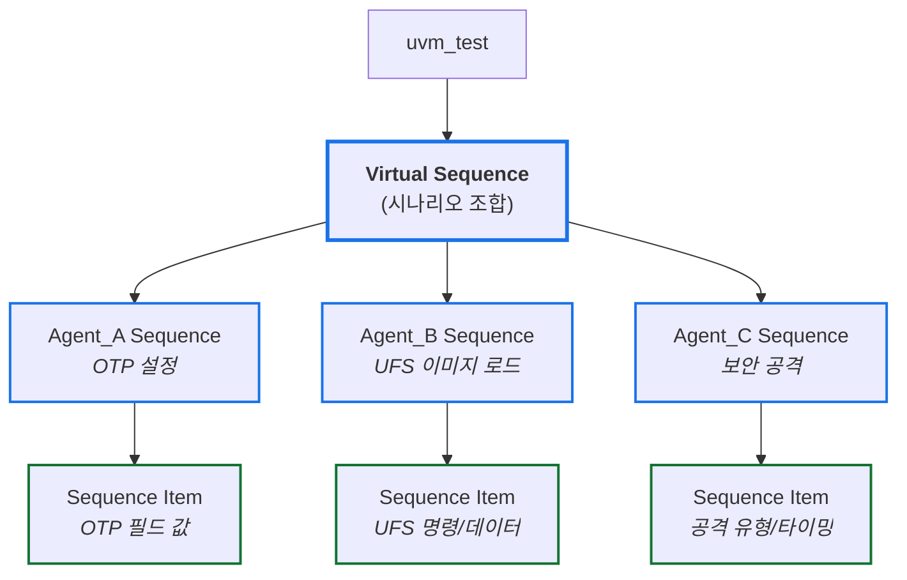
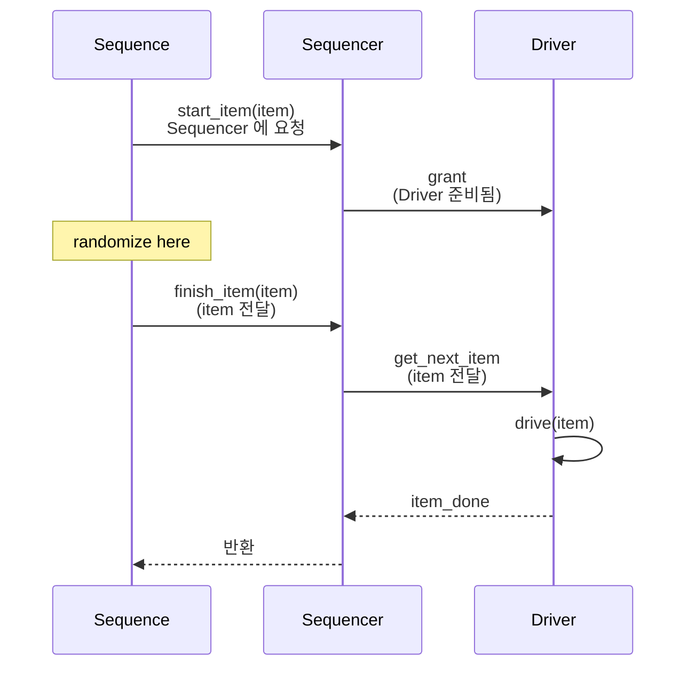
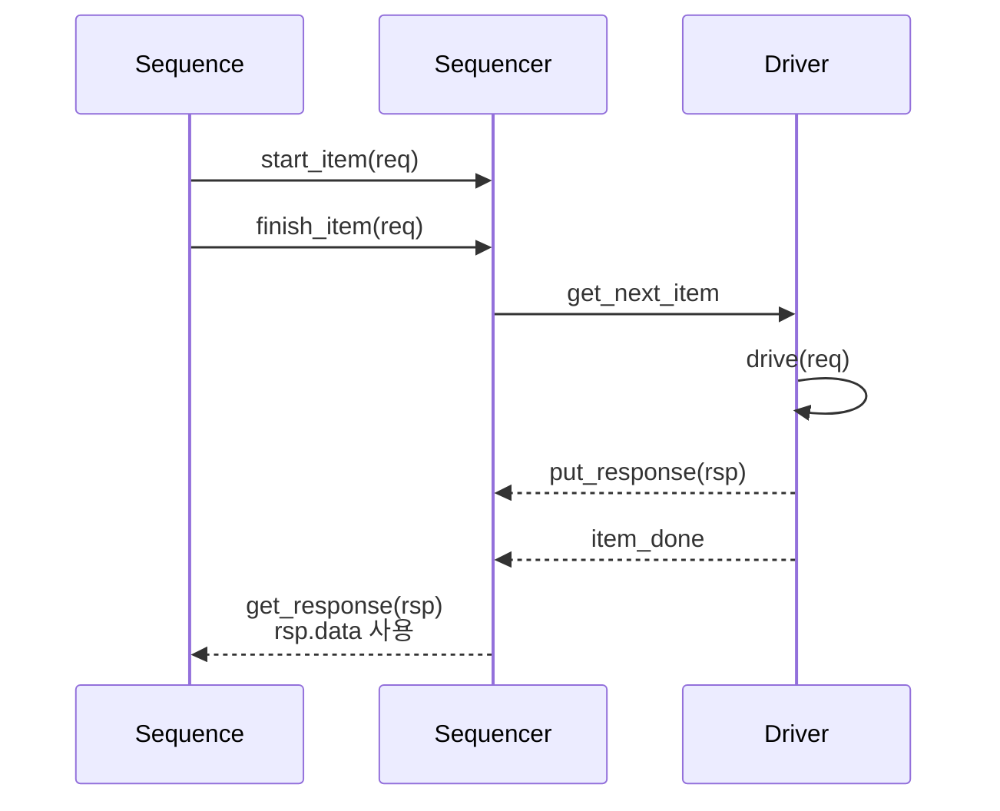

# Module 03 — Sequence & Sequence Item

<!-- DV-SKOOL-CH-CTX:start -->
<div class="chapter-context" data-cat="core">
  <a class="chapter-back" href="../">
    <span class="chapter-back-arrow">←</span>
    <span class="chapter-back-icon">🧪</span>
    <span class="chapter-back-text">UVM</span>
  </a>
  <span class="chapter-divider">›</span>
  <span class="chapter-marker">Module 03</span>
</div>
<!-- DV-SKOOL-CH-CTX:end -->

<!-- DV-SKOOL-CH-TOC:start -->
<div class="page-toc">
  <span class="page-toc-label">목차</span>
  <a class="page-toc-link" href="#1-why-care-자극의-품질이-검증-가치를-결정한다">1. Why care?</a>
  <a class="page-toc-link" href="#2-intuition-각본가-와-한-장-그림">2. Intuition</a>
  <a class="page-toc-link" href="#3-작은-예-write-then-read-한-쌍이-sequence-에서-driver-까지-가는-과정">3. 작은 예 — Write→Read 한 쌍의 흐름</a>
  <a class="page-toc-link" href="#4-일반화-sequence-item-sequence-virtual-sequence-의-3-계층">4. 일반화 — 3 계층 구조</a>
  <a class="page-toc-link" href="#5-디테일-do-메서드-p_sequencer-response-arbitration-grab-lock">5. 디테일</a>
  <a class="page-toc-link" href="#6-흔한-오해-와-dv-디버그-체크리스트">6. 흔한 오해 + DV 디버그 체크리스트</a>
  <a class="page-toc-link" href="#7-핵심-정리-key-takeaways">7. 핵심 정리</a>
</div>
<!-- DV-SKOOL-CH-TOC:end -->

!!! objective "학습 목표"
    이 모듈을 마치면:

    - **Define** `rand` 필드와 constraint 를 갖춘 Sequence Item 클래스를 설계할 수 있다.
    - **Implement** `body()` 안에서 `uvm_do_with` / `start_item` + `finish_item` 두 패턴을 구분해 작성할 수 있다.
    - **Compose** 여러 Agent 의 Sequence 를 조율하는 Virtual Sequence 를 `p_sequencer` 로 작성할 수 있다.
    - **Decide** Sequence Library / Layered Sequence / In-line constraint 중 시나리오에 맞는 패턴을 고를 수 있다.
    - **Trace** 하나의 transaction 이 sequence body → start_item → randomize → finish_item → sequencer → driver 로 흐르는 경로를 단계별로 추적할 수 있다.

!!! info "사전 지식"
    - [Module 01](01_architecture_and_phase.md), [Module 02](02_agent_driver_monitor.md)
    - SystemVerilog `randomize()` + constraint, in-line constraint 문법

---

## 1. Why care? — 자극의 품질이 검증 가치를 결정한다

### 1.1 시나리오 — _100 시나리오_ 가 _10 줄_ 로

당신은 SoC 검증. 시나리오:
- Test 1: AXI write 후 CPU read.
- Test 2: AXI write + DMA + CPU read.
- Test 3: AXI write + concurrent reset.
- ... × 100.

**Naive (sequence 없이)**: 각 test 가 _개별 SV file_, 500 줄씩 = **50000 줄 코드**.

**UVM sequences**:
- _Base sequence_: `axi_write_seq`, `axi_read_seq`, `dma_seq`, `reset_seq` (각 100 줄).
- _Virtual sequence_: 위 base 들을 _조합_ 으로 시나리오 구성. **각 test 1-2 줄**.

```
class test_3 extends base_vseq;
  task body();
    fork
      axi_write_seq::type_id::create().start(env.axi_sqr);
      reset_seq::type_id::create().start(env.reset_sqr);
    join
  endtask
endclass
```

총 코드: ~1000 줄 (base) + 100 × 5 줄 (combinations) = **1500 줄** vs naive 50000 줄.

**Sequence 의 핵심 가치**: _조합 가능성_. 시나리오 폭증 시 _코드 폭증 안 함_.

검증 가치의 절반은 **자극의 다양성과 의도성** 에서 나옵니다. Sequence 가 부실하면 coverage 가 안 메워지고 (curated 가 아니라 우연이 채움), 너무 hard-coded 면 재사용이 안 됩니다 (시나리오 1 개당 sequence 1 개의 폭발).

이 모듈을 건너뛰면 이후 모든 검증이 _directed test 의 무한 증식_ 으로 흐릅니다. 반대로 sequence / item / virtual sequence 의 3 계층을 정확히 잡으면, _시나리오 = sequence 조합_ 으로 표현되어 새 시나리오 1 개를 추가할 때 코드가 1~2 줄 늘어나는 환경이 됩니다. Virtual Sequence 는 SoC-level 시나리오의 핵심 — 여러 Agent 를 시간 / 순서로 조율해야 의미 있는 시스템 검증이 됩니다.

---

## 2. Intuition — 각본가, 와 한 장 그림

!!! tip "💡 한 줄 비유"
    **Sequence ↔ Sequence Item** ≈ **각본가 (Sequence) ↔ 대사 한 줄 (Item)**.<br>
    각본가는 어떤 대사를 어떤 순서로 던질지 _계획_ 하고, item 은 _실제로 던지는 한 줄_. 같은 대사도 누가 어떤 흐름에서 던지느냐에 따라 의미가 달라집니다. **Virtual Sequence** = 여러 무대 (Agent) 를 한꺼번에 지휘하는 _연출가_.

### 한 장 그림 — Sequence 3 계층의 데이터 흐름

```d2
direction: down

TEST: "uvm_test\nstart vseq"
VSEQ: "**Virtual Sequence**\n연출가" { style.stroke: "#1a73e8"; style.stroke-width: 3 }
SEQA: "agentA Sequence\n(각본가)" { style.stroke: "#1a73e8"; style.stroke-width: 2 }
SEQB: "agentB Sequence\n(각본가)" { style.stroke: "#1a73e8"; style.stroke-width: 2 }
ITA: "Item\n(대사 한 줄)\nrand + constraint" { style.stroke: "#137333"; style.stroke-width: 2 }
ITB: "Item\n(대사 한 줄)\nrand + constraint" { style.stroke: "#137333"; style.stroke-width: 2 }
SQRA: sequencerA { style.stroke: "#5f6368"; style.stroke-width: 2 }
SQRB: sequencerB { style.stroke: "#5f6368"; style.stroke-width: 2 }
DRVA: driverA { style.stroke: "#5f6368"; style.stroke-width: 2 }
DRVB: driverB { style.stroke: "#5f6368"; style.stroke-width: 2 }
DUT: DUT

TEST -> VSEQ
VSEQ -> SEQA
VSEQ -> SEQB
SEQA -> ITA: "body()"
SEQB -> ITB: "body()"
ITA -> SQRA: "start_item / finish_item"
ITB -> SQRB: "start_item / finish_item"
SQRA -> DRVA
SQRB -> DRVB
DRVA -> DUT
DRVB -> DUT
```

### 왜 이 디자인인가 — Design rationale

세 가지 요구의 교집합:

1. **데이터 (transaction) 와 시나리오 (시퀀스 로직) 가 분리되어야** → `uvm_sequence_item` (데이터) + `uvm_sequence` (시나리오) 의 두 클래스.
2. **시나리오는 _재사용_ 가능해야** → Sequence 가 driver 의 _내부_ 를 모르고도 동작 (sequencer 가 중개).
3. **여러 agent 를 한꺼번에 동기화해야 의미 있는 시스템 시나리오** → Virtual Sequence 가 sub-sequencer 핸들 보유, sub-sequence 를 순서대로 / 동시에 start.

이 세 요구가 곧 **3 계층 (item / sequence / virtual sequence) + Sequencer-Driver 분리 + p_sequencer** 의 디자인 결정.

---

## 3. 작은 예 — Write-then-Read 한 쌍이 sequence 에서 driver 까지 가는 과정

가장 단순한 시나리오. Sequence 가 같은 주소에 Write → 같은 주소에서 Read (write→read 페어) 를 만들고, 두 transaction 이 driver 까지 어떻게 흘러가는지.

### 단계별 다이어그램

```mermaid
sequenceDiagram
    autonumber
    participant SEQ as write_read_seq.body
    participant SQR as Sequencer
    participant DRV as Driver
    participant DUT as DUT

    Note over SEQ: Write 단계
    SEQ->>SEQ: ① wr_item = type_id::create("wr_item")
    SEQ->>SQR: ② start_item(wr_item)
    SQR-->>SEQ: grant
    SEQ->>SEQ: ③ wr_item.randomize() with<br/>{ wr_rd==1; addr==X; data==D }
    SEQ->>SQR: ④ finish_item(wr_item)
    SQR->>DRV: forward
    DRV->>DUT: vif.valid<=1<br/>vif.data<=D<br/>vif.addr<=X<br/>(write 인가)

    Note over SEQ: Read 단계
    SEQ->>SEQ: ⑤ rd_item = type_id::create("rd_item")
    SEQ->>SQR: ⑥ start_item(rd_item)
    SEQ->>SEQ: ⑦ rd_item.randomize() with<br/>{ wr_rd==0; addr==X }
    SEQ->>SQR: ⑧ finish_item(rd_item)
    SQR->>DRV: forward
    DRV->>DUT: read 인가 → DUT 응답 받기
```

### 단계별 의미

| Step | 누가 | 무엇을 | 왜 |
|---|---|---|---|
| ① | sequence body | `wr_item = axi_item::type_id::create("wr_item")` | factory 로 item 생성 — override 가능 |
| ② | sequence body | `start_item(wr_item)` | sequencer 에 "이 item 을 driver 에 보내달라" 요청 |
| ③ | sequence body | `wr_item.randomize() with { wr_rd==1; addr==X; data==D; }` | start 와 finish 사이가 randomize 의 표준 위치 |
| ④ | sequence body | `finish_item(wr_item)` — sequencer 가 forward, driver 가 get_next_item 으로 받음 | Module 02 의 driver flow 시작 |
| ⑤ | sequence body | `rd_item = axi_item::type_id::create("rd_item")` | 두 번째 item 생성 |
| ⑥ | sequence body | `start_item(rd_item)` | 다시 sequencer arbitration |
| ⑦ | sequence body | `rd_item.randomize() with { wr_rd==0; addr==X; }` | 같은 주소에서 read |
| ⑧ | sequence body | `finish_item(rd_item)` | driver 가 read transaction 인가 → 응답은 다음 절 (5.3 Response 핸들링) |

### 실제 코드

```systemverilog
class write_read_seq extends uvm_sequence #(axi_item);
  `uvm_object_utils(write_read_seq)
  function new(string name = "write_read_seq"); super.new(name); endfunction

  task body();
    axi_item wr_item, rd_item;

    // Write
    wr_item = axi_item::type_id::create("wr_item");
    start_item(wr_item);
    assert(wr_item.randomize() with {
      wr_rd == 1;
      addr  == 32'h0000_1000;
    });
    finish_item(wr_item);

    // Read back (같은 주소)
    rd_item = axi_item::type_id::create("rd_item");
    start_item(rd_item);
    assert(rd_item.randomize() with {
      wr_rd == 0;
      addr  == 32'h0000_1000;
    });
    finish_item(rd_item);
  endtask
endclass
```

!!! note "여기서 잡아야 할 두 가지"
    **(1) `start_item` + randomize + `finish_item` 은 _세 단계 모두_ 필요하다.** 한 단계라도 빠지면 sequencer arbitration 을 거치지 않거나 (start 누락), driver 로 forward 안 됨 (finish 누락), 또는 random data 가 아닌 default 값으로 인가 (randomize 누락). `uvm_do_with` 매크로는 이 셋을 한꺼번에 감춤.<br>
    **(2) sequence 는 _driver 의 내부를 모른다_.** `wr_item` 이 어떤 핀으로 어떻게 인가되는지는 driver 의 책임. 이 분리 덕분에 sequence 는 다른 driver 에 재사용 가능.

---

## 4. 일반화 — Sequence Item / Sequence / Virtual Sequence 의 3 계층

### 4.1 Sequence Item — 트랜잭션 데이터

```systemverilog
class axi_item extends uvm_sequence_item;
  `uvm_object_utils(axi_item)

  // 필드: 랜덤화 대상
  rand bit [31:0] addr;
  rand bit [31:0] data;
  rand bit        wr_rd;     // 1=Write, 0=Read
  rand int        burst_len; // 1~256

  // 제약: 유효한 조합만 생성
  constraint c_addr   { addr[1:0] == 2'b00; }        // 4-byte aligned
  constraint c_burst  { burst_len inside {[1:16]}; }  // 최대 16-beat
  constraint c_addr_range { addr < 32'h1000_0000; }   // 유효 주소 범위

  function new(string name = "axi_item");
    super.new(name);
  endfunction
endclass
```

### 4.2 Sequence — 시나리오 로직

```systemverilog
class write_read_seq extends uvm_sequence #(axi_item);
  `uvm_object_utils(write_read_seq)

  task body();
    axi_item wr_item, rd_item;
    // 위 §3 코드와 동일
  endtask
endclass
```

### 4.3 Virtual Sequence — 멀티 Agent 시나리오



**장점**:

- 개별 Sequence 재사용 가능
- Virtual Sequence 에서 조합만 변경하여 새 시나리오 생성
- Test 에서는 어떤 VSeq 를 사용할지만 선택

### 4.4 start_item / finish_item 흐름



---

## 5. 디테일 — do 메서드 / p_sequencer / Response / Arbitration / grab-lock

### 5.1 Sequence Item Automation — do 메서드

```systemverilog
class axi_item extends uvm_sequence_item;
  `uvm_object_utils(axi_item)

  rand bit [31:0] addr;
  rand bit [31:0] data;
  rand bit        wr_rd;
  rand int        burst_len;

  // --- do_copy: 깊은 복사 ---
  function void do_copy(uvm_object rhs);
    axi_item rhs_;
    super.do_copy(rhs);
    $cast(rhs_, rhs);
    this.addr      = rhs_.addr;
    this.data      = rhs_.data;
    this.wr_rd     = rhs_.wr_rd;
    this.burst_len = rhs_.burst_len;
  endfunction

  // --- do_compare: 필드별 비교 (Scoreboard 에서 사용) ---
  function bit do_compare(uvm_object rhs, uvm_comparer comparer);
    axi_item rhs_;
    bit result;
    result = super.do_compare(rhs, comparer);
    $cast(rhs_, rhs);
    result &= (this.addr      == rhs_.addr);
    result &= (this.data      == rhs_.data);
    result &= (this.wr_rd     == rhs_.wr_rd);
    result &= (this.burst_len == rhs_.burst_len);
    return result;
  endfunction

  // --- do_print: 로그 출력 형식 정의 ---
  function void do_print(uvm_printer printer);
    super.do_print(printer);
    printer.print_field_int("addr",      addr,      32, UVM_HEX);
    printer.print_field_int("data",      data,      32, UVM_HEX);
    printer.print_field_int("wr_rd",     wr_rd,     1,  UVM_BIN);
    printer.print_field_int("burst_len", burst_len, 32, UVM_DEC);
  endfunction

  // --- convert2string: 간결한 문자열 표현 ---
  function string convert2string();
    return $sformatf("%s addr=0x%08h data=0x%08h burst=%0d",
                     wr_rd ? "WR" : "RD", addr, data, burst_len);
  endfunction
endclass
```

#### do 메서드 vs Field Automation 매크로

```
방법 1: `uvm_field_* 매크로 (편리하지만 비추천)
  `uvm_object_utils_begin(axi_item)
    `uvm_field_int(addr, UVM_ALL_ON)
    `uvm_field_int(data, UVM_ALL_ON)
  `uvm_object_utils_end
  → 단점: 시뮬레이션 속도 저하 (10~30%), 디버그 어려움
  → Synopsys / Cadence 모두 do 메서드 직접 구현을 권장

방법 2: do 메서드 직접 구현 (권장)
  do_copy, do_compare, do_print, convert2string
  → 장점: 성능 최적, 비교 로직 커스터마이즈 가능
  → 예: 특정 필드를 비교에서 제외, 조건부 출력 등

실무 규칙:
  - 새 필드 추가 시 4개 메서드 모두 업데이트 (누락 → 비교 오류)
  - convert2string 은 로그 가독성에 직접 영향 → 반드시 구현
  - do_compare 에서 comparer 활용하면 mismatch 상세 리포트 가능
```

#### Constraint 전략

| 전략 | 예시 | 용도 |
|------|------|------|
| 기본 제약 (Item) | `addr[1:0] == 0` | 항상 적용 (프로토콜 규칙) |
| Sequence 제약 | `item.addr == 32'h100` | 특정 시나리오 |
| Inline 제약 | `item.randomize() with { data > 0; }` | 호출 시점 오버라이드 |
| Disable 제약 | `item.c_burst.constraint_mode(0)` | 기존 제약 비활성화 |

### 5.2 Virtual Sequence — 코드 예

```systemverilog
class boot_vseq extends uvm_sequence;
  `uvm_object_utils(boot_vseq)

  // 여러 Agent 의 Sequencer 핸들
  uvm_sequencer #(otp_item)      otp_sqr;
  uvm_sequencer #(ufs_item)      ufs_sqr;
  uvm_sequencer #(security_item) sec_sqr;

  task body();
    // 1. OTP 설정: Secure Boot ON, UFS 부팅
    otp_config_seq otp_seq = otp_config_seq::type_id::create("otp_seq");
    otp_seq.start(otp_sqr);

    // 2. UFS 에 정상 이미지 로드
    ufs_load_seq ufs_seq = ufs_load_seq::type_id::create("ufs_seq");
    ufs_seq.start(ufs_sqr);

    // 3. 보안 공격: Fault Injection (선택)
    if (inject_fault) begin
      fi_attack_seq fi_seq = fi_attack_seq::type_id::create("fi_seq");
      fi_seq.start(sec_sqr);
    end
  endtask
endclass

// Test 에서 사용
class secure_boot_test extends uvm_test;
  task run_phase(uvm_phase phase);
    phase.raise_objection(this);
    boot_vseq vseq = boot_vseq::type_id::create("vseq");
    vseq.otp_sqr = env.otp_agent.sequencer;
    vseq.ufs_sqr = env.ufs_agent.sequencer;
    vseq.sec_sqr = env.sec_agent.sequencer;
    vseq.start(null);  // Virtual Sequencer 또는 null
    phase.drop_objection(this);
  endtask
endclass
```

### 5.3 p_sequencer — Sequencer 리소스 접근

```systemverilog
// 문제: body() 안에서 Sequencer 의 멤버에 접근하고 싶을 때
// m_sequencer 는 uvm_sequencer_base 타입 → 커스텀 멤버 접근 불가

// 해결: `uvm_declare_p_sequencer 로 타입 캐스팅 자동화
class my_seq extends uvm_sequence #(axi_item);
  `uvm_object_utils(my_seq)
  `uvm_declare_p_sequencer(my_sequencer)
  // → p_sequencer 멤버가 my_sequencer 타입으로 자동 선언

  task body();
    // p_sequencer 를 통해 Sequencer 의 커스텀 멤버에 접근
    if (p_sequencer.cfg.enable_error_injection) begin
      // 에러 주입 시나리오
    end

    // Sequencer 가 보유한 다른 정보 활용
    `uvm_info("SEQ", $sformatf("Running on %s", p_sequencer.get_full_name()), UVM_LOW)
  endtask
endclass

// 커스텀 Sequencer 예시
class my_sequencer extends uvm_sequencer #(axi_item);
  `uvm_component_utils(my_sequencer)

  my_agent_config cfg;  // Sequence 에서 접근할 설정

  function void build_phase(uvm_phase phase);
    super.build_phase(phase);
    if (!uvm_config_db #(my_agent_config)::get(this, "", "cfg", cfg))
      `uvm_fatal("CFG", "Agent config not found")
  endfunction
endclass
```

#### p_sequencer 사용 시 주의

| 주의사항 | 설명 |
|---------|------|
| 재사용성 저하 | 특정 Sequencer 타입에 의존 → 다른 Agent 에 재사용 어려움 |
| 대안: config_db | Sequence 에서 `uvm_config_db::get` 으로 설정을 직접 획득 |
| 사용 적합 시점 | Sequencer 고유 기능 필요 시 (arbitration 제어, 큐 상태 등) |
| 기본 원칙 | 단순 설정 전달 → config_db, Sequencer 제어 필요 → p_sequencer |

### 5.4 Response 핸들링 — Driver → Sequence 응답

```systemverilog
// 기본 흐름은 Sequence → Driver (단방향)
// Response 를 사용하면 Driver → Sequence (양방향) 가능

// --- Sequence 측: Response 수신 ---
class read_seq extends uvm_sequence #(axi_item);
  `uvm_object_utils(read_seq)

  task body();
    axi_item req, rsp;

    req = axi_item::type_id::create("req");
    start_item(req);
    assert(req.randomize() with { wr_rd == 0; });  // Read
    finish_item(req);

    // Driver 로부터 응답 수신 (Read 데이터)
    get_response(rsp);
    `uvm_info("SEQ", $sformatf("Read data: 0x%08h", rsp.data), UVM_LOW)
  endtask
endclass

// --- Driver 측: Response 송신 ---
class my_driver extends uvm_driver #(axi_item);
  task run_phase(uvm_phase phase);
    forever begin
      seq_item_port.get_next_item(req);

      // Pin-level 구동
      drive_item(req);

      // Read 인 경우 DUT 로부터 읽은 데이터를 Response 로 전달
      if (!req.wr_rd) begin
        axi_item rsp = axi_item::type_id::create("rsp");
        rsp.set_id_info(req);  // ★ 필수: req 의 ID 를 복사하여 매칭
        rsp.data = vif.rdata;
        seq_item_port.put_response(rsp);  // Sequence 로 응답
      end

      seq_item_port.item_done();
    end
  endtask
endclass
```

#### Response 흐름



!!! note "핵심"
    - `set_id_info(req)`: rsp 에 req 의 transaction_id / sequence_id 복사 → Sequencer 가 어떤 Sequence 의 응답인지 매칭
    - `get_response` 는 blocking — 응답이 올 때까지 대기
    - `item_done()` 과 `put_response()` 순서 주의 (put_response 먼저)

#### item_done(rsp) 단축 패턴

```systemverilog
// put_response + item_done 을 한 줄로:
task run_phase(uvm_phase phase);
  forever begin
    seq_item_port.get_next_item(req);
    drive_item(req);
    req.data = vif.rdata;        // req 자체에 응답 데이터 기록
    seq_item_port.item_done(req); // item_done 에 rsp 전달 = 한 번에 처리
  end
endtask

// Sequence 측에서는 동일하게 get_response(rsp) 사용
// 장점: 별도 rsp 객체 생성 불필요, 코드 간결
// 주의: req 객체를 재사용하므로 Sequence 측에서 즉시 복사해야 함
```

### 5.5 Sequencer Arbitration — 다중 Sequence 제어

```systemverilog
// 하나의 Sequencer 에 여러 Sequence 가 동시에 실행될 때 순서 결정
env.agent.sequencer.set_arbitration(UVM_SEQ_ARB_FIFO);
```

| 모드 | 동작 | 용도 |
|------|------|------|
| `UVM_SEQ_ARB_FIFO` | 요청 순서대로 (기본값) | 대부분의 경우 |
| `UVM_SEQ_ARB_WEIGHTED` | 우선순위 가중치 기반 | 트래픽 믹스 비율 제어 |
| `UVM_SEQ_ARB_RANDOM` | 랜덤 선택 | 랜덤 트래픽 패턴 |
| `UVM_SEQ_ARB_STRICT_FIFO` | 우선순위 → FIFO | 긴급 트랜잭션 우선 처리 |
| `UVM_SEQ_ARB_STRICT_RANDOM` | 우선순위 → 랜덤 | 우선순위 내 랜덤 |
| `UVM_SEQ_ARB_USER` | 사용자 정의 | 커스텀 스케줄링 |

### 5.6 grab / lock — Sequencer 독점

```systemverilog
// grab: 즉시 독점 (현재 진행 중인 item 이후부터)
class critical_seq extends uvm_sequence #(axi_item);
  task body();
    // Sequencer 를 독점 — 다른 Sequence 는 대기
    grab();

    // 이 구간에서는 이 Sequence 의 item 만 Driver 로 전달
    repeat (10) begin
      axi_item item = axi_item::type_id::create("item");
      start_item(item);
      assert(item.randomize());
      finish_item(item);
    end

    // 독점 해제
    ungrab();
  endtask
endclass

// lock: grab 과 유사하지만 우선순위가 낮음
// → 현재 큐에 있는 모든 pending 요청이 처리된 후 독점
// grab: 즉시 독점 (더 공격적)
// lock: 대기 후 독점 (더 안전)
```

#### grab vs lock 비교

```
시나리오: Seq_A, Seq_B 가 동시 실행 중, Seq_C 가 독점 요청

grab():
  Seq_A: item3 대기중 → ★ 즉시 중단
  Seq_B: item2 대기중 → ★ 즉시 중단
  Seq_C: grab() → 바로 독점 시작
  → 용도: Reset Sequence, Error Recovery 등 긴급 상황

lock():
  Seq_A: item3 대기중 → 처리 완료까지 대기
  Seq_B: item2 대기중 → 처리 완료까지 대기
  Seq_C: lock() → pending 모두 처리 후 독점
  → 용도: Atomic 트랜잭션 (연속 burst 등)
```

### 5.7 Sequence Library 패턴

```systemverilog
// 기본 시퀀스들을 라이브러리로 관리
// seq_lib/axi_base_seq.sv          — 공통 베이스
// seq_lib/axi_write_seq.sv         — 단순 Write
// seq_lib/axi_read_seq.sv          — 단순 Read
// seq_lib/axi_burst_seq.sv         — Burst 전송
// seq_lib/axi_error_seq.sv         — 에러 주입
// vseq_lib/boot_normal_vseq.sv     — 정상 부팅
// vseq_lib/boot_attack_vseq.sv     — 공격 시나리오

// 패키지:
// my_seq_lib_pkg.sv
package my_seq_lib_pkg;
  `include "axi_base_seq.sv"
  `include "axi_write_seq.sv"
  // ...
endpackage
```

---

## 6. 흔한 오해 와 DV 디버그 체크리스트

### 흔한 오해

!!! danger "❓ 오해 1 — '`finish_item` 만 호출하면 충분하다'"
    **실제**: `start_item` + `randomize` + `finish_item` 의 **3 단계가 모두 필요**. start_item 없이 finish_item 호출하면 sequencer arbitration 을 거치지 않아 race / hang. randomize 누락 시 default 값 (0) 으로 인가 → 자극 다양성 0.<br>
    **왜 헷갈리는가**: convenience 매크로 (`uvm_do`) 가 이 셋을 한꺼번에 감춰주기 때문에 직접 작성할 때 한 단계를 빼먹기 쉽다.

!!! danger "❓ 오해 2 — 'randomize() 만 호출하면 자극이 자동 인가된다'"
    **실제**: `randomize()` 는 단지 _필드를 채우는_ 행위입니다. Sequencer 큐에 들어가려면 `start_item` + `finish_item` 으로 반드시 forward 해야 합니다. randomize 만 하고 다음 줄로 넘어가면 시뮬은 _아무 자극 없이_ 종료. coverage 0, 에러 없음.<br>
    **왜 헷갈리는가**: 함수 이름이 _randomize_ 라 그것 자체가 "랜덤 자극 인가" 같은 인상을 줘서.

!!! danger "❓ 오해 3 — 'set_id_info 는 single-sequence 환경에서 안 써도 된다'"
    **실제**: 단일 sequence 환경에서는 우연히 동작합니다 — sequence_id 의 default 값이 매칭되기 때문. 그러나 멀티 sequence 환경 (Virtual Sequence 안의 sub-sequence 들 또는 grab/lock 시나리오) 에서 즉시 깨지는 잠재 버그입니다. **기본 습관으로 항상 호출**.<br>
    **왜 헷갈리는가**: 단순 시나리오에서 잘 돌아가는 코드가 시스템 시나리오로 옮길 때 갑자기 깨져서.

!!! danger "❓ 오해 4 — 'grab 이 lock 보다 더 강력해서 안전하다'"
    **실제**: grab 은 _즉시 중단_ 이라 다른 sequence 의 한 transaction 이 _중간에 잘릴_ 수 있습니다. AXI 의 burst 가운데 grab 이 끼어들면 protocol violation. lock 은 pending 처리 후 독점이므로 더 안전. 일반적으로 lock 사용, reset / error recovery 같은 긴급 상황에만 grab.<br>
    **왜 헷갈리는가**: "더 즉시 = 더 통제력" 이라는 직관 때문에.

!!! danger "❓ 오해 5 — 'uvm_field_* 매크로가 있는데 굳이 do 메서드를 직접 구현하나'"
    **실제**: `uvm_field_*` 매크로는 reflection 기반이라 시뮬 속도가 **10~30% 저하**. 수십만 transaction 의 검증에서 무시 못 할 오버헤드. 또한 do_compare 에서 특정 필드만 비교하거나 조건부 출력 등 커스터마이즈 불가. 실무 표준은 do_copy / do_compare / do_print / convert2string 의 4 개를 직접 구현.<br>
    **왜 헷갈리는가**: 매크로가 _짧고 편해 보여서_ — 그러나 cost 가 숨어 있음.

### DV 디버그 체크리스트 (이 모듈 내용으로 마주칠 첫 실패들)

| 증상 | 1차 의심 | 어디 보나 |
|---|---|---|
| 시뮬은 정상 종료, coverage 0 | sequence body 가 randomize 만 하고 finish_item 누락 | sequence body 의 모든 transaction 에 start/finish 가 짝지어 있는지 |
| `Randomization failed` UVM_ERROR | constraint 충돌 (item-level 과 inline 이 모순) | item 의 base constraint + inline `with { ... }` 비교 |
| Read 응답이 sequence 에 안 옴 | Driver 의 `put_response(rsp)` 누락 또는 `set_id_info(req)` 누락 | Driver 의 read 분기 코드 |
| Multi-sequence 환경에서 응답이 다른 sequence 로 감 | `set_id_info` 누락 (sequence_id 가 default) | `grep set_id_info driver/*.sv` |
| Virtual Sequence 가 sub-sequencer 에 start 못 함 | `vseq.sub_sqr` 핸들 대입 누락 | Test 의 `vseq.start(null)` 직전 sub_sqr 핸들 set 줄 |
| `p_sequencer.member` null deref | sequencer 의 build 에서 `cfg` get 실패 (config_db 누락) | sequencer.build_phase 의 `uvm_config_db::get` 결과 |
| grab 한 sequence 가 끝나도 sequencer 가 안 풀림 | `ungrab()` 또는 `unlock()` 누락 | grab/lock 호출과 짝지어진 ungrab/unlock 있는지 |
| `do_compare` 가 항상 mismatch | item 에 새 필드 추가 후 do_compare 업데이트 누락 | item 의 4 개 do_* 메서드 모두 새 필드 반영 여부 |

---

## 7. 핵심 정리 (Key Takeaways)

- **3 계층**: Sequence Item (데이터+constraint) / Sequence (시나리오 로직) / Virtual Sequence (멀티 agent 조율). 둘은 다른 클래스 계층 (`uvm_sequence_item` vs `uvm_sequence`).
- **`uvm_do_with` 짧음 / `start_item + randomize + finish_item` 세밀**. 데이터 후처리 필요하면 후자, 단순 random 은 전자.
- **Virtual Sequence** 는 multi-agent 동기화의 표준. `p_sequencer` 로 sub-sequencer 핸들 접근, 또는 직접 sub_sqr 멤버 대입.
- **Sequence Library 패턴** 으로 시나리오 재사용. Constraint 는 sequence 내부에 두지 말고 sequence item 이나 별도 bag (config) 에.
- **Response 핸들링**: `set_id_info(req)` 는 _기본 습관_ 으로 — multi-sequence 환경에서 silent 깨짐 방지.
- **Sequencer Arbitration**: 다중 sequence 동시 실행 시 정책으로 트래픽 믹스 / 우선순위 제어. grab 은 긴급 상황만, 일반 atomic 은 lock.

!!! warning "실무 주의점"
    - `start_item` / `finish_item` 을 빼먹은 채 `randomize()` 만 호출하는 패턴 — 시뮬 PASS 인데 coverage 0 인 _가장 조용한_ 버그.
    - `do_compare` / `do_print` 는 새 필드 추가 시 _즉시_ 함께 업데이트.
    - Virtual Sequence 의 sub-sequencer 핸들 대입은 Test 의 `start` 직전. 누락 시 sub_sqr null deref.

### 7.1 자가 점검

!!! question "🤔 Q1 — Sequence vs Item (Bloom: Analyze)"
    Sequence 와 Sequence Item 의 _경계_ 를 한 줄로 정의하라.
    ??? success "정답"
        **Item = "무엇을" (data), Sequence = "어떻게/언제" (scenario/control)**.
        - Item: `addr`, `data`, `len` 같은 _필드_ + `do_copy/do_compare/do_print`. Time-less.
        - Sequence: `start_item` / `finish_item` 호출 _순서_, 분기, 조건부 randomize, sub-sequence 호출. Time-aware (가능).
        - 안티패턴: Item 안에 `#10ns` 또는 분기 로직 → unrandomizable + 재사용 불가.
        - 디버깅 단서: Item 에 task 가 있으면 잘못된 분류.

!!! question "🤔 Q2 — Virtual Sequence 의 가치 (Bloom: Evaluate)"
    Single agent 면 그냥 sequence 면 충분. _Virtual_ Sequence 가 필요한 시점?
    ??? success "정답"
        Multi-agent 조율:
        - **시나리오**: AXI agent + IRQ agent + memory agent 의 _합동_ 시퀀스. AXI write 후 IRQ trigger, memory check.
        - Virtual sequence 는 _sequencer 없는_ 상위 컨트롤러 — sub-sequencer 핸들을 들고 각각에 `start` 호출.
        - 대안 (단일 sequence): 3 agent 의 sequencer 를 매번 직접 접근 → 결합 강해짐, 재사용 불가.
        - **trade-off**: virtual seq 1 개 = test 의 _scenario layer_ , 분리되어야 test 가 깔끔.

### 7.2 출처

**Internal (Confluence)**
- `Sequence Library Conventions` — Item/Sequence 경계 가이드
- `Virtual Sequence Patterns` — multi-agent 조율 사례

**External**
- *UVM 1.2 User's Guide* §8 (Stimulus Generation) — Accellera
- *UVM Cookbook* (Mentor) — Virtual Sequence Patterns

---

## 다음 모듈

→ [Module 04 — config_db & Factory](04_config_db_factory.md): 이 챕터에서 type_id::create 로 만든 모든 객체가 _런타임에 다른 타입으로 대체_ 가능한 메커니즘, 그리고 sequence/agent 가 _설정_ 을 받는 표준 채널.

[퀴즈 풀어보기 →](quiz/03_sequence_and_item_quiz.md)


--8<-- "abbreviations.md"
