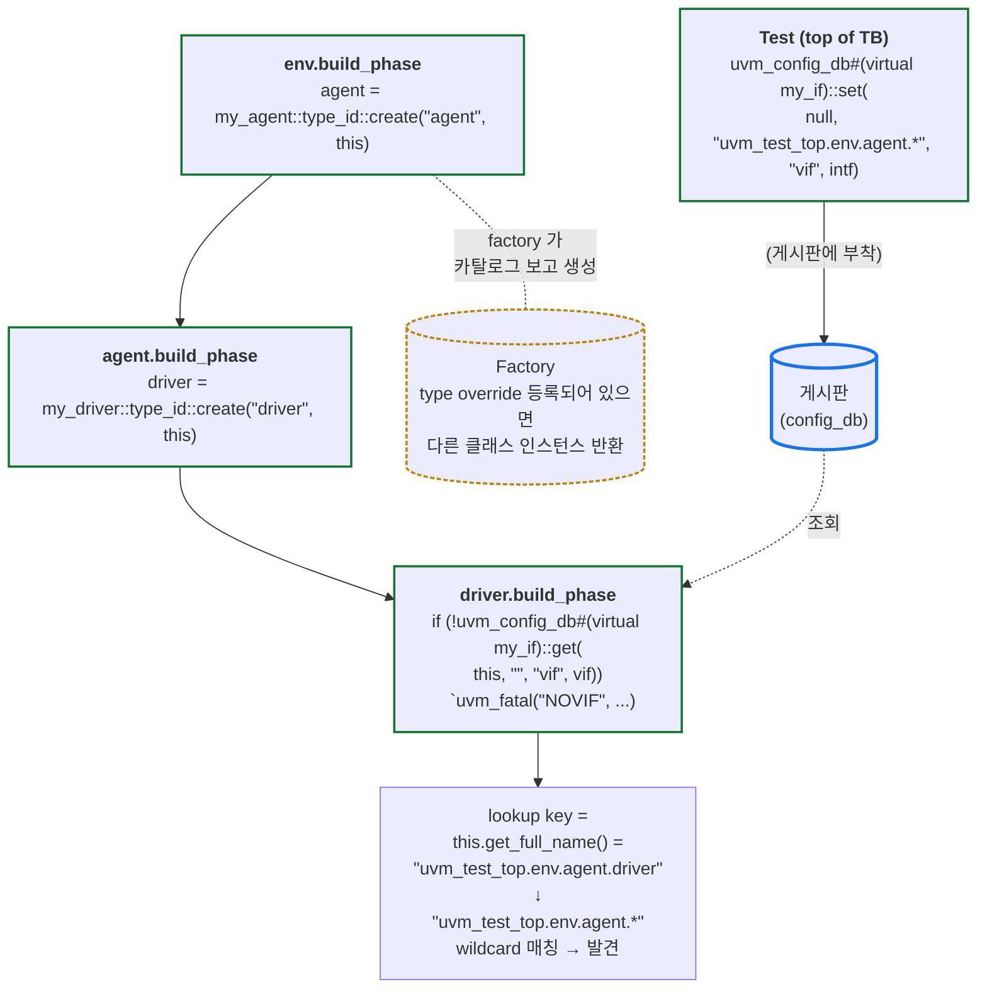
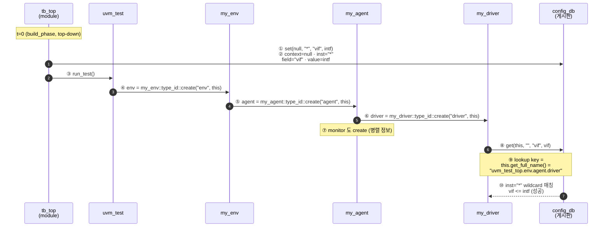

# Module 04 — config_db & Factory

<!-- DV-SKOOL-CH-CTX:start -->
<div class="chapter-context" data-cat="core">
  <a class="chapter-back" href="../">
    <span class="chapter-back-arrow">←</span>
    <span class="chapter-back-icon">🧪</span>
    <span class="chapter-back-text">UVM</span>
  </a>
  <span class="chapter-divider">›</span>
  <span class="chapter-marker">Module 04</span>
</div>
<!-- DV-SKOOL-CH-CTX:end -->

<!-- DV-SKOOL-CH-TOC:start -->
<div class="page-toc">
  <span class="page-toc-label">목차</span>
  <a class="page-toc-link" href="#1-why-care-config_db-factory-가-uvm-유연성의-핵심인-이유">1. Why care?</a>
  <a class="page-toc-link" href="#2-intuition-게시판-과-한-장-그림">2. Intuition</a>
  <a class="page-toc-link" href="#3-작은-예-vif-가-top-에서-driver-까지-config_db-로-전달되는-과정">3. 작은 예 — vif 의 set→get 한 사이클</a>
  <a class="page-toc-link" href="#4-일반화-config_db-경로-매칭-과-factory-override-의-2-스코프">4. 일반화 — 경로 매칭 + override 스코프</a>
  <a class="page-toc-link" href="#5-디테일-config-object-패턴-override-디버그-otp-사례">5. 디테일</a>
  <a class="page-toc-link" href="#6-흔한-오해-와-dv-디버그-체크리스트">6. 흔한 오해 + DV 디버그 체크리스트</a>
  <a class="page-toc-link" href="#7-핵심-정리-key-takeaways">7. 핵심 정리</a>
</div>
<!-- DV-SKOOL-CH-TOC:end -->

!!! objective "학습 목표"
    이 모듈을 마치면:

    - **Apply** `config_db::set` / `get` 을 사용해 virtual interface 와 configuration object 를 계층으로 전달할 수 있다.
    - **Use** Factory 의 `type_id::create` 와 type / instance override 로 테스트별 동작 변형을 구현할 수 있다.
    - **Debug** `uvm_config_db::dump` 와 `factory.print()` 로 경로 불일치 / 누락 override 를 분석할 수 있다.
    - **Decide** type override vs instance override 중 적절한 범위 (scope) 를 선택할 수 있다.
    - **Trace** 한 vif 핸들이 top.set → env.set → agent.set → driver.get 으로 흘러가는 경로 일치 / 불일치를 구분할 수 있다.

!!! info "사전 지식"
    - [Module 01](01_architecture_and_phase.md), [Module 02](02_agent_driver_monitor.md), [Module 03](03_sequence_and_item.md)
    - hierarchical naming (`uvm_test_top.env.agent.*`) 이해

---

## 1. Why care? — config_db / Factory 가 UVM 유연성의 핵심인 이유

### 1.1 시나리오 — _Project A 에서 B_ 로 _3 일_ 안에

당신은 AXI verification 환경을 _1 년_ 작성. Project B 시작 — 같은 AXI 인터페이스, 다른 _data width / burst length / address width_.

**Naive 포팅**: 모든 component 의 _hardcoded 값_ 추적 → 변경 → bug fix → 검증. **수 주**.

**UVM config_db + factory**:
- Width / burst / address 는 _config object_ 의 field → Project B 의 test 에서 _config 인스턴스_ 만 다르게.
- 다른 _구현 변형_ (예: AXI4 vs AXI5 driver) → factory override 1 줄.
- **3-5 일** 안에 포팅 완료.

**비교**:

| 작업 | Naive | config_db + factory |
|------|-------|---------------------|
| 포팅 시간 | 수 주 | 3-5 일 |
| 코드 수정 | 모든 component | _test 의 config 만_ |
| 디버그 | 수십 곳 race | 단일 config 추적 |

UVM 환경의 **유연성과 재사용성은 모두 config_db + Factory 에서 나옵니다**. 한 환경을 다른 프로젝트에 _3-5 일 안에_ 포팅하는 비결은 다음 둘:

1. _설정 차이_ 를 config_db 의 Config Object 1 개로 흡수 (`my_agent_config` 의 필드만 바꿈).
2. _구현 차이_ 를 Factory override 1 줄로 흡수 (`set_type_override_by_type(...)`).

동시에 두 메커니즘은 **가장 silent 한 실패 원천**: 경로 한 글자 차이로 set 한 값이 get 에 안 잡혀도 시뮬은 default 로 동작합니다. **silent failure → cascading bug** 의 전형적 패턴 — 그래서 모든 get 을 `if (!get(...)) uvm_fatal(...)` 으로 감싸는 습관이 표준입니다.

---

## 2. Intuition — 게시판, 과 한 장 그림

!!! tip "💡 한 줄 비유"
    **config_db** ≈ **사내 게시판 (Bulletin Board)**.<br>
    **set** 은 게시판에 _"이 경로에 이 값을 붙여 둠"_, **get** 은 _"내 자리에서 가장 가까운 게시물 찾기"_. 경로 wildcard 가 매칭되면 첫 매칭이 적용. 게시물 종이 색깔 (타입) 이 다르면 못 찾고, 게시판 이름 (field name) 이 다르면 못 찾습니다.

    **Factory** ≈ **부품 카탈로그**. 카탈로그에서 _"my_driver"_ 를 주문 (`type_id::create`) 하면 보통 my_driver 가 옴. Override 등록되어 있으면 _"my_driver 주문은 enhanced_driver 로 대체"_ 라는 redirect 가 있어서, 카탈로그 _주문 코드_ (`type_id::create`) 는 그대로 두고도 받는 부품을 바꿀 수 있음.

### 한 장 그림 — set / get 의 매칭 원리와 Factory override



### 왜 이 디자인인가 — Design rationale

세 가지 요구의 교집합:

1. **컴포넌트 트리의 _상위_ 가 _하위_ 에게 설정을 줘야** → set 의 시작 컨텍스트는 상위, get 의 시작 컨텍스트는 자기 자신. 경로는 상대 hierarchy.
2. **컴포넌트가 자기 자신의 위치를 _몰라도_ 동작해야** → wildcard (`*`) 로 한 set 이 여러 위치에 도달.
3. **타입 / 인스턴스 단위로 동작 변형이 가능해야** → Factory 의 type_override (전부) vs inst_override (특정 경로).

이 세 요구가 곧 **string-based hierarchical key + factory redirect table** 의 디자인 결정. 단점은 string-based 라 컴파일러가 검증을 못 해줌 — 한 글자 오타가 silent failure 로 빠지는 _대가_.

---

## 3. 작은 예 — vif 가 top 에서 driver 까지 config_db 로 전달되는 과정

가장 흔한 시나리오. Top module 에서 만든 `my_if intf` 핸들이 driver 의 `virtual my_if vif` 까지 도달하는 경로를 step-by-step 으로.

### 단계별 다이어그램



### 단계별 의미

| Step | 누가 | 무엇을 | 왜 |
|---|---|---|---|
| ① | tb_top 의 initial | `uvm_config_db#(virtual my_if)::set(null, "*", "vif", intf)` | 게시판에 "모든 컴포넌트 (`*`)" 의 "vif" 필드에 intf 부착 |
| ② | (parameter 의미) | context=null (글로벌), inst="*" (모든 경로 매칭), field="vif", value=intf | string + wildcard + type 의 3 차원 키 |
| ③ | tb_top | `run_test()` 호출 | UVM kernel 이 uvm_test_top 생성 + build_phase 시작 |
| ④ | test.build | `env = my_env::type_id::create("env", this)` | factory create — name="env", full_name="uvm_test_top.env" |
| ⑤ | env.build | `agent = my_agent::type_id::create("agent", this)` | full_name="uvm_test_top.env.agent" |
| ⑥ | agent.build | `driver = my_driver::type_id::create("driver", this)` | full_name="uvm_test_top.env.agent.driver" |
| ⑦ | agent.build | (Active 시) `monitor = ...` | (병렬 정보 — 같은 vif 받음) |
| ⑧ | driver.build | `uvm_config_db#(virtual my_if)::get(this, "", "vif", vif)` | get 의 inst="" → 자기 자신의 full_name 사용 |
| ⑨ | UVM kernel | get 의 lookup key = "uvm_test_top.env.agent.driver" | this.get_full_name() |
| ⑩ | UVM kernel | "*" wildcard 가 매칭 → vif 가 intf 로 채워짐 | get 반환 = 1 (성공) |

### 실제 코드 (전부 합쳐서)

```systemverilog
// top
module tb_top;
  logic clk, rst;
  my_if intf(clk, rst);
  my_dut dut(.clk(clk), .rst(rst), .valid(intf.valid), ...);

  initial begin
    // ① set: 게시판에 부착
    uvm_config_db #(virtual my_if)::set(null, "*", "vif", intf);
    run_test();
  end
endmodule

// driver (build_phase 시점)
class my_driver extends uvm_driver #(my_item);
  `uvm_component_utils(my_driver)
  virtual my_if vif;

  function void build_phase(uvm_phase phase);
    super.build_phase(phase);
    // ⑧ get: 게시판에서 찾음
    if (!uvm_config_db #(virtual my_if)::get(this, "", "vif", vif))
      `uvm_fatal("NOVIF", $sformatf("vif not found at %s", get_full_name()))
  endfunction
endclass
```

!!! note "여기서 잡아야 할 두 가지"
    **(1) get 은 _자기 자신의 full_name_ 으로 lookup 한다.** 따라서 set 의 inst 가 자기 full_name 과 매칭 (wildcard 포함) 되어야 발견. 이 매칭은 _string 비교_ — 한 글자 차이도 silent miss.<br>
    **(2) `if (!get(...)) uvm_fatal(...)` 패턴은 _선택이 아니라 의무_ 다.** get 이 0 (실패) 을 반환하면 vif 는 null 인 채로 다음 phase 로 넘어가고, run_phase 에서 vif null deref 로 stall — 그제야 fatal 이 뜨면 원인 추적이 어렵다. build_phase 에서 즉시 fatal.

---

## 4. 일반화 — config_db 경로 매칭 과 Factory override 의 2 스코프

### 4.1 set / get 의 4 인자

```
set(context, inst_name, field_name, value)
get(context, inst_name, field_name, variable)

  context:    this (현재 컴포넌트) 또는 null (글로벌)
  inst_name:  대상 계층 경로 ("env.agent.*" = 와일드카드)
  field_name: 필드 이름 (문자열)
  value/var:  전달할 값
```

### 4.2 경로 매칭 규칙

```
"env.agent.driver"  → 정확히 일치
"env.agent.*"       → agent 하위 모든 컴포넌트
"*"                 → 모든 컴포넌트
""                  → get 에서: 자기 자신의 경로
```

| set 측 inst | 의미 | 매칭되는 get 측 |
|---|---|---|
| `"*"` | 모든 컴포넌트 | 어디서 get 해도 hit |
| `"env.*"` | env 하위 전부 | env, env.agent, env.agent.driver, ... |
| `"env.agent"` | 정확히 env.agent | env.agent 의 build 에서 get(this, "", ...) |
| `"env.agent.driver"` | 정확히 그 driver | driver 의 build 에서 get(this, "", ...) |

### 4.3 Factory 의 두 종류 override

```systemverilog
// Type Override: 모든 my_driver 를 enhanced_driver 로 대체
set_type_override_by_type(my_driver::get_type(),
                          enhanced_driver::get_type());

// Instance Override: 특정 인스턴스만 대체
set_inst_override_by_type("env.agent.driver",
                          my_driver::get_type(),
                          enhanced_driver::get_type());
```

| | Type Override | Instance Override |
|---|---|---|
| 적용 범위 | _모든_ my_driver 인스턴스 | _특정 경로_ 의 my_driver 만 |
| 호출 위치 | base_test 의 build_phase | base_test 의 build_phase |
| 사용 예 | 정상 → 에러 주입 driver 로 환경 전체 교체 | env 의 cpu_agent 만 glitch driver 로 |

### 4.4 환경 동작을 바꾸는 두 축

```
설정 (config_db)        ↔        구현 (Factory override)
───────────────                  ──────────────────────
"timeout = 1000"                  "Driver 클래스 = enhanced"
"is_active = ACTIVE"              "Sequence 클래스 = stress"
"vif = intf"                      "Scoreboard 클래스 = perf"
숫자 / 핸들 / 객체로 변형          타입 자체로 변형
컴포넌트 _내부 동작_ 변형          컴포넌트 _자체_ 교체
```

이 두 축으로 _코드 수정 없이_ 시나리오 / DUT / 환경을 변형할 수 있는 것이 UVM 의 본질.

---

## 5. 디테일 — Config Object 패턴 / Override / 디버그 / OTP 사례

### 5.1 Config Object 패턴 — 흩어진 set/get 폭발 방지

```systemverilog
// 여러 설정을 하나의 객체로 묶기
class my_agent_config extends uvm_object;
  `uvm_object_utils(my_agent_config)

  virtual my_if       vif;
  uvm_active_passive_e is_active = UVM_ACTIVE;
  int                  num_transactions = 100;
  bit                  enable_coverage = 1;
  bit                  enable_checker = 1;
endclass

// Test 에서 한 번에 set
my_agent_config cfg = my_agent_config::type_id::create("cfg");
cfg.vif = my_vif;
cfg.num_transactions = 200;
uvm_config_db #(my_agent_config)::set(this, "env.agent", "cfg", cfg);

// Agent 에서 한 번에 get
my_agent_config cfg;
uvm_config_db #(my_agent_config)::get(this, "", "cfg", cfg);
```

**장점**: set/get 호출 수 감소, 관련 설정을 논리적으로 그룹화, 타입 안전성. 포팅 시 Config Object 의 필드만 바꾸면 환경 전체 동작 변형.

### 5.2 Factory Override 활용 패턴

| 패턴 | 예시 | 효과 |
|------|------|------|
| **Driver 교체** | 정상 Driver → 에러 주입 Driver | 코드 수정 없이 Negative 테스트 |
| **Sequence Item 교체** | base_item → constrained_item | 다른 트래픽 패턴 |
| **Scoreboard 교체** | func_scoreboard → perf_scoreboard | 성능 검증 모드 전환 |
| **Env 교체** | base_env → extended_env | 환경 확장 |

```systemverilog
// Test 에서 활용
class error_injection_test extends base_test;
  function void build_phase(uvm_phase phase);
    super.build_phase(phase);   // ★ super 호출 누락 시 base 의 env create 가 사라짐
    // 정상 Driver 를 에러 주입 Driver 로 교체
    set_type_override_by_type(
      my_driver::get_type(),
      error_inject_driver::get_type()
    );
  endfunction
endclass
```

### 5.3 config_db 경로 디버그 도구

```systemverilog
// 흔한 실수: 경로 불일치
// set: uvm_config_db #(int)::set(this, "env.agent", "count", 10);
// get: uvm_config_db #(int)::get(this, "", "cnt", val);  // "count" vs "cnt" 오타!

// 디버그 방법:

// 1. UVM_CONFIG_DB_TRACE
//    +UVM_CONFIG_DB_TRACE  (시뮬레이션 옵션)
//    → 모든 set/get 호출을 로그로 출력

// 2. get 실패 시 `uvm_fatal 사용
if (!uvm_config_db #(int)::get(this, "", "count", val))
  `uvm_fatal("CFG", $sformatf("config_db get failed for 'count' in %s",
                               get_full_name()))

// 3. 경로 확인
`uvm_info("CFG", $sformatf("My path: %s", get_full_name()), UVM_LOW)

// 4. dump 로 전체 set 기록 출력
//    uvm_config_db::dump();   // 흔히 build_phase 끝에서 호출

// 5. factory print 로 등록된 type + override 매핑 확인
//    factory.print();
```

### 5.4 OTP Abstraction Layer 와 config_db (이력서 연결)

```
BootROM 검증에서의 config_db 활용:

  Test:
    otp_config cfg = otp_config::type_id::create("cfg");
    cfg.secure_boot_en = 1;
    cfg.boot_device    = UFS;
    cfg.rotpk_hash     = 256'hDEAD...;
    uvm_config_db #(otp_config)::set(this, "env.otp_agent", "otp_cfg", cfg);

  OTP Agent:
    uvm_config_db #(otp_config)::get(this, "", "otp_cfg", cfg);
    → cfg 기반으로 OTP 값을 DUT 에 force

  Config 객체가 OTP Abstraction Layer 의 인터페이스:
    Test 는 의미 (secure_boot_en) 로 설정
    Agent 가 물리 주소로 변환
    → 물리 주소 은닉 = 재사용성의 핵심
```

### 5.5 set 과 get 의 phase 순서 주의

`set` 은 **언제든 호출 가능** 하지만, `get` 은 보통 **build_phase** 또는 그 이후에서만 의미가 있습니다. 그리고 build_phase 는 _top-down_ 이므로:

- 부모가 build_phase 안에서 set, 자식이 같은 build_phase 안에서 get → ✓ (자식 build 가 부모 build 보다 _늦게_ 실행됨)
- 자식이 build_phase 에서 set, 부모가 build_phase 에서 get → ✗ (부모 build 가 _먼저_ 실행되므로 set 이 아직 안 됨)

이 순서를 어기는 경우는 거의 없지만, derived test 에서 `super.build_phase(phase)` 를 _누락_ 하면 base 가 set 한 항목이 적용되지 않은 채로 자식이 get → silent default 동작.

---

## 6. 흔한 오해 와 DV 디버그 체크리스트

### 흔한 오해

!!! danger "❓ 오해 1 — 'set 한 값은 항상 get 으로 받을 수 있다'"
    **실제**: set 의 inst_path 와 get 의 lookup path 가 정확히 (혹은 wildcard 로) 매칭되어야 합니다. 한 글자 오타 / hierarchy 차이 시 **silent miss → null handle**. get 의 반환값 0 을 무시하면 시뮬은 default (null) 로 진행하다 다른 곳에서 deref.<br>
    **왜 헷갈리는가**: factory_db 처럼 string-based key 라 컴파일러가 검증을 못 해 줌. 런타임에 silent 로 실패하는 것이 가장 빈번한 버그.

!!! danger "❓ 오해 2 — 'set / get 의 type 은 적절히 cast 되니 약간 달라도 된다'"
    **실제**: set 의 `#(my_agent_config)` 와 get 의 `#(uvm_object)` 가 다르면 UVM 내부 타입 키가 _완전히 다른 entry_ 라 매칭 안 됨. `dump()` 결과에는 set 항목이 보이는데 get 이 실패하는 가장 찾기 힘든 패턴.<br>
    **왜 헷갈리는가**: SystemVerilog 의 일반 type cast 직관 (parent ↔ child 캐스트 가능) 때문에.

!!! danger "❓ 오해 3 — 'type override 가 모든 곳에 즉시 적용된다'"
    **실제**: `set_type_override_by_type` 은 _이후의 `type_id::create` 호출_ 에만 적용됩니다. 이미 만들어진 인스턴스는 변경 안 됨. 따라서 override 는 반드시 base_test 의 `build_phase` 에서 (env create 전에) 호출.<br>
    **왜 헷갈리는가**: "override 등록 = 즉시 적용" 의 직관 때문에.

!!! danger "❓ 오해 4 — '`new()` 로 만들어도 factory override 가 적용된다'"
    **실제**: `new()` 는 _factory 우회_ — override table 을 안 봅니다. 따라서 base 가 모든 컴포넌트를 `type_id::create` 로 만들어야 derived 의 override 가 효력 발휘. legacy 코드를 인수받을 때 종종 보이는 함정.<br>
    **왜 헷갈리는가**: SystemVerilog 표준 생성 방법이 `new()` 라서.

!!! danger "❓ 오해 5 — 'wildcard 가 명시 경로보다 항상 안전하다'"
    **실제**: wildcard `env.*.agent.*` 는 _의도하지 않은 자식_ 까지 hit 할 수 있습니다 (예: env 안의 sub_env 의 agent 도 매칭). 너무 넓은 매칭이 silent 오작동의 원인. 명시 경로는 컴포넌트 이름 변경에 silent miss, wildcard 는 _과도한_ 매칭이 silent 오동작 — 둘 다 silent 의 종류만 다름.<br>
    **왜 헷갈리는가**: "유연 = 안전" 이라는 직관 때문에 — 실제로는 _명확함_ 이 안전.

### DV 디버그 체크리스트 (이 모듈 내용으로 마주칠 첫 실패들)

| 증상 | 1차 의심 | 어디 보나 |
|---|---|---|
| `UVM_FATAL NOVIF` 또는 vif null deref | set 의 inst 와 driver 의 full_name 이 매칭 안 함 | top 의 set inst + driver `get_full_name()` 비교, `+UVM_CONFIG_DB_TRACE` 로 모든 set/get 추적 |
| set 했는데 dump 에 보이는데 get 실패 | set / get 의 `#(TYPE)` 파라미터가 다름 | `grep "config_db #(" *.sv` 로 type 일치 확인 |
| Override 가 안 먹어서 정상 component 가 만들어짐 | 컴포넌트가 `new()` 로 직접 생성 | `grep "= new(" *_pkg.sv` — type_id::create 가 아닌 줄 |
| Derived test 의 override 가 적용 안 됨 | Derived test 의 build_phase 첫 줄에 `super.build_phase(phase)` 누락 | base_test 의 env / config_db / factory override 가 모두 사라짐 — `+UVM_VERBOSITY=UVM_HIGH` 로 hierarchy print |
| Wildcard set 이 의도하지 않은 곳에 hit | inst="`*`" 가 너무 넓음 | 더 좁은 wildcard `env.agent.*` 또는 명시 경로로 |
| set 후 컴포넌트 이름 리팩터 → 시뮬은 PASS 인데 결과 이상 | 명시 경로의 한 글자가 변경 컴포넌트 이름과 어긋남 | get 측에 항상 `if (!get(...)) uvm_fatal` |
| Type override 한 줄 추가했는데 컴파일 에러 "type undefined" | override 의 두 타입 중 하나의 `get_type` import 누락 | 해당 컴포넌트의 package 가 import 됐는지 |
| Config object 의 vif 가 일부 driver 만 null | env 가 set 할 때 inst 경로가 일부 agent 만 cover | env 의 set 줄과 모든 자식 agent 의 full_name 비교 |

---

## 7. 핵심 정리 (Key Takeaways)

- **`config_db` 는 hierarchical path 기반**. 첫 인자 (시작 컨텍스트) + 두 번째 인자 (상대 경로) 의 결합이 실제 lookup key.
- **set/get 은 build_phase 에서**. get 누락 시 silent default 동작 → 항상 `if (!get(...)) uvm_fatal` 패턴.
- **`type_id::create` 가 모든 컴포넌트 생성의 표준** (`new` 직접 호출 금지). Factory 가 override 를 반영.
- **type override = 모든 인스턴스, instance override = 특정 경로**. 변경 scope 에 따라 선택. base_test 의 build_phase 에서 (env create 전에) 호출.
- **디버그 도구**: `+UVM_CONFIG_DB_TRACE` (모든 set/get 추적), `uvm_config_db::dump()` (전체 set 기록), `factory.print()` (등록된 type + override 매핑).
- 자주 발생하는 cascading bug 패턴: 한 곳의 경로 오타 → silent → 의도와 다른 default → 다운스트림 false error.

!!! warning "실무 주의점"
    - **모든 derived test** 의 `build_phase` 첫 줄에 `super.build_phase(phase)` — 빠지면 base 의 set / override 가 전부 무효.
    - get 의 inst="" 는 _자기 자신의 full_name_ 사용 — 컴포넌트의 hierarchy 위치를 _set 측이 알아야_.
    - Config Object 패턴은 _포팅의 핵심_: SoC 별 차이를 Object 의 필드 1 곳으로 흡수.

### 7.1 자가 점검

!!! question "🤔 Q1 — config_db get 실패 (Bloom: Apply)"
    `uvm_config_db#(virtual axi_if)::get(this, "", "vif", vif)` 가 NULL 을 받는 _3 가지_ 원인은?
    ??? success "정답"
        1. **Test 의 build_phase 에서 set 누락**: top tb 에서 set 안 함 → 어디서도 없음.
        2. **Hierarchy 불일치**: set 시 `"uvm_test_top.env.agent"` 인데 get 측 컴포넌트 full_name 이 `"uvm_test_top.env.master_agent"` → 경로 불일치.
        3. **Phase ordering**: set 이 derived test 의 build_phase 인데, 자식 agent 가 _부모 build 직후_ 에 get → set 이 아직 일어나지 않음 (build top→bottom 인데 super.build_phase 빠진 경우).
        - 디버그: `+UVM_CONFIG_DB_TRACE` 로 set/get 시각 + 경로 dump.

!!! question "🤔 Q2 — Factory override vs config (Bloom: Evaluate)"
    "Agent 의 driver 를 Error 주입 버전으로 교체" 와 "Driver 의 inject_error 필드 true 로 설정". 둘 중 어느 방식?
    ??? success "정답"
        **상황에 따라 결정**:
        - **Factory override**: 동작 _자체_ 가 다름 (잘못된 신호 인터리브, 프로토콜 위반) → 코드 분기보다 별도 클래스가 깔끔. Test 별로 override.
        - **Config 필드**: 동작은 같고 _빈도/확률_ 만 다름 (에러 1%) → if/case 로 충분.
        - **일반 규칙**: 분기 5 줄 미만 = config, 분기 50 줄 이상 = override. 그 사이는 팀 컨벤션.
        - **trade-off**: override 가 많아지면 클래스 폭증, config 가 많아지면 driver 가 god class 화.

### 7.2 출처

**Internal (Confluence)**
- `config_db Best Practices` — set/get 위치 + scope 규칙
- `Factory Override Patterns` — type vs inst override 선택 기준

**External**
- *UVM 1.2 User's Guide* §6 (Configuration) — Accellera
- *UVM Cookbook* (Mentor) — Factory Override Recipes

---

## 다음 모듈

→ [Module 05 — TLM, Scoreboard, Coverage](05_tlm_scoreboard_coverage.md): config_db / factory 로 만든 환경에서, monitor 가 수집한 transaction 이 _어떻게 비교되고 어떻게 coverage 로 흡수되는가_.

[퀴즈 풀어보기 →](quiz/04_config_db_factory_quiz.md)


--8<-- "abbreviations.md"
