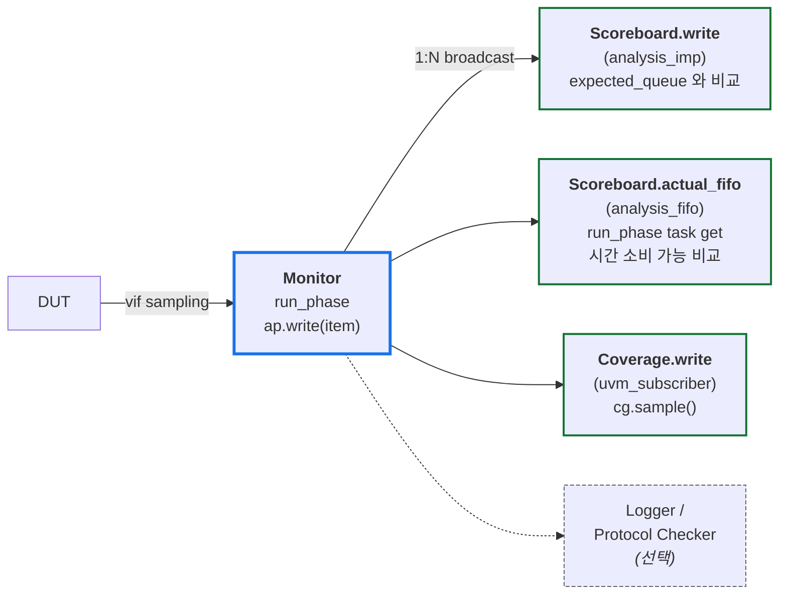
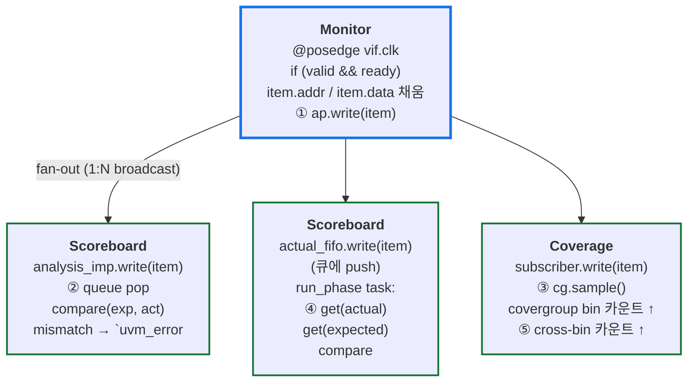
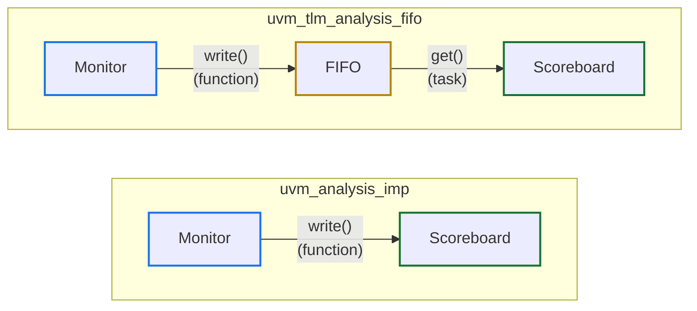

# Module 05 — TLM, Scoreboard, Coverage

<!-- DV-SKOOL-CH-CTX:start -->
<div class="chapter-context" data-cat="core">
  <a class="chapter-back" href="../">
    <span class="chapter-back-arrow">←</span>
    <span class="chapter-back-icon">🧪</span>
    <span class="chapter-back-text">UVM</span>
  </a>
  <span class="chapter-divider">›</span>
  <span class="chapter-marker">Module 05</span>
</div>
<!-- DV-SKOOL-CH-CTX:end -->

<!-- DV-SKOOL-CH-TOC:start -->
<div class="page-toc">
  <span class="page-toc-label">목차</span>
  <a class="page-toc-link" href="#1-why-care-tb-의-검증-가치는-비교와-커버리지-에서-나온다">1. Why care?</a>
  <a class="page-toc-link" href="#2-intuition-방송국-과-한-장-그림">2. Intuition</a>
  <a class="page-toc-link" href="#3-작은-예-monitor-한-write-가-scoreboard-와-coverage-로-fan-out-되는-과정">3. 작은 예 — fan-out 한 사이클</a>
  <a class="page-toc-link" href="#4-일반화-tlm-포트-종류-와-scoreboard-2-가지-매칭-전략">4. 일반화 — TLM 포트 + 매칭 전략</a>
  <a class="page-toc-link" href="#5-디테일-analysis_fifo-ooo-scoreboard-covergroup-bins-closure">5. 디테일</a>
  <a class="page-toc-link" href="#6-흔한-오해-와-dv-디버그-체크리스트">6. 흔한 오해 + DV 디버그 체크리스트</a>
  <a class="page-toc-link" href="#7-핵심-정리-key-takeaways">7. 핵심 정리</a>
</div>
<!-- DV-SKOOL-CH-TOC:end -->

!!! objective "학습 목표"
    이 모듈을 마치면:

    - **Connect** Monitor 의 `analysis_port` 를 Scoreboard 와 Coverage 양쪽에 1:N broadcast 로 연결할 수 있다.
    - **Implement** in-order / out-of-order 트래픽에 맞는 Scoreboard 비교 로직을 작성할 수 있다.
    - **Define** covergroup 을 coverpoint, bins, cross 로 의미 있는 functional coverage 가 되도록 정의할 수 있다.
    - **Trigger** Monitor 의 write 콜백에서 covergroup `sample()` 을 호출해 sampling 시점을 명확히 할 수 있다.
    - **Plan** Coverage closure 전략 (시드 다양성 + 타겟 시퀀스 + cross 분석) 을 설계할 수 있다.
    - **Trace** 한 write transaction 이 monitor.ap → scoreboard / coverage 로 fan-out 되는 경로를 단계별로 추적할 수 있다.

!!! info "사전 지식"
    - [Module 01-04](01_architecture_and_phase.md)
    - SystemVerilog covergroup, coverpoint, cross 문법 (IEEE 1800 §19)

---

## 1. Why care? — TB 의 검증 가치는 _비교_ 와 _커버리지_ 에서 나온다

### 1.1 시나리오 — _OoO AXI_ scoreboard 의 false fail

당신은 AXI master agent 검증. Scoreboard: expected queue 에 _expected_, actual queue 에 _DUT 결과_, FIFO 비교.

**문제**: AXI 는 _OoO 응답_ — Tag ID 다른 transaction 이 다른 순서 도착 가능.

```
Expected:  [W1(id=1), W2(id=2)]
Actual:    [W2(id=2), W1(id=1)]   ← OoO 도착
```

Naive FIFO pop_front 비교 → _mismatch_. False fail.

해법: **Per-ID queue** scoreboard:
```
queue_per_id[1] expected ↔ queue_per_id[1] actual: FIFO 비교 (같은 ID 는 in-order).
queue_per_id[2] expected ↔ queue_per_id[2] actual.
```

이게 _OoO 프로토콜_ scoreboard 의 _표준 패턴_. UVM 의 TLM analysis port 가 _자유로운 비교_ 가능하게 함.

TB 의 **검증 가치** 는 두 곳에서 생성됩니다: **비교 (Scoreboard)** 로 결함을 발견하고, **커버리지 (Coverage)** 로 검증 완전성을 측정합니다. 둘 다 TLM 위에서 동작하므로 Analysis Port 연결이 잘못되면 두 기능 _모두_ 무력해집니다.

이 모듈을 건너뛰면 검증 환경은 _자극은 인가하지만 결과를 못 잡는_ 상태로 빠집니다. 특히 OoO 응답을 가진 프로토콜 (AXI ID, PCIe TLP tag) 에서는 Scoreboard 매칭 로직 설계가 검증 신뢰성의 핵심 — 단순 큐 pop_front 비교를 그대로 쓰면 spurious mismatch 가 폭발합니다.

---

## 2. Intuition — 방송국, 과 한 장 그림

!!! tip "💡 한 줄 비유"
    **TLM Analysis Port** ≈ **방송국의 출력 포트 (broadcast)**.<br>
    한 방송 신호 (`ap.write(item)`) 가 여러 수신자 (scoreboard, coverage, logger) 에 동시 도달. publisher (monitor) 는 누가 듣는지 신경 쓸 필요 없음. 새 수신자 추가는 _수신자 측_ 만 connect 하면 끝 — publisher 코드는 변경 없음.

### 한 장 그림 — Monitor 한 곳에서 N 곳으로 fan-out



### 왜 이 디자인인가 — Design rationale

세 가지 요구의 교집합:

1. **새 검증 컴포넌트를 추가해도 monitor 코드는 변경 없어야** → publisher / subscriber 분리 (analysis_port).
2. **Scoreboard 가 _시간을 소비하며_ 비교해야 하는 경우가 있어야** → analysis_fifo (큐) + run_phase task get.
3. **검증 완전성 (coverage) 과 결함 발견 (scoreboard) 이 _같은 transaction stream_ 에서 동시 작동해야** → 같은 ap 가 둘 다에 fan-out.

이 세 요구가 곧 **Analysis Port (1:N) + analysis_imp (function 즉시 처리) / analysis_fifo (task 비동기 처리) 의 두 receiver 패턴** 의 디자인 결정.

---

## 3. 작은 예 — Monitor 한 write 가 Scoreboard 와 Coverage 로 fan-out 되는 과정

가장 단순한 시나리오. Monitor 가 Write transaction 1 개를 sample, ap.write 호출 → Scoreboard 가 expected 와 비교 + Coverage 가 covergroup sample.

### 단계별 다이어그램



### 단계별 의미

| Step | 누가 | 무엇을 | 왜 |
|---|---|---|---|
| ① | Monitor.run_phase | `ap.write(item)` — analysis_port 의 모든 subscriber 에 broadcast | publisher 는 누가 듣는지 모름 |
| ② | Scoreboard.write (function) | `expected = expected_queue.pop_front(); actual.compare(expected)` | 즉시 비교 (function — 시간 소비 불가) |
| ③ | Coverage.write | `cg.sample()` — covergroup 의 coverpoint 들이 현재 item 값을 sample | bin / cross-bin 카운트 증가 |
| ④ | Scoreboard.run_phase (task) | (별도 fan-out) `actual_fifo.get(actual); expected_fifo.get(expected); compare` | 시간 소비 가능 — 두 fifo 가 다른 시점에 도착해도 매칭 가능 |
| ⑤ | Coverage | cross 의 (addr, opcode) 조합 카운트 | cross coverage closure |

### 실제 코드 (전부 합쳐서)

```systemverilog
// Monitor (publisher)
class my_monitor extends uvm_monitor;
  `uvm_component_utils(my_monitor)
  uvm_analysis_port #(my_item) ap;
  virtual my_if vif;

  function void build_phase(uvm_phase phase);
    super.build_phase(phase);
    ap = new("ap", this);
    if (!uvm_config_db#(virtual my_if)::get(this, "", "vif", vif))
      `uvm_fatal("NOVIF", "vif missing")
  endfunction

  task run_phase(uvm_phase phase);
    forever begin
      my_item item = my_item::type_id::create("item");
      @(posedge vif.clk);
      if (vif.valid && vif.ready) begin
        item.addr = vif.addr;
        item.data = vif.data;
        ap.write(item);                                    // ①
      end
    end
  endtask
endclass

// Scoreboard (subscriber A)
class my_scoreboard extends uvm_scoreboard;
  `uvm_component_utils(my_scoreboard)
  uvm_analysis_imp #(my_item, my_scoreboard) actual_imp;
  my_item expected_queue[$];

  function void build_phase(uvm_phase phase);
    actual_imp = new("actual_imp", this);
  endfunction

  function void write(my_item actual);                     // ②
    my_item expected;
    if (expected_queue.size() == 0) begin
      `uvm_error("SB", "Unexpected actual")
      return;
    end
    expected = expected_queue.pop_front();
    if (!actual.compare(expected))
      `uvm_error("SB", $sformatf("Mismatch! Exp:%s Act:%s",
                                 expected.convert2string(), actual.convert2string()))
  endfunction
endclass

// Coverage (subscriber B)
class my_cov extends uvm_subscriber #(my_item);
  `uvm_component_utils(my_cov)
  my_item item;

  covergroup cg;
    cp_addr: coverpoint item.addr[31:28] {
      bins low  = {[4'h0:4'h3]};
      bins mid  = {[4'h4:4'h7]};
      bins high = {[4'h8:4'hF]};
    }
    cp_op: coverpoint item.wr_rd { bins wr={1}; bins rd={0}; }
    cx_addr_op: cross cp_addr, cp_op;
  endgroup

  function new(string name, uvm_component parent);
    super.new(name, parent);
    cg = new();
  endfunction

  function void write(my_item t);                          // ③
    item = t;
    cg.sample();
  endfunction
endclass

// env.connect_phase
function void connect_phase(uvm_phase phase);
  agent.monitor.ap.connect(sb.actual_imp);                 // 1:N
  agent.monitor.ap.connect(cov.analysis_export);
endfunction
```

!!! note "여기서 잡아야 할 두 가지"
    **(1) Monitor 한 곳의 `ap.write` 가 Scoreboard 와 Coverage 양쪽으로 _동시에_ 도달한다.** 새 subscriber 를 추가해도 Monitor 코드는 _변경 없음_. 1:N 의 핵심 가치.<br>
    **(2) Scoreboard 의 write 는 _function_ 이므로 시간 소비 불가**. 만약 두 monitor 의 데이터를 매칭해야 한다 (입력 + 출력) 면 analysis_imp 한 개로는 부족 — analysis_fifo + run_phase task 에서 둘 다 get.

---

## 4. 일반화 — TLM 포트 종류 와 Scoreboard 2 가지 매칭 전략

### 4.1 주요 TLM 포트 타입

| 포트 | 방향 | 용도 |
|------|------|------|
| `uvm_analysis_port` | 송신 (write) | Monitor 가 Transaction broadcast |
| `uvm_analysis_imp` | 수신 (write 구현, function) | Scoreboard / Coverage 가 즉시 수신 |
| `uvm_analysis_export` | 중간 전달 | 계층 경유 시 사용 |
| `uvm_tlm_analysis_fifo` | 수신 (큐 + get task) | 시간 소비 / 매칭 / 비동기 처리 |
| `uvm_seq_item_port` | 양방향 | Sequencer ↔ Driver |

### 4.2 analysis_imp vs analysis_fifo



**`uvm_analysis_imp`**

- `write()` 는 function → 시간 소비 (`#`, `@`) 불가
- Monitor 의 run_phase 안에서 직접 호출됨
- 단순한 비교에 적합

**`uvm_tlm_analysis_fifo`**

- FIFO 가 중간에서 버퍼링
- Scoreboard 의 run_phase 에서 get() (task) → 시간 제어 가능
- Monitor 와 Scoreboard 가 완전 비동기 (디커플링)
- 실무에서 가장 많이 사용하는 패턴

**사용 지침**

- 단순 카운터 / 플래그 업데이트 → `analysis_imp`
- 비교 로직, 순서 대기, 복잡한 처리 → `analysis_fifo`
- 다중 포트 수신 후 매칭 → `analysis_fifo` (필수)

### 4.3 In-Order vs Out-of-Order 비교 전략

```
In-Order Scoreboard:
  expected_queue[$] 에 push_back → pop_front 로 순서대로 비교
  → DUT 가 입력 순서 = 출력 순서를 보장할 때 (FIFO, 단순 파이프라인)

Out-of-Order Scoreboard:
  expected 를 Associative Array 에 저장 → 키 (ID/addr) 로 매칭
  → DUT 가 순서를 보장하지 않을 때 (AXI reordering, 캐시, 멀티포트)
```

### 4.4 Scoreboard 전략 선택 가이드

| DUT 특성 | Scoreboard 전략 | 키 |
|----------|----------------|-----|
| FIFO, 단순 파이프라인 | In-Order (Queue) | 순서 자체 |
| AXI (OOO 허용) | Out-of-Order (Map) | AXI ID |
| 캐시 | Out-of-Order (Map) | Address |
| DMA (채널별 순서 보장) | Per-Channel In-Order | Channel ID + Queue |
| 패킷 프로세서 | Out-of-Order (Map) | Packet ID / Hash |

---

## 5. 디테일 — analysis_fifo / OoO Scoreboard / Covergroup / Bins / Closure

### 5.1 uvm_tlm_analysis_fifo — 비동기 수신의 핵심

```systemverilog
// 문제: uvm_analysis_imp 의 write() 는 function → 시간 소비 불가
//       Scoreboard 에서 비교 로직이 복잡하거나 시간이 필요한 경우?

// 해결: uvm_tlm_analysis_fifo 로 버퍼링 후 task 에서 처리
class my_scoreboard extends uvm_scoreboard;
  `uvm_component_utils(my_scoreboard)

  // FIFO: Analysis Port 로부터 수신 → 내부 큐에 버퍼링
  uvm_tlm_analysis_fifo #(my_item) expected_fifo;
  uvm_tlm_analysis_fifo #(my_item) actual_fifo;

  function void build_phase(uvm_phase phase);
    super.build_phase(phase);
    expected_fifo = new("expected_fifo", this);
    actual_fifo   = new("actual_fifo", this);
  endfunction

  // Env 에서 연결:
  //   input_monitor.ap.connect(scoreboard.expected_fifo.analysis_export);
  //   output_monitor.ap.connect(scoreboard.actual_fifo.analysis_export);

  task run_phase(uvm_phase phase);
    my_item expected, actual;
    forever begin
      // blocking get — 데이터가 올 때까지 대기 (task 이므로 가능)
      expected_fifo.get(expected);
      actual_fifo.get(actual);

      if (!actual.compare(expected)) begin
        `uvm_error("SB", $sformatf("Mismatch!\n  Exp: %s\n  Act: %s",
                   expected.convert2string(), actual.convert2string()))
      end
    end
  endtask
endclass
```

### 5.2 Dual-Port Scoreboard (입출력 비교)

```systemverilog
// Input Monitor → Scoreboard (기대값 생성)
// Output Monitor → Scoreboard (실제값 수신)

class dual_scoreboard extends uvm_scoreboard;
  `uvm_analysis_imp_decl(_input)
  `uvm_analysis_imp_decl(_output)

  uvm_analysis_imp_input  #(in_item, dual_scoreboard) in_export;
  uvm_analysis_imp_output #(out_item, dual_scoreboard) out_export;

  function void write_input(in_item item);
    // Reference Model 로 기대 출력 계산
    out_item expected = ref_model.predict(item);
    expected_queue.push_back(expected);
  endfunction

  function void write_output(out_item actual);
    // 기대값과 비교
    // ...
  endfunction
endclass
```

### 5.3 Out-of-Order Scoreboard 구현

```systemverilog
class ooo_scoreboard extends uvm_scoreboard;
  `uvm_component_utils(ooo_scoreboard)

  // 키 = transaction ID, 값 = 기대 트랜잭션
  my_item expected_map[int];
  int match_count, mismatch_count;

  uvm_tlm_analysis_fifo #(my_item) exp_fifo;
  uvm_tlm_analysis_fifo #(my_item) act_fifo;

  function void build_phase(uvm_phase phase);
    super.build_phase(phase);
    exp_fifo = new("exp_fifo", this);
    act_fifo = new("act_fifo", this);
  endfunction

  task run_phase(uvm_phase phase);
    fork
      collect_expected();
      compare_actual();
    join
  endtask

  task collect_expected();
    my_item exp;
    forever begin
      exp_fifo.get(exp);
      expected_map[exp.id] = exp;  // ID 를 키로 저장
    end
  endtask

  task compare_actual();
    my_item act, exp;
    forever begin
      act_fifo.get(act);

      if (!expected_map.exists(act.id)) begin
        `uvm_error("SB", $sformatf("No expected item for ID=%0d", act.id))
        continue;
      end

      exp = expected_map[act.id];
      expected_map.delete(act.id);

      if (!act.compare(exp)) begin
        `uvm_error("SB", $sformatf("Mismatch ID=%0d\n  Exp: %s\n  Act: %s",
                   act.id, exp.convert2string(), act.convert2string()))
        mismatch_count++;
      end else begin
        match_count++;
      end
    end
  endtask

  function void check_phase(uvm_phase phase);
    if (expected_map.size() > 0)
      `uvm_error("SB", $sformatf("%0d unmatched expected items", expected_map.size()))
    `uvm_info("SB", $sformatf("Match=%0d, Mismatch=%0d", match_count, mismatch_count), UVM_LOW)
  endfunction
endclass
```

### 5.4 Covergroup 기본 + Cross

```systemverilog
class my_coverage extends uvm_subscriber #(my_item);
  `uvm_component_utils(my_coverage)

  covergroup cg;
    // Coverpoint: 관심 변수
    cp_opcode: coverpoint item.opcode {
      bins read  = {READ};
      bins write = {WRITE};
      bins burst = {BURST_READ, BURST_WRITE};
    }

    cp_size: coverpoint item.size {
      bins small  = {[1:64]};
      bins medium = {[65:512]};
      bins large  = {[513:4096]};
    }

    cp_addr_region: coverpoint item.addr[31:28] {
      bins low    = {[4'h0:4'h3]};
      bins mid    = {[4'h4:4'h7]};
      bins high   = {[4'h8:4'hF]};
    }

    // Cross: 조합 커버리지
    cx_opcode_size: cross cp_opcode, cp_size;
    cx_opcode_addr: cross cp_opcode, cp_addr_region;
  endgroup

  my_item item;

  function new(string name, uvm_component parent);
    super.new(name, parent);
    cg = new();
  endfunction

  function void write(my_item t);
    item = t;
    cg.sample();  // 커버리지 샘플링
  endfunction
endclass
```

### 5.5 Covergroup Option — 세밀한 제어

```systemverilog
covergroup cg with function sample(my_item item);

  // --- Covergroup-level option ---
  option.per_instance = 1;     // 인스턴스별 개별 커버리지 추적
  option.goal = 95;            // 목표 커버리지 95% (기본 100)
  option.comment = "AXI Transaction Coverage";

  // --- Coverpoint-level option ---
  cp_opcode: coverpoint item.opcode {
    option.at_least = 10;      // 각 bin 최소 10회 hit 필요 (기본 1)
    option.auto_bin_max = 8;   // 자동 bin 최대 개수 제한

    bins read  = {READ};
    bins write = {WRITE};
  }

  cp_size: coverpoint item.size {
    option.weight = 2;         // 이 coverpoint 의 가중치 2배
    bins small  = {[1:64]};
    bins medium = {[65:512]};
    bins large  = {[513:4096]};
  }
endgroup
```

#### 주요 Covergroup / Coverpoint Option

| Option | Level | 기본값 | 설명 |
|--------|-------|--------|------|
| `at_least` | CG/CP | 1 | bin 이 "hit" 으로 인정되는 최소 샘플 수 |
| `auto_bin_max` | CG/CP | 64 | 명시적 bin 없을 때 자동 생성되는 최대 bin 수 |
| `goal` | CG/CP | 100 | 목표 커버리지 % (보고용) |
| `weight` | CG/CP | 1 | 전체 커버리지 계산 시 가중치 |
| `per_instance` | CG | 0 | 1 이면 인스턴스별 독립 추적 |
| `cross_auto_bin_max` | CG | — | Cross 의 자동 bin 수 제한 (폭발 방지) |

### 5.6 Transition Coverage — 상태 전이 추적

```systemverilog
covergroup fsm_cg with function sample(state_e cur_state);

  // 단일 상태 커버리지
  cp_state: coverpoint cur_state {
    bins idle     = {IDLE};
    bins active   = {ACTIVE};
    bins burst    = {BURST};
    bins error    = {ERROR};
  }

  // ★ Transition bins — 상태 전이 경로 추적
  cp_transition: coverpoint cur_state {
    // 단일 전이: A → B
    bins idle_to_active  = (IDLE   => ACTIVE);
    bins active_to_burst = (ACTIVE => BURST);
    bins active_to_idle  = (ACTIVE => IDLE);
    bins error_to_idle   = (ERROR  => IDLE);

    // 연속 전이: A → B → C
    bins full_burst = (IDLE => ACTIVE => BURST);

    // 반복 전이: A → A (연속 N회)
    bins active_held = (ACTIVE [*3:5]);  // 3~5 회 연속 ACTIVE

    // Wildcard 전이: 임의 → 특정
    bins any_to_error = (default => ERROR);

    // Illegal 전이: 발생하면 안 되는 전이
    illegal_bins idle_to_error = (IDLE => ERROR);
  }
endgroup

// 사용: 매 클럭마다 sample
always @(posedge clk) begin
  fsm_cg.sample(dut.current_state);
end
```

### 5.7 Wildcard / Illegal / Ignore Bins 실전

```systemverilog
covergroup protocol_cg;
  cp_cmd: coverpoint item.cmd {
    // Wildcard bins: 비트 패턴 매칭 (? = don't care)
    wildcard bins write_any = {4'b01??};  // 0100, 0101, 0110, 0111
    wildcard bins read_any  = {4'b10??};  // 1000, 1001, 1010, 1011

    // Illegal bins: 발생 시 시뮬레이션 에러
    illegal_bins reserved = {4'b1111, 4'b0000};
    // → 프로토콜에서 금지된 값 검출 (자동 assertion 역할)

    // Ignore bins: 커버리지 계산에서 제외
    ignore_bins debug_only = {4'b1110};
    // → 디버그 모드 전용 명령은 커버리지 목표에서 제외
  }

  cp_resp: coverpoint item.resp {
    bins okay   = {RESP_OKAY};
    bins exokay = {RESP_EXOKAY};
    bins slverr = {RESP_SLVERR};
    bins decerr = {RESP_DECERR};

    // illegal_bins 로 DUT 에러 자동 검출
    illegal_bins undefined = default;
    // → 정의된 4 개 이외의 값이 나오면 에러
  }

  // Cross 에서 특정 조합 제외
  cx_cmd_resp: cross cp_cmd, cp_resp {
    ignore_bins write_exokay = binsof(cp_cmd.write_any) &&
                               binsof(cp_resp.exokay);
    // → exclusive access 가 아닌 write 에서 EXOKAY 는 불가
  }
endgroup
```

### 5.8 Coverage 설계 원칙

| 원칙 | 설명 |
|------|------|
| 의미 있는 Bin | 프로토콜 / 기능 관점에서 의미 있는 분류 |
| Cross 필수 | 단일 변수보다 **조합** 이 버그를 찾음 |
| Illegal Bin | `illegal_bins` 로 불법 값 / 전이 자동 검출 (assertion 대용) |
| Ignore Bin | `ignore_bins` 로 불필요한 조합 제외 (커버리지 목표 현실화) |
| 경계값 포함 | min, max, 경계 ±1 |
| Transition 필수 | FSM 상태 전이, 프로토콜 시퀀스 검증 |
| at_least 조정 | 중요 시나리오는 `at_least > 1` 로 반복 검증 |
| Cross 폭발 방지 | `cross_auto_bin_max`, `ignore_bins` 로 불필요 조합 제거 |

### 5.9 Coverage Closure 전략

```
1. Directed Smoke (seed=0)        → 기본 경로 확인 → ~30%
2. Configuration Sweep             → 설정 조합 자동 생성 → ~60%
3. Constrained Random (100+ seeds) → 코너 케이스 → ~85%
4. Coverage Hole 분석              → 미커버 bin 확인 → Directed 추가 → ~95%
5. Edge Case Directed              → 경계값, 에러 → ~100%

미도달 Coverage 분석:
  - Unreachable: 설계상 불가능 → waive
  - Missing scenario: Sequence 추가
  - Constraint 과다: Constraint 완화
```

### 5.10 기본 Scoreboard + check_phase

```systemverilog
class my_scoreboard extends uvm_scoreboard;
  `uvm_component_utils(my_scoreboard)
  uvm_analysis_imp #(my_item, my_scoreboard) actual_export;
  my_item expected_queue[$];

  function void build_phase(uvm_phase phase);
    actual_export = new("actual_export", this);
  endfunction

  function void add_expected(my_item item);
    expected_queue.push_back(item);
  endfunction

  function void write(my_item actual);
    my_item expected;
    if (expected_queue.size() == 0) begin
      `uvm_error("SB", "Unexpected transaction received")
      return;
    end
    expected = expected_queue.pop_front();
    if (!actual.compare(expected)) begin
      `uvm_error("SB", $sformatf("Mismatch!\n  Exp: %s\n  Act: %s",
                                  expected.sprint(), actual.sprint()))
    end
  endfunction

  // ★ check_phase: 잔여 항목 확인 (DUT 가 응답을 안 준 경우 검출)
  function void check_phase(uvm_phase phase);
    if (expected_queue.size() > 0)
      `uvm_error("SB", $sformatf("%0d expected items remaining",
                                  expected_queue.size()))
  endfunction
endclass
```

---

## 6. 흔한 오해 와 DV 디버그 체크리스트

### 흔한 오해

!!! danger "❓ 오해 1 — 'Scoreboard 가 hang 했다는 건 transaction 이 안 들어왔다는 뜻이다'"
    **실제**: Scoreboard 가 hang 하는 이유의 다수는 **expected / actual 큐 size 가 영원히 0 이 안 되어** check_phase 또는 run_phase 의 forever fifo.get 이 무한 대기. 수신은 됐는데 _비교가 안 끝난_ 것.<br>
    **왜 헷갈리는가**: "hang = no-input" 이라는 단순화된 mental model 때문에 — 실제로는 input 은 있지만 expected 계산이 잘못돼 큐가 비지 않는 경우 다수.

!!! danger "❓ 오해 2 — 'OoO 트래픽인데 큐 1 개로도 운 좋게 동작하면 OK'"
    **실제**: 단순 시나리오에서는 우연히 in-order 일 수 있어도, AXI 의 ID 별 reorder 가 발생하는 순간 _첫 비교부터_ spurious mismatch 가 폭발. **DUT 의 protocol 이 OoO 를 _허용_ 하면 즉시 per-key 큐 (associative array) 로 가야** 합니다.<br>
    **왜 헷갈리는가**: 초기 시나리오의 PASS 가 마치 "큐 1 개로 충분" 의 증거처럼 보여서.

!!! danger "❓ 오해 3 — '단일 변수 coverage 100% 면 검증 끝'"
    **실제**: 단일 변수 100% ≠ _조합_ 100%. opcode={READ,WRITE} 와 size={SMALL,LARGE} 가 각각 100% 여도 READ+LARGE 조합이 한 번도 테스트되지 않을 수 있습니다. **Cross 가 이 조합을 추적**. 실제 버그는 대부분 특정 조합에서.<br>
    **왜 헷갈리는가**: "100%" 라는 숫자가 _완전히 끝_ 같은 인상을 줘서.

!!! danger "❓ 오해 4 — 'check_phase 는 선택이다'"
    **실제**: `run_phase` 에서 actual 만 받아 비교하는 scoreboard 는 _DUT 가 응답을 누락_ 한 경우 (drop / miss) 를 검출 못 합니다. 시뮬은 PASS 로 종료되지만 expected 큐에 항목이 쌓인 채 끝남. **`check_phase` 에서 큐 잔여 size 를 반드시 확인**.<br>
    **왜 헷갈리는가**: "비교 = run_phase 의 책임" 이라는 단순 모델 때문에.

!!! danger "❓ 오해 5 — 'covergroup 만 정의하면 자동으로 sample 된다'"
    **실제**: `cg.sample()` 호출이 _없으면_ covergroup 은 trigger 되지 않아 **coverage 0** 으로 남습니다. Monitor 의 write 콜백 안에서 호출하는 것이 표준. covergroup 정의만으로는 _bins_ 만 선언될 뿐 실제 샘플링은 일어나지 않음.<br>
    **왜 헷갈리는가**: covergroup 이 자동 sampling 메커니즘 (`@(posedge clk)`) 을 가질 _수 있어서_ — 그러나 trigger 명시 없이는 안 함.

### DV 디버그 체크리스트 (이 모듈 내용으로 마주칠 첫 실패들)

| 증상 | 1차 의심 | 어디 보나 |
|---|---|---|
| Scoreboard hang (run_phase 무한 대기) | actual 또는 expected 가 안 옴 (특히 OoO 에서 ID mismatch 로 영원히 wait) | run.log 에서 `[SB]` 로그 카운트, expected_map size 추적 |
| 시뮬 PASS, coverage 0 | `cg.sample()` 호출 누락 또는 covergroup 인스턴스 (`new()`) 누락 | `grep cg.sample *.sv` + Coverage subscriber 의 new |
| 시뮬 PASS, 그런데 DUT bug 가 누락됨 | check_phase 가 잔여 expected 확인 안 함 | scoreboard 의 check_phase 함수 존재 여부 |
| In-order scoreboard 의 첫 비교부터 mismatch | DUT 가 OoO (예: AXI ID 다른 채널) 인데 큐 1 개 사용 | DUT spec 의 ordering rule 확인 → per-key 큐로 |
| Coverage cross bin 폭발 (cross_auto_bin_max 초과) | cross 의 두 coverpoint 가 너무 많은 bin × bin | `cross_auto_bin_max` 또는 ignore_bins 추가 |
| analysis_imp 안에서 `#10ns` 컴파일 에러 | analysis_imp.write 는 function — 시간 소비 불가 | analysis_fifo + run_phase task 로 변경 |
| Multiple monitor 간 매칭이 안 됨 | analysis_imp 한 개로 두 source 받는데 동시 도착 가정 | analysis_fifo 두 개 + run_phase 에서 둘 get |
| illegal_bins 가 발생했는데 시뮬이 PASS | illegal_bins 가 정의돼도 시뮬 자체는 fatal 안 함 (보통 UVM_ERROR 또는 reporting) | report_phase 의 coverage report 확인, illegal hit count |

---

## 7. 핵심 정리 (Key Takeaways)

- **Analysis Port = 1:N broadcast**. Monitor 한 곳에서 send → 여러 구독자 (SB, Coverage) 가 각자 처리. 새 subscriber 추가는 publisher 코드 변경 없이.
- **Scoreboard 비교 모델**: in-order 는 단일 큐, OoO 는 per-key 큐 (또는 ID 별 associative array), 복잡 DUT 는 reference model + 출력 비교.
- **analysis_imp (function, 즉시) vs analysis_fifo (task, 비동기)** 의 선택. 다중 source 매칭 / 시간 소비 비교는 analysis_fifo 필수.
- **Covergroup sampling 시점**: Monitor 의 write 콜백에서 `cg.sample()` 호출이 표준. trigger source 명시 안 하면 의도와 다른 시점에 샘플링.
- **Cross coverage** 는 단순 합집합이 아니라 곱집합 (N × M bins) — 의미 있는 조합만 정의해야 폭발 방지.
- **Coverage closure 전략**: (1) 시드 다양화로 baseline, (2) 타겟 시퀀스로 hole 채움, (3) cross 분석으로 미커버 조합 식별.

!!! warning "실무 주의점"
    - Scoreboard 의 `check_phase` 에서 _잔여 expected 큐 size_ 검사 — 빠지면 DUT miss 가 silent.
    - covergroup 인스턴스화 (`cg = new()`) 는 _new 함수 안에서_ — covergroup 만 선언하고 new 호출 안 하면 sample 무시.
    - `illegal_bins` 는 assertion 의 _대체_ 가 아니라 _보완_. 핵심 protocol 위반은 SVA 도 같이.

### 7.1 자가 점검

!!! question "🤔 Q1 — Analysis Port 1:N (Bloom: Analyze)"
    Monitor 의 `analysis_port` 가 한 transaction 을 _여러_ subscriber 에게 보낸다. _수신측_ 이 transaction 을 변형 (mutate) 하면 어떤 일이?
    ??? success "정답"
        모든 subscriber 가 동일 객체 핸들을 받음 → 한 곳에서 변형 시 다른 subscriber 가 _변형 후_ 객체 관찰:
        - **증상**: scoreboard 가 normal, coverage 가 mutated 를 보는 식의 _silent_ 데이터 오염.
        - **방어**: subscriber 의 `write()` 첫 줄에 `do_copy()` 또는 `clone()` 으로 _자기 사본_ 생성.
        - 또는 송신 monitor 가 매번 `new()` + 필드 채워 broadcasting → 송신측 보장이 더 깔끔.
        - 디버그 단서: 같은 trans 가 다른 시각에 다른 값으로 찍히면 mutate 의심.

!!! question "🤔 Q2 — Scoreboard `check_phase` (Bloom: Evaluate)"
    `run_phase` 에서 매 transaction 마다 비교했는데, `check_phase` 에서 _다시_ 검사할 게 남는 이유?
    ??? success "정답"
        Steady-state 와 final-state 검사가 다름:
        - **run_phase 매 트랜잭션**: 도착한 actual 과 expected_q.front 비교 → drop/mismatch 검출.
        - **check_phase 잔여 검사**: `expected_q.size() == 0` 검사 → DUT 가 _빠뜨린_ 트랜잭션 검출. run_phase 에서는 pop 만 → 잔여를 모름.
        - 추가: scoreboard 가 unexpected 도 큐로 들고 있다면 그 size 도 0 이어야.
        - 누락 시 증상: DUT 가 10 개 중 1 개 drop 해도 silent PASS — 가장 위험한 escape.

### 7.2 출처

**Internal (Confluence)**
- `Scoreboard Patterns` — analysis port + clone 의무
- `Coverage Strategy` — covergroup new + illegal_bins 사용 기준

**External**
- *UVM 1.2 User's Guide* §9 (Analysis) — Accellera
- *Coverage-Driven Verification* (Cadence) — covergroup design

---

## 다음 모듈

→ [Module 06 — 실무 패턴 & 안티패턴](06_practical_patterns.md): 지금까지 배운 컴포넌트 / 메커니즘들을 _실제 환경 구축_ 에 어떻게 조립하는가, 그리고 _하면 안 되는_ 패턴들.

[퀴즈 풀어보기 →](quiz/05_tlm_scoreboard_coverage_quiz.md)


--8<-- "abbreviations.md"
