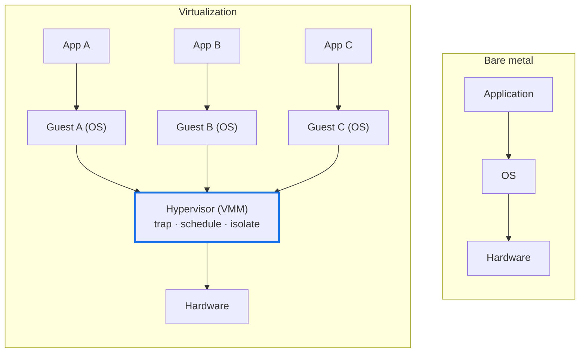
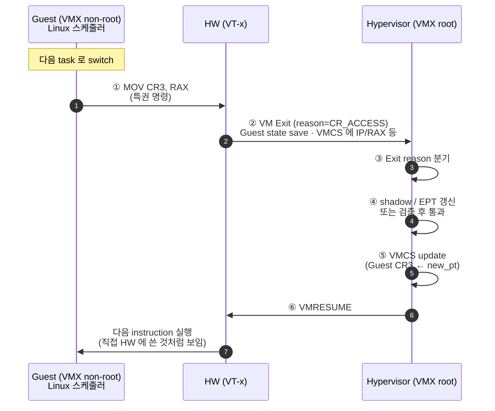
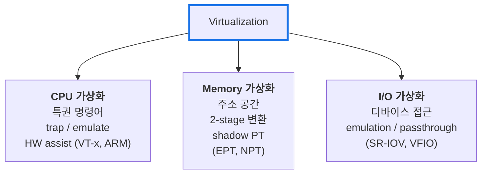
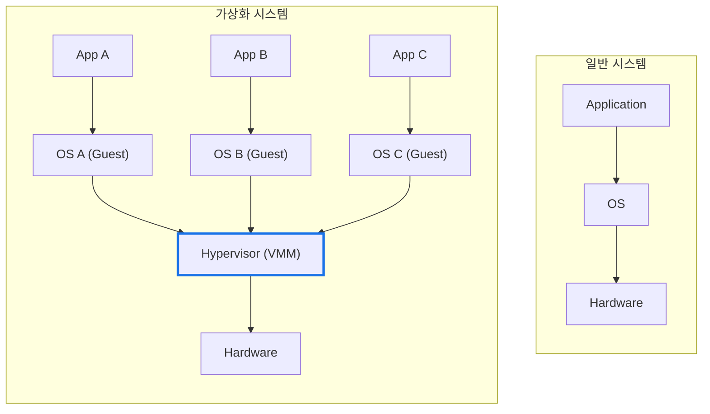
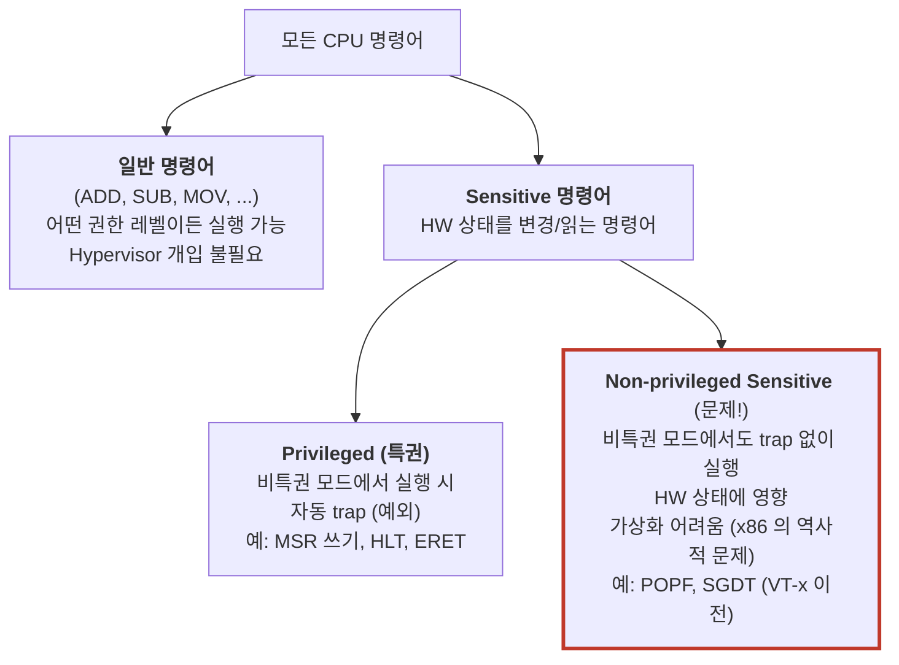
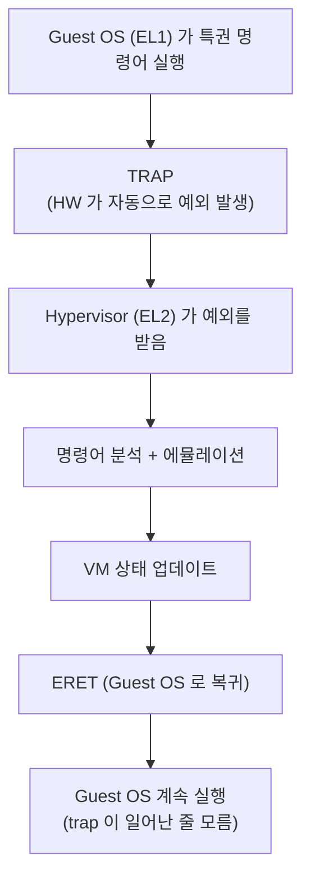
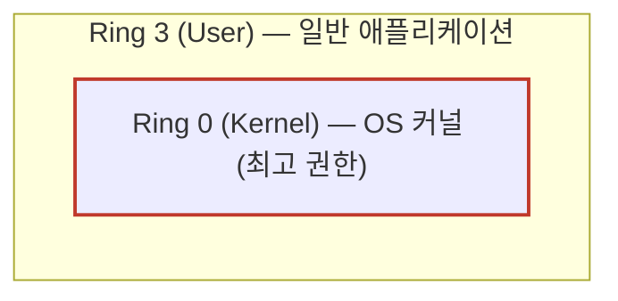

# Module 01 — Virtualization Fundamentals

<!-- DV-SKOOL-CH-CTX:start -->
<div class="chapter-context" data-cat="soc">
  <a class="chapter-back" href="../">
    <span class="chapter-back-arrow">←</span>
    <span class="chapter-back-icon">🪟</span>
    <span class="chapter-back-text">Virtualization</span>
  </a>
  <span class="chapter-divider">›</span>
  <span class="chapter-marker">Module 01</span>
</div>
<!-- DV-SKOOL-CH-CTX:end -->

<!-- DV-SKOOL-CH-TOC:start -->
<div class="page-toc">
  <span class="page-toc-label">목차</span>
  <a class="page-toc-link" href="#1-why-care-이-모듈이-왜-필요한가">1. Why care?</a>
  <a class="page-toc-link" href="#2-intuition-비유와-한-장-그림">2. Intuition</a>
  <a class="page-toc-link" href="#3-작은-예-cr3-write-한-번이-vm-exit-vm-entry-가-되는-과정">3. 작은 예 — VM Exit/Entry 한 사이클</a>
  <a class="page-toc-link" href="#4-일반화-3대-자원과-popek-goldberg-3조건">4. 일반화 — 3대 자원 + Popek-Goldberg</a>
  <a class="page-toc-link" href="#5-디테일-trap-popek-goldberg-역사-confluence">5. 디테일</a>
  <a class="page-toc-link" href="#6-흔한-오해-와-dv-디버그-체크리스트">6. 흔한 오해 + DV 디버그 체크리스트</a>
  <a class="page-toc-link" href="#7-핵심-정리-key-takeaways">7. 핵심 정리</a>
</div>
<!-- DV-SKOOL-CH-TOC:end -->

!!! objective "학습 목표"
    이 모듈을 마치면:

    - **Define** 가상화의 정의와 동기 (격리, 효율, multi-tenant) 를 한 문장으로 설명할 수 있다.
    - **Distinguish** Full / Para / HW-assisted virtualization 의 격리 경계와 성능 위치를 구분할 수 있다.
    - **Explain** Popek-Goldberg 3조건 (Equivalence / Resource Control / Efficiency) 이 위반될 때 무엇이 깨지는지 설명할 수 있다.
    - **Trace** 특권 명령어 한 번이 trap → emulate → resume 하는 1 사이클을 추적할 수 있다.
    - **Identify** Virtualization 적합 / 부적합 시나리오를 자원 활용률 관점에서 식별할 수 있다.

!!! info "사전 지식"
    - OS 기본 (process, kernel/user mode 분리)
    - CPU 권한 모드 (x86 ring, ARM EL)

---

## 1. Why care? — 이 모듈이 왜 필요한가

이후 모든 가상화 모듈은 한 가정에서 출발합니다 — **"하나의 물리 머신 위에 여러 OS 가 동시에, 그러나 서로를 모르는 채 동작한다"**. CPU 가상화의 trap-and-emulate, Memory 가상화의 2-stage translation, I/O 가상화의 SR-IOV 모두 이 한 가정의 파생입니다.

이 모듈을 건너뛰면 이후의 VMCS / EPT / IOMMU / VirtIO 가 "왜 그렇게 생겼는지" 가 보이지 않고 그냥 외워야 하는 규칙이 됩니다. 반대로 **3대 자원(CPU/Mem/I/O)** 과 **Popek-Goldberg 3조건** 만 정확히 잡으면, 디테일을 만날 때마다 _이유_ 가 보입니다.

---

## 2. Intuition — 비유와 한 장 그림

!!! tip "💡 한 줄 비유"
    **Bare metal** = 한 가족이 사는 단독주택. 모든 방 / 화장실 / 부엌을 한 가족이 독점.<br>
    **Virtualization** = **호텔** — 한 건물 안에 여러 객실이 격리돼 있고, 각 객실 손님은 자기가 단독주택에 사는 것처럼 행동. **호텔 매니저(Hypervisor)** 가 자원을 분배하고 객실 사이의 충돌을 가로챈다.

### 한 장 그림 — Bare metal vs Virtualization



세 가지 일이 Hypervisor 에서 동시에 일어납니다.

1. **자원 분할** — 각 VM 에 vCPU / 메모리 슬라이스 / 가상 디바이스를 할당.
2. **접근 중재** — Guest OS 가 특권 명령을 실행하려 하면 trap 으로 가로채서 대신 처리.
3. **격리 보장** — VM A 는 VM B 의 메모리를 읽을 수 없도록 page table 분리.

### 왜 이렇게 설계됐는가 — Design rationale

서버 한 대를 한 워크로드가 독점하던 시대는 평균 **CPU 활용률 10–15%** 에 머물렀습니다. 자원의 90% 가 낭비됐다는 뜻입니다. 동시에 보안 / 부팅 시간 / OS 의존성 / 멀티테넌시 요구는 **격리는 강하면서 자원은 공유** 하는 모델을 요구했습니다. Hypervisor 가 답입니다 — 충돌만 가로채고, 나머지 99% 명령은 HW 가 직접 실행하게 두면 활용률은 올라가고 격리는 유지됩니다. 이 한 줄 — **"가로채야 할 명령만 가로챈다"** — 가 곧 Popek-Goldberg 3조건의 효율성, VT-x 의 VMX root/non-root 분리, ARM EL2 의 도입 동기입니다.

---

## 3. 작은 예 — CR3 write 한 번이 VM Exit / VM Entry 가 되는 과정

가장 단순한 시나리오. Linux Guest 안에서 컨텍스트 스위치가 일어나 **새 page table base 를 CR3 에 쓰는** 단 한 줄이 어떻게 trap → emulate → resume 1 사이클이 되는지 추적합니다.



| Step | 누가 | 무엇을 | 의미 |
|---|---|---|---|
| ① | Guest OS | `MOV CR3, RAX` (또는 ARM `MSR TTBR0_EL1, X0`) | 새 task 의 page table 로 전환 — bare metal 에서는 그냥 1 명령 |
| ② | HW (VT-x / EL2) | VMCS 의 VM-Execution Control 이 "CR3 access trap" 을 ON 으로 둔 상태 → **VM Exit** | 비특권 모드에서 특권 자원 접근 → HW 가 자동 trap |
| ③ | Hypervisor | VMCS 의 Exit Reason 필드 읽음 (예: `28` = `CR_ACCESS`) | "왜 깼는지" 만 보고 분기 — 빠른 디스패치 |
| ④ | Hypervisor | new_pt 가 IPA 인지, 이 VM 에 속하는지 검증, EPT/Shadow PT 갱신 | 보안 검증 — Guest 가 다른 VM 메모리를 볼 수 없게 |
| ⑤ | Hypervisor | VMCS 의 Guest-state.CR3 = new_pt 로 기록 | resume 시 HW 가 이 값을 CR3 에 로드 |
| ⑥ | HW | `VMRESUME` → Guest 가 다음 명령부터 정상 실행 | Guest 는 trap 이 일어났는지 _모름_ |

```c
/* Step ① 의 실제 코드 (Linux process switch 의 일부 — switch_mm_irqs_off). */
static inline void load_new_mm_cr3(pgd_t *pgdir) {
    unsigned long new_mm_cr3 = __sme_pa(pgdir);
    /* 이 한 줄이 VM Exit 을 유발 — Guest 는 모름 */
    write_cr3(new_mm_cr3);
}
```

!!! note "여기서 잡아야 할 두 가지"
    **(1) Guest 는 VM Exit 이 일어났는지 _모른다_** — `MOV CR3, RAX` 다음 명령이 정상 실행되는 것처럼 보임. 이게 "Equivalence (동등성)" 조건의 실체.<br>
    **(2) Hypervisor 는 _가로챈 명령만_ 처리한다** — ADD / MOV / 일반 분기는 HW 에서 직접 실행. 이게 "Efficiency (효율성)" 조건. 99% 명령에 trap 이 끼면 가상화는 죽은 기술입니다.

---

## 4. 일반화 — 3대 자원과 Popek-Goldberg 3조건

### 4.1 가상화의 3대 요소

하드웨어는 크게 3 가지 자원으로 구성되고, 각각 다른 방식으로 가상화됩니다.



| 자원 | 가상화 대상 | 핵심 과제 |
|------|-----------|----------|
| **CPU** | 특권 명령어 실행, 인터럽트 처리 | Guest OS 가 직접 HW 제어 못하게 하면서 성능 유지 |
| **Memory** | 주소 변환, 메모리 격리 | VM 마다 독립 주소 공간 제공, 변환 오버헤드 최소화 |
| **I/O** | 디바이스 접근, DMA | 디바이스 공유 vs 전용 할당의 trade-off |

이 셋이 이후 Module 02 / 03 / 04 의 본문이고, 모든 모듈은 위 표의 한 칸을 깊게 파는 구조입니다.

### 4.2 Popek-Goldberg 3 조건 (1974)

가상화가 "올바르게 동작" 하기 위한 이론적 조건입니다. 한 번 외워두면 평생 씁니다.

```
Equivalence  ──── VM 안 실행 결과 = bare metal 결과 (timing 차이는 허용)
Resource     ──── Hypervisor 가 모든 HW 자원의 control 을 잃지 않음
Control
Efficiency   ──── 대부분의 Guest 명령은 HW 직접 실행 — trap 은 일부만
```

| 조건 | 위반 시 무엇이 깨지나 |
|------|--------|
| **Equivalence (동등성)** | Guest 프로그램이 bare metal 과 다른 결과 → 신뢰 불가 |
| **Resource Control** | 악의적 Guest 가 다른 VM 메모리 / Hypervisor 를 침해 → 보안 붕괴 |
| **Efficiency (효율성)** | 모든 명령을 emulate → 성능 100배 이상 저하 |

§3 의 worked example 에서 ② → ⑤ 가 Resource Control, ⑥ 이후 Guest 가 일반 명령을 native 실행하는 것이 Efficiency, Guest 가 trap 을 _모르고_ 동일하게 동작하는 것이 Equivalence 입니다.

### 4.3 가상화 변형 3가지

같은 3 조건을 만족시키는 3 가지 다른 길.

| 방식 | 어떻게 sensitive 명령을 처리하나 | 대표 |
|---|---|---|
| **Full (HW emulation)** | QEMU 가 모든 HW 동작을 SW 로 흉내 — 사용자 OS 그대로 | QEMU 단독 (TCG 모드) |
| **Para-virtualization** | Guest OS 를 수정해 hypercall 로 직접 호출 — trap 회피 | Xen para-virt (Linux 수정) |
| **HW-assisted** | CPU 가 sensitive 명령을 HW 에서 자동 trap (VMX/EL2) — Guest 미수정 | Intel VT-x, AMD-V, ARM EL2 |

오늘날 거의 모든 production 가상화는 **HW-assisted** 입니다. Para-virt 의 "guest 수정" 부담과 Full emulation 의 성능 절벽을 동시에 피하기 때문입니다.

---

## 5. 디테일 — Trap, Popek-Goldberg, 역사, Confluence

### 5.1 왜 가상화가 필요한가 — 자원 활용률 관점

```
물리 서버 1대 = OS 1개 = 서비스 1개

  서버 A: 웹 서버   (CPU 사용률 10%)
  서버 B: DB 서버   (CPU 사용률 15%)
  서버 C: 메일 서버 (CPU 사용률 5%)

  → 3대 서버 평균 사용률: 10% (나머지 90% 는 낭비)
  → 서비스마다 물리 서버 구매 필요
  → 서버 간 격리는 되지만, 비용이 선형 증가
```

| 문제 | 가상화의 해결 |
|------|-------------|
| 낮은 자원 활용률 | 하나의 물리 머신에 여러 VM → 활용률 60~80% 로 향상 |
| 서버 과다 | VM consolidation 으로 물리 서버 수 감소 |
| 격리 부재 | VM 간 메모리 / 프로세스 완전 격리 |
| 환경 의존성 | 각 VM 이 독립 OS → 서로 다른 환경 공존 |
| 복구 어려움 | VM snapshot / live migration 으로 빠른 복구 / 이동 |
| 개발 / 테스트 | 동일 HW 에서 여러 OS / 환경 즉시 생성 |

### 5.2 추상화 계층 — 일반 시스템 vs 가상화 시스템



**핵심**: Hypervisor 가 HW 와 Guest OS 사이에 위치하여 (1) HW 자원을 분할, (2) Guest OS 의 특권 명령어를 가로채서 처리, (3) VM A 가 VM B 의 메모리에 접근 불가.

### 5.3 Privileged vs Sensitive Instructions



이 마지막 칸의 존재 때문에 VMware 가 1998 년 **Binary Translation** 을 발명했고, Intel 이 2005 년 VT-x 로 **모든 sensitive 명령을 HW trap 대상** 으로 확장했습니다.

### 5.4 Trap-and-Emulate 메커니즘 (§3 의 형식적 일반화)



**핵심**: Guest OS 는 자기가 직접 HW 를 제어한다고 생각하지만, 실제로는 Hypervisor 가 대신 처리하고 결과만 돌려줍니다 — Equivalence 의 구현.

### 5.5 x86 Protection Ring 과 가상화 충돌



- **Ring 0**: 모든 HW 자원 접근 가능 (특권 명령어 실행 가능).
- **Ring 3**: 제한된 권한 (특권 명령어 실행 시 → 예외 발생).
- **Ring 1, 2**: x86 spec 에 존재하지만 현대 OS 는 미사용.

**충돌**: OS 는 Ring 0 에서 동작한다고 가정하고 설계되었습니다. 가상화 시 Guest OS 도 Ring 0 을 요구하고 Hypervisor 도 Ring 0 이 필요 → **두 Ring 0 이 충돌**. 해결: VT-x 의 **VMX root / non-root 모드** 분리로 Hypervisor 와 Guest 가 각자 자기 root 의 Ring 0 을 가짐. (자세한 내용은 [Module 02](02_cpu_virtualization.md) §VT-x.)

### 5.6 가상화의 역사

| 연대 | 사건 | 의미 |
|------|------|------|
| 1960s | IBM CP/CMS | 최초의 가상 머신 — 메인프레임 시분할 |
| 1974 | Popek-Goldberg 논문 | 가상화 이론적 조건 정립 |
| 1998 | VMware 설립 | x86 가상화 상용화 시작 (Binary Translation) |
| 2003 | Xen 발표 | 오픈소스 Type 1 하이퍼바이저 (para-virt) |
| 2005-06 | Intel VT-x / AMD-V | x86 HW 가상화 지원 → trap 문제 해결 |
| 2007 | KVM 리눅스 합류 | Linux 커널 내장 하이퍼바이저 |
| 2008 | Intel EPT / AMD NPT | 메모리 가상화 HW 지원 → shadow PT 불필요 |
| 2013 | Docker 발표 | 컨테이너 기반 경량 가상화 대중화 |
| 2017+ | ARM VHE (v8.1) | ARM 에서 호스트 OS 가 EL2 에서 직접 실행 |

### 5.7 면접 단골 Q&A

**Q: 가상화의 3대 요소와 각각이 추상화하는 HW 자원은?**

> "CPU 가상화 (특권 명령어 trap + 인터럽트 처리), 메모리 가상화 (VM 별 독립 주소 공간, VA→IPA→PA 2-stage 변환), I/O 가상화 (디바이스 접근 공유 / 격리 — 에뮬레이션, VirtIO, SR-IOV pass-through). 세 요소 모두 SW 방식에서 시작하여 HW 지원 (VT-x, EPT, SR-IOV) 으로 진화했다는 공통 흐름이 있다."

**Q: Popek-Goldberg 조건 중 '효율성' 이 왜 중요한가?**

> "대부분의 Guest 명령어가 Hypervisor 개입 없이 HW 에서 직접 실행되어야 한다는 조건이다. 위반 시 ADD, MOV 같은 일반 연산까지 trap 하게 되어 성능이 100 배 이상 저하된다. 따라서 '특권 명령어만 trap, 나머지는 직접 실행' 이 가상화의 핵심 설계 원칙이며, 이것이 Popek-Goldberg 3 조건 (동등성, 자원 제어, 효율성) 중 실용적으로 가장 큰 제약이다."

**Q: x86 에서 VT-x 이전에 가상화가 어려웠던 이유는?**

> "x86 에는 POPF, SGDT 같은 'Sensitive 하지만 Non-privileged' 한 명령어가 있었다. HW 상태를 변경 / 읽지만 비특권 모드에서 trap 없이 실행되어 Hypervisor 가 가로챌 수 없었다. VMware 는 Binary Translation (명령어 동적 치환) 으로 SW 우회했고, Intel 이 VT-x 로 VMX non-root 모드를 추가하여 모든 Sensitive 명령어가 자동 VM Exit 되도록 HW 근본 해결했다."

---

## 6. 흔한 오해 와 DV 디버그 체크리스트

### 흔한 오해

!!! danger "❓ 오해 1 — 'Virtualization = software 만의 영역'"
    **실제**: Modern virtualization 의 핵심은 HW assist (Intel VT-x, AMD-V, ARM EL2). SW 만으로는 trap-and-emulate overhead 가 폭증하고, x86 의 non-privileged sensitive 명령은 SW 로 trap 자체가 안 된다.<br>
    **왜 헷갈리는가**: "virtual = soft" 라는 명칭 직관. 실제로는 **HW + SW 협업** 이 본질.

!!! danger "❓ 오해 2 — 'VMM 이 모든 instruction 을 emulate 한다'"
    **실제**: HW-assisted (VT-x) 환경에서 99%+ 의 명령은 HW 에서 native 실행되고, sensitive 명령만 VM Exit 됩니다. 그래서 가상화 오버헤드가 5-10% 수준.<br>
    **왜 헷갈리는가**: 초기 SW-only emulation (VMware ESX 1.0 등) 시대의 mental model 이 남아 있음.

!!! danger "❓ 오해 3 — 'Para-virtualization 드라이버를 깔면 자동으로 빠르다'"
    **실제**: KVM 환경에서 Guest 에 VirtIO 드라이버를 설치해도 host 측 vhost backend (vhost-net, vhost-blk) 가 활성화되지 않으면 여전히 QEMU user-space 를 경유하는 full emulation 경로 사용.<br>
    **왜 헷갈리는가**: "drivers installed" → "fast" 라는 단순 매핑. 실제로는 **양 끝의 backend 매칭** 까지 확인해야 함.

!!! danger "❓ 오해 4 — 'VM 격리가 켜졌으니 자동으로 안전하다'"
    **실제**: Hypervisor SW 의 page table 정확성 / IOMMU 설정 / VMCS control field 가 정확해야 격리가 성립. 단순히 "VT-x ON" 만으로는 부족.<br>
    **왜 헷갈리는가**: 마케팅 문구의 "HW-enforced isolation" 단순화. 실제는 HW + SW 정책의 합.

!!! danger "❓ 오해 5 — '가상화는 항상 overhead 를 만든다'"
    **실제**: VT-x + EPT + IOMMU + huge page 조합으로 modern overhead 는 5-10% 수준이며, 워크로드에 따라 자원 활용률 향상이 overhead 를 압도.<br>
    **왜 헷갈리는가**: 초기 SW-only 시대의 30%+ overhead 인상이 남아 있음.

### DV 디버그 체크리스트 (초기 가상화 brings up 에서 자주 보는 실패)

| 증상 | 1차 의심 | 어디 보나 |
|---|---|---|
| Guest 가 부팅 직후 hang / undefined instruction | sensitive 명령이 trap 안 잡힘 | VMCS 의 VM-Execution Control bitmap (CR3 / MSR / IO bitmap) |
| `VMRESUME` 후 Guest IP 가 엉뚱한 위치 | VMCS Guest-state 영역에 IP/RSP 잘못 기록 | VM-Exit handler 의 state save/restore 코드 |
| 같은 코드가 bare metal 과 다른 결과 | Equivalence 위반 — emulation 누락 | exit reason → Hypervisor 의 emulator 분기 |
| `ADD` 같은 일반 명령에서도 VM Exit 발생 | exit bitmap 이 너무 광범위 | VM-Execution Control 의 trap 조건 |
| Guest 가 다른 VM 메모리 read 가능 | EPT/Stage-2 page table 권한 | VMCS 의 EPT pointer + 실제 PT entry 의 RWX |
| VM 부팅은 OK 인데 throughput 30% 저하 | overhead 측정 baseline 부재 | bare-metal vs VM cyclictest/fio/netperf 비교, `kvm_stat exits/sec` |
| `CPUID` 가 호출될 때마다 VM Exit, 초당 수십만 회 | tight loop 안의 cpuid / msr read | `perf kvm stat`, exit reason 분포, synthetic value cache |
| Live migration 후 silent corruption | dirty bit tracking 누락 | EPT D-bit, PML buffer flush, write-protect race |

이 체크리스트는 §3 의 trap → emulate → resume 1 사이클이 **어디서든 깨질 수 있다는 것** 을 형식화한 것입니다. 이후 모듈에서 각 칸을 더 깊이 다룹니다.

---

## 7. 핵심 정리 (Key Takeaways)

- **가상화 = HW 자원 추상화**: 1 physical → N virtual, 격리 / 효율 / multi-tenant 의 기반.
- **3 대 자원**: CPU / Memory / I/O 가상화 — 모든 모듈이 이 3 칸 중 하나를 깊게 다룸.
- **Popek-Goldberg 3 조건**: Equivalence + Resource Control + Efficiency. 셋이 동시에 만족돼야 의미가 있다.
- **3 가지 방식**: Full (QEMU 단독, 느림) / Para (Guest 수정, Xen) / HW-assisted (VT-x, EL2 — **현재 표준**).
- **§3 의 1 사이클** — trap → exit reason → emulate → VMCS update → resume — 이 한 cycle 이 가상화의 모든 것.

!!! warning "실무 주의점"
    - **Para-virtualization 드라이버 설치 ≠ 빠름**: host 측 vhost backend 도 같이 켜져 있어야 한다. `lsmod | grep vhost` 와 `/sys/bus/virtio/drivers/` 동시 확인.
    - **"VT-x ON" ≠ 격리 보장**: VMCS control field, EPT permission, IOMMU 가 모두 정확해야 격리 성립. SW 정책이 critical.
    - **모든 vCPU 가 native 모드로 실행되는 것은 아니다** — `perf kvm stat` 로 exit 분포를 측정하지 않으면 5% 인 줄 알았던 overhead 가 실제로 30% 일 수 있다.

---

## 다음 모듈

→ [Module 01A — System Architecture Evolution](01a_system_architecture_evolution.md): 가상화가 어디서 왔는지 — HW Only → MMU → IOMMU → Hypervisor 의 7 단계 진화로 전체 그림을 잡습니다.

[퀴즈 풀어보기 →](quiz/01_virtualization_fundamentals_quiz.md)

<div class="chapter-nav">
  <a class="nav-prev" href="../">
    <div class="nav-label">◀ 이전</div>
    <div class="nav-title">코스 홈</div>
  </a>
  <a class="nav-next" href="../01a_system_architecture_evolution/">
    <div class="nav-label">다음 ▶</div>
    <div class="nav-title">Unit 1a: 시스템 아키텍처 진화 — HW Only에서 가상화까지</div>
  </a>
</div>


--8<-- "abbreviations.md"
