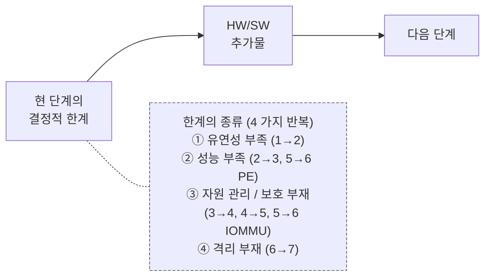
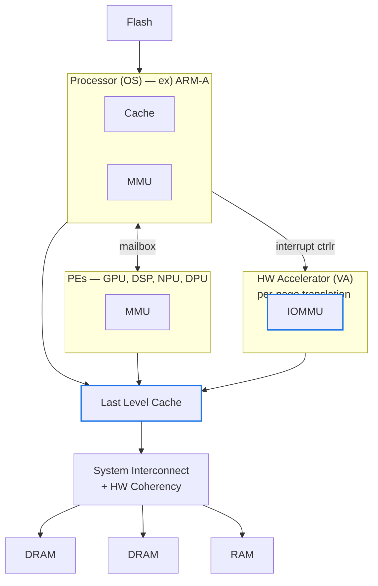
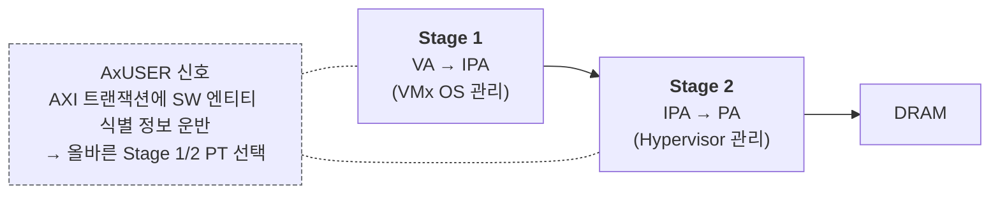

# Module 01A — System Architecture Evolution

<!-- DV-SKOOL-CH-CTX:start -->
<div class="chapter-context" data-cat="soc">
  <a class="chapter-back" href="../">
    <span class="chapter-back-arrow">←</span>
    <span class="chapter-back-icon">🪟</span>
    <span class="chapter-back-text">Virtualization</span>
  </a>
  <span class="chapter-divider">›</span>
  <span class="chapter-marker">Module 01A</span>
</div>
<!-- DV-SKOOL-CH-CTX:end -->

<!-- DV-SKOOL-CH-TOC:start -->
<div class="page-toc">
  <span class="page-toc-label">목차</span>
  <a class="page-toc-link" href="#1-why-care-이-모듈이-왜-필요한가">1. Why care?</a>
  <a class="page-toc-link" href="#2-intuition-비유와-한-장-그림">2. Intuition</a>
  <a class="page-toc-link" href="#3-작은-예-단계-5-6-디바이스-dma-가-iommu-로-바뀌는-1-사이클">3. 작은 예 — IOMMU 등장 1 사이클</a>
  <a class="page-toc-link" href="#4-일반화-7-단계의-공통-패턴">4. 일반화 — 7 단계의 공통 패턴</a>
  <a class="page-toc-link" href="#5-디테일-각-단계-구조-와-techforum-정리">5. 디테일 — 각 단계 구조</a>
  <a class="page-toc-link" href="#6-흔한-오해-와-dv-디버그-체크리스트">6. 흔한 오해 + DV 디버그 체크리스트</a>
  <a class="page-toc-link" href="#7-핵심-정리-key-takeaways">7. 핵심 정리</a>
</div>
<!-- DV-SKOOL-CH-TOC:end -->

<div class="learning-meta">
  <span class="meta-badge meta-level-intermediate">📊 Intermediate</span>
</div>

!!! objective "학습 목표"
    이 모듈을 마치면:

    - **Trace** HW only → microcontroller → MMU 도입 → IOMMU → 가상화의 7 단계 진화 흐름을 추적할 수 있다.
    - **Identify** 각 단계에서 추가된 HW 메커니즘 (Processor / HW Accel / OS / MPU / MMU / IOMMU / Hypervisor) 과 그 동기를 식별한다.
    - **Justify** 왜 가상화가 multi-tenant 시대의 토대가 되었는지 자원 활용률 + 격리 관점에서 설명할 수 있다.
    - **Decompose** 단계 6 (현대 SoC) 의 4 대 추가 요소 (IOMMU, PEs, LLC, HW Coherency) 가 가상화에 어떻게 기여하는지 분해할 수 있다.

!!! info "사전 지식"
    - [Module 01](01_virtualization_fundamentals.md) — 가상화의 3 대 요소
    - 컴퓨터 architecture 일반 (CPU, RAM, DMA)

---

## 1. Why care? — 이 모듈이 왜 필요한가

### 1.1 시나리오 — 40 년의 누적 _왜_

당신은 _modern SoC_ 를 봅니다. MMU, IOMMU, ATS, PASID, StreamID, AxUSER, hypervisor mode, EPT, ... _수십 개의 가상화 관련 hardware_. 처음 보면 **압도적**.

질문: 이게 _왜 이렇게 복잡_ 한가? _한 번에_ 다 만들 수 없었나?

답: **40 년의 점진적 진화**.

```
1970s: MMU (process 격리)
1990s: VT-x / AMD-V (CPU 가상화)
2000s: IOMMU (DMA 격리)
2008+: EPT/NPT (2-stage page table)
2010+: SR-IOV (device 가상화)
2015+: ATS/PRI (latency 감소)
2020+: PASID (process-level isolation in device)
```

각 단계는 _이전 단계의 한계_ 가 _구체적으로 드러난 후_ 추가됨. _이론적_ 으로 한 번에 만들 수 있었지만 _실제로는_ 그 _한계가 _운영_ 에서 드러나야 _필요성_ 인정.

예: IOMMU 가 _없었을 때_ 가상화 OK 였다. 그러다 _2010 년대_ 100 GbE pass-through 가 _DMA 보안 hole_ 만들면서 IOMMU _필수_ 가 됨.

가상화는 **하루아침에 만들어진 것이 아닙니다**. CPU 에 처음 MMU 가 붙은 1970 년대부터 IOMMU 가 표준이 된 2010 년대까지 거의 40 년의 누적 결과입니다. 각 단계는 이전 단계의 한계를 정확히 인식하고 그것만 풀기 위해 추가됐습니다.

이 진화 흐름을 모르면 — 왜 IOMMU 가 "가상화의 전제 조건" 인지, AxUSER / StreamID 가 왜 필요한지, 단계 6 (현대 SoC) 의 4 대 요소가 왜 그 순서로 들어왔는지 — 이런 디자인 결정이 그냥 나열된 사실로 보입니다. 7 단계로 정리하고 나면 "왜 이게 거기에 있는가" 가 보입니다.

> 이 Unit 은 DV TechForum #54 "Evolution of system architecture, HW virtualization" 발표 내용을 기반으로 정리한 것입니다.

---

## 2. Intuition — 비유와 한 장 그림

!!! tip "💡 한 줄 비유"
    **시스템 아키텍처 진화** = **교통 수단의 진화** — 도보 → 자전거 → 자동차 → 자율주행 .<br>
    **Bare metal → process → VM → container → microVM** 으로 진화하며 격리 / 효율의 trade-off 가 점진적으로 변화. 각 단계는 이전의 결정적 한계 (고장 전파, 활용률 부족, 격리 부재) 하나씩을 해결.

### 한 장 그림 — 7 단계 조감도

```d2
direction: right

S1: "**단계 1**\nHW Only\n고정 기능"
S2: "**단계 2**\nProcessor (FW)\n프로그래머블\n저성능"
S3: "**단계 3**\nFW + HW Accel\n하이브리드\n고성능"
S4: "**단계 4**\nOS(ARM-M) + HW Accel\nMPU, DRAM, 시스템콜\n애플리케이션 특화"
S5: "**단계 5**\nOS(ARM-A) + MMU\n범용, 고성능\nIOMMU 없음 (문제)"
S6: "**단계 6**\n+ PEs + IOMMU + LLC + Coherency\n확장 가능\n현대 SoC"
S7: "**단계 7**\n+ Virtualization\nVM 격리\nHW 지원"
S1 -> S2
S2 -> S3
S3 -> S4
S4 -> S5
S5 -> S6
S6 -> S7
```

### 왜 이 디자인인가 — Design rationale

각 단계는 **이전 단계의 결정적 한계 정확히 한 가지** 를 풀기 위해 추가됐습니다 — "더 좋게" 가 아니라 "그것 없이는 다음이 안 된다". HW Only 의 한계는 _요구사항 변경 = 재설계_, Processor 의 한계는 _범용 CPU 로는 연산이 부족_, OS+MPU 의 한계는 _가상 주소 없음 → Linux 가 안 돔_, MMU 만 있고 IOMMU 없는 단계 5 의 한계는 _HW Accel 이 PA 직접 접근 → DMA 공격 가능_, 단계 6 의 한계는 _여러 워크로드를 한 SoC 에서 격리 못함_. 이 한계 → 다음 단계의 추가물 매핑이 곧 이 모듈의 본문입니다.

---

## 3. 작은 예 — 단계 5 → 6: 디바이스 DMA 가 IOMMU 로 바뀌는 1 사이클

가장 결정적 전환점인 **단계 5 → 6** 만 step-by-step. HW 가속기가 1 KB 데이터를 DRAM 에서 읽는 단 한 번의 DMA 가 IOMMU 도입 전후 어떻게 바뀌는지.

```d2
direction: down

S5: "단계 5 — IOMMU 없음" {
  direction: down
  A1: "HW Accel\n① 드라이버가 PA 0x1_0000 발급\n(예약된 1 GB 영역에서)"
  A2: "② DMA read addr=0x1_0000"
  A3: "System Interconnect"
  A4: "DRAM (PA 0x1_0000 의 1 KB)"
  A5: "HW Accel buffer\n③ 1 KB return"
  A1 -> A2
  A2 -> A3
  A3 -> A4
  A4 -> A5
}
S6: "단계 6 — IOMMU 있음" {
  direction: down
  B1: "HW Accel\n① 드라이버가 IOVA 0x4000 발급\n(devicetree/ACPI 가 설정)"
  B2: "② DMA read addr=0x4000 (가상)"
  B3: "IOMMU\n③ StreamID 매칭 → STE\n④ Stage-1: VA→IPA\n⑤ Stage-2: IPA→PA → 0x9_2000"
  B4: "⑥ DMA read addr=0x9_2000"
  B5: "System Interconnect\n⑦ permission OK 면 통과"
  B6: "DRAM (PA 0x9_2000)"
  B7: "HW Accel buffer\n⑧ 1 KB return (IOVA 그대로 보임)"
  B1 -> B2
  B2 -> B3
  B3 -> B4
  B4 -> B5
  B5 -> B6
  B6 -> B7
}
```

| Step | 단계 5 (IOMMU 없음) | 단계 6 (IOMMU 있음) | 의미 |
|---|---|---|---|
| ① | 드라이버 = HW 의 친구. 직접 PA 발급 | 드라이버 = guest OS. IOVA 만 발급 | guest 는 PA 를 모름 |
| ② | DMA addr = 진짜 PA | DMA addr = 가상 (IOVA) | 추상화 한 칸 추가 |
| ③ | (없음) | IOMMU 가 transaction 의 StreamID 로 STE 검색 | "이 디바이스가 누구 소속인가" |
| ④ | (없음) | Stage-1 PT walk: IOVA → IPA | guest 가 본 가상 주소 |
| ⑤ | (없음) | Stage-2 PT walk: IPA → PA | hypervisor 가 본 실제 주소 |
| ⑥ | (해당 없음) | 변환된 PA 로 실제 transaction | 권한 검증 통과 시만 |
| ⑦ | 항상 통과 (위험!) | permission flag 검증, 위반 시 fault | 격리 / 보안 |

```c
/* Step ① 의 구체적 코드 비교 (Linux DMA API). */

/* 단계 5 — bounce buffer 없는 시대, PA 직접 노출 */
dma_addr = virt_to_phys(buf);                /* 진짜 PA — 무방비 */
hw_set_dma_addr(accel, dma_addr);

/* 단계 6 — IOMMU 경유, IOVA 만 노출 */
dma_addr = dma_map_single(dev, buf, len, DMA_FROM_DEVICE);
/* dma_addr 는 IOVA. IOMMU 가 알아서 PA 로 번역 */
hw_set_dma_addr(accel, dma_addr);
```

!!! note "여기서 잡아야 할 두 가지"
    **(1) IOMMU 등장의 핵심은 _주소의 격리_** — 디바이스가 임의 PA 에 접근할 수 있는 한 VM 격리는 불가능합니다. IOMMU 가 곧 가상화의 전제 조건인 이유.<br>
    **(2) StreamID (또는 VT-d 의 BDF) 가 "VM 정체성" 의 키** — 이게 없으면 IOMMU 도 어떤 page table 을 봐야 할지 모릅니다. AxUSER signal 이 곧 이걸 운반합니다.

---

## 4. 일반화 — 7 단계의 공통 패턴

### 4.1 모든 단계 전이의 공통 구조



이 4 가지 한계의 _순환_ 이 진화 과정 자체입니다. **격리 부재** 의 답이 가상화이고, 가상화는 다시 **자원 관리 부재** (live migration / over-commit) 를 만들고, 그게 또 microVM / DPU offload 같은 다음 진화를 부릅니다.

### 4.2 7 단계 한 줄 표

| 단계 | 구성 | 핵심 추가 요소 | 해결한 한계 |
|---|---|---|---|
| 1 | HW Only | (없음) | — |
| 2 | Processor (FW) | 프로그래밍 | ① 유연성 |
| 3 | Processor + HW Accel | HW 가속기 | ② 연산 성능 |
| 4 | OS(ARM-M) + HW Accel | OS, MPU, DRAM | ③ 자원 관리, 메모리 보호 |
| 5 | OS(ARM-A) + HW Accel | MMU, Cache | ① 가상 주소, 범용 OS |
| **6** | **+ PEs + IOMMU + LLC + Coherency** | **IOMMU, LLC, Coherency** | **③ 디바이스 격리 (가상화 전제)** |
| 7 | + Virtualization (HW) | Hypervisor, PF/VF, 2-stage | ④ VM 격리 + 성능 유지 |

### 4.3 단계 6 의 4 대 요소 — 왜 모두 한꺼번에 들어왔나

```d2
direction: right

S6: "**단계 6**\n현대 SoC"
IO: "**1. IOMMU**\n디바이스 격리\n(가상화 전제)"
PE: "**2. PEs**\nGPU / DSP / NPU / DPU\n워크로드 다양성"
LLC: "**3. LLC**\n컴포넌트 간\n메모리 공유 효율"
COH: "**4. HW Coherency**\n캐시 일관성 자동화\n(SW flush 제거)"
S6 -> IO
S6 -> PE
S6 -> LLC
S6 -> COH
```

이 넷이 단계 6 에 _묶여서_ 들어온 이유는 — IOMMU 만 있고 PE 가 없으면 격리할 게 없고, PE 만 있고 IOMMU 가 없으면 PE 가 host 메모리를 침해하고, LLC/Coherency 없이 PE 가 늘어나면 SW 캐시 관리가 폭발합니다. 넷이 한 세트입니다.

---

## 5. 디테일 — 각 단계 구조 와 TechForum 정리

### 5.1 단계 1: HW Only (고정 기능)

```d2
direction: right

UI: "User inputs"
S: "Sensor"
IP: "HW IP"
A: "Actuator"
O: "Executed outputs"
UI -> S
S -> IP
IP -> A
A -> O
```

HW 로직 (게이트, ASIC) 만으로 구성된 시스템. 소프트웨어 없음.

| 항목 | 설명 |
|------|------|
| 성능 | **극도로 높음** — 고정 기능에 최적화된 HW |
| 에너지 효율 | **최고** — 불필요한 회로 없음 |
| 유연성 | **없음** — 기능 변경 = 재설계 |
| 예시 | 고정 알고리즘 신호처리기, 초기 계산기 |

한계: 요구사항이 바뀌면 HW 를 처음부터 다시 설계해야 함. 동기 — 프로세서 도입.

### 5.2 단계 2: Processor + FW (프로그래머블)

```d2
direction: right

FLASH: "Flash\n(FW 저장)"
UI: "User inputs"
SENS: "Sensor"
PROC: "Processor (FW)"
SI: "System\nInterconnect"
ACT: "Actuator"
OUT: "Outputs"
RAM: "RAM"
UI -> SENS
SENS -> PROC
PROC -> SI
SI -> ACT
ACT -> OUT
FLASH -> PROC
PROC -- RAM
```

마이크로컨트롤러 기반. Flash 에 펌웨어를 저장하고, RAM 에서 실행.

| 항목 | 설명 |
|------|------|
| 성능 | **낮음** — 범용 프로세서의 한계 |
| 유연성 | **있음** — FW 업데이트로 기능 변경 가능 |
| 예시 | 전자레인지, 세탁기, 간단한 소비자 전자기기, 장난감 |

한계: 범용 프로세서로는 영상처리 / 암호화 같은 연산 집약적 작업 부족. 동기 — HW 가속기 추가.

### 5.3 단계 3: Processor(FW) + HW Accelerator (하이브리드)

```d2
direction: down

FLASH: "Flash"
PROC: "Processor (FW)"
ACC: "HW Accelerator"
SI: "System Interconnect"
RAM: "RAM"
FLASH -> PROC
PROC -> ACC: "Configuration\nInterrupt"
PROC -> SI: "Memory access\n(PA direct)"
ACC -> SI: "Memory access\n(PA direct)"
SI -> RAM
```

핵심 포인트: HW Accelerator 가 **물리 주소 (PA) 로 직접 메모리 접근**. 이게 단계 5 의 보안 위험의 원조.

| 항목 | 설명 |
|------|------|
| 성능 | **높음** — 집약 연산을 HW 오프로드 |
| 유연성 | **제한적** — 가속기는 고정 기능, 프로세서는 프로그래머블 |
| 예시 | 데이터 로직 처리, 간단한 제어 시스템 + 액추에이터 |

한계: 확장성 부족, 메모리 보호 부재, 사용자 / 시스템 프로그램 분리 필요. 동기 — OS + MPU 도입.

### 5.4 단계 4: Middle-end Processor(OS) + HW Accelerator + MPU

```d2
direction: down

FLASH: "Flash"
PROC: "Processor (OS) — ex) ARM-M" {
  MPU: "MPU\n(Memory Protection)"
}
ACC: "HW Accelerator"
SI: "System Interconnect"
RAM: "RAM"
DRAM: "DRAM\n(대용량 도입)"
FLASH -> PROC
PROC -> ACC: "Configuration\nInterrupt"
PROC -> SI
ACC -> SI: "Memory access\n(PA direct)"
SI -> RAM
SI -> DRAM
```

#### MPU vs MMU

| 항목 | MPU | MMU |
|------|-----|-----|
| 기능 | 메모리 **보호** 만 | 메모리 보호 + **주소 변환** |
| 가상 주소 | 없음 (물리 주소 직접 사용) | VA → PA 변환 |
| 복잡도 | 단순 | 복잡 (Page Table, TLB) |
| 사용처 | ARM Cortex-M (RTOS) | ARM Cortex-A (Linux/범용 OS) |
| 페이지 단위 | 영역 (region) 단위 | 페이지 (4 KB / 2 MB / 1 GB) 단위 |

| 항목 | 설명 |
|------|------|
| 성능 | 높음 (HW 가속기 오프로드) |
| OS | RTOS 또는 경량 OS 실행 가능 |
| DRAM | 대용량 메모리 → 복잡한 애플리케이션 수용 |
| 예시 | 오디오/비디오 처리, 데이터 압축/암호화, 자동차 ECU, 로봇 |

한계: 가상 주소 없음 → 프로세스마다 PA 직접 관리 (복잡), HW 가속기가 PA 직접 접근 (보안 위험), 범용 OS (Linux) 실행 어려움. 동기 — MMU 도입.

### 5.5 단계 5: High-end Processor(OS) + HW Accelerator + MMU (IOMMU 없음)

```d2
direction: down

FLASH: "Flash"
PROC: "Processor (OS) — ex) ARM-A" {
  CACHE: "Cache"
  MMU: "MMU"
}
ACC: "HW Accelerator (PA)\n물리 주소로\n메모리 직접 접근"
SI: "System Interconnect"
DRAM1: "DRAM"
DRAM2: "DRAM"
RAM: "RAM"
FLASH -> PROC
PROC -> ACC: "Configuration\nInterrupt ctrlr"
PROC -> SI
ACC -> SI: "reserved\nmemory chunk"
SI -> DRAM1
SI -> DRAM2
SI -> RAM
```

#### IOMMU 없음의 문제 (중요)

```
문제 1: 메모리 비효율
  ┌──────────────────────────────────────────────┐
  │                    DRAM                       │
  │  ┌────────┐                   ┌────────────┐ │
  │  │ OS +   │   빈 공간 (낭비)  │ HW Accel용  │ │
  │  │ App    │                   │ 예약 영역   │ │
  │  │ 사용   │                   │ (큰 연속    │ │
  │  │        │                   │  메모리)    │ │
  │  └────────┘                   └────────────┘ │
  └──────────────────────────────────────────────┘

  HW 가속기는 PA 로 접근하므로:
  → 큰 연속 물리 메모리 청크를 미리 예약해야 함
  → OS 가 이 영역을 다른 용도로 사용 불가
  → 메모리 활용률 감소

문제 2: 보안 위험
  HW 가속기가 PA 로 접근 = 어떤 물리 주소든 접근 가능
  → OS 커널 메모리, 다른 프로세스 메모리도 접근 가능
  → DMA 공격과 동일한 위험

  공격 시나리오:
    악의적 드라이버가 HW 가속기의 DMA 대상 주소를
    커널 메모리로 설정 → 커널 데이터 유출 / 변조
```

| 항목 | 설명 |
|------|------|
| 성능 | 높음 (ARM-A + HW 가속기) |
| 범용성 | 높음 (Linux/Android 실행 가능) |
| 확장성 | **낮음** — IOMMU 없이 디바이스 관리 비효율적 |
| 예시 | 스마트폰, 태블릿, 스마트 TV (초기 세대) |

한계 → 동기: IOMMU + PEs + LLC + HW Coherency 도입.

### 5.6 단계 6: 현대 SoC — IOMMU + PEs + LLC + HW Coherency



#### 4 대 핵심 추가 요소

##### (1) IOMMU (가장 중요한 전환점)

```d2
direction: right

S5: "단계 5 (IOMMU 없음)" {
  direction: right
  # unparsed: A1["HW Accel"]
  # unparsed: A2["PA"]
  # unparsed: A3["DRAM"]
  A1 -> A2: "직접 물리 접근"
  A2 -> A3
}
S6: "단계 6 (IOMMU 있음)" {
  direction: right
  # unparsed: B1["HW Accel"]
  # unparsed: B2["VA"]
  # unparsed: B3["IOMMU<br/>페이지 단위 주소 변환<br/>+ 접근 권한 검사"]
  # unparsed: B4["PA"]
  # unparsed: B5["DRAM"]
  B3 { style.stroke: "#1a73e8"; style.stroke-width: 2 }
  B1 -> B2: "가상 주소"
  B2 -> B3
  B3 -> B4
  B4 -> B5
}
```

| IOMMU 이전 | IOMMU 이후 |
|-----------|-----------|
| HW 가속기가 PA 직접 접근 | VA → PA 변환 (페이지 단위) |
| 큰 연속 물리 메모리 예약 필요 | 가상으로 연속, 물리로 불연속 가능 |
| 임의 메모리 영역 접근 가능 (보안 위험) | 커널이 설정한 범위만 접근 가능 |
| 디바이스 드라이버가 물리 주소 의존 | 드라이버가 가상 주소 사용 → 이식성 향상 |

##### (2) Processing Elements (PEs)

| PE | 특화 분야 | 장점 |
|----|----------|------|
| **GPU** | 병렬 연산 (그래픽, GPGPU) | 수천 코어로 대규모 병렬 처리 |
| **DSP** | 신호 처리 (오디오, 통신) | 고정소수점 연산 최적화 |
| **NPU** | AI/ML 추론 | 행렬 연산, 저전력 추론 |
| **DPU** | 데이터 처리 (네트워크, 스토리지) | CPU 오프로드, 인프라 가속 |

##### (3) Last Level Cache (LLC)

```d2
direction: right

CPU: "CPU"
PE: "PE"
HW: "HW Accel"
LLC: "LLC (공유)"
DRAM: "DRAM"
CPU -> LLC
PE -> LLC
HW -> LLC
LLC -> DRAM
```

- CPU, PE, HW 가속기가 LLC 를 공유
- 자주 접근하는 데이터의 DRAM 접근 횟수 감소 → 지연시간 감소
- 컴포넌트 간 데이터 공유 효율 향상

##### (4) HW Coherency (하드웨어 일관성)

```
Coherency 없을 때:
  CPU 가 캐시에 데이터 A = 10 보유
  GPU 가 DRAM 에서 A = 5 를 읽음 (오래된 값)
  → 불일치! SW 가 수동으로 flush/invalidate 필요

Coherency 있을 때:
  CPU 가 A = 10 으로 갱신하면
  HW coherency 프로토콜이 GPU 측에 자동 통보
  → GPU 도 A = 10 을 봄
  → SW 복잡도 대폭 감소
```

| 항목 | 설명 |
|------|------|
| 데이터 일관성 | CPU, GPU, 가속기 간 자동 캐시 동기화 |
| SW 단순화 | 수동 flush/invalidate 불필요 |
| 성능 최적화 | 불필요한 DRAM 접근 감소 |

#### 단계 6 특징 종합

| 항목 | 설명 |
|------|------|
| 범용성 | **최고** — 어떤 워크로드든 처리 가능 |
| 확장성 | **높음** — PE / 가속기 추가 용이, IOMMU 로 관리 |
| 성능 | **높음** — LLC, Coherency, 특화 PE |
| 예시 | 현대 스마트폰 SoC (Snapdragon, Apple Silicon), 서버 SoC |

한계 → 동기: 여러 독립된 실행 환경을 동시에 운영해야 함 (서버 / 자동차 / 모바일). Hypervisor + 가상화 도입.

### 5.7 단계 7a: 가상화 — HW 지원 없음 (SW 에뮬레이션)

```d2
direction: down

VM0: "VM0 (4 GB)"
VM1: "VM1 (2 GB)"
HV: "Hypervisor\n2-stage translation (CPU 메모리)\n인터럽트: capture 후 분배\nHW Accel: 설정 / 관리"
DRAM: "DRAM\nVM0 STE · VM0 STE · VM1 STE · ..."
VM0 -> HV
VM1 -> HV
HV -> DRAM
```

문제: 모든 I/O 가 Hypervisor 를 경유 → 심각한 성능 오버헤드, HW 가속기 설정도 Hypervisor 대행, VM 수 증가 시 오버헤드 선형 증가.

### 5.8 단계 7b: 가상화 — HW 지원 (현대 시스템)

#### 핵심 변화: HW 가 가상화를 직접 지원

```d2
direction: right

R: "HW 가상화 지원 3 대 요소"
IO: "1. I/O 가상화\n디바이스를 VM 별 분할 (PF/VF)"
INT: "2. 인터럽트 가상화\n올바른 VM 에 직접 전달"
MEM: "3. 메모리 가상화\nIOMMU 2-stage translation"
R -> IO
R -> INT
R -> MEM
```

#### I/O 가상화: PF/VF 분리

```d2
direction: down

IP: "HW IP (MVIP)" {
  direction: down
  PF: "**PF** (Physical Function)\nengine0 (ctrlr)\nHypervisor 가 직접 설정 / 관리\n전체 디바이스 초기화 담당"
  VF0: "**VF0**\nVM0 용"
  VF1: "**VF1**\nVM1 용"
  VF2: "**VF2**\nVM2 용"
}
VM0: "VM0 Guest OS"
VM1: "VM1 Guest OS"
VM2: "VM2 Guest OS"
HV: "Hypervisor"
HV -> PF: "설정 / 관리"
VM0 -> VF0: "직접 설정 / 사용\n(pass-through)" { style.stroke-dash: 4 }
VM1 -> VF1: "pass-through" { style.stroke-dash: 4 }
VM2 -> VF2: "pass-through" { style.stroke-dash: 4 }
```

Hypervisor 역할:

- PF 를 통해 디바이스 전체 초기화 / 관리
- 각 VF 를 해당 VM 에 할당 (인터페이스를 VM 에 노출)

VM 의 Guest OS 역할:

- 할당받은 VF 를 직접 설정 / 사용
- Hypervisor 개입 없이 I/O 수행 → Pass-through!

#### 인터럽트 가상화

```d2
direction: right

HW: "HW"
IC: "Interrupt Controller"
HV: "Hypervisor\n(인터럽트 라우팅)"
VMx: "VMx"
HW -> IC: "1. IRQ 발생"
IC -> HV: "2. 포착"
HV -> VMx: "3. 어떤 VM 의 인터럽트인지\n판단 후 전달"
```

#### 메모리 가상화: IOMMU 2-Stage Translation



VMx OS 입장: VA → IPA 를 관리 (IPA 가 PA 라고 생각함).

Hypervisor 입장: IPA → PA 를 관리 (실제 물리 메모리 배치 결정).

#### SW 가상화 vs HW 가상화 비교

| 항목 | SW 가상화 (7a) | HW 가상화 (7b) |
|------|---------------|---------------|
| I/O | Hypervisor 가 에뮬레이션 | PF/VF 분리, VM 이 VF 직접 접근 |
| 인터럽트 | Hypervisor 가 모든 인터럽트 처리 | HW 라우팅 + Hypervisor 분배 |
| 메모리 | 2-stage (SW 관리 비중 높음) | 2-stage (HW 지원, IOMMU) |
| HW 가속기 설정 | **Hypervisor 가 설정** | **VM 의 OS 가 직접 설정** (VF) |
| 성능 | 오버헤드 큼 | Bare metal 에 근접 |
| 확장성 | 낮음 | 높음 (VF 추가로 VM 수 확장) |

### 5.9 면접 단골 Q&A

**Q: IOMMU 가 "가상화의 전제 조건" 이라고 하는 이유는?**

> "가상화에서 디바이스를 VM 에 pass-through 할당하려면 DMA 격리가 필수다. IOMMU 없이는: (1) 디바이스가 PA 로 직접 접근하므로 VM 간 DMA 격리 불가 — VM0 디바이스가 VM1 메모리에 접근 가능, (2) 모든 I/O 를 Hypervisor 가 에뮬레이션해야 하여 성능 저하, (3) 각 VM 에 연속 물리 메모리 예약 필요 — 비효율적. IOMMU 는 '디바이스용 MMU' 로서 디바이스 수준의 주소 변환 + 접근 제어를 제공하며, 이것 없이는 안전하고 효율적인 I/O 가상화가 불가능하다."

**Q: 시스템 아키텍처 진화에서 단계 6 (IOMMU, PEs, LLC, HW Coherency) 이 가상화에 기여하는 바는?**

> "네 요소가 각각 다른 측면을 해결한다. IOMMU — 디바이스 DMA 의 2-stage translation 으로 VM 별 메모리 격리 (핵심 전제 조건). PEs (GPU, NPU, DPU) — GPU pass-through, DPU 네트워크 오프로드 등 각 PE 에도 IOMMU 로 VM 별 격리 적용. LLC — 여러 VM 실행 시 메모리 접근 지연 감소, Hypervisor page table 도 캐싱되어 가상화 오버헤드 감소. HW Coherency — VM 간 PE 공유 시 SW 캐시 관리 불필요, 자동 일관성 유지로 SW 복잡도 감소."

**Q: AXI 의 AxUSER 신호가 IOMMU 2-stage translation 에서 하는 역할은?**

> "AxUSER (ARUSER/AWUSER) 는 AXI 트랜잭션에 'VM 정체성 (identity)' 을 부여하는 메커니즘이다. 디바이스가 메모리 접근 시 AxUSER 에 SW 엔티티 정보를 실어 보내면, IOMMU 가 이를 읽고 해당 VM 의 Stage 1 PT 로 VA→IPA, Stage 2 PT 로 IPA→PA 변환을 수행한다. AxUSER 없이는 IOMMU 가 어떤 VM 의 접근인지 구분 불가. ARM SMMU 에서는 이것이 StreamID 에 해당하며, Stream Table Entry (STE) 를 인덱싱하여 디바이스 / VM 별 변환 설정을 찾는다."

---

## 6. 흔한 오해 와 DV 디버그 체크리스트

### 흔한 오해

!!! danger "❓ 오해 1 — 'Container 는 VM 의 가벼운 버전이다'"
    **실제**: Container 는 같은 host kernel 공유 (process 격리 강화), VM 은 자체 kernel + HW emulation. 격리 모델이 근본적으로 다릅니다.<br>
    **왜 헷갈리는가**: "가벼운 = 같은 카테고리" 의 직관. 실제로는 7 단계 진화 중 _다른 분기_ 입니다 — VM 은 단계 7 의 hypervisor, container 는 단계 5/6 OS 의 namespace 확장.

!!! danger "❓ 오해 2 — 'IOMMU 는 보안용 옵션이다'"
    **실제**: IOMMU 는 가상화의 _전제 조건_. 보안 + 주소 변환 + DMA 격리 세 가지를 동시에 제공하며, 단계 5→6 의 결정적 추가물.<br>
    **왜 헷갈리는가**: "VT-d / AMD-Vi 는 BIOS 옵션" 이라는 운영 인식. 실제로는 _없으면 가상화가 안 된다_ 가 본질.

!!! danger "❓ 오해 3 — '단계 6 의 4 요소는 독립적으로 추가 가능하다'"
    **실제**: IOMMU + PEs + LLC + HW Coherency 는 한 세트. PE 만 늘리고 IOMMU 가 없으면 PE 가 host 메모리를 침해, LLC 만 추가하고 Coherency 가 없으면 SW 캐시 관리 폭발.<br>
    **왜 헷갈리는가**: 표로 그리면 4 칸이라 독립적으로 보임.

!!! danger "❓ 오해 4 — 'IOMMU 만 켜져 있으면 passthrough 가 안전하다'"
    **실제**: BIOS 의 VT-d 가 활성화돼도 kernel cmdline 의 `intel_iommu=on` 누락, ATS / PRI 설정 오류, ACS override 패치로 isolation 약화 등 여러 단계에서 깨질 수 있음.<br>
    **왜 헷갈리는가**: "IOMMU = secure DMA" 마케팅 메시지의 단순화.

### DV 디버그 체크리스트 (단계별 brings up)

| 증상 | 1차 의심 | 어디 보나 |
|---|---|---|
| HW Accel 이 host kernel panic 유발 | 단계 5 식 PA 직접 접근 (IOMMU off) | `dmesg \| grep -i iommu`, BIOS VT-d 옵션 |
| IOMMU 통해 가도 fault 가 자주 | StreamID / DeviceID 매칭 실패 | STE 의 VMID/ASID, AxUSER 값과 STE index 일치 여부 |
| Stage-2 walk 가 항상 miss | IPA 영역이 host 가 mapping 안 한 곳 | hypervisor 의 IPA→PA 매핑 표, EPT/Stage-2 root |
| 1 GB Huge Page 할당 후에도 TLB miss 잦음 | huge page 가 실제로 적용 안 됨 | `/proc/meminfo` 의 HugePages, IOMMU domain 의 pgsize |
| GPU/NPU pass-through 후 다른 VM 메모리 노출 | IOMMU group 분리 실패 | `/sys/kernel/iommu_groups/` 의 device 분포, ACS support |
| LLC hit 율이 낮은데 DRAM 대역폭이 포화 | coherency 없음으로 PE 가 LLC 우회 | snoop traffic, coherency protocol level (CHI / CCIX) |
| AxUSER 가 항상 0 으로 들어옴 | RTL 의 AxUSER tie-off 또는 widening 미설정 | AXI VIP 의 USER width, 상위 IP 의 user generation |
| VF 생성은 OK 인데 VM 안에서 안 보임 | host 에 VFIO 바인딩 누락 | `lspci -k`, VFIO group device 목록, qemu CLI 의 vfio-pci 인자 |

---

## 7. 핵심 정리 (Key Takeaways)

- **7 단계 진화** — 고정 기능 HW → 프로그래머블 CPU → MMU → IOMMU → 가상화 → microVM. 각 단계는 이전 단계의 _결정적 한계 하나_ 를 풀려고 추가됐다.
- **각 단계의 동기** — 더 큰 sharing/efficiency 와 더 강한 isolation 의 줄다리기.
- **단계 6 의 4 요소는 한 세트** — IOMMU / PEs / LLC / HW Coherency. 분리 도입 불가.
- **IOMMU = 가상화의 전제** — 보안 + 주소 변환 + DMA 격리. 없으면 passthrough 안전성과 effiency 모두 깨짐.
- **AxUSER → StreamID → STE → Stage-1/2 PT** — DV 가 검증해야 할 IOMMU 의 backbone path.

!!! warning "실무 주의점"
    - **IOMMU disable 상태의 device passthrough 는 host kernel panic 유도 가능** — `dmesg | grep -i "DMAR\|IOMMU"` 와 `/sys/class/iommu/` 존재 여부를 시뮬 시작 시 체크.
    - **IOMMU group 의 ACS isolation** 이 깨져 있으면 같은 group 의 모든 device 가 한 VM 에 묶여야 함 — pass-through 단위가 의도와 달라질 수 있다.
    - **단계 6 가 단계 5 의 sub-set 이라 착각하지 말 것** — IOMMU 추가만으로는 PE 다양성 / LLC / Coherency 가 자동으로 따라오지 않는다.

### 7.1 자가 점검

!!! question "🤔 Q1 — 단계 5 → 6 차이 (Bloom: Apply)"
    "MMU 가 추가된 multi-core" (단계 5) 와 "IOMMU 가 추가된 단계 6". 가상화 측면의 _결정적_ 변화 1 가지?
    ??? success "정답"
        IOMMU 가 _DMA path_ 를 가상화:
        - 단계 5: CPU 의 메모리 접근만 page table 거침. DMA (device → memory) 는 _직접_ 물리 주소 사용 → VM passthrough 시 host RAM 침해 가능.
        - 단계 6: IOMMU 가 device 의 GPA → HPA 변환 → VM passthrough 가 _안전_.
        - 결론: SR-IOV / VFIO / GPU passthrough 가 _가능_ 해진 분기점이 단계 6.

!!! question "🤔 Q2 — 7 단계 진화 ROI (Bloom: Evaluate)"
    7 단계 모두를 신규 SoC 에 _다 적용_ 할 필요는 없다. 어떤 단계까지가 _비용 대비_ 적정선?
    ??? success "정답"
        SoC 카테고리별 분기:
        - **IoT / MCU**: 단계 1~2 (코어 + protected mode) 충분 — 가상화 불필요.
        - **Mobile SoC**: 단계 5–6 (MMU + IOMMU) — TEE 격리에 IOMMU 필요.
        - **Server / Cloud SoC**: 단계 7 (Hypervisor + SR-IOV) 필수.
        - **trade-off**: 단계마다 silicon 면적 + verification 노력 증가. 단계 7 의 검증 비용 = 단계 1~5 합보다 큼 (가상화 격리 음성 시나리오 폭증).

### 7.2 출처

**Internal (Confluence)**
- `SoC Architecture Evolution` — 7 단계 분류 + 검증 매트릭스
- `IOMMU Integration Guide` — ACS / group 격리 사례

**External**
- ARM *AMBA System Memory Management Unit Architecture Specification (SMMUv3)*
- Intel *VT-d Architecture Specification* — DMA remapping

---

## 다음 모듈

→ [Module 02 — CPU Virtualization](02_cpu_virtualization.md): 7 단계 중 단계 7 의 _CPU 부분_ 을 깊게 — Trap-and-emulate, VMX root/non-root, ARM EL2, VMCS, VHE.

[퀴즈 풀어보기 →](quiz/01a_system_architecture_evolution_quiz.md)

<div class="chapter-nav">
  <a class="nav-prev" href="../01_virtualization_fundamentals/">
    <div class="nav-label">◀ 이전</div>
    <div class="nav-title">가상화 기본 개념</div>
  </a>
  <a class="nav-next" href="../02_cpu_virtualization/">
    <div class="nav-label">다음 ▶</div>
    <div class="nav-title">CPU 가상화</div>
  </a>
</div>


--8<-- "abbreviations.md"
