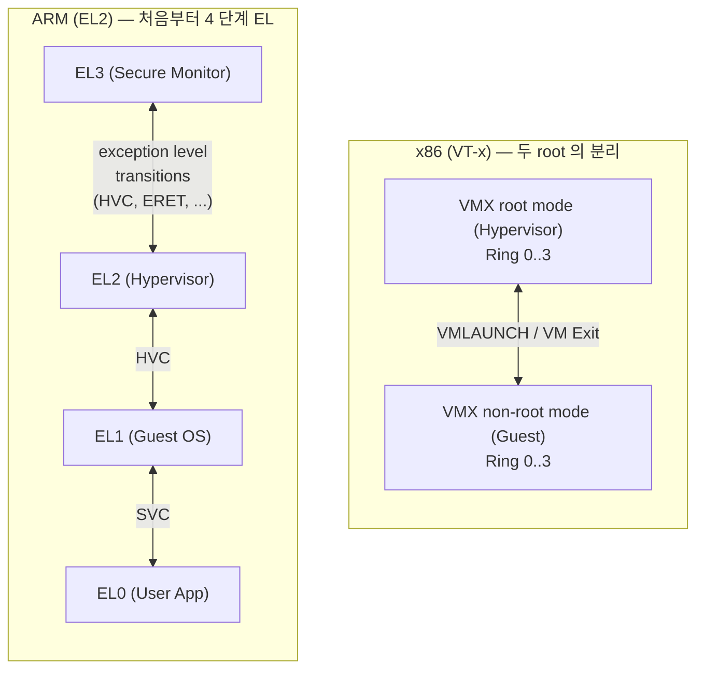
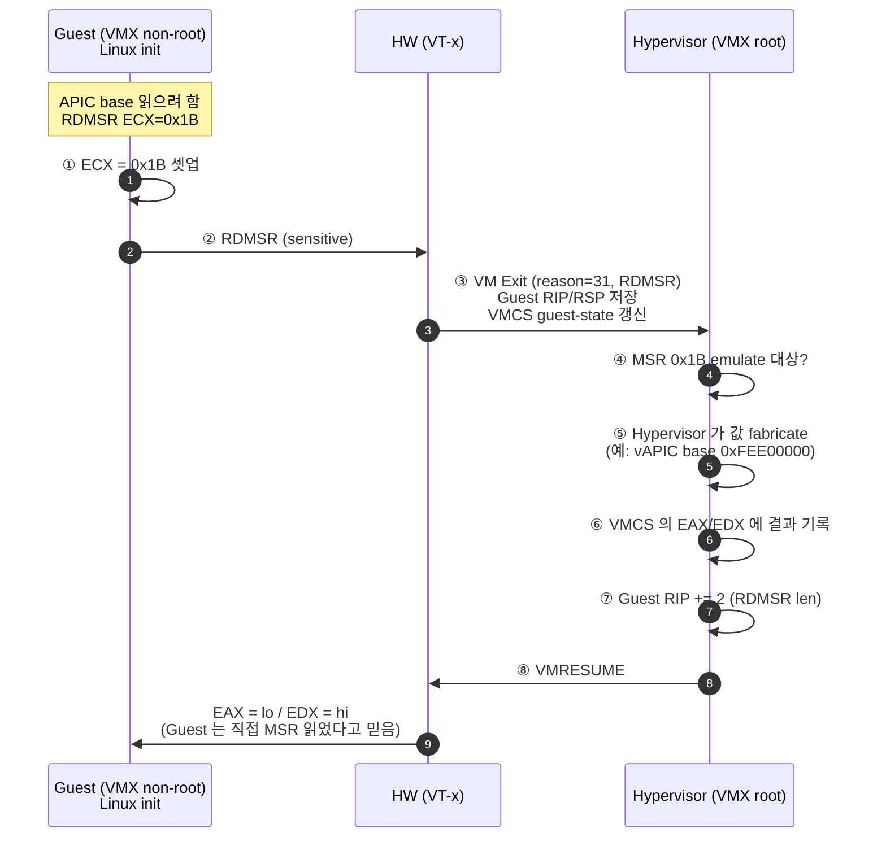

# Module 02 — CPU Virtualization

<!-- DV-SKOOL-CH-CTX:start -->
<div class="chapter-context" data-cat="soc">
  <a class="chapter-back" href="../">
    <span class="chapter-back-arrow">←</span>
    <span class="chapter-back-icon">🪟</span>
    <span class="chapter-back-text">Virtualization</span>
  </a>
  <span class="chapter-divider">›</span>
  <span class="chapter-marker">Module 02</span>
</div>
<!-- DV-SKOOL-CH-CTX:end -->

<!-- DV-SKOOL-CH-TOC:start -->
<div class="page-toc">
  <span class="page-toc-label">목차</span>
  <a class="page-toc-link" href="#1-why-care-이-모듈이-왜-필요한가">1. Why care?</a>
  <a class="page-toc-link" href="#2-intuition-비유와-한-장-그림">2. Intuition</a>
  <a class="page-toc-link" href="#3-작은-예-rdmsr-한-번이-vm-exit-vm-entry-를-만드는-과정">3. 작은 예 — RDMSR VM Exit 사이클</a>
  <a class="page-toc-link" href="#4-일반화-3-가지-cpu-가상화-방식">4. 일반화 — 3 가지 방식</a>
  <a class="page-toc-link" href="#5-디테일-vt-x-arm-el-vmcs-vhe-context-switch">5. 디테일</a>
  <a class="page-toc-link" href="#6-흔한-오해-와-dv-디버그-체크리스트">6. 흔한 오해 + DV 디버그 체크리스트</a>
  <a class="page-toc-link" href="#7-핵심-정리-key-takeaways">7. 핵심 정리</a>
</div>
<!-- DV-SKOOL-CH-TOC:end -->

!!! objective "학습 목표"
    이 모듈을 마치면:

    - **Trace** Trap-and-emulate 메커니즘 (privileged instruction → trap → hypervisor emulate → resume) 1 사이클을 추적할 수 있다.
    - **Distinguish** Binary Translation, Para-virtualization, HW-assisted (VT-x / AMD-V / EL2) 의 격리 / 성능 / Guest-수정 비용을 구분할 수 있다.
    - **Apply** VMCS / VMCB / vCPU 가 어떤 정보를 어디에 저장하는지 적용할 수 있다.
    - **Identify** Sensitive instruction 과 그 처리 방법 (trap-able 여부) 을 식별한다.
    - **Compare** x86 (VT-x) 와 ARM (EL2) 의 가상화 모델을 mode / state-save / 전환 비용 관점에서 비교할 수 있다.

!!! info "사전 지식"
    - CPU 권한 모드 (kernel/user, ring, EL)
    - [Module 01](01_virtualization_fundamentals.md), [Module 01A](01a_system_architecture_evolution.md)

---

## 1. Why care? — 이 모듈이 왜 필요한가

CPU 가상화는 가상화의 **심장** 입니다. Memory / I/O 가상화도 결국 "Guest 가 sensitive 명령을 실행하면 어떻게 되는가" 의 변형이고, VMCS / VM Exit / EL 전환 같은 어휘는 이후 모듈 모든 그림에 등장합니다.

이 모듈을 건너뛰면 — 왜 EPT / Stage-2 가 "PT 변경 시 VM Exit 가 안 일어난다" 는 게 큰 일인지 (Module 03), 왜 SR-IOV 가 "VM Exit 을 줄인다" 가 핵심인지 (Module 04), 왜 KVM 의 분류가 모호한지 (Module 05) — 이 모든 게 "그냥 사실" 이 됩니다. 반대로 이 모듈의 trap-and-emulate 사이클 + VMCS 구조 + 4 회 context switch 만 잡으면 나머지 모듈은 _이걸 어떻게 줄이는가_ 의 변형으로 보입니다.

---

## 2. Intuition — 비유와 한 장 그림

!!! tip "💡 한 줄 비유"
    **CPU Virtualization** = **회의실의 시간 분할 (time-slicing)** + **금고 매니저** .<br>
    한 CPU 를 여러 VM 이 시간 분할로 나눠 쓰면서 (회의실 예약), 각 VM 이 _금고_ (특권 자원: CR3, MSR, page table) 를 만지려 할 때마다 _매니저 (Hypervisor)_ 가 가로채서 대신 처리. 일반 명령 (펜으로 메모) 은 가로채지 않음.

### 한 장 그림 — VMX root / non-root + EL2



### 왜 이 디자인인가 — Design rationale

세 가지 요구가 동시에 풀려야 했습니다.

1. **Guest OS 가 자기를 Ring 0 / EL1 이라고 믿어야** — Equivalence (Guest 미수정).
2. **Hypervisor 도 자기 영역의 가장 높은 권한이 필요** — Resource Control.
3. **일반 명령은 trap 없이 직접 실행** — Efficiency.

x86 은 **VMX root / non-root 의 _두 root_ 분리** 로 풀었고, ARM 은 **처음부터 4 단계 Exception Level (EL3 → EL2 → EL1 → EL0)** 로 푸는 길을 택했습니다. 결과: Guest OS 는 자기가 EL1 / Ring 0 라고 믿으면서 직접 실행되고, sensitive 명령만 EL2 / VMX root 로 trap 됩니다. 이게 §3 의 워크플로우의 base.

---

## 3. 작은 예 — RDMSR 한 번이 VM Exit / VM Entry 를 만드는 과정

가장 단순한 시나리오. Guest Linux 가 부팅 중 `RDMSR(IA32_APIC_BASE)` 한 번을 실행하는 순간을 step-by-step.



| Step | 누가 | 무엇을 | 의미 |
|---|---|---|---|
| ① | Guest OS | `MOV ECX, 0x1B` | 읽을 MSR 번호 셋업 |
| ② | Guest OS | `RDMSR` | bare metal 에서는 그냥 1 명령. 가상화에서는 sensitive |
| ③ | HW (VT-x) | VMCS 의 MSR-read bitmap 에 0x1B 가 set 돼 있어 VM Exit | **자동 trap** — Guest 코드 수정 불필요 |
| ④ | Hypervisor | Exit reason `31` (`RDMSR`) 디스패치 | "왜 깼는지" 만 보고 분기 |
| ⑤ | Hypervisor | virtual APIC 의 base 주소 fabricate | guest 의 시각에서 일관된 값 |
| ⑥ | Hypervisor | VMCS guest-state.EAX = lo, guest-state.EDX = hi 기록 | resume 시 HW 가 이 값을 GP register 에 로드 |
| ⑦ | Hypervisor | guest-state.RIP += 2 (RDMSR opcode 길이) | 다음 명령부터 재개 |
| ⑧ | HW | `VMRESUME` | Guest 는 trap 을 모름 |

```c
/* Step ⑤–⑥ 의 의사 코드 — KVM 의 RDMSR exit handler 와 거의 동일 구조 */
static int handle_rdmsr(struct vcpu *vcpu) {
    u32 msr = vcpu->arch.regs[VCPU_REGS_RCX];
    u64 val;
    if (kvm_get_msr_common(vcpu, msr, &val)) {
        kvm_inject_gp(vcpu, 0);              /* 미지원 MSR → #GP 주입 */
        return 1;
    }
    vcpu->arch.regs[VCPU_REGS_RAX] = (u32)val;
    vcpu->arch.regs[VCPU_REGS_RDX] = (u32)(val >> 32);
    skip_emulated_instruction(vcpu);          /* RIP += 2 */
    return 1;                                 /* VMRESUME */
}
```

!!! note "여기서 잡아야 할 두 가지"
    **(1) Guest 는 `RDMSR` 다음 명령이 정상 실행되는 것처럼 본다** — Equivalence. Guest 코드를 한 줄도 수정하지 않았는데 가상화가 됐다는 것이 VT-x 의 핵심.<br>
    **(2) VM Exit 한 번이 수백 ~ 수천 cycle** — bare metal RDMSR 은 ~50 cycle. VT-x VM Exit 은 1000+ cycle. Tight loop 에서 RDMSR 이 자주 호출되면 성능 절벽 → 이게 §6 의 디버그 체크리스트의 첫 항목.

---

## 4. 일반화 — 3 가지 CPU 가상화 방식

§3 의 trap-and-emulate 사이클을 어떻게 _구현_ 하느냐에 따라 3 가지 길이 갈립니다.

### 4.1 한 장 비교

```
              Binary Translation          Para-virt              HW-assisted
              ──────────────────          ──────────              ──────────────
              Guest 코드 스캔 + 치환        Guest 수정 + hypercall    HW 가 자동 trap
              VMware ESX 1.x              Xen Linux              VT-x / AMD-V / EL2

  Guest      [POPF] → [CALL handler]      [hypercall_set_pte]     [POPF]   (그대로)
  실행                                                              ↓ HW trap
  경로                                                              Hypervisor

  Guest 수정  X (런타임 치환)               O (kernel 빌드)          X
  HW 지원     불필요                         불필요                   필수 (VT-x/EL2)
  성능        보통 ~ 좋음                    좋음                     좋음 (5-10% overhead)
  비공개 OS   가능 (Windows OK)             불가능 (Windows X)       가능
```

### 4.2 어떤 명령에서 trap 이 일어나야 하나

```
모든 sensitive 명령
├── Privileged 만 (대부분의 RISC: ARM, MIPS, RISC-V)
│   → 비특권 모드에서 자동 trap
│   → SW-only 가상화 가능했음
│
└── Privileged + Non-privileged Sensitive (x86 의 역사적 문제)
    → POPF, SGDT, SIDT, ... 가 비특권 모드에서 silent 실행
    → SW 만으로는 trap 불가 → Binary Translation 필요
    → VT-x 가 모든 sensitive 명령을 강제 trap 화하여 해결
```

이 한 칸의 차이가 **VMware 의 BT 발명 (1998)** 과 **Intel 의 VT-x 발표 (2005)** 의 7 년 간격입니다.

### 4.3 VMCS / VMCB / vCPU — 같은 것의 다른 이름

| 이름 | 사용처 | 한 마디 |
|---|---|---|
| **VMCS** | Intel VT-x | VM control structure — Guest state + Host state + Exec control |
| **VMCB** | AMD-V | VM control block — VMCS 와 거의 동형 |
| **vCPU** | Hypervisor SW 추상 | 위 둘을 추상화한 SW 객체 (KVM 의 `struct vcpu`) |

§3 의 ⑥ 단계에서 "VMCS 에 EAX/EDX 기록" 한다는 게 곧 VM 의 register state 가 _메모리에 살고 있다_ 는 뜻입니다.

---

## 5. 디테일 — VT-x, ARM EL, VMCS, VHE, Context Switch

### 5.1 x86 Protection Ring 과 가상화의 충돌

```
┌─────────────────────────────────────┐
│           Ring 3 (User)             │  ← 일반 애플리케이션
│      ┌───────────────────┐          │
│      │   Ring 0 (Kernel) │          │  ← OS 커널 (최고 권한)
│      └───────────────────┘          │
└─────────────────────────────────────┘
```

- **Ring 0**: 모든 HW 자원 접근 가능 (특권 명령어 실행 가능)
- **Ring 3**: 제한된 권한 (특권 명령어 실행 시 → 예외 발생)
- **Ring 1, 2**: x86 spec 에 존재하지만 현대 OS 미사용

**핵심**: OS 는 Ring 0 가정. 가상화 시 Guest OS 도 Ring 0 + Hypervisor 도 Ring 0 → **충돌**.

### 5.2 CPU 가상화의 과제

Guest OS 는 원래 bare metal 에서 동작하도록 설계되었습니다. 즉, 자기가 가장 높은 권한을 갖고 있다고 가정합니다.

```
Guest OS 가 하려는 것:
  1. 페이지 테이블 설정 (CR3 / TTBR 레지스터 쓰기)
  2. 인터럽트 활성화 / 비활성화
  3. I/O 포트 접근
  4. CPU 모드 전환

문제: 이 모든 것을 Guest OS 가 직접 하면
  → 다른 VM 의 메모리를 건드릴 수 있음
  → 하이퍼바이저의 제어권을 빼앗을 수 있음
  → VM 간 격리 붕괴
```

해결: Guest OS 의 특권 명령어를 Hypervisor 가 가로채서 (trap) 대신 처리 (emulate).

### 5.3 방법 1 — Binary Translation (SW 방식)

VT-x 이전, VMware 가 x86 의 "Non-privileged Sensitive" 명령어 문제를 해결한 방법.

```
Guest OS 코드 (원본)              변환된 코드 (실행되는 것)
┌─────────────────┐             ┌─────────────────────┐
│ MOV EAX, 5      │ ────────→  │ MOV EAX, 5          │  (그대로)
│ ADD EBX, EAX    │ ────────→  │ ADD EBX, EAX        │  (그대로)
│ POPF            │ ────────→  │ CALL vmm_popf_handler│ (치환!)
│ CLI             │ ────────→  │ CALL vmm_cli_handler │ (치환!)
│ MOV ECX, 10     │ ────────→  │ MOV ECX, 10         │  (그대로)
└─────────────────┘             └─────────────────────┘
```

#### 동작 원리

1. **Guest 코드 블록을 스캔** — 실행 전에 코드를 분석
2. **Sensitive 명령어를 발견하면 치환** — Hypervisor 의 핸들러 호출로 대체
3. **나머지 명령어는 그대로** — HW 에서 직접 실행 (효율성 유지)
4. **변환 결과를 캐시** — 같은 코드 블록 재실행 시 재변환 불필요

| 장점 | 단점 |
|------|------|
| HW 지원 없이 동작 | 변환 오버헤드 (첫 실행 시) |
| Guest OS 수정 불필요 | 구현 복잡도 높음 |
| Non-privileged Sensitive 해결 | 자기 수정 코드 (self-modifying code) 처리 어려움 |

### 5.4 방법 2 — Para-virtualization (Guest OS 수정)

Guest OS 커널을 수정하여, 특권 명령어 대신 **Hypervisor API (Hypercall)** 를 직접 호출.

```
[ Full Virtualization ]          [ Para-virtualization ]

Guest OS:                        Guest OS (수정됨):
  MOV CR3, EAX  ← 특권 명령어      hypercall(SET_PAGE_TABLE, addr)
      │                                  │
      ▼ trap                             ▼ 직접 호출 (trap 없음)
  Hypervisor                         Hypervisor
  "CR3 쓰기를 에뮬레이션"            "Page table 설정 요청 처리"
```

#### 대표 사례: Xen

```c
// Xen para-virtualized Guest OS (Linux 커널 수정)
// 원래: 직접 페이지 테이블 갱신
//   *pte = new_entry;

// 수정: hypercall 로 Xen 에 요청
HYPERVISOR_mmu_update(&update, 1, NULL, DOMID_SELF);
```

| 장점 | 단점 |
|------|------|
| trap 오버헤드 없음 (직접 호출) | Guest OS 커널 수정 필요 |
| Binary Translation 보다 효율적 | 비공개 OS (Windows) 지원 불가 |
| 인터페이스 최적화 가능 | HW 가상화 등장 후 필요성 감소 |

### 5.5 방법 3 — HW 지원 가상화 (VT-x / ARM VHE)

#### Intel VT-x

x86 의 가상화 문제를 HW 레벨에서 근본 해결.

```
VT-x 이전:                      VT-x 이후:
┌─────────────┐                 ┌─────────────┐
│ Ring 0: OS  │ ← 여기가 문제    │ VMX root    │ ← Hypervisor
│ Ring 3: App │                 │  (Ring 0)   │
└─────────────┘                 ├─────────────┤
Hypervisor 를 어디에 놓을까?     │VMX non-root │ ← Guest OS
(Ring 0 은 OS 가 점유)           │  (Ring 0)   │   (Ring 0 이지만 제한됨)
                                │  (Ring 3)   │ ← Guest App
                                └─────────────┘
```

#### 핵심 구조: VMCS (Virtual Machine Control Structure)

```
┌─────────────────────────────────────────┐
│            VMCS (per VM)                │
├─────────────────────────────────────────┤
│ Guest State Area                        │
│   - 레지스터 (RAX, RBX, ..., RIP, RSP)  │
│   - CR0, CR3, CR4                       │
│   - IDTR, GDTR                          │
│   - Segment registers                   │
├─────────────────────────────────────────┤
│ Host State Area                         │
│   - Hypervisor 복귀 시 로드할 상태      │
├─────────────────────────────────────────┤
│ VM-Execution Control                    │
│   - 어떤 이벤트에서 VM Exit 할지 설정    │
│   - 예: CR3 쓰기, I/O 접근, 인터럽트    │
├─────────────────────────────────────────┤
│ VM-Exit / VM-Entry Control              │
│   - Exit/Entry 시 수행할 동작 설정      │
└─────────────────────────────────────────┘
```

#### VM Entry / VM Exit 흐름

```
Hypervisor (VMX root mode)
    │
    │ VMLAUNCH / VMRESUME
    ▼
┌─────────────────────────┐
│ Guest 실행               │
│ (VMX non-root mode)     │
│                          │
│ 일반 명령어 → HW 직접    │
│ 특권 명령어 → VM Exit ──┼──┐
│ 외부 인터럽트 → VM Exit ─┼──┤
│ I/O 접근 → VM Exit ─────┼──┤
└─────────────────────────┘  │
                              │
    ┌─────────────────────────┘
    │
    ▼
Hypervisor 가 원인 분석 및 처리
    │
    │ VMRESUME
    ▼
Guest 재개 (exit 지점부터)
```

**성능 포인트**: VM Exit 은 비용이 큽니다 (수백~수천 사이클). Exit 횟수를 최소화하는 것이 성능 핵심.

### 5.6 ARM Exception Level 기반 가상화

ARM 은 처음부터 가상화를 고려한 Exception Level 설계.

```
┌─────────────────────────────────────────────┐
│  EL0  │ User Application        (비특권)     │
├───────┤                                      │
│  EL1  │ Guest OS Kernel         (OS 특권)    │
├───────┤                                      │
│  EL2  │ Hypervisor              (가상화 특권) │
├───────┤                                      │
│  EL3  │ Secure Monitor/TrustZone (보안 특권)  │
└─────────────────────────────────────────────┘

전환:
  EL0 → EL1: SVC (SuperVisor Call)    ← 시스템 콜
  EL1 → EL2: HVC (HyperVisor Call)    ← 하이퍼바이저 호출
  EL1/2 → EL3: SMC (Secure Monitor Call) ← TrustZone 전환
```

#### ARM vs x86 가상화 비교

| 항목 | x86 (VT-x) | ARM (EL2) |
|------|------------|-----------|
| HW 모드 | VMX root / non-root | EL2 (Hypervisor) / EL1 (Guest) |
| VM 상태 저장 | VMCS (HW 관리) | 메모리 (SW 관리, 유연함) |
| 전환 비용 | VM Exit/Entry (~수천 cycle) | EL 전환 (~수백 cycle, 상대적 경량) |
| 가상화 역사 | 후천적 추가 (2005) | 설계 시 포함 (ARMv7/v8) |
| 2-stage translation | EPT | Stage 1 (EL1) + Stage 2 (EL2) |

### 5.7 ARM VHE (Virtualization Host Extensions, v8.1+)

```
VHE 이전:                         VHE 이후:
┌──────────┐                     ┌──────────┐
│EL0: App  │                     │EL0: App  │
│EL1: Guest│                     │EL1: Guest│
│EL2: Hyp  │ ← 별도 코드 필요    │EL2: Host OS + Hypervisor│
│          │                     │          │ ← Host OS 가 EL2 에서
└──────────┘                     └──────────┘   직접 실행 가능

이점: KVM 같은 Type 2 하이퍼바이저에서
      Host OS (Linux) 가 EL2 에서 직접 실행
      → EL1↔EL2 전환 오버헤드 감소
```

### 5.8 Context Switching 비용 분석

#### Bare Metal 에서의 시스템 콜

```
User App (EL0)
    │ SVC (시스템 콜)
    ▼
OS Kernel (EL1)
    │ 처리 완료
    ▼ ERET
User App (EL0)

총 context switch: 2 회 (EL0→EL1, EL1→EL0)
```

#### 가상화 환경에서의 시스템 콜 (I/O 포함)

```
User App (EL0)
    │ SVC
    ▼
Guest OS (EL1) ─── OS 가 I/O 처리 시도
    │ HVC (또는 trap)
    ▼
Hypervisor (EL2) ─── 실제 HW I/O 수행
    │ ERET
    ▼
Guest OS (EL1) ─── I/O 결과 수신
    │ ERET
    ▼
User App (EL0)

총 context switch: 4 회 (EL0→1, EL1→2, EL2→1, EL1→0)
```

#### 비용 비교

| 시나리오 | Context Switch 횟수 | 추가 비용 |
|---------|-------------------|----------|
| Bare Metal 시스템 콜 | 2 | 없음 |
| 가상화 + I/O | 4 | 2-stage 주소 변환 + 레지스터 저장/복원 |
| 가상화 + 인터럽트 | 4+ | 인터럽트 라우팅 오버헤드 추가 |

**이것이 Hypervisor Pass-through 가 필요한 이유**: I/O 경로에서 EL1→EL2 전환을 제거하면 context switch 절반으로 감소. (Module 06 에서 자세히.)

### 5.9 면접 단골 Q&A

**Q: Binary Translation 과 VT-x 의 핵심 차이는?**

> "Binary Translation 은 Guest 코드를 실행 전에 스캔하여 Sensitive 명령어를 Hypervisor 핸들러 호출로 동적 치환하는 SW 우회 방식이다. VT-x 는 VMX non-root 모드를 HW 에 추가하여 모든 Sensitive 명령어가 자동으로 VM Exit 을 발생시키도록 한 HW 근본 해결이다. BT 는 코드 변환 오버헤드와 복잡도가 있지만, VT-x 는 코드 변환 없이 Guest OS 를 그대로 실행 가능하다."

**Q: Bare Metal 대비 가상화 환경에서 I/O 의 context switch 오버헤드는?**

> "Bare Metal 시스템 콜은 EL0→EL1→EL0 으로 2 회, 가상화 I/O 는 EL0→EL1→EL2→EL1→EL0 으로 4 회 — 2 배 차이다. 각 EL 전환마다 레지스터 저장/복원, TLB 처리가 발생하며, 특히 EL1↔EL2 는 VMCS 상태 전체 저장/복원으로 수백~수천 cycle 이 소요된다. 고빈도 I/O 에서 누적 오버헤드가 심각하며, 비결정적 latency 로 실시간 deadline 위반 가능. 이것이 Pass-through 로 EL2 경유를 제거하려는 동기다."

**Q: Para-virtualization 이 HW 가상화 등장 후 줄어든 이유는?**

> "Para-virtualization 은 x86 의 Non-privileged Sensitive 명령어를 trap 할 수 없어서 Guest OS 를 수정하여 hypercall 로 대체하는 방식이었다. VT-x / ARM EL2 가 모든 Sensitive 명령어를 HW 에서 자동 trap 하므로 Guest OS 수정이 불필요해졌고, 미수정 OS (Windows 포함) 도 그대로 실행 가능해졌다. 다만 VirtIO 같은 I/O para-virtualization 은 에뮬레이션보다 VM Exit 이 적어 여전히 성능 이점이 있어 현재도 널리 사용된다."

---

## 6. 흔한 오해 와 DV 디버그 체크리스트

### 흔한 오해

!!! danger "❓ 오해 1 — 'VMM 이 모든 instruction 을 emulate 한다'"
    **실제**: Modern HW (VT-x / EL2) 는 99%+ 의 명령을 native 실행하고, 특정 sensitive instruction 만 trap → VMExit 합니다.<br>
    **왜 헷갈리는가**: 초기 SW-only virtualization (VMware ESX 1.0) 시대의 mental model 이 남아 있어서.

!!! danger "❓ 오해 2 — 'VT-x 와 EL2 는 동일하다'"
    **실제**: VT-x 는 두 root 의 분리 (VMX root / non-root), EL2 는 처음부터 4 단계 EL 의 한 단. State save 도 VT-x 는 VMCS (HW), EL2 는 메모리 (SW). 비용도 다름 (~1000 vs ~수백 cycle).<br>
    **왜 헷갈리는가**: 둘 다 "CPU 가상화의 HW 모드" 라는 추상 역할이 같음.

!!! danger "❓ 오해 3 — 'ARM 은 VHE 가 있어서 EL1 ↔ EL2 전환이 사라졌다'"
    **실제**: VHE 는 _Host OS_ 가 EL2 에서 직접 실행되도록 한 것. Guest 의 EL1 ↔ Hypervisor 의 EL2 전환은 그대로 존재. Type 2 hypervisor 의 Host OS 컨텍스트 부담만 줄어듦.<br>
    **왜 헷갈리는가**: "VHE = EL2 통합" 이라는 마케팅 단순화.

!!! danger "❓ 오해 4 — 'VM Exit 빈도는 항상 낮다'"
    **실제**: Guest 가 tight loop 에서 CPUID, RDMSR, I/O port 읽기를 반복하면 초당 수십만 VM Exit 발생 가능. 성능이 native 의 50% 이하로 떨어짐.<br>
    **왜 헷갈리는가**: "VT-x 가 효율적" 이라는 일반론. 실제로는 _Guest 코드 패턴_ 이 결정.

!!! danger "❓ 오해 5 — 'KVM 의 vCPU 는 thread 와 1:1 이다'"
    **실제**: KVM 의 vCPU 는 host 의 한 thread 에 매핑되지만, host scheduler 가 그 thread 를 _다른 물리 CPU 로 옮길 수 있다_. CPU pinning 을 안 하면 NUMA 횡단 액세스로 성능 저하.<br>
    **왜 헷갈리는가**: "1 vCPU = 1 CPU" 의 이름 직관.

### DV 디버그 체크리스트 (CPU 가상화 brings up)

| 증상 | 1차 의심 | 어디 보나 |
|---|---|---|
| Guest 부팅 직후 hang / `#GP` | VMCS execution control 의 trap bitmap 이 너무 narrow | MSR-read/write bitmap, exception bitmap |
| `VMRESUME` 실패 (`VMfailValid`) | VMCS guest-state field 일관성 위반 | VMX entry checks (CR0/CR4 fixed bits, EFER/LMA) |
| Guest IP 가 ⓒ exit 다음이 아닌 곳 | RIP advance 누락 | exit handler 의 `skip_emulated_instruction` 호출 여부 |
| 같은 코드가 bare metal 결과와 다름 | sensitive emulation 로직 버그 | exit reason 별 emulator 코드 |
| 초당 수백만 VM Exit | tight loop 안 sensitive 명령 | `perf kvm stat`, exit reason 분포 |
| `CPUID` 결과가 Guest 마다 다름 | feature exposure 정책 미일관 | KVM 의 cpuid override, leaf 0x1 / 0x7 |
| Live migration 후 Guest 가 다른 결과 | migration 시 vCPU state 이전 누락 | VMCS guest-state, FPU/XSAVE, TSC offset |
| ARM EL2 에서 EL1 으로 못 돌아감 | ELR_EL2 / SPSR_EL2 setup 문제 | exception entry 시점의 ELR / SPSR snapshot |

---

## 7. 핵심 정리 (Key Takeaways)

- **Trap-and-emulate**: privileged instruction → trap → hypervisor emulate → resume — 가상화의 1 사이클.
- **3 가지 방식**: Binary Translation (VT-x 이전 SW), Para-virt (Xen, Guest 수정), HW-assisted (VT-x / EL2 — 표준).
- **VMCS / VMCB**: per-VM control + state. VM Exit / Entry 시 HW 가 자동 save/restore.
- **x86 vs ARM**: VT-x 는 두 root 분리, EL2 는 4 단계 EL 의 하나. ARM 은 처음부터 가상화 고려.
- **Context switch 4 회**: EL0→EL1→EL2→EL1→EL0. Pass-through 가 EL1→EL2→EL1 을 잘라내는 게 핵심.

!!! warning "실무 주의점"
    - **VM Exit 빈도** 가 가상화 성능의 첫 KPI — `perf kvm stat` 으로 항상 측정.
    - **CPUID / RDMSR 의 tight loop 호출** 이 흔한 함정. Guest 코드 hot path 에서 발견되면 hypervisor 측 synthetic value cache 또는 host-side hoist.
    - **VHE = Host OS 의 EL2 실행** 이지 Guest ↔ Hypervisor 전환 제거가 아님.

---

## 다음 모듈

→ [Module 03 — Memory Virtualization](03_memory_virtualization.md): CPU 가 sensitive 명령을 trap 하는 모델은 알았으니, 이제 _메모리 주소 자체_ 가 어떻게 가상화되는지 — VA → IPA → PA 의 2-stage translation.

[퀴즈 풀어보기 →](quiz/02_cpu_virtualization_quiz.md)

<div class="chapter-nav">
  <a class="nav-prev" href="../01a_system_architecture_evolution/">
    <div class="nav-label">◀ 이전</div>
    <div class="nav-title">Unit 1a: 시스템 아키텍처 진화 — HW Only에서 가상화까지</div>
  </a>
  <a class="nav-next" href="../03_memory_virtualization/">
    <div class="nav-label">다음 ▶</div>
    <div class="nav-title">메모리 가상화</div>
  </a>
</div>


--8<-- "abbreviations.md"
